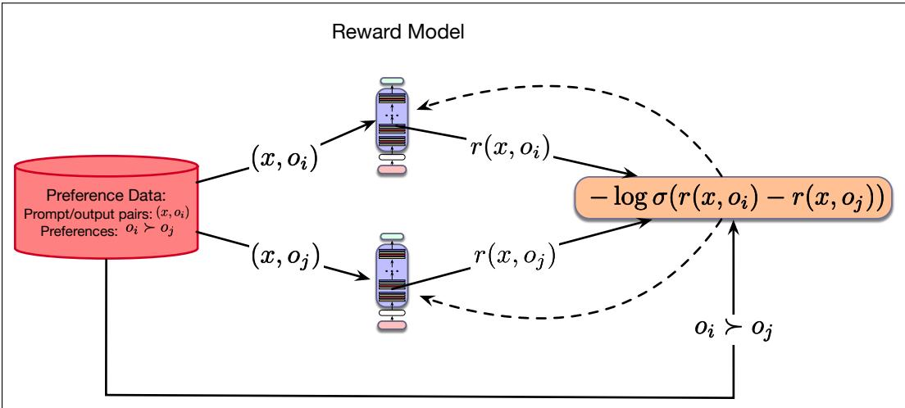
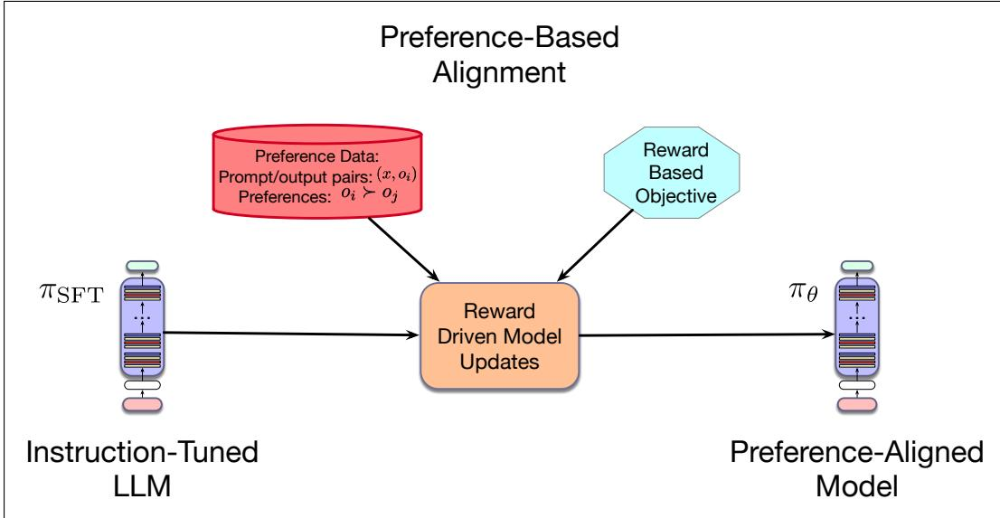
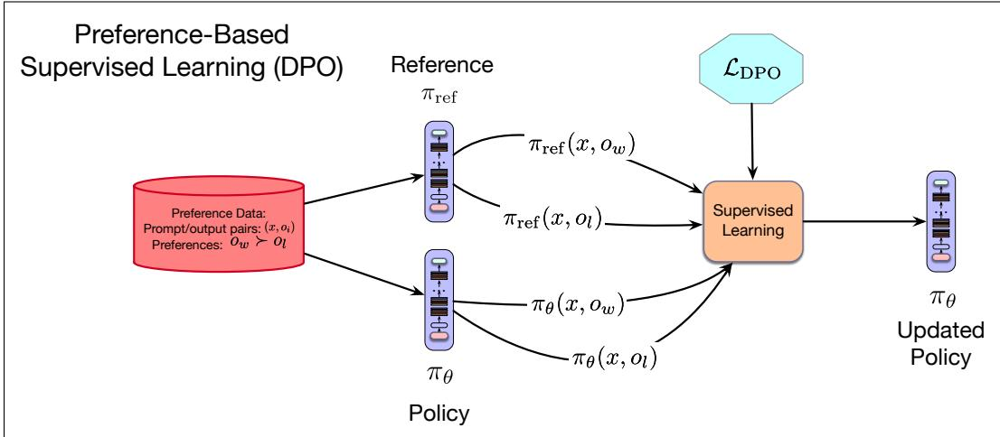

# 8.4 通过基于偏好的学习对齐 LLM

当前利用偏好数据对齐 LLM 的方法，都以 **强化学习**（Reinforcement Learning, RL）框架为基础（Sutton and Barto, 1998）。在强化学习环境中，模型依据利用当前状态特征的策略来选择动作序列。环境会为采取的每个动作提供奖励，而整个序列的奖励是组成该序列的各个动作之奖励的函数。强化学习的学习目标，是在一段训练期内最大化总体奖励。把强化学习用于优化 LLM 时，我们采用以下框架：

**图 8.10 使用预训练 LLM 学习奖励模型。模型以一个 LLM 初始化，并把语言模型头替换为线性层。该层随机初始化，再使用标准标签 $o _ { i } \succ o _ { j }$，通过交叉熵损失进行训练。**

• 动作对应于自回归生成过程中对词元的选择。

• 状态对应于当前解码步骤的上下文，也就是截至该步骤已经生成的词元历史。

• 策略对应于预训练 LLM 所体现的概率语言模型。

• LLM 输出的奖励来自使用偏好数据学到的奖励模型。

依照这一强化学习框架，我们把预训练 LLM 称为 **策略**（policy）$\pi$，把提示与输出所对应的偏好分数称为 **奖励**（reward）$r ( x , o )$。由此，我们的目标是训练一个策略 $\pi _ { \theta }$：给定从偏好数据中得到的奖励模型，使该策略输出的奖励最大。也就是说，我们希望经过偏好训练的 LLM 生成高奖励输出。可以把它表示为如下优化问题：

$$
\pi^ {*} = \underset {\pi_ {\theta}} {\operatorname{argmax}} \mathbb {E} _ {x \sim \mathcal {D}, o \sim \pi_ {\theta} (o | x)} [ r (x, o) ]\tag{8.5}
$$

在这一形式下，我们从一组相关训练提示中选择提示 x，从给定策略中采样输出 o，再评估每个样本的奖励。训练样本上的平均奖励给出 $\pi _ { \theta }$ 的期望奖励，而我们的目标就是找到能使该期望奖励最大的策略（模型）。

传统强化学习与其通常用于 LLM 对齐时的方式之间，有两个关键区别。第一个区别是，在传统强化学习中，奖励信号来自环境，并反映动作结果中可观察的事实（例如赢得游戏，或没有赢得游戏）。而在偏好学习中，学到的奖励模型只是存在噪声的真实奖励模型替代品。

第二个区别在于学习的起点。典型的强化学习应用试图从头学习最优策略，即从随机初始化的策略开始。这里则从已经具有较高性能的模型出发：模型先在大量数据上预训练，再通过指令微调进行微调，之后才使用偏好数据进一步改进。这里的重点并不是彻底改变现有模型的行为，而是轻推它，使其趋向更受偏好的行为。

**图 8.11 基于偏好的模型对齐。**

鉴于上述特点，如果直接像式 8.5 那样优化奖励，预训练 LLM 在转而追求从少量可用偏好数据中获得高奖励时，通常会忘记预训练期间学到的一切。为避免这种情况，需要在奖励函数中加入一项惩罚，使与起点偏离过远的模型受到惩罚。

$$
\pi^ {*} = \underset {\pi_ {\theta}} {\operatorname{argmax}} \mathbb {E} _ {x \sim \mathcal {D}, o \sim \pi_ {\theta} (o | x)} [ r (x, o) - \beta \mathbb {D} _ {\mathrm{KL}} [ \pi_ {\theta} (o | x) | | \pi_ {\mathrm{ref}} (o | x) ] ]\tag{8.6}
$$

这一形式中的第二项 $\mathbb { D } _ { \mathrm { K L } } ( \pi _ { \theta } ( o | x ) | | \pi _ { \mathrm { r e f } } ( o | x ) )$ 是 **库尔贝克–莱布勒散度**（Kullback–Leibler divergence, KL divergence）。简而言之，KL 散度衡量两个概率分布之间的距离。$\beta$ 是一个超参数，用于调节该惩罚项的影响。对于基于 LLM 的策略，KL 散度是训练后策略与原始参考策略 $\pi _ { \mathrm { r e f } }$ 之比的对数。

$$
\pi^ {*} = \underset {\pi_ {\theta}} {\operatorname{argmax}} \mathbb {E} _ {x \sim \mathcal {D}, o \sim \pi_ {\theta} (o | x)} \left[ r _ {\phi} (x, o) - \beta \log \frac {\pi_ {\theta} (o | x)}{\pi_ {\mathrm{ref}} (o | x)} \right]\tag{8.7}
$$

下面几节将考察两种基于这一优化框架对齐 LLM 的学习方法。第一种方法使用偏好数据训练一个显式奖励模型，再将该模型与强化学习方法结合，按照式 8.7 优化模型。第二种方法巧妙地重排式 8.7 的闭式解，直接根据现有偏好数据微调模型。

## 8.4.1 使用偏好反馈的强化学习（PPO）

:::{warning} 译文待补充
本小节的中文译文尚未补充完整。
:::

## 8.4.2 直接偏好优化

**直接偏好优化**（Direct Preference Optimization, DPO）（Rafailov et al., 2023）使用基于梯度的学习，利用偏好数据优化候选 LLM；它既不学习显式奖励模型，也不从正在更新的模型中采样。回想一下，在 Bradley–Terry 模型中，一个偏好对的概率是两个选项奖励之差的逻辑 sigmoid；在强化学习框架中，这些分数 z 则由作用于提示及其对应输出的奖励模型提供。

$$
P (o _ {i} \succ o _ {j} | x) = \sigma (z _ {i} - z _ {j})\tag{8.8}
$$

$$
= \sigma (r (x, o _ {i}) - r (x, o _ {j}))\tag{8.9}
$$

DPO 从前文式 8.7 引入的 KL 约束最大化问题出发；该式根据奖励模型和参考模型 $\pi _ { \mathrm r e f }$ 表示最优策略 $\pi ^ { * }$。DPO 的关键洞见，是改写这个最大化问题的闭式解，根据最优策略 $\pi ^ { * }$ 和参考策略 $\pi _ { \mathrm { r } e f }$ 表示奖励函数 $r ( x , o )$。

$$
r (x, o) = \beta \log \frac {\pi_ {r} (o | x)}{\pi_ {r e f} (o | x)} + \beta \log Z (x)\tag{8.10}
$$

其中，$Z ( x )$ 是 **配分函数**（partition function），即给定提示 x 时，在所有可能输出 o 上求和。

$$
Z (x) = \sum_ {y} \pi_ {\text { ref }} (o | x) \exp \left(\frac {1}{\beta} r (x, o)\right)\tag{8.11}
$$

这个配分函数中的求和，使得任何直接使用它的做法都不切实际。不过，由于 Bradley–Terry 模型以项目奖励之差为基础，把式 8.10 代入式 8.8 后，可以得到下面的表达式，其中配分函数相互抵消。

$$
\begin{array}{r c l} P (o _ {i} \succ o _ {j} | x) & = & \sigma (r (x, o _ {i}) - r (x, o _ {j})) \\ & = & \sigma \left(\beta \log \frac {\pi_ {\theta} (o _ {i} | x)}{\pi_ {\mathrm{ref}} (o _ {i} | x)} - \beta \log \frac {\pi_ {\theta} (o _ {j} | x)}{\pi_ {r e f} (o _ {j} | x)}\right) \end{array}\tag{8.12}
$$

(8.13)

经过这一变换，DPO 不再根据显式奖励模型，而是根据两个 LLM 策略来表示偏好对的似然。因此，单个实例的交叉熵损失（负对数似然）为：

$$
L _ {\mathrm{DPO}} (x, o _ {w}, o _ {l}) = - \log \sigma \left(\beta \log \frac {\pi_ {\theta} (o _ {w} | x)}{\pi_ {\mathrm{ref}} (o _ {w} | x)} - \beta \log \frac {\pi_ {\theta} (o _ {l} | x)}{\pi_ {\mathrm{ref}} (o _ {l} | x)}\right)
$$

训练集 D 上的损失由下面的期望给出：

$$
L _ {\mathrm{DPO}} \left(\pi_ {\theta}\right) = - \mathbb {E} _ {\left(x, o _ {w}, o _ {l}\right) \sim \mathcal {D}} \left[ \log \sigma \left(\beta \log \frac {\pi_ {\theta} \left(o _ {w} \mid x\right)}{\pi_ {\text { ref }} \left(o _ {w} \mid x\right)} - \beta \log \frac {\pi_ {\theta} \left(o _ {l} \mid x\right)}{\pi_ {\text { ref }} \left(o _ {l} \mid x\right)}\right) \right]
$$

该损失由 sigmoid 的导数推导而来，与 8.3.3 节使用 Bradley–Terry 框架学习奖励模型时介绍的损失直接对应。从操作上看，这个损失函数及其相应的基于梯度的更新，会提高偏好选项的似然，降低非偏好选项的似然。同时，它通过 KL 惩罚，在这一目标与不让模型偏离 $\pi _ { \mathrm { r e f } }$ 过远的目标之间取得平衡。$\beta$ 是控制惩罚项的超参数，其取值通常在 0.01 到 0.1 之间。

如图 8.12 所示，DPO 在可用训练数据上利用这一损失执行梯度下降，以优化策略 $\pi$；该策略使用一个现有的、经过预训练和微调的 LLM 初始化。

**图 8.12 使用直接偏好优化进行基于偏好的对齐。**

与 8.4.1 节介绍的显式强化学习方法 PPO 相比，DPO 有以下几个优点。

• DPO 不需要训练显式奖励模型。

• DPO 直接从 D 中包含的偏好学习，无需从 $\pi_\theta$ 进行计算成本高昂的在线采样。

• DPO 在训练期间只需承担维护 2 个 LLM 的成本，而 PPO 需要维护 4 个模型。

## 8.4.3 偏好对齐模型的评估

## 8.4.4 基于偏好的学习的局限
