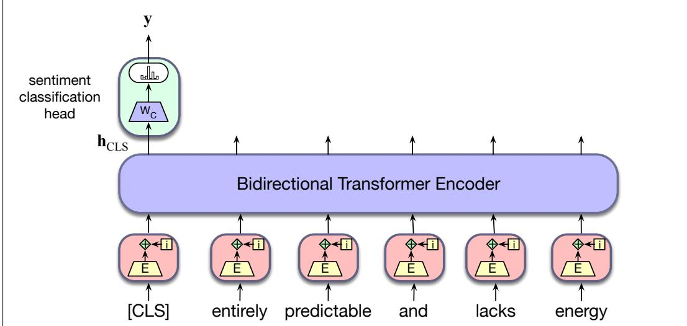

## 9.4 Fine-Tuning for Classification

The power of pretrained language models lies in their ability to extract generalizations from large amounts of text—generalizations that are useful for myriad downstream applications. There are two ways to make practical use of the generalizations to solve downstream tasks. The most common way is to use natural language to prompt the model, putting it in a state where it contextually generates what we want.

In this section we explore an alternative way to use pretrained language models for downstream applications, a kind of fine-tuning. In the kind of fine-tuning used for masked language models, we add application-specific circuitry (often called a special head) on top of pretrained models, taking their output as its input. The fine-tuning process consists of using labeled data about the application to train these additional application-specific parameters. Typically, this training will either freeze or make only minimal adjustments to the pretrained language model parameters.

The following sections introduce fine-tuning methods for some common classes of text-based applications: sequence classification, sentence-pair classification, and sequence labeling.

## 9.4.1 Sequence Classification

The task of sequence classification is to classify an entire sequence of text with a single label. This set of tasks is commonly called text classification, like sentiment analysis or spam detection (Appendix B) in which we classify a text into two or three classes (like positive or negative), as well as classification tasks with a large number of categories, like document-level topic classification.

For sequence classification we represent the entire input to be classified by a single vector. We can represent a sequence in various ways. One way is to take the sum or the mean of the last output vector from each token in the sequence. For BERT, we instead add a new unique token to the vocabulary called [CLS], and prepended it to the start of all input sequences, both during pretraining and encoding. The output vector in the final layer of the model for the [CLS] input represents the entire input sequence and serves as the input to a classifier head, a logistic regression or neural network classifier that makes the relevant decision.

As an example, let’s return to the problem of sentiment classification. Finetuning a classifier for this application involves learning a set of weights, $\mathsf { w } _ { \mathsf { c } } ,$ , to map the output vector for the [CLS] token— $- \hbar _ { \tt C L S } ^ { \tt L }$ —to a set of scores over the possible sentiment classes. Assuming a three-way sentiment classification task (positive, negative, neutral) and dimensionality d as the model dimension, ${ \sf { W } } _ { \sf C }$ will be of size $[ d \times 3 ]$ . To classify a document, we pass the input text through the pretrained language model to generate $\mathsf { h } _ { \mathsf { C } \mathsf { L } S } ^ { \mathsf { L } }$ , multiply it by ${ \mathsf { \pmb { W } } } _ { \mathsf { C } }$ , and pass the resulting vector through a softmax.

$$
\textbf {y} = \mathrm{softmax} (\mathbf {h} _ {\mathsf {C L S}} ^ {\mathsf {L}} \mathbf {W} _ {\mathsf {C}})\tag{9.6}
$$

Finetuning the values in ${ \sf { W } } _ { \sf C }$ requires supervised training data consisting of input sequences labeled with the appropriate sentiment class. Training proceeds in the usual way; cross-entropy loss between the softmax output and the correct answer is used to drive the learning that produces ${ \sf { W } } _ { \sf C }$

This loss can be used to not only learn the weights of the classifier, but also to update the weights for the pretrained language model itself. In practice, reasonable classification performance is typically achieved with only minimal changes to the language model parameters, often limited to updates over the final few layers of the transformer. Fig. 9.6 illustrates this overall approach to sequence classification.

## 9.4.2 Sequence-Pair Classification

As mentioned in Section 9.3.2, an important type of problem involves the classification of pairs of input sequences. Practical applications that fall into this class include paraphrase detection (are the two sentences paraphrases of each other?), logical entailment (does sentence A logically entail sentence B?), and discourse coherence (how coherent is sentence B as a follow-on to sentence A?).

Fine-tuning an application for one of these tasks proceeds just as with pretraining using the NSP objective. During fine-tuning, pairs of labeled sentences from a supervised fine-tuning set are presented to the model, and run through all the layers of the model to produce the h outputs for each input token. As with sequence classification, the output vector associated with the prepended [CLS] token represents the model’s view of the input pair. And as with NSP training, the two inputs are separated by the [SEP] token. To perform classification, the [CLS] vector is multiplied by a set of learned classification weights and passed through a softmax to generate label predictions, which are then used to update the weights.

  
Figure 9.6 Sequence classification with a bidirectional transformer encoder. The output vector for the [CLS] token serves as input to a simple classifier.

As an example, let’s consider an entailment classification task with the Multi-Genre Natural Language Inference (MultiNLI) dataset (Williams et al., 2018). In the task of natural language inference or NLI, also called recognizing textual entailment, a model is presented with a pair of sentences and must classify the relationship between their meanings. For example in the MultiNLI corpus, pairs of sentences are given one of 3 labels: entails, contradicts and neutral. These labels describe a relationship between the meaning of the first sentence (the premise) and the meaning of the second sentence (the hypothesis). Here are representative examples of each class from the corpus:

• Neutral

a: Jon walked back to the town to the smithy.

b: Jon traveled back to his hometown.

• Contradicts

a: Tourist Information offices can be very helpful.

b: Tourist Information offices are never of any help.

• Entails

a: I’m confused.

b: Not all of it is very clear to me.

A relationship of contradicts means that the premise contradicts the hypothesis; entails means that the premise entails the hypothesis; neutral means that neither is necessarily true. The meaning of these labels is looser than strict logical entailment or contradiction indicating that a typical human reading the sentences would most likely interpret the meanings in this way.

To finetune a classifier for the MultiNLI task, we pass the premise/hypothesis pairs through a bidirectional encoder as described above and use the output vector for the [CLS] token as the input to the classification head. As with ordinary sequence classification, this head provides the input to a three-way classifier that can be trained on the MultiNLI training corpus.
