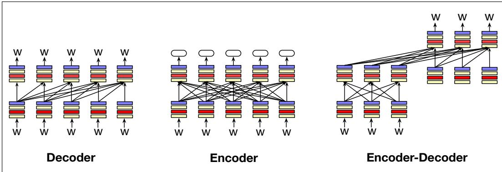

# 9.1 语言模型的三种架构

第 7 章介绍的从左到右语言模型或自回归语言模型架构，实际上只是三种常见语言模型架构之一。

这三种架构分别是编码器、解码器和编码器—解码器。图 9.1 给出了三者的示意图。

**解码器**（decoder）就是前面已经介绍过的架构。它接收一系列词元作为输入，再以迭代方式逐个生成输出词元。GPT、Claude、Llama 和 Mistral 等大语言模型都使用解码器架构。解码器中的信息从左向右流动，这意味着模型只依据先前词语预测下一词。解码器属于生成式模型，即给定输入词元后，它们会生成新的输出词元。

**编码器**（encoder）接收词元序列作为输入，并为每个词元输出一个向量表示。编码器通常是掩码语言模型，也就是说，它通过遮住一个词，再学习查看两侧周围词语以预测该词来训练。BERT、RoBERTa 以及 BERT 家族中的其他掩码语言模型，都属于编码器模型。编码器模型不是生成式模型，不用于生成文本。相反，它们经常用于创建分类器：例如，输入为文本，输出为情感、主题或其他类别的标签。这通过微调编码器实现，也就是使用监督数据训练它们。本章将介绍编码器模型。

**图 9.1 语言模型的三种架构：解码器、编码器和编码器—解码器。箭头粗略表示三种架构中的信息流。解码器接收词元作为输入，生成词元作为输出；编码器接收词元作为输入，生成编码（每个词元的向量表示）作为输出；编码器—解码器接收词元作为输入，生成一系列词元作为输出。**

**编码器—解码器**（encoder-decoder）接收词元序列作为输入，并输出一系列词元。它与仅解码器模型的区别在于，编码器—解码器的输入词元与输出词元之间关系宽松得多，而且它们用于在不同类型的词元之间进行映射。也就是说，在编码器—解码器中，输出词元可能来自非常不同的词元集合，输出序列也可能比输入词元序列长得多或短得多。例如，编码器—解码器架构用于机器翻译时，输入词元属于一种语言，输出词元则属于另一种语言，而且数量很可能不同。编码器—解码器架构还用于语音识别，此时输入是表示语音的词元，输出则是表示文本的词元。第 13 章将在机器翻译中介绍编码器—解码器架构，第 16 章则将在语音识别中介绍它。

这三种架构都可以由多种神经网络构建，但这里仍假定使用 Transformer。
