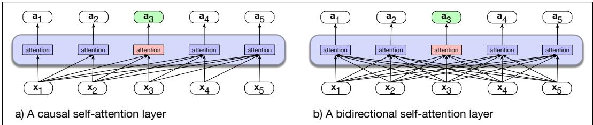
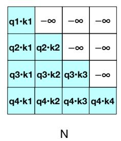
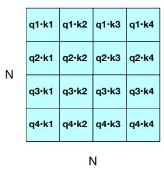

# 9.2 双向 Transformer 编码器

首先介绍 BERT 及其后继模型 RoBERTa（Liu et al., 2019）等模型所基于的双向 Transformer 编码器。第 7 章的解码器 LLM 具有从左到右的性质，这可能构成一种限制，因为在有些任务中，处理一个词元时如果能查看未来词元会很有帮助。对于需要为每个词元赋予一个标签的序列标注任务尤其如此，例如 9.5 节将介绍的命名实体标注任务，以及后续章节会讨论的词性标注或句法分析任务。

这里介绍的双向编码器，与因果模型属于不同类型。第 7 章的因果模型是生成式模型，设计目标是方便地生成序列中的下一词元；双向编码器的重点则是计算输入词元的上下文化表示。双向编码器使用自注意力，把输入嵌入序列 $\left( \mathbf { x } _ { 1 } , . . . , \mathbf { x } _ { n } \right)$ 映射为同样长度的输出嵌入序列 $\left( \mathbf { h } _ { 1 } , . . . , \mathbf { h } _ { n } \right)$；其中，输出向量已经利用整个输入序列的信息完成上下文化。这些输出嵌入是各输入词元的上下文化表示，可用于各种需要依据上下文中的词元进行分类或决策的应用。

请记得，我们曾说第 7 章的模型有时称为 **仅解码器模型**（decoder-only model），因为它们对应于第 13 章将介绍的编码器—解码器模型中的解码器部分。与之相对，本章的掩码语言模型有时称为 **仅编码器模型**（encoder-only model），因为它们会为每个输入词元生成编码，但通常不通过解码／采样生成连续文本。掩码语言模型也可以用于某些生成任务，例如近期涉及扩散模型的工作，不过这里暂不讨论。本章将重点介绍掩码语言模型在解释性任务中的应用。

## 9.2.1 双向掩码模型的架构

先来讨论整体架构。基于双向 Transformer 的语言模型与前几章的因果 Transformer 有两点不同。第一，注意力函数不是因果的；词元 i 的注意力可以查看后续的词元 i + 1，依此类推。第二，训练方式略有不同，因为我们预测的是文本中间的内容，而不是末尾的内容。本节讨论第一点，下一节讨论第二点。

图 9.2a 复制自第 7 章，展示了第 7 章从左到右方法中的信息流。每个词元上的注意力计算都以前面的输入词元（以及当前词元）为基础，忽略了位于当前所考察词元右侧、可能很有用的信息。双向编码器允许注意力机制覆盖整个输入，从而克服这一限制，如图 9.2b 所示。

**图 9.2 (a) 第 7 章的因果 Transformer，突出显示词元 3 上的注意力计算。每个词元的注意力值只使用上下文中更早出现的信息计算。(b) 双向注意力模型中的信息流。在处理每个词元时，模型会关注当前词元之前和之后的全部输入。因此，词元 3 的注意力可以利用后续词元的信息。**

实现非常简单！只需移除式 7.35 中引入的注意力遮蔽步骤。回顾第 7 章，对于因果 Transformer，我们必须遮蔽 $\mathbf { Q } \mathbf { K } ^ { T }$ 矩阵，使注意力无法查看未来词元（下面重复式 7.35 中单个注意力头的情形）：

$$
\operatorname { head } = \operatorname { softmax } \left(\operatorname { mask } \left(\frac {\mathbf { Q } \mathbf { K } ^ { T }}{\sqrt {d _ { k }}}\right)\right) \mathbf { V }\tag{9.1}
$$

图 9.3 展示了 $\mathbf { Q } \mathbf { K } ^ { T }$ 的遮蔽版本和未遮蔽版本。对于双向注意力，我们使用图 9.3b 中的未遮蔽版本。因此，双向注意力的计算与式 9.1 完全相同，只是移除了掩码：

(a)

(b)  
**图 9.3 形状为 $N \times N$ 的 $\mathbf { Q } \mathbf { K } ^ { T }$ 矩阵，其中显示 $\mathbf { q } _ { i } \cdot \mathbf { k } _ { j }$ 的值。(a) 把比较矩阵的上三角部分置零（先设为 $-\infty$，softmax 会将其变为零），(b) 则展示未遮蔽版本。**

$$
\operatorname { head } = \operatorname { softmax } \left(\frac {\mathbf { Q } \mathbf { K } ^ { T }}{\sqrt {d _ { k }}}\right) \mathbf { V }\tag{9.2}
$$

除此之外，注意力计算与第 7 章所述完全相同，Transformer 块的架构（前馈层、层归一化等）也是如此。与第 7 章一样，输入同样是一系列子词词元，通常由三种流行的词元化算法之一计算得出，包括第 2 章已经介绍的 BPE 算法，以及另外两种算法：WordPiece 算法和 SentencePiece Unigram LM 算法。这意味着，每个输入句子都必须先进行词元化，之后的全部处理都作用于子词词元而非词语。正如教材第三部分将说明的，对于句法分析等需要词语概念的某些 NLP 任务，我们有时必须把子词重新映射回词语。

更具体地说，最初仅支持英语的双向 Transformer 编码器模型 BERT（Devlin et al., 2019）具有以下配置：

• 仅包含英语、由 WordPiece 算法生成的 30,000 个词元组成的子词词表（Schuster and Nakajima, 2012）。

• 输入上下文窗口 $N=512$ 个词元，模型维度 $d=768$。

• 因此，模型输入 $\mathbf { X }$ 的形状为 $[ N \times d ] = [ 512 \times 768 ]$。

• $L=12$ 层 Transformer 块，每层包含 $A=12$ 个（双向）多头注意力层。

• 所得模型约有 100M 个参数。

更大的多语言 XLM-RoBERTa 模型在 100 种语言上训练，具有以下配置

• 一个包含 250,000 个词元、由 SentencePiece Unigram LM 算法生成的多语言子词词表（Kudo and Richardson, 2018）。

• 输入上下文窗口 $N=512$ 个词元，模型维度 $d=1024$；因此，模型输入 $\mathbf { X }$ 的形状为 $[ N \times d ] = [ 512 \times 1024 ]$。

• $L=24$ 层 Transformer 块，每层包含 $A=16$ 个多头注意力层。

• 所得模型约有 550M 个参数。

请注意，按照大语言模型的标准，550M 参数相对较少（Llama 3 有 405B 个参数，因此大了 3 个数量级）。事实上，掩码语言模型通常比因果语言模型小得多。

