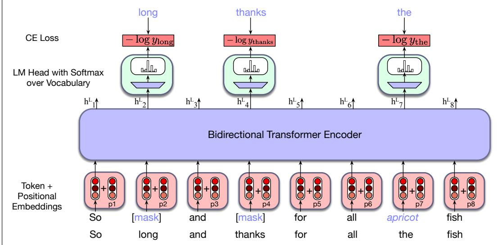
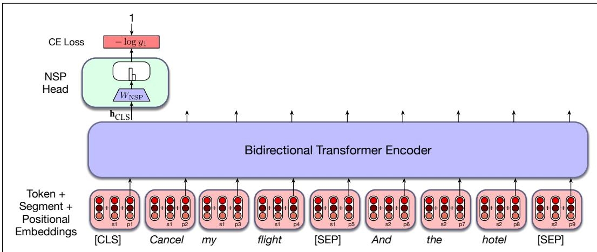

# 9.3 训练双向编码器

第 7 章通过让因果 Transformer 语言模型反复预测文本中的下一词来训练它们。但是，一旦去除注意力中的因果掩码，“猜下一词”这一语言建模任务就会变得易如反掌——答案可以直接从上下文中看到——所以我们需要一种新的训练方案。模型不再尝试预测下一词，而是学习执行填空任务；这种任务在技术上称为 **完形填空任务**（cloze task）（Taylor, 1953）。为理解这一点，让我们回到第 3 章用于说明动机的例子。原本要求模型预测下面这段文字中接下来可能出现哪些词：

The water of Walden Pond is so beautifully

现在则要求模型根据句子的其余部分预测缺失项。

The _____ of Walden Pond is so beautifully ...

也就是说，给定一个缺少一个或多个元素的输入序列，学习任务是预测这些缺失元素。更准确地说，在训练期间，模型无法看到输入序列中的一个或多个词元，并且必须为每个缺失项生成词表上的概率分布。随后，我们利用模型各项预测的交叉熵损失来驱动学习过程。

这种方法可以推广为各种不同方法：先破坏训练输入，再要求模型恢复原始输入。曾经采用的操作包括对训练文本进行遮蔽、替换、重排、删除，以及插入无关内容。这类训练统称为 **去噪**（denoising）：我们以某种方式破坏输入（加入噪声），例如遮住一个词或放入一个错误的词，而系统的目标就是去除噪声。

## 9.3.1 遮蔽词语

下面介绍用于训练双向编码器的 **掩码语言建模**（Masked Language Modeling, MLM）方法（Devlin et al., 2019）。与已经介绍过的语言模型训练方法相同，MLM 使用大型语料库中的无标注文本。在 MLM 训练中，模型会看到来自训练语料库的一系列句子，其中一定比例的词元（BERT 模型中为 15%）被随机选中，接受遮蔽流程的处理。给定输入句子 lunch was delicious，并假设随机选择第 3 个词元 delicious 进行处理：

• 80% 的情况下：该词元被替换为名为 [MASK] 的特殊词表词元，例如 lunch was delicious → lunch was [MASK]。

• 10% 的情况下：该词元被替换为另一个词元；替代词元根据词元一元概率从词表中随机采样，例如 lunch was delicious → lunch was gasp。

• 10% 的情况下：该词元保持不变，例如 lunch was delicious → lunch was delicious。

随后训练模型猜出接受处理的词元原本是什么。为什么需要三种可能的处理方式？加入 [MASK] 词元会在预训练与下游微调或推理之间造成不匹配，因为使用 MLM 模型执行下游任务时并不会使用任何 [MASK] 词元。如果只把词元替换成 [MASK]，模型可能只会在看到 [MASK] 时预测词元；但我们希望模型始终尝试预测输入词元。

为了训练模型进行预测，首先使用子词模型对原始输入序列进行词元化，再采样要接受处理的词元。从嵌入矩阵 $\mathbf { E }$ 中取出输入内所有词元的词嵌入，与位置嵌入结合形成 Transformer 的输入；输入经过双向 Transformer 块的堆栈，再经过语言模型头。MLM 的训练目标是预测每个被遮蔽词元的原始输入，而这些预测产生的交叉熵损失会驱动模型全部参数的训练。也就是说，所有输入词元都参与自注意力过程，但只有被采样的词元用于学习。

**图 9.4 掩码语言模型训练。在这个例子中，选中了三个输入词元，其中两个被遮蔽，第三个被无关词语替换。模型为这三项赋予的概率用作训练损失；另外 5 个词元不参与训练损失。**

图 9.4 用一个简单例子说明了这种方法。从训练序列中采样了 long、thanks 和 the，其中前两个被遮蔽，the 则被随机采样的词元 apricot 替换。所得嵌入经过双向 Transformer 块的堆栈。回顾第 7 章 7.5 节，为了给每个被遮蔽词元生成词表上的概率分布，语言模型头会取得最后一个 Transformer 层 $L$ 对每个被遮蔽词元 $i$ 产生的输出向量 $\mathbf { h } _ { i } ^ { L }$，将其乘以反嵌入层 $\mathbf { E } ^ { T }$ 以产生 logits $\mathbf { u }_i$，再使用 softmax 把 logits 转换成词表上的概率 $\mathbf { y }_i$：

$$
\mathbf {u} _ {i} = \mathbf {h} _ {i} ^ {\mathrm{L}} \mathbf {E} ^ {\mathrm{T}}\tag{9.3}
$$

$$
\mathbf {y} _ {i} = \operatorname{softmax} (\mathbf {u} _ {\mathbf {i}})\tag{9.4}
$$

得到每个被遮蔽项的预测概率分布后，可以使用交叉熵计算每项的损失，即模型赋予实际被遮蔽词语的概率之负对数，如图 9.4 所示。更正式地说，对于句子或批次中的给定输入词元向量 $\mathbf { x }$，令被遮蔽的词元集合为 $M$，令该句中一些词元被掩码替换后的版本为 $\mathbf { x } ^ { \mathrm { mask } }$，并令输出向量序列为 $\mathbf { h }$。对于给定输入词元 $x _ { i }$，例如图 9.4 中的 long，损失就是给定 $\mathbf { x } ^ { \mathrm { mask } }$ 时正确词语 long 的概率；$\mathbf { x } ^ { \mathrm { mask } }$ 的信息汇总在单个输出向量 $\mathbf { h } _ { i } ^ { L }$ 中：

$$
L _ {M L M} (x _ {i}) = - \log P (x _ {i} | \mathbf {h} _ {i} ^ {L})
$$

作为权重更新基础的梯度，根据单条训练序列（或一个序列批次）中被采样学习项的平均损失计算。

$$
L _ {M L M} = - \frac {1}{| M |} \sum_ {i \in M} \log P (x _ {i} | \mathbf {h} _ {i} ^ {L})
$$

请注意，只有 M 中的词元参与学习，其他词语不参与损失函数。因此从这个意义上说，BERT 及其后继模型的效率并不高：训练数据中只有 15% 的输入样本实际用于训练权重。

## 9.3.2 下一句预测

基于掩码的学习专注于根据周围上下文预测词语，目标是产生有效的词级表示。不过，有一类重要应用需要判断句子对之间的关系，其中包括释义检测（判断两个句子的意义是否相似）、蕴含（判断两个句子的意义是相互蕴含还是相互矛盾），以及语篇连贯性（判断两个相邻句子能否组成连贯语篇）等任务。

为了捕捉这类应用所需的知识，BERT 家族中的一些模型包含第二个学习目标，称为 **下一句预测**（Next Sentence Prediction, NSP）。在这项任务中，模型会看到成对的句子，并被要求预测每一对句子究竟是训练语料库中真实相邻的一对句子，还是互不相关的一对句子。在 BERT 中，50% 的训练句对是正例；其余 50% 的句对中，第二个句子从语料库的其他位置随机选择。NSP 损失取决于模型区分真实句对与随机句对的能力。

为了支持 NSP 训练，BERT 在输入表示中引入两个特殊词元；这些词元后来对微调也很有用。使用子词模型对输入进行词元化后，在输入句对前添加词元 [CLS]，并在两个句子之间以及第二个句子的最后一个词元之后放置词元 [SEP]。实际上还有两个特殊词元，即“第一分段”词元和“第二分段”词元。在输入阶段，它们会被加入词嵌入和位置嵌入。也就是说，输入 X 中的每个词元实际上由三种嵌入相加而成：词嵌入、位置嵌入和第一／第二分段嵌入。

训练期间，与 [CLS] 词元关联的最终层输出向量 $\mathbf { h } _ { \mathrm { CLS } } ^ { L }$ 表示下一句预测。与 MLM 目标一样，我们会添加一个专用模型头；这里是 NSP 头，它由一组学习得到的分类权重 $\mathbf { W } _ { \mathrm { NSP } } \in \mathbb { R } ^ { d \times 2 }$ 构成，根据原始 [CLS] 向量 $\mathbf { h } _ { \mathrm { CLS } } ^ { L }$ 产生二分类预测：

$$
\mathbf { y } = \operatorname { softmax } (\mathbf { h } _ { \mathrm { CLS } } ^ { L } \mathbf { W } _ { \mathrm { NSP } })
$$

模型每看到一个句对，就使用交叉熵计算其 NSP 损失。图 9.5 展示了整体 NSP 训练设置。在 BERT 中，NSP 损失与 MLM 训练目标结合形成最终损失。

**图 9.5 NSP 损失计算示例。**

## 9.3.3 训练方案

BERT 及其他早期基于 Transformer 的语言模型使用约 33 亿词进行训练；训练数据由英文维基百科和一个称为 BooksCorpus 的书籍文本语料库组成（Zhu et al., 2015），后者因知识产权问题已不再使用。现代掩码语言模型如今在规模大得多的网络文本数据集上训练；这些文本会接受一定过滤，并补充维基百科等更高质量的数据，与第 7 章讨论的因果大语言模型相同。多语言模型同样使用网络文本和多语言维基百科。例如，XLM-R 模型使用来自 [Common Crawl](https://commoncrawl.org/) 的 100 种语言、约 3000 亿词元进行训练。

训练最初的 BERT 模型时，按照下一句预测的 50/50 方案从训练语料库中选择文本片段对。采样句对时，要确保它们合计的长度小于 512 个输入词元。随后，使用 MLM 方法遮蔽这些句对中的词元，并将 MLM 与 NSP 目标的损失结合成最终损失。由于这个最终损失会反向传播通过整个 Transformer，每个 Transformer 层的嵌入都将学到有助于根据相邻词语预测词语的表示。[CLS] 词元是 NSP 分类器的直接输入，因此它学到的表示往往会包含整个序列的信息。模型大约需要在训练数据上完成 40 轮遍历，才能收敛。

RoBERTa 等一些模型舍弃了下一句预测目标，因此也会稍微改变训练方案。输入不再是采样得到的句对，而只是一系列连续句子，开头仍使用特殊的 [CLS] 词元。如果文档在达到 512 个词元之前结束，就加入额外的分隔词元，再把下一篇文档中的句子装入，直到总数达到 512 个词元。通常会使用较大的批次，大小介于 8K 与 32K 个词元之间。

多语言模型还需要做出一项额外决定：使用什么数据构建词表？回想一下，所有语言模型都使用子词词元化，其中 BPE 和 SentencePiece Unigram LM 是最常见的两种算法。由于某些语言的文本比其他语言容易获得得多，应当使用什么文本来学习多语言词元化？一种方案是从训练数据（也许是来自 Common Crawl 的网络文本）中随机采样句子，以创建这个词表学习数据集。但这样会选中大量来自英语等在网络上占比很高的语言的句子，所得词元也会偏向罕见英语词元，而不是为数据较少的语言创建高频词元。常见做法是把训练数据划分成 N 种不同语言的子语料库，计算每种语言 i 的句子数量 $n _ { i }$，再重新调整这些概率，提高代表性不足语言的概率权重（Lample and Conneau, 2019）。从 N 种语言中各自选择一个句子的新概率（其原始频率为 $n _ { i }$）为 $\{ q _ { i } \} _ { i = 1 \ldots N }$，其中：

$$
q _ {i} = \frac {p _ {i} ^ {\alpha}}{\sum_ {j = 1} ^ {N} p _ {j} ^ {\alpha}} \text { with } p _ {i} = \frac {n _ {i}}{\sum_ {k = 1} ^ {N} n _ {k}}\tag{9.5}
$$

回顾第 5 章式 5.19，$\alpha$ 取 0 到 1 之间的值时，会为较低概率的样本赋予更高权重。Conneau et al. (2020) 表明，$\alpha = 0 . 3$ 能够有效提高罕见语言被纳入词元化过程的程度，从而获得整体上更好的多语言性能。

这一预训练过程的结果，既包括学到的词嵌入，也包括双向编码器的全部参数；这些参数用于为新的输入产生上下文嵌入。

在许多用途下，预训练多语言模型都比单语言模型更实用，因为它避免了构建许多（多达一百个！）独立单语言模型的需要。多语言模型还可以利用训练数据中资源较多的相似语言所提供的语言信息，提高低资源语言上的性能。尽管如此，当语言数量变得非常多时，多语言模型会表现出所谓的 **多语言诅咒**（curse of multilinguality）（Conneau et al., 2020）：与在较少语言上训练的模型相比，每种语言上的性能都会下降。多语言模型的另一个问题是它们“带有口音”：高资源语言（往往是英语）的语法结构会渗入低资源语言；训练数据中数量庞大的英语内容，会让模型对低资源语言的表示略微变得更像英语（Papadimitriou et al., 2023）。
