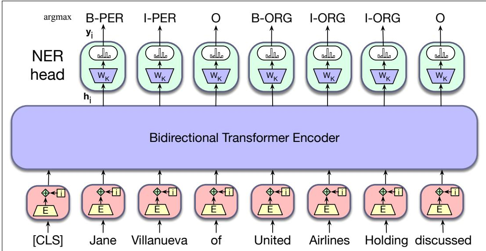

# 9.5 面向序列标注的微调：命名实体识别

在序列标注中，网络的任务是为序列中的每个词元赋予一个标签，标签取自一个较小的固定集合。最常见的序列标注任务之一是命名实体识别。

## 9.5.1 命名实体

粗略地说，**命名实体**（named entity）是任何可以用专有名称指称的事物，例如人、地点或组织。**命名实体识别**（named entity recognition, NER）的任务，是找出文本中构成专有名称的跨度，并标注实体类型。最常见的四种实体标签是 PER（人物）、LOC（地点）、ORG（组织）和 GPE（地缘政治实体）。不过，“命名实体”这一术语通常也扩展到本身并非实体的事物，包括日期、时间等时间表达式，甚至价格等数值表达式。下面是一个 NER 标注器的输出示例：

Citing high fuel prices, [ORG United Airlines] said $[ \mathrm { { T I M E } }$ Friday] it has increased fares by [MONEY \$6] per round trip on flights to some cities also served by lower-cost carriers. [ORG American Airlines], a unit of $[ \mathrm { o } \mathrm { R } \mathrm { G }$ AMR Corp.], immediately matched the move, spokesman [PER Tim Wagner] said. $[ \mathrm { O R G }$ United], a unit of $[ \mathrm { o } \mathrm { R } \mathrm { G }$ UAL Corp.], said the increase took effect [TIME Thursday] and applies to most routes where it competes against discount carriers, such as [LOC Chicago] to $\operatorname { I } _ { \mathrm { L O C } }$ Dallas] and $\operatorname { I } _ { \mathrm { L O C } }$ Denver] to $\operatorname { I } _ { \mathrm { L O C } }$ San Francisco].

这段文本包含 13 处命名实体提及，其中有 5 个组织、4 个地点、2 个时间、1 个人物和 1 个金额。图 9.7 展示了典型的通用命名实体类型。许多应用还需要使用蛋白质、基因、商品或艺术作品等特定实体类型。

<table><tr><td>类型</td><td>标签</td><td>类别示例</td><td>例句</td></tr><tr><td>人物</td><td>PER</td><td>人物、角色</td><td>Turing is a giant of computer science.</td></tr><tr><td>组织</td><td>ORG</td><td>公司、运动队</td><td>The IPCC warned about the cyclone.</td></tr><tr><td>地点</td><td>LOC</td><td>地区、山脉、海洋</td><td>Mt. Sanitas is in Sunshine Canyon.</td></tr><tr><td>地缘政治实体</td><td>GPE</td><td>国家、州</td><td>Palo Alto is raising the fees for parking.</td></tr></table>

**图 9.7 通用命名实体类型列表及其所指实体的种类。**

命名实体识别是多种自然语言处理任务中的一个有用步骤，例如把文本链接到维基百科等结构化知识来源、衡量文本对某个特定实体的情感或态度，甚至作为出于隐私目的将文本匿名化的一部分。NER 任务的难点之一，是 NER 跨度的切分存在歧义：必须判断哪些词元属于实体、哪些不属于实体，而文本中的大多数词都不是命名实体。另一个难点来自类型歧义。Washington 这一名称可以指一个人、一支运动队、一座城市或美国政府，如图 9.8 所示。

[PER Washington] was born into slavery on the farm of James Burroughs. [ORG Washington] went up 2 games to 1 in the four-game series. Blair arrived in $\operatorname { I } _ { \mathrm { L O C } }$ Washington] for what may well be his last state visit. In June, $[ _ { \mathrm { G P E } }$ Washington] passed a primary seatbelt law.

**图 9.8 名称 Washington 在使用中的类型歧义示例。**

## 9.5.2 BIO 标注

对于 NER 这类跨度识别问题，标准的序列标注方法之一是 BIO **标注法**（BIO tagging）（Ramshaw and Marcus, 1995）。这种方法使用同时捕捉边界和命名实体类型的标签，使我们能够把 NER 当作逐词序列标注任务。请看下面的句子：

[PER Jane Villanueva ] of $\mathrm { \Delta [ o R G }$ United] , a unit of $[ \mathrm { o } \mathrm { R } \mathrm { G }$ United Airlines Holding] , said the fare applies to the $\operatorname { I } _ { \mathrm { L O C } }$ Chicago ] route.

图 9.9 使用 BIO 标注表示了同一段文字，同时还展示了 IO 标注和 BIOES 标注两种变体。在 BIO 标注中，任何感兴趣跨度的起始词元都标为 B，位于跨度内部的词元标为 I，不属于任何感兴趣跨度的词元则标为 O。O 标签只有一个，但每种命名实体类别都有各自的 B 标签和 I 标签。因此，标签数量为 2n+1，其中 n 是实体类型的数量。BIO 标注能够表示与括号记法完全相同的信息，但它的优点是可以像词性标注一样，用简单的序列建模方式表示任务：为每个输入词 $x _ { i }$ 赋予单个标签 $y _ { i }$。

<table><tr><td>词语</td><td>IO 标签</td><td>BIO 标签</td><td>BIOES 标签</td></tr><tr><td>Jane</td><td>I-PER</td><td>B-PER</td><td>B-PER</td></tr><tr><td>Villanueva</td><td>I-PER</td><td>I-PER</td><td>E-PER</td></tr><tr><td>of</td><td>O</td><td>O</td><td>O</td></tr><tr><td>United</td><td>I-ORG</td><td>B-ORG</td><td>B-ORG</td></tr><tr><td>Airlines</td><td>I-ORG</td><td>I-ORG</td><td>I-ORG</td></tr><tr><td>Holding</td><td>I-ORG</td><td>I-ORG</td><td>E-ORG</td></tr><tr><td>discussed</td><td>O</td><td>O</td><td>O</td></tr><tr><td>the</td><td>O</td><td>O</td><td>O</td></tr><tr><td>Chicago</td><td>I-LOC</td><td>B-LOC</td><td>S-LOC</td></tr><tr><td>route</td><td>O</td><td>O</td><td>O</td></tr><tr><td>.</td><td>O</td><td>O</td><td>O</td></tr></table>

**图 9.9 把 NER 表示为序列模型，其中展示 IO、BIO 和 BIOES 三种标注方式。**

这里还展示了两种标注方案的变体：IO 标注删除了 B 标签，因此会损失一些信息；BIOES 标注则增加了表示跨度末尾的结束标签 E，以及表示仅由一个词构成之跨度的单词跨度标签 S。

## 9.5.3 序列标注

在序列标注中，我们把每个输入词元所对应的最终输出向量传给分类器，由分类器产生所有可能标签上的 softmax 分布。对于单前馈层分类器，需要学习的权重集合是大小为 $[ d \times k ]$ 的 $\boldsymbol { \mathsf { W } } _ { \mathsf { K } }$，其中 k 是该任务可能标签的数量。可以采用贪心方法，把每个词元的 argmax 标签作为最可能的答案，从而生成最终输出标签序列。图 9.10 展示了这种方法的一个例子，其中 ${ \bf y _ { i } }$ 是标签上的概率向量，k 为标签索引。

$$
\mathbf {y} _ {\mathrm{i}} = \operatorname{softmax} \left(\mathbf {h} _ {\mathrm{i}} ^ {\mathrm{L}} \mathbf {W} _ {\mathrm{K}}\right)\tag{9.7}
$$

$$
\mathbf {t _ {i}} = \operatorname{argmax} _ {k} (\mathbf {y} _ {i})\tag{9.8}
$$

另一种方法，是把 softmax 为每个输入词元提供的标签分布传给 **条件随机场**（conditional random field, CRF）层，由后者考虑全局的标签级转移（关于 CRF，见第 18 章）。

**图 9.10 使用双向 Transformer 编码器进行命名实体识别的序列标注。每个输入词元的输出向量都会传给一个简单的 k 路分类器。**

## 词元化与 NER

请注意，NER 的监督训练数据通常采用与词级切分文本相关联的 BIO 标签形式。例如，下面的句子包含两个命名实体：

[LOC Mt. Sanitas ] is in [LOC Sunshine Canyon] .

它具有下面这组逐词 BIO 标签。

$$
\begin{array}{l l} (9. 9) & \text { Mt. } \quad \text { Sanitas   is   in   Sunshine   Canyon } \\ & \text { B - LOC   I - LOC   O   O   B - LOC   I - LOC   O } \end{array}
$$

遗憾的是，该句子的 WordPiece 词元序列与标注中的 BIO 标签并不直接对齐：

’Mt’, ’.’, ’San’, ’##itas’, ’is’, ’in’, ’Sunshine’, ’Canyon’ ’.’

为了处理这种错位，我们需要一种方法在训练期间为子词词元分配 BIO 标签，并需要一种相应的方法在解码期间根据子词恢复词级标签。在训练中，可以直接把与每个词关联的标准标签，赋予由该词派生出的所有子词词元。

在解码中，最简单的方法是使用一个词的第一个子词词元所对应的 argmax BIO 标签。因此，在这个例子中，分配给 “Mt” 的 BIO 标签会被分配给 “Mt.”，分配给 “San” 的标签会被分配给 “Sanitas”，实际上忽略了分配给 “.” 和 “##itas” 的标签信息。更复杂的方法会结合各子词上的标签概率分布，尝试找出最优的词级标签。

## 9.5.4 命名实体识别的评估

命名实体识别器使用召回率、精确率和 $\mathbf { F } _ { 1 }$ 度量进行评估。回想一下，召回率是正确标注的回答数量与本应标注的回答总数之比；精确率是正确标注的回答数量与实际标注的回答总数之比；$\mathrm { F } _ { 1 }$ 度量则是两者的调和平均数。

为了判断两个 NER 系统的 $\mathrm { F } _ { 1 }$ 分数之差是否显著，我们使用配对自助法检验，或类似的随机化检验（4.11 节）。

对于命名实体标注，回答单位是实体而不是词语。因此，在图 9.9 的例子中，两个实体 Jane Villanueva 和 United Airlines Holding，以及非实体 discussed，都分别算作一个回答。

命名实体标注包含切分成分，而文本分类或词性标注等任务并不包含，这会给评估带来一些问题。例如，如果系统把 Jane 而不是 Jane Villanueva 标为人物，就会造成两个错误：O 的一个假阳性，以及 I-PER 的一个假阴性。此外，使用实体作为回答单位、却使用词语作为训练单位，意味着训练条件与测试条件之间存在不匹配。
