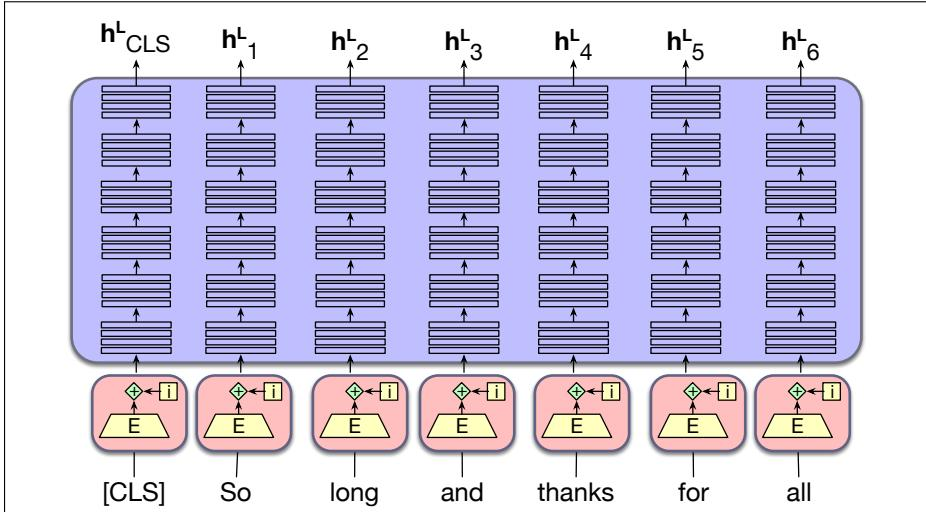
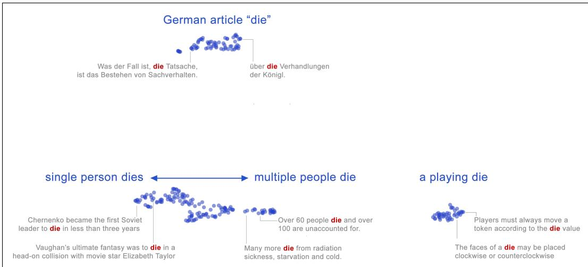
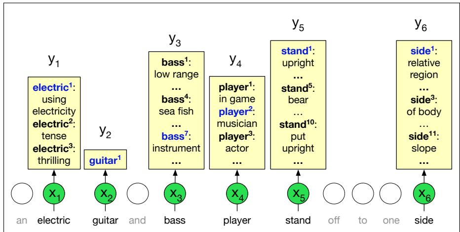
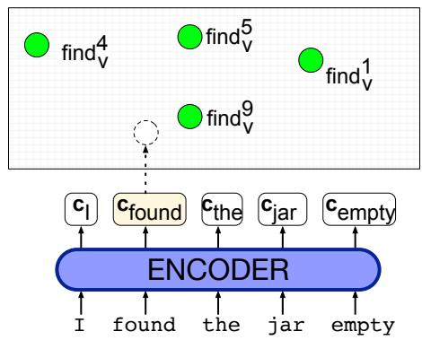

# 10.1 上下文嵌入

首先扩展第 5 章介绍的嵌入基本思想，看看它在 Transformer 及其他 LLM 架构中的对应形式。第 5 章的 word2vec 或 GloVe 等方法，会为词表中每个不同的词 w 学习单个向量嵌入。与之相对，使用 **上下文嵌入**（contextual embedding）时，同一个词 w 每次出现在不同上下文中，都会由不同的向量表示。第 7 章的因果语言模型和第 9 章的编码器模型都使用上下文嵌入；不过，掩码语言模型创建的嵌入似乎特别适合作为表示，因此下面的例子会采用这种嵌入。

将文本输入预训练语言模型时，模型每个组件（注意力头、前馈网络）的输出都是一种会被加入残差流的表示。出现在每个层级、每个词元上的这些表示，都称为上下文嵌入。正如前文所暗示的，可以把上下文嵌入理解为对词元在上下文中某方面意义进行编码的向量，也就是第 5 章静态嵌入的上下文化版本。因此，我们可以把这些嵌入用于涉及词元或词语意义的任务。

例如，给定输入词元序列 $x _ { 1 } , . . . , x _ { n }$，可以使用模型最后一层 $L$ 的输出向量 $\mathbf { h } _ { i } ^ { L }$，表示词元 $x _ { i }$ 在句子 $x _ { 1 } , . . . , x _ { n }$ 上下文中的意义，如图 10.1 所示。

对于 BERT 模型，人们通常不会只使用模型最后一层的向量 $\mathbf { h } _ { i } ^ { L }$，而是对模型最后四层中词元 $i$ 的输出 $\mathbf { h }_i$ 进行均值池化或最大池化，以计算 $x_i$ 的表示；这四个输出分别是 $\mathbf { h } _ { i } ^ { L }$、$\mathbf { h } _ { i } ^ { L - 1 }$、$\mathbf { h } _ { i } ^ { L - 2 }$ 和 $\mathbf { h } _ { i } ^ { L - 3 }$。

正如第 5 章使用 word2vec 等静态嵌入表示词义一样，对于任何需要词义模型的任务，我们都可以用上下文嵌入表示词语在上下文中的意义。静态嵌入表示词类型（即词表条目）的意义，上下文嵌入则表示词实例的意义，也就是某个特定词类型在特定上下文中的实例。因此，word2vec 为每个词类型提供一个向量，而上下文嵌入则为该词类型在句子上下文中的每个实例分别提供一个向量。由此，上下文嵌入可以用于衡量上下文中两个词的语义相似度等任务，也适用于需要词义模型的语言学任务。

**图 10.1 BERT 风格模型为每个输入词元 $x_i$ 输出一个上下文嵌入向量 $\mathbf { h }_i^L$。**

## 10.1.1 上下文嵌入与词义

词语存在歧义：同一个词可以用来表达不同的事物。第 5 章曾说明，单词 “mouse” 可以表示：（1）一种小型啮齿动物，或（2）用手操作、控制光标的设备。单词 “bank” 可以表示：（1）金融机构，或（2）倾斜的堤岸。我们说 “mouse” 和 “bank” 这样的词具有 **多义性**（polysemy；该词源自希腊语“多个意义”，poly- 意为“多个”，sema 意为“符号、标记”）。

**词义**（sense 或 word sense）是一个词之意义某个方面的离散表示。可以用上标表示每个词义：bank1 和 bank2、mouse1 和 mouse2。这些词义可以在 WordNet 等在线类义词典中查到（Fellbaum, 1998）；WordNet 提供多种语言的数据集，列出了许多词的不同词义。在上下文中，很容易看出这些意义的区别：

mouse1：.... a mouse controlling a computer system in 1968.

mouse2：.... a quiet animal like a mouse

bank1：...a bank can hold the investments in a custodial account ...

bank2：...as agriculture burgeons on the east bank, the river ...

上下文能够消解上面 mouse 和 bank 的词义歧义，这一事实也可以用几何方式可视化。图 10.2 展示了英语和德语中单词 die 的许多 BERT 嵌入实例在二维空间中的投影。图中的每个点表示 die 在一个输入句子中的一次使用。在 BERT 嵌入空间里，可以清楚地看到至少两种不同的英语词义（dice 的单数和“死亡”这一动词），以及德语中的冠词。

**图 10.2 每个蓝点表示单词 die 在不同英语或德语句子中的一个 BERT 上下文嵌入，并使用 UMAP 算法投影到二维空间。德语意义、英语意义以及不同的英语词义分别落入不同的簇。图中还展示了一些样本点及其来源句子的上下文。图片来自 Coenen et al. (2019)。**

因此，WordNet 等类义词典会给出离散的词义列表，而嵌入（无论静态嵌入还是上下文嵌入）则提供一种连续的高维意义模型。尽管这种模型可以聚类，却不会划分成完全离散的词义。

## 词义消歧

为词语选择正确词义的任务称为 **词义消歧**（word sense disambiguation, WSD）。WSD 算法接收上下文中的一个词以及一个固定的候选词义清单（例如 WordNet 中的词义）作为输入，再输出该词在上下文中的正确词义。图 10.3 概要展示了这项任务。

**图 10.3 全词 WSD 任务：把输入词（x）映射到 WordNet 词义（y）。图片构思来自 Chaplot and Salakhutdinov (2018)。**

WSD 可以作为一种有用的分析工具，用于人文学科和社会科学的文本分析；词义也可以在词语表示的模型可解释性研究中发挥作用。此外，词义还具有有趣的分布性质。例如，一个词在一段语篇中通常大致保持同一个词义，这一观察称为 **每篇一义规则**（one sense per discourse rule）（Gale et al., 1992a）。

目前性能最佳的 WSD 算法，是一种使用上下文词嵌入的简单 1-最近邻算法，由 Melamud et al. (2016) 和 Peters et al. (2018) 提出。在训练时，我们让某个词义标注数据集（例如多种语言的 SemCore 或 SenseEval 数据集）中的每个句子经过任意上下文嵌入模型（如 BERT），从而为每个有标注词元产生上下文嵌入。（计算词元 $i$ 的上下文嵌入 $\mathbf { v } _ { i }$ 有多种方式；对于 BERT，常见做法是对多层进行池化，例如把 BERT 最后四层中 $i$ 的向量表示相加。）随后，对于语料库中任意词的每个词义 $s$，取该词义的 $n$ 个词元，将它们的 $n$ 个上下文表示 $\mathbf { v } _ { i }$ 求平均，从而得到 $s$ 的上下文词义嵌入 $\mathbf { v } _ { s }$：

$$
\mathbf {v} _ {s} = \frac {1}{n} \sum_ {i} \mathbf {v} _ {i} \quad \forall \mathbf {v} _ {i} \in \operatorname{tokens} (s)\tag{10.1}
$$

测试时，给定目标词 $t$ 在上下文中的一个词元，计算其上下文嵌入 $\mathbf { t }$，再从训练集中选择距离最近的词义，也就是词义嵌入与 $\mathbf { t }$ 的余弦最高的词义：

$$
\operatorname{sense} (t) = \underset {s \in \operatorname{senses} (t)} {\operatorname{argmax}} \operatorname{cosine} (\mathbf {t}, \mathbf {v} _ {s})\tag{10.2}
$$

图 10.4 展示了这一模型。  

**图 10.4 用于 WSD 的最近邻算法。绿色表示为每个词的各个词义预先计算的上下文嵌入；这里仅展示 find 的几个词义。模型为目标词 found 计算上下文嵌入，再选取最近邻词义（本例中为 $\mathbf { f i n d } _ { \nu } ^ { 9 }$）。图片构思来自 Loureiro and Jorge (2019)。**

## 10.1.2 上下文嵌入与词语相似度

第 5 章介绍过这样一种思想：以余弦作为相似度函数，根据两个词在几何空间中的接近程度来衡量其相似度。意义相似的思想也清晰地体现在图 10.2 的意义簇中：一个词在特定上下文中表达某个特定词义时，其表示会更接近该词同一词义的其他实例。因此，我们经常使用上下文嵌入之间的余弦，衡量上下文中两个词实例之间的相似度，或同一个词在两个不同上下文中的两个实例之间的相似度。

计算余弦之前，通常需要对嵌入做一些变换。这是因为上下文嵌入（无论来自掩码语言模型还是自回归模型）具有这样一种性质：所有词的向量都极其相似。如果查看 BERT 或其他模型最后一层的嵌入，任意随机选取的两个词实例之嵌入都会具有非常高、甚至十分接近 1 的余弦，这意味着所有词向量都倾向于指向同一方向。一个系统中的向量全都倾向于指向同一方向，这种性质称为 **各向异性**（anisotropy）。Ethayarajh (2019) 把模型的各向异性定义为语料库中任意词对的期望余弦相似度。“各向同性”（isotropy）一词表示所有方向上的均匀性，因此在各向同性模型中，向量集合应指向所有方向，随机嵌入对之间的期望余弦应为零。Timkey and van Schijndel (2021) 表明，各向异性的一个成因是：余弦度量由上下文嵌入中少数几个取值与其他维度差异很大的维度主导；这些 **异常维度**（rogue dimension）具有非常大的幅值和非常高的方差。

Timkey and van Schijndel (2021) 表明，可以通过对向量执行标准化（z 分数化），即减去均值再除以标准差，使嵌入更加各向同性。给定某个语料库中全部嵌入组成的集合 $C$，其中每个嵌入的维度均为 $d$（即 $\mathbf { x } \in \mathbb { R } ^ { d }$），均值向量 $\boldsymbol { \mu } \in \mathbb { R } ^ { d }$ 为：

$$
\boldsymbol { \mu } = \frac {1}{| C |} \sum_ {\mathbf { x } \in C} \mathbf { x }\tag{10.3}
$$

每个维度上的标准差 $\boldsymbol { \sigma } \in \mathbb { R } ^ { d }$ 为：

$$
\boldsymbol { \sigma } = \sqrt {\frac {1}{| C |} \sum_ {\mathbf { x } \in C} (\mathbf { x } - \boldsymbol { \mu }) ^ {2}}\tag{10.4}
$$

随后，把每个词向量 $\mathbf { x }$ 替换为其标准化版本 $\mathbf { z }$：

$$
\mathbf { z } = \frac {\mathbf { x } - \boldsymbol { \mu }}{\boldsymbol { \sigma }}\tag{10.5}
$$

余弦存在一个无法通过标准化解决的问题：对于非常高频的词，它往往会低估人类对词义相似度的判断（Zhou et al., 2022）。
