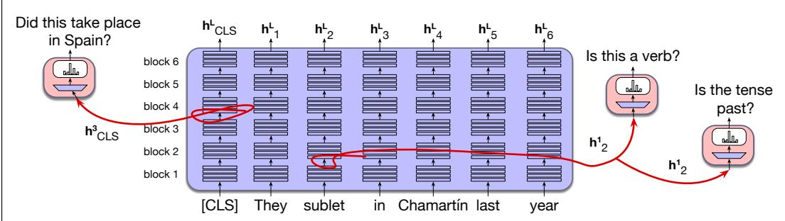

# 10.2 探测

我们经常希望知道，网络中的某个特定表示是否编码了某类特定信息。例如，我们可能希望了解网络如何处理与语法或意义有关的语言信息：网络在某一层对单词 ketchup 的表示，是否编码了它是名词而非动词这一事实？又或者，单词 sublet 既可以是过去时也可以是现在时，那么模型对它在某个特定句子中的表示是否编码了时态？如果编码了，这发生在网络的哪一层？

处理这类问题最简单的技术称为 **探测**（probing）。在探测中，我们构建一个分类器；它可以是逻辑回归、线性回归或小型 MLP，接收嵌入向量作为输入，再返回我们感兴趣的类别（例如“名词”或“动词”）。如果探针认为某个词是名词的概率很高（并且优于某些控制条件），我们就说该表示可能编码了“名词”这一概念。图 10.5 展示了这一思想，其中三个可能的探针考察 BERT 表示内部的两个不同嵌入向量。

探测已被用于研究信息如何在 Transformer 中从较低层向较高层传播。例如，研究表明，词元的语法信息似乎编码在较低层，语义信息编码在中间层，而共指等语篇信息编码在更高层（Tenney et al., 2019）。

**图 10.5 在探测中，我们训练简单分类器来提取词元的语言属性或其他属性（例如是否为动词、是否使用过去时），或句子的属性（例如是否发生在西班牙），从而考察模型中某个表示编码了哪些信息。这里展示三个不同的探针，它们考察两个表示 $\mathbf { h } _ { \mathrm { CLS } } ^ { 3 }$ 和 $\mathbf { h } _ { 2 } ^ { 1 }$。**

探测分为训练和测试两个阶段。训练探针包含四个步骤：

1. 选择希望考察的属性，例如词性、意义的某个方面，或代词与哪个实体共指。

2. 在我们希望研究的某个位置和层级上创建嵌入训练集与测试集（例如“Transformer 第 2 层到第 16 层的前馈网络输出”），并用正确答案进行标注，如相应的词性、时态或其他属性。

3. 让训练集中的句子经过 LLM，并提取激活值。

4. 冻结 LLM 的权重，只训练分类器的权重，使其把嵌入映射为属性。

在推理时，让测试集文本经过模型，提取激活值，再将它们传给分类器，并报告模型能否正确提取该属性。

探测通常需要与控制条件进行比较，例如确保其性能优于使用随机标签进行探测（Belinkov et al., 2017）。探针不能过于强大也很重要，否则它可能只是因为相关信息编码在探针自身的权重中，而不是编码在被考察的表示中，才取得成功（Hewitt and Liang, 2019）。

探测成功虽然表明某种信息编码在表示中，却不能证明模型实际使用了该信息。也就是说，被探测的信息可能与嵌入中的内容相关，但对模型行为没有因果影响（Belinkov, 2022）。
