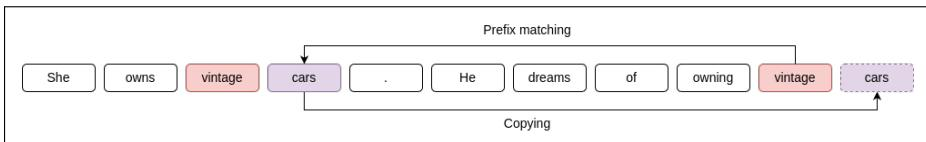

# 10.6 上下文学习与归纳头

如果把提示看作让模型执行我们所需行为的一种方式，那么它与预训练有着根本区别。通过预训练进行学习，是指依据某个损失函数，使用梯度下降更新模型参数；但包含示范的提示也能教模型执行新任务。模型在处理提示时，会从这些示范中学到与任务有关的内容。

即使没有示范，也可以把提示过程理解为一种学习。例如，模型在提示中处理得越深入，往往越善于预测接下来出现的词元。上下文中的信息正在帮助模型获得更强的预测能力。

**上下文学习**（in-context learning）一词最早由 Brown et al. (2020) 在介绍 GPT-3 系统时提出，用于指称语言模型从提示中进行的上述两类学习。上下文学习是指语言模型在推理时的前向传递过程中，不对模型参数执行任何基于梯度的更新，却能学会执行新任务、更好地预测词元，或从总体上降低损失。

上下文学习是如何工作的？虽然我们尚不确定，但已经出现了一些引人入胜的思路。其中一种假说以 **归纳头**（induction head）的概念为基础（Elhage et al., 2021; Olsson et al., 2022）。归纳头是一种 **回路**（circuit）的名称，而回路是网络中的一种抽象组件。归纳头回路属于 Transformer 注意力计算的一部分，最初通过考察只有 1–2 个注意力头的微型语言模型发现。

归纳头的功能是预测重复序列。例如，如果它在输入序列中看到模式 AB...A，就会预测接下来出现 B，从而实例化模式补全规则 AB...A B。实现这一功能时，注意力计算中的 **前缀匹配组件**（prefix matching component）会在查看当前词元 A 时回溯搜索上下文，寻找 A 先前出现的实例。如果找到，归纳头中的复制机制就会“复制”跟在较早 A 后面的词元 B，即提高 B 接下来出现的概率。图 10.7 给出了一个例子。

Olsson et al. (2022) 提出，这种模式补全规则经过推广后的模糊版本，可能负责实现上下文学习。它执行的规则类似 $\smash { \mathsf { A } ^ { * } \mathsf { B } ^ { * } , \ldots , \mathsf { A } \to \mathsf { B } }$，其中 $\mathbf { A } ^ { * } \approx \mathbf { A }$ 且 $\mathbf { B } ^ { \ast } \approx \mathbf { B }$，也就是二者在某种语义意义上相似。Crosbie and Shutova (2022) 提供了支持这一假说的证据：消融归纳头会导致上下文学习性能下降。

**消融**（ablation）原本是一个医学术语，意为移除某种事物。在 NLP 可解释性研究中，我们把它作为检验因果效应的工具：如果破坏一个假定的原因，就会预期其效果随之消失。为了识别模型中的归纳头，研究者利用 Elhage et al. (2021) 发现的归纳行为，并采用 Bansal et al. (2023) 所述、与任务无关的前缀匹配分数计算方法。Crosbie and Shutova (2022) 首先找出在随机输入序列上表现为归纳头的注意力头，再把输出矩阵 $\boldsymbol { \mathsf { W } } ^ { 0 }$ 中的相应项设为零，从而将这些注意力头的输出清零。这样做会破坏模型的上下文复制能力（Bansal et al., 2023）。他们确实发现，经过消融的模型在上下文学习上差得多，也就是从提示中的示范学习时性能显著下降。

**图 10.7 在序列“...vintage cars ... vintage”中，查看 vintage 的归纳头使用前缀匹配机制，找到先前出现的 vintage，再通过复制机制关注其后的词语 cars，并预测 cars 会再次出现。图片来自 Crosbie and Shutova (2022)。**
