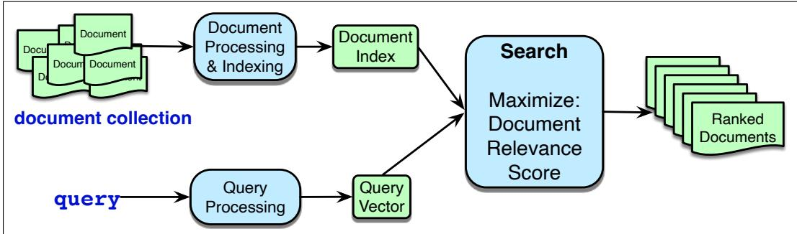
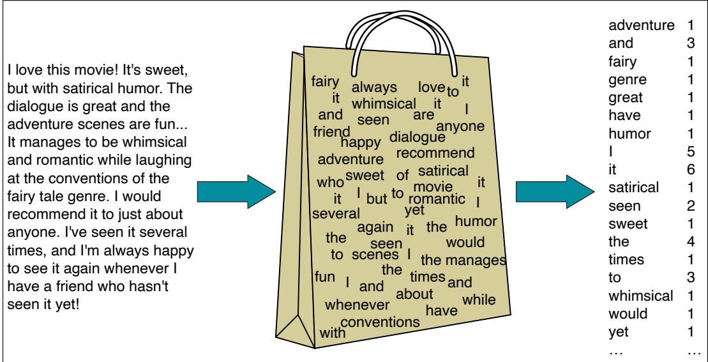
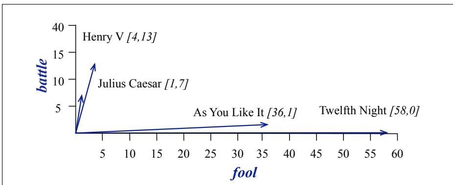

## 11.1 Information Retrieval

Information retrieval or IR is the name of the field encompassing the retrieval of all manner of media based on user information needs. The resulting IR system is often called a search engine. Our goal in this section is to give a sufficient overview of IR to see its application to large language models meeting user information needs. Readers with more interest specifically in information retrieval should see the Historical Notes section at the end of the chapter.

The IR task we consider is called ad hoc retrieval, in which a user poses a query to a retrieval system, which then returns an ordered set of documents from some collection. A document refers to whatever unit of text the system indexes and retrieves (web pages, scientific papers, news articles, or even shorter passages like paragraphs). A collection refers to a set of documents being used to satisfy user requests. A collection can mean the entire web, in which case we are doing web search. But a collection can also be a smaller corporate repo, or even a set of documents used by one person. term refers to a word in a collection, but it may also include phrases. Finally, a query represents a user’s information need expressed as a set of terms.

  
Figure 11.1 The architecture of an ad hoc IR system. Document ranking is based on computing a score for each candidate document given the query, expressing how relevant it is likely to be to meet the users information need. There are two classes of IR systems, based on the two classes of vectors that are used to represent queries and documents: sparse vectors and dense vectors. These two kinds of retrieval differ in the details of the indexing and scoring mechanisms.

The high-level architecture of an ad hoc retrieval engine is shown in Fig. 11.1. This figure abstracts over the two classes of IR systems, which are based on the two classes of vectors that are used to represent queries and documents: sparse vectors and dense vectors. In sparse retrieval, we represent documents and queries with count vectors, weighted by tf-idf or BM25. In dense retrieval, we represent documents and queries with embeddings, computed from language models (either encoder or decoder models). We’ll discuss sparse retrieval in the rest of this section, and turn to dense retrieval in Section 11.3.

## 11.1.1 Representing documents as vectors

In the vector space model of information retrieval (Salton, 1971) a document is represented as a vector of counts of the words it contains.

We sometimes call this kind of model a bag-of-words model. Fig. 11.2 shows the intuition: we are representing a text document as if it were a bag of words, that is, an unordered set of words with their position ignored, keeping only their frequency in the document. In the example in the figure, instead of representing the word order in all the phrases like “It manages to be whimsical and romantic”, we simply note that the word it occurred 5 times in the entire excerpt, the words love, recommend, and movie once, and so on.

  
Figure 11.2 Intuition of the classic vector space model applied to a single document. The position of the words is ignored (the bag-of-words assumption) and we make use of the frequency of each word.

We could thus imagine representing the document in Fig. 11.2 as the vector [1 3 1 1 1 1 1 5 6 1 2 1 4 1 3 1 1 1] (if we limited ourselves to these 18 dimensions and ignored all the other words in English).

More generally, we can represent a set of documents as a term-document matrix in which each row represents a word in the vocabulary and each column represents a document from some collection of documents. Fig. 11.3 shows a small selection from a term-document matrix showing the occurrence of four words in four plays by Shakespeare. Each cell in this matrix represents the number of times a particular word (defined by the row) occurs in a particular document (defined by the column). Thusfool appeared 58 times in Twelfth Night.

A document is represented as a count vector, a column in Fig. 11.4. In the example in Fig. 11.4, we’ve chosen to make the document vectors of dimension 4, just so they fit on the page; in real term-document matrices, the document vectors would have dimensionality V , the vocabulary size. The first dimension for both these vectors corresponds to the number of times the word battle occurs, and we can compare each dimension, noting for example that the vectors for As You Like It and Twelfth Night have similar values (1 and 0, respectively) for the first dimension.

<table><tr><td></td><td>As You Like It</td><td>Twelfth Night</td><td>Julius Caesar</td><td>Henry V</td></tr><tr><td>battle</td><td>1</td><td>0</td><td>7</td><td>13</td></tr><tr><td>good</td><td>114</td><td>80</td><td>62</td><td>89</td></tr><tr><td>fool</td><td>36</td><td>58</td><td>1</td><td>4</td></tr><tr><td>wit</td><td>20</td><td>15</td><td>2</td><td>3</td></tr></table>

Figure 11.3 The term-document matrix for four words in four Shakespeare plays. Each cell contains the number of times the (row) word occurs in the (column) document.

<table><tr><td></td><td>As You Like It</td><td>Twelfth Night</td><td>Julius Caesar</td><td>Henry V</td></tr><tr><td>battle</td><td>1</td><td>0</td><td>7</td><td>13</td></tr><tr><td>good</td><td>114</td><td>80</td><td>62</td><td>89</td></tr><tr><td>fool</td><td>36</td><td>58</td><td>1</td><td>4</td></tr><tr><td>wit</td><td>20</td><td>15</td><td>2</td><td>3</td></tr></table>

Figure 11.4 The term-document matrix for four words in four Shakespeare plays. The red boxes show that each document is represented as a column vector of length four.

Since 4-dimensional spaces are hard to visualize, Fig. 11.5 shows a visualization of the four document vectors in two dimensions; we’ve arbitrarily chosen the dimensions corresponding to the words battle and fool.

  
Figure 11.5 A spatial visualization of the document vectors for the four Shakespeare play documents, showing just two of the dimensions, corresponding to the words battle and fool. The comedies have high values for thefool dimension and low values for the battle dimension.

Two documents that are similar will tend to have similar words, and if two documents have similar words their column vectors will tend to be similar. The vectors for the comedies As You Like It [1,114,36,20] and Twelfth Night [0,80,58,15] look a lot more like each other (more fools and wit than battles) than they look like Julius Caesar [7,62,1,2] or Henry V [13,89,4,3].

## 11.1.2 Term weighting: tf-idf and BM25

In fact, in IR, we don’t use raw word counts like [1 114 36 20] for As You Like It, or [1 3 1 1 1 1 1 5 6 1 2 1 4 1 3 1 1 1] for the document in Fig. 11.2. Instead we compute a term weight for each document word. Two term weighting schemes are common: tf-idf and a variant of tf-idf called BM25.

Tf-idf (the ‘-’ here is a hyphen, not a minus sign) is the product of two terms, the term frequency tf and the inverse document frequency idf.

The term frequency term tells us how frequent the word is; words that occur more often in a document are likely to be informative about the document’s contents. We usually use the $\log _ { 1 0 }$ of the word frequency, rather than the raw count. The intuition is that a word appearing 100 times in a document doesn’t make that word 100 times more likely to be relevant to the meaning of the document. We also need to do something special with counts of 0, since we can’t take the log of $0 . { } ^ { 3 }$ So if we define count( $^ { \ast , d ) }$ as the raw count of term t in document $d ,$ then $\mathrm { t f } _ { t , d } ,$ the tf of term t in document d is

$$
\operatorname{tf} _ {t, d} = \left\{ \begin{array}{l l} 1 + \log_ {1 0} \operatorname{count} (t, d) & \text { if } \operatorname{count} (t, d) > 0 \\ 0 & \text { otherwise } \end{array} \right.\tag{11.4}
$$

If we use log weighting, terms which occur 0 times in a document would have $\operatorname { t f } = 0$ 1 times in a document $\mathrm { t f } = 1 + \log _ { 1 0 } ( 1 ) = 1 + 0 = 1$ , 10 times in a document $\mathbf { t } \mathbf { = }$ $1 + \log _ { 1 0 } ( 1 0 ) = 2 , 1 0 0$ times t $\dot { \mathbf { \eta } } = 1 + \log _ { 1 0 } ( 1 0 0 ) = 3$ , 1000 times $\operatorname { t f } = 4 .$ , and so on.

The document frequency df<sub>t</sub> of a term t is the number of documents it occurs in. Terms that occur in only a few documents are useful for discriminating those documents from the rest of the collection; terms that occur across the entire collection aren’t as helpful. The inverse document frequency or idf term weight (Sparck Jones, 1972) is defined as:

$$
\mathrm{idf} _ {t} = \log_ {1 0} \frac {N}{\mathrm{df} _ {t}}\tag{11.5}
$$

where N is the total number of documents in the collection, and df<sub>t</sub> is the number of documents in which term t occurs. The fewer documents in which a term occurs, the higher this weight; the lowest weight of 0 is assigned to terms that occur in every document.

Here are some idf values for some words in the corpus of Shakespeare plays, ranging from extremely informative words that occur in only one play like Romeo, to those that occur in a few like salad or Falstaff, to those that are very common like fool or so common as to be completely non-discriminative since they occur in all 37 plays like good or sweet.<sup>4</sup>

<table><tr><td>Word</td><td>df</td><td>idf</td></tr><tr><td>Romeo</td><td>1</td><td>1.57</td></tr><tr><td>salad</td><td>2</td><td>1.27</td></tr><tr><td>Falstaff</td><td>4</td><td>0.967</td></tr><tr><td>forest</td><td>12</td><td>0.489</td></tr><tr><td>battle</td><td>21</td><td>0.246</td></tr><tr><td>wit</td><td>34</td><td>0.037</td></tr><tr><td>fool</td><td>36</td><td>0.012</td></tr><tr><td>good</td><td>37</td><td>0</td></tr><tr><td>sweet</td><td>37</td><td>0</td></tr></table>

The tf-idf value for word t in document d is then the product of term frequency $\mathrm { t f } _ { t , d }$ and IDF:

$$
\operatorname{tf-idf} (t, d) = \operatorname{tf} _ {t, d} \cdot \operatorname{idf} _ {t}\tag{11.6}
$$

## 11.1.3 Document Scoring

Once we have represented each document and query as a weighted vector, we need to score each document. Our goal is to measure the relevance of the document to the user’s information need, as expressed in their query. In the classic tf-idf model we estimate this relevance of a document by measuring its geometric similarity in vector space to the query. That is, we make the simplifying assumption that documents that have similar words to the query are more relevant to the user.

We use the cosine similarity function introduced in Chapter 5, scoring document d by the cosine of its vector d with the query vector q:

$$
\operatorname{score} (q, d) = \cos (\mathbf {q}, \mathbf {d}) = \frac {\mathbf {q} \cdot \mathbf {d}}{| \mathbf {q} | | \mathbf {d} |}\tag{11.7}
$$

Another way to think of the cosine computation is as the dot product of unit vectors; we can first normalize both the query and document vector to unit vectors, by dividing by their lengths, and then take the dot product:

$$
\operatorname{score} (q, d) = \cos (\mathbf {q}, \mathbf {d}) = \frac {\mathbf {q}}{| \mathbf {q} |} \cdot \frac {\mathbf {d}}{| \mathbf {d} |}\tag{11.8}
$$

We can spell out Eq. 11.8, using the tf-idf values and spelling out the dot product as a sum of products:

$$
\operatorname{score} (q, d) = \sum_ {t \in \mathfrak {q}} \frac {\operatorname{tf-idf} (t , q)}{\sqrt {\sum_ {q _ {i} \in q} \operatorname{tf-idf} ^ {2} (q _ {i} , q)}} \cdot \frac {\operatorname{tf-idf} (t , d)}{\sqrt {\sum_ {d _ {i} \in d} \operatorname{tf-idf} ^ {2} (d _ {i} , d)}}\tag{11.9}
$$

Now let’s use Eq. 11.9 to walk through an example of a tiny query against a collection of 4 nano documents, computing tf-idf values and seeing the rank of the documents. We’ll assume all words in the following query and documents are downcased and punctuation is removed:

```txt
Query: sweet love  
Doc 1: Sweet sweet nurse! Love?  
Doc 2: Sweet sorrow  
Doc 3: How sweet is love?  
Doc 4: Nurse!
```

Fig. 11.6 shows the computation of the tf-idf cosine between the query and Document 1, and the query and Document 2. The cosine is the normalized dot product of tf-idf values, so for the normalization we must need to compute the document vector lengths q , $\left| d _ { 1 } \right|$ , and $\left| d _ { 2 } \right|$ for the query and the first two documents using Eq. 11.4, Eq. 11.5, Eq. 11.6, and Eq. 11.9 (computations for Documents 3 and 4 are also needed but are left as an exercise for the reader). The dot product between the vectors is the sum over dimensions of the product, for each dimension, of the values of the two tf-idf vectors for that dimension. This product is only non-zero where both the query and document have non-zero values, so for this example, in which only sweet and love have non-zero values in the query, the dot product will be the sum of the products of those elements of each vector.

Document 1 has a higher cosine with the query (0.747) than Document 2 has with the query (0.0779), and so the tf-idf cosine model would rank Document 1 above Document 2. This ranking is intuitive given the vector space model, since Document 1 has both terms including two instances of sweet, while Document 2 is missing one of the terms. We leave the computation for Documents 3 and 4 as an exercise for the reader.

<table><tr><td>word</td><td>cnt</td><td>tf</td><td>df</td><td>idf</td><td>tf-idf</td><td colspan="5">n’lized = tf-idf/|q|</td></tr><tr><td>sweet</td><td>1</td><td>1</td><td>3</td><td>0.125</td><td>0.125</td><td>0.383</td><td></td><td></td><td></td><td></td></tr><tr><td>nurse</td><td>0</td><td>0</td><td>2</td><td>0.301</td><td>0</td><td>0</td><td></td><td></td><td></td><td></td></tr><tr><td>love</td><td>1</td><td>1</td><td>2</td><td>0.301</td><td>0.301</td><td>0.924</td><td></td><td></td><td></td><td></td></tr><tr><td>how</td><td>0</td><td>0</td><td>1</td><td>0.602</td><td>0</td><td>0</td><td></td><td></td><td></td><td></td></tr><tr><td>sorrow</td><td>0</td><td>0</td><td>1</td><td>0.602</td><td>0</td><td>0</td><td></td><td></td><td></td><td></td></tr><tr><td>is</td><td>0</td><td>0</td><td>1</td><td>0.602</td><td>0</td><td>0</td><td></td><td></td><td></td><td></td></tr><tr><td colspan="11">|q| =  $\sqrt{.125^2 + .301^2} = .326$ </td></tr><tr><td colspan="11"></td></tr><tr><td rowspan="2">word</td><td rowspan="2">cnt</td><td rowspan="2">tf</td><td colspan="4">Document 1</td><td colspan="4">Document 2</td></tr><tr><td>tf-idf</td><td>n’lized</td><td>× q</td><td>cnt</td><td>tf</td><td>tf-idf</td><td>n’lized</td><td>× q</td></tr><tr><td>sweet</td><td>2</td><td>1.301</td><td>0.163</td><td>0.357</td><td>0.137</td><td>1</td><td>1.000</td><td>0.125</td><td>0.203</td><td>0.0779</td></tr><tr><td>nurse</td><td>1</td><td>1.000</td><td>0.301</td><td>0.661</td><td>0</td><td>0</td><td>0</td><td>0</td><td>0</td><td>0</td></tr><tr><td>love</td><td>1</td><td>1.000</td><td>0.301</td><td>0.661</td><td>0.610</td><td>0</td><td>0</td><td>0</td><td>0</td><td>0</td></tr><tr><td>how</td><td>0</td><td>0</td><td>0</td><td>0</td><td>0</td><td>0</td><td>0</td><td>0</td><td>0</td><td>0</td></tr><tr><td>sorrow</td><td>0</td><td>0</td><td>0</td><td>0</td><td>0</td><td>1</td><td>1.000</td><td>0.602</td><td>0.979</td><td>0</td></tr><tr><td>is</td><td>0</td><td>0</td><td>0</td><td>0</td><td>0</td><td>0</td><td>0</td><td>0</td><td>0</td><td>0</td></tr><tr><td colspan="6">|d1| =  $\sqrt{.163^2 + .301^2 + .301^2} = .456$ </td><td colspan="5">|d2| =  $\sqrt{.125^2 + .602^2} = .615$ </td></tr><tr><td colspan="6">Cosine: ∑ of column: 0.747</td><td colspan="5">Cosine: ∑ of column: 0.0779</td></tr></table>

Figure 11.6 Computation of tf-idf cosine score between the query and nano-documents 1 (0.747) and 2 (0.0779), using Eq. 11.4, Eq. 11.5, Eq. 11.6 and Eq. 11.9.

In practice, there are many variants and approximations to Eq. 11.9. For example, we might choose to simplify processing by removing some terms. To see this, let’s start by expanding the formula for tf-idf in Eq. 11.9 to explicitly mention the tf and idf terms from Eq. 11.6:

$$
\operatorname{score} (q, d) = \sum_ {t \in \mathfrak {q}} \frac {\operatorname{tf} _ {t , q} \cdot \operatorname{idf} _ {t}}{\sqrt {\sum_ {q _ {i} \in q} \operatorname{tf-idf} ^ {2} \left(q _ {i} , q\right)}} \cdot \frac {\operatorname{tf} _ {t , d} \cdot \operatorname{idf} _ {t}}{\sqrt {\sum_ {d _ {i} \in d} \operatorname{tf-idf} ^ {2} \left(d _ {i} , d\right)}}\tag{11.10}
$$

In one common variant of tf-idf cosine, for example, we drop the idf term for the document. Eliminating the second copy of the idf term (since the identical term is already computed for the query) turns out to sometimes result in better performance:

$$
\operatorname{score} (q, d) = \sum_ {t \in \mathfrak {q}} \frac {\operatorname{tf} _ {t , q} \cdot \operatorname{idf} _ {t}}{\sqrt {\sum_ {q _ {i} \in q} \operatorname{tf-idf} ^ {2} \left(q _ {i} , q\right)}} \cdot \frac {\operatorname{tf} _ {t , d} \cdot \operatorname{idf} _ {t}}{\sqrt {\sum_ {d _ {i} \in d} \operatorname{tf-idf} ^ {2} \left(d _ {i} , d\right)}}\tag{11.11}
$$

Other variants of tf-idf eliminate various other terms.

A slightly more complex variant in the tf-idf family is the BM25 weighting scheme (sometimes called Okapi BM25 after the Okapi IR system in which it was introduced (Robertson et al., 1995)). BM25 adds two parameters: k, a knob that adjusts the balance between term frequency and IDF, and b, which controls the importance of document length normalization. The BM25 score of a document d given

a query q is:

$$
\sum_ {t \in q} \overbrace {\log \left(\frac {N}{\mathrm{df} _ {t}}\right)} ^ {\text { IDF }} \overbrace {\frac {\operatorname{tf} _ {t , d}}{k \left(1 - b + b \left(\frac {| d |}{| d _ {\text { avg }} |}\right)\right) + \operatorname{tf} _ {t , d}}} ^ {\text { weighted   tf }}\tag{11.12}
$$

where $| d _ { \mathrm { a v g } } |$ is the length of the average document. When k is 0, BM25 reverts to no use of term frequency, just a binary selection of terms in the query (plus idf). A large k results in raw term frequency (plus idf). b ranges from 1 (scaling by document length) to 0 (no length scaling). Manning et al. (2008) suggest reasonable values are $\mathbf { k } = [ 1 . 2 , 2 ]$ and ${ \bf b } = 0 . 7 5$ . Kamphuis et al. (2020) is a useful summary of the many minor variants of BM25.

Stop words In the past it was common to remove high-frequency words from both the query and document before representing them. The list of such high-frequency words to be removed is called a stop list. The intuition is that high-frequency terms (often function words like $t h e , a , t o )$ carry little semantic weight and may not help with retrieval, and can also help shrink the inverted index files we describe below. The downside of using a stop list is that it makes it difficult to search for phrases that contain words in the stop list. For example, common stop lists would reduce the phrase to be or not to be to the phrase not. In modern IR systems, the use of stop lists is much less common, partly due to improved efficiency and partly because much of their function is already handled by IDF weighting, which downweights function words that occur in every document. Nonetheless, stop word removal is occasionally useful in various NLP tasks so is worth keeping in mind.

## 11.1.4 Efficiently finding documents: the Inverted Index

In order to compute scores, we need to efficiently find documents that contain words in the query. (Any document that contains none of the query terms will have a score of 0 and can be ignored.) The basic search problem in IR is thus to find all documents $d \in C$ that contain a term $q \in { \cal Q }$

The data structure for this task is the inverted index, which we use for making this search efficient, and also conveniently storing useful information like the document frequency and the count of each term in each document.

An inverted index, given a query term, gives a list of documents that contain the term. It consists of two parts, a dictionary and the postings. The dictionary is a list of terms (designed to be efficiently accessed), each pointing to a postings list for the term. A postings list is the list of document IDs associated with each term, which can also contain information like the term frequency or even the exact positions of terms in the document. The dictionary can also store the document frequency for each term. For example, a simple inverted index for our 4 sample documents above, with each word containing its document frequency in , and a pointer to a postings list that contains document IDs and term counts in [], might look like the following:

$$
\begin{array}{l l} \text {how \{1\}} & \to 3 [ 1 ] \\ \text {is \{1\}} & \to 3 [ 1 ] \\ \text {love \{2\}} & \to 1 [ 1 ] \to 3 [ 1 ] \\ \text {nurse \{2\}} & \to 1 [ 1 ] \to 4 [ 1 ] \\ \text {sorrow \{1\}} & \to 2 [ 1 ] \\ \text {sweet \{3\}} & \to 1 [ 2 ] \to 2 [ 1 ] \to 3 [ 1 ] \end{array}
$$

Given a list of terms in query, we can very efficiently get lists of all candidate documents, together with the information necessary to compute the tf-idf scores we need.

## 11.1.5 Summary: Ranked Retrieval

All the pieces we’ve describe are integrated together to create a single ranked retrieval system. In the initialization phase, the system is given a document collection and creates the inverted index for it.

Then during retrieval, given a user query, the retrieval system uses the inverted index to find all candidate documents with keywords in the query. For each candidate document, the system estimates its relevance to the user by assigning it a score based on computing the tf-idf (or BM25) cosine with the user’s query vector. The documents are sorted according to relevance scores, from most to least relevant, and the list (or the first N documents on it) are returned to the user.
