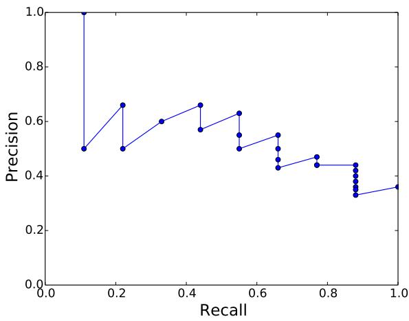
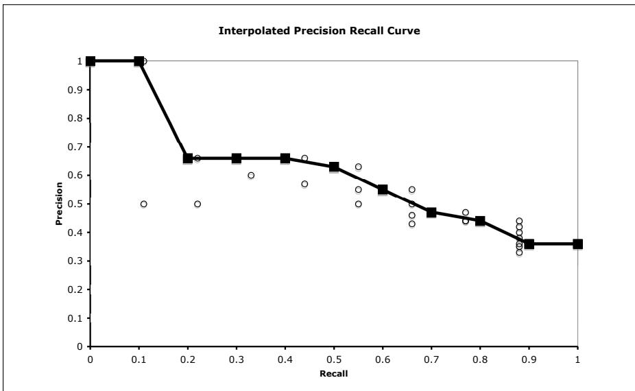

## 11.2 Evaluation of Information-Retrieval Systems

We measure the performance of ranked retrieval systems using the same precision and recall metrics we have been using. We make the assumption that each document returned by the IR system is either relevant to our purposes or not relevant. Precision is the fraction of the returned documents that are relevant, and recall is the fraction of all relevant documents that are returned. More formally, let’s assume a system returns T ranked documents in response to an information request, a subset R of these are relevant, a disjoint subset, $N ,$ are the remaining irrelevant documents, and U documents in the collection as a whole are relevant to this request. Precision and recall are then defined as:

$$
P r e c i s i o n = \frac {| R |}{| T |} \quad R e c a l l = \frac {| R |}{| U |}\tag{11.13}
$$

Unfortunately, these metrics don’t adequately measure the performance of a system that ranks the documents it returns. If we are comparing the performance of two ranked retrieval systems, we need a metric that prefers the one that ranks the relevant documents higher. We need to adapt precision and recall to capture how well a system does at putting relevant documents higher in the ranking.

Let’s turn to an example. Assume we have a user query and have retrieved a set of documents from a collection of 25 documents, 9 of which are relevant to the query in this collection. The table in Fig. 11.7 shows the 25 ranked documents with the judgment column indicating if the document was relevant or not.

The next two columns give the rank-specific precision and recall values calculated as we proceed down through a set of ranked documents for a particular query. The precisions are the fraction of relevant documents seen at a given rank, and recalls the fraction of relevant documents found at the same rank. More formally, at rank $k ,$ we can define precisionk and recallk as:

$$
\begin{array}{c} \text { Precision } _ {k} = \frac {\left| \text { relevant   documents   in   top } k \right|}{k} \\ \text { Recall } _ {k} = \frac {\left| \text { relevant   documents   in   top } k \right|}{9} \end{array}\tag{11.14}
$$

<table><tr><td>Rank</td><td>Judgment</td><td>PrecisionRank</td><td>RecallRank</td></tr><tr><td>1</td><td>R</td><td>1.0</td><td>.11</td></tr><tr><td>2</td><td>N</td><td>.50</td><td>.11</td></tr><tr><td>3</td><td>R</td><td>.66</td><td>.22</td></tr><tr><td>4</td><td>N</td><td>.50</td><td>.22</td></tr><tr><td>5</td><td>R</td><td>.60</td><td>.33</td></tr><tr><td>6</td><td>R</td><td>.66</td><td>.44</td></tr><tr><td>7</td><td>N</td><td>.57</td><td>.44</td></tr><tr><td>8</td><td>R</td><td>.63</td><td>.55</td></tr><tr><td>9</td><td>N</td><td>.55</td><td>.55</td></tr><tr><td>10</td><td>N</td><td>.50</td><td>.55</td></tr><tr><td>11</td><td>R</td><td>.55</td><td>.66</td></tr><tr><td>12</td><td>N</td><td>.50</td><td>.66</td></tr><tr><td>13</td><td>N</td><td>.46</td><td>.66</td></tr><tr><td>14</td><td>N</td><td>.43</td><td>.66</td></tr><tr><td>15</td><td>R</td><td>.47</td><td>.77</td></tr><tr><td>16</td><td>N</td><td>.44</td><td>.77</td></tr><tr><td>17</td><td>N</td><td>.41</td><td>.77</td></tr><tr><td>18</td><td>R</td><td>.44</td><td>.88</td></tr><tr><td>19</td><td>N</td><td>.42</td><td>.88</td></tr><tr><td>20</td><td>N</td><td>.40</td><td>.88</td></tr><tr><td>21</td><td>N</td><td>.38</td><td>.88</td></tr><tr><td>22</td><td>N</td><td>.36</td><td>.88</td></tr><tr><td>23</td><td>N</td><td>.35</td><td>.88</td></tr><tr><td>24</td><td>N</td><td>.33</td><td>.88</td></tr><tr><td>25</td><td>R</td><td>.36</td><td>1.0</td></tr></table>

Figure 11.7 Rank-specific precision and recall values calculated as we proceed down through a set of ranked documents (assuming the collection has 9 relevant documents).

  
Figure 11.8 The precision recall curve for the data in table 11.7.

Note that recall is non-decreasing; when a relevant document is encountered, recall increases, and when a non-relevant document is found it remains unchanged. Precision, on the other hand, jumps up and down, increasing when relevant documents are found, and decreasing otherwise. The most common way to visualize precision and recall is to plot precision against recall in a precision-recall curve, like the one shown in Fig. 11.8 for the data in table 11.7.

Fig. 11.8 shows the values for a single query. But we’ll need to combine values for all the queries, and in a way that lets us compare one system to another. One way of doing this is to plot averaged precision values at 11 fixed levels of recall (0 to 100, in steps of 10). Since we’re not likely to have datapoints at these exact levels, we use interpolated precision values for the 11 recall values from the data points we do have. We can accomplish this by choosing the maximum precision value achieved at any level of recall at or above the one we’re calculating. In other words,

$$
\operatorname{IntPrecision} (r) = \max _ {i > = r} \operatorname{Precision} (i)\tag{11.15}
$$

This interpolation scheme not only lets us average performance over a set of queries, but also helps smooth over the irregular precision values in the original data. It is designed to give systems the benefit of the doubt by assigning the maximum precision value achieved at higher levels of recall from the one being measured. Fig. 11.9 and Fig. 11.10 show the resulting interpolated data points from our example.

<table><tr><td>Interpolated Precision</td><td>Recall</td></tr><tr><td>1.0</td><td>0.0</td></tr><tr><td>1.0</td><td>.10</td></tr><tr><td>.66</td><td>.20</td></tr><tr><td>.66</td><td>.30</td></tr><tr><td>.66</td><td>.40</td></tr><tr><td>.63</td><td>.50</td></tr><tr><td>.55</td><td>.60</td></tr><tr><td>.47</td><td>.70</td></tr><tr><td>.44</td><td>.80</td></tr><tr><td>.36</td><td>.90</td></tr><tr><td>.36</td><td>1.0</td></tr></table>

Figure 11.9 Interpolated data points from Fig. 11.7.

Given curves such as that in Fig. 11.10 we can compare two systems or approaches by comparing their curves. Clearly, curves that are higher in precision across all recall values are preferred. However, these curves can also provide insight into the overall behavior of a system. Systems that are higher in precision toward the left may favor precision over recall, while systems that are more geared towards recall will be higher at higher levels of recall (to the right).

A second way to evaluate ranked retrieval is mean average precision (MAP), which provides a single metric that can be used to compare competing systems or approaches. In this approach, we again descend through the ranked list of items, but now we note the precision only at those points where a relevant item has been encountered (for example at ranks 1, 3, 5, 6 but not 2 or 4 in Fig. 11.7). For a single query, we average these individual precision measurements over the return set (up to some fixed cutoff). More formally, if we assume that $R _ { r }$ is the set of relevant documents at or above $r ,$ then the average precision (AP) for a single query is

$$
\mathrm{AP} = \frac {1}{| R _ {r} |} \sum_ {d \in R _ {r}} \text { Precision } _ {r} (d)\tag{11.16}
$$

where $P r e c i s i o n _ { r } ( d )$ is the precision measured at the rank at which document d was found. For an ensemble of queries $Q ,$ we then average over these averages, to get our final MAP measure:

$$
\mathrm{MAP} = \frac {1}{| Q |} \sum_ {q \in Q} \mathrm{AP} (q)\tag{11.17}
$$

The MAP for the single query (hence = AP) in Fig. 11.7 is 0.6.

  
Figure 11.10 An 11 point interpolated precision-recall curve. Precision at each of the 11 standard recall levels is interpolated for each query from the maximum at any higher level of recall. The original measured precision recall points are also shown.
