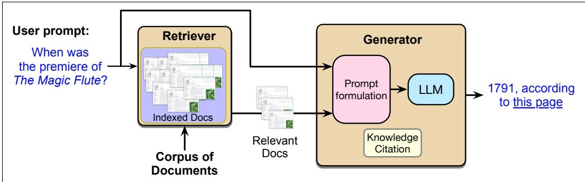

## 11.4 Retrieval-Augmented Generation (RAG)

The information retrieval techniques we introduced in the prior section can be integrated into language models via a method called retrieval-augmented generation or RAG. In the basic RAG scenario that we will describe in this section, we use IR techniques to retrieve documents from some specified store of documents that are likely to have useful information. Then we use a large language model to generate an answer conditioned on these documents in addition to the original query.

As we summarized in the introduction to the chapter, there are many goals of retrieval-augmented generation. RAG can help mitigate hallucination, by giving the model a set of trusted documents. RAG can also help language models generate factual text about proprietary data, like personal email, or health records, or company-internal documents, or other legal documents. RAG can also help with the problem that knowledge is dynamic and time-sensitive, for example if we know the user’s information need references data from a time after a language model was trained.

A RAG system is based on two major components: the retriever and the generator, (the latter is sometimes called, for historical reasons, the reader (Chen et al., 2017a)). Fig. 11.13 sketches out this standard model for answering questions.

In the first stage of the retrieval-augmented generation, or RAG model shown in Fig. 11.13 we retrieve relevant passages from some prespecified text collection, for example using the dense retrievers of the previous section. In the second generate stage, we take the set of retrieved passages, integrate it with the user prompt, and pass some version of these to a large language model to generate an answer conditioned on these two things.

For example imagine the user asks the question What year was the premiere of The Magic Flute?. We pass this question to a dense retriever and return a series of passages about The Magic Flute.

  
Figure 11.13 Retrieval-augmented generation takes as input a user prompt (which may express an information need like this question example), and a corpus of documents that may be useful in meeting the information need. The method has two stages: retrieval, which returns relevant documents from the collection, and generation, in which an LLM generates text given the documents as a prompt. Some generations include a knowledge citation that can help the user decide whether to trust the generation, or follow up if they are interested.

The idea of retrieval-augmented generation is to condition on the retrieved passages, jointly with some prompt text, for example like “Based on these texts, answer this question:”. Thus given a document collection D and a user query q, the most basic RAG algorithm is:

1. Call a retriever to return $R ( q ) = d _ { 1 } \cdot \cdot \cdot d _ { k }$ , the top-k relevant passages from D

2. Create a prompt that includes q and the retrieved passages

3. Call an LLM with the prompt

The resulting prompts might look something like:

```txt
Schematic of a RAG Prompt

retrieved passage 1

retrieved passage 2

...

retrieved passage k

Based on these texts, answer this question: What year was the premiere of The Magic Flute?
```

The task for the language model is then to generate text according to this probability model:

$$
p (x _ {1}, \dots , x _ {n}) = \prod_ {i = 1} ^ {n} p (x _ {i} | \mathrm{R} (q); \text { Answer   the   following   question... }; q; x _ {<   i})
$$

There are many augmentations of this basic RAG paradigm. One addition is the use of agent-based RAG. In the RAG paradigm described so far, a search is always run and then retrieved passages are combined with the user’s question in a prompt. But in actual applications, we may not want to run retrieval for every user turn. Or we may want to retrieve from different collections for different user needs (sometimes the web, other times a private collection). In agent-based RAG, the system decides when to call a retrieval agent and for which collection.

Another research area has to do with the relationship between the retriever and the generator. For example there may be noise in the retrieved passages; some of them may be irrelevant or wrong, or in an unhelpful order. How can we encourage the LLM to focus on the good passages? Some RAG architectures add a reranker that reranks or reorders passages after they are retrieved. Or some complex questions may require multi-hop architectures, in which a query is used to retrieve documents, which are then appended to the original query for a second stage of retrieval.

Another class of solutions is to train the LLM for RAG. The basic version of RAG described above involves no training; we take an off-the-shelf LLM, and give it the passages and a prompt and hope that it will correctly figure out which passages are useful or relevant in generating the answer. One learning variant involves instruction-tuning an LLM, by first creating a dataset of questions annotated with retrieved passages and correct answers, and then instruction-tuning the LLM to correctly answer the questions from the passages. An alternative method is to do this via test-time compute, prompting the LLM to answer the question and simultaneously to generate reflections on which passages were useful. The process of generating these reflections may lead the LLM to improve at identifying good passages. The resulting reflection text can also be used for in-context learning, for example by using the text as part of a prompt for further questions.

In addition to training the LLM, we could train the IR engine. After all, the IR engine itself has not been optimized for the RAG scenario. It might not have been trained, or if it was, it was likely trained for simple IR or factoid question-answering tasks, not for the RAG scenario where the retrieved passages are specifically to be used by another LLM for generating texts. We can address this mismatch for trainable IR algorithms by doing end-to-end training of the entire architecture on some set of questions and answers, training the parameters of the IR model as well as the LLM.

Finally, it is generally useful for LLMs to give the user evidence for any factual statement. This can be in the form of knowledge citations, such as URLs of a trusted source or citation references to particular literature. For example a question answering system might generate numbered pointers to URLs as follows:

Q: Which films have Gong Li as a member of their cast?

A: The Story of Qiu Ju [1], Farewell My Concubine [2], The Monkey King 2 [3], Mulan [3], Saturday Fiction [3] ...

The simplest way for generating knowledge citations is to specify it as part of the prompt. For example Gao et al. (2023) employ a prompt with text like:

‘‘Write an answer for the given question using only the provided search results (some of which might be irrelevant) and cite them properly... Always cite for any factual claim".
