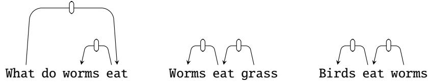

## Historical Notes

Question answering was one of the earliest NLP tasks. By 1961 the BASEBALL system (Green et al., 1961) answered questions about baseball games like “Where did the Red Sox play on July 7” by querying a structured database of game information. The database was stored as a kind of attribute-value matrix with values for attributes of each game:

```txt
Place = ?
```  
Team = Red Sox  
Month = July  
Day = 7

```txt
Month = July
    Place = Boston
    Day = 7
    Game Serial No. = 96
    (Team = Red Sox, Score = 5)
    (Team = Yankees, Score = 3)
```

Each question was constituency-parsed using the algorithm of Zellig Harris’s TDAP project at the University of Pennsylvania, essentially a cascade of finite-state transducers (see the historical discussion in Joshi and Hopely 1999 and Karttunen 1999). Then in a content analysis phase each word or phrase was associated with a program that computed parts of its meaning. Thus the phrase ‘Where’ had code to assign the semantics Place = ?, with the result that the question “Where did the Red Sox play on July 7” was assigned the meaning

The question is then matched against the database to return the answer.

The Protosynthex system of Simmons et al. (1964), given a question, formed a query from the content words in the question, and then retrieved candidate answer sentences in the document, ranked by their frequency-weighted term overlap with the question. The query and each retrieved sentence were then parsed with dependency parsers, and the sentence whose structure best matches the question structure selected. Thus the question What do worms eat? would match worms eat grass: both have the subject worms as a dependent of eat, in the version of dependency grammar used at the time, while birds eat worms has birds as the subject:



Simmons (1965) summarizes other early QA systems.

By the 1970s, systems used predicate calculus as the meaning representation language. The LUNAR system (Woods et al. 1972, Woods 1978) was designed to be a natural language interface to a database of chemical facts about lunar geology. It could answer questions like Do any samples have greater than 13 percent aluminum by parsing them into a logical form

(TEST (FOR SOME X16 / (SEQ SAMPLES) : T ; (CONTAIN’ X16 (NPR\* X17 / (QUOTE AL203)) (GREATERTHAN 13 PCT))))

By the 1990s question answering shifted to machine learning. Zelle and Mooney (1996) proposed to treat question answering as a semantic parsing task, by creating the Prolog-based GEOQUERY dataset of questions about US geography. This model was extended by Zettlemoyer and Collins (2005) and 2007. By a decade later, neural models were applied to semantic parsing (Dong and Lapata 2016, Jia and Liang 2016), and then to knowledge-based question answering by mapping text to SQL (Iyer et al., 2017).

[TBD: History of IR.]

Meanwhile, a paradigm for answering questions that drew more on informationretrieval was influenced by the rise of the web in the 1990s. The U.S. governmentsponsored TREC (Text REtrieval Conference) evaluations, run annually since 1992, provide a testbed for evaluating information-retrieval tasks and techniques (Voorhees and Harman, 2005). TREC added an influential QA track in 1999, which led to a wide variety of factoid and non-factoid question answering systems competing in annual evaluations.

At that same time, Hirschman et al. (1999) introduced the idea of using children’s reading comprehension tests to evaluate machine text comprehension algorithms. They acquired a corpus of 120 passages with 5 questions each designed for 3rd-6th grade children, built an answer extraction system, and measured how well the answers given by their system corresponded to the answer key from the test’s publisher. Their algorithm focused on word overlap as a feature; later algorithms added named entity features and more complex similarity between the question and the answer span (Riloff and Thelen 2000, Ng et al. 2000).

The DeepQA component of the Watson Jeopardy! system was a large and sophisticated feature-based system developed just before neural systems became common. It is described in a series of papers in volume 56 of the IBM Journal of Research and Development, e.g., Ferrucci (2012).

Early neural reading comprehension systems drew on the insight common to early systems that answer finding should focus on question-passage similarity. Many of the architectural outlines of these neural systems were laid out in Hermann et al. (2015), Chen et al. (2017a), and Seo et al. (2017). These systems focused on datasets like Rajpurkar et al. (2016) and Rajpurkar et al. (2018) and their successors, usually using separate IR algorithms as input to neural reading comprehension systems. The paradigm of using dense retrieval with a span-based reader, often with a single endto-end architecture, is exemplified by systems like Lee et al. (2019) or Karpukhin et al. (2020). An important research area with dense retrieval for open-domain QA is training data: using self-supervised methods to avoid having to label positive and negative passages (Sachan et al., 2023).

Early work on large language models showed that they stored sufficient knowledge in the pretraining process to answer questions (Petroni et al., 2019; Raffel et al., 2020; Radford et al., 2019; Roberts et al., 2020), at first not competitively with special-purpose question answerers, but quickly surpassing them. Retrievalaugmented generation algorithms were first introduced as a way to improve language modeling word prediction (Khandelwal et al., 2019), but were quickly applied to question answering (Izacard et al., 2022; Ram et al., 2023; Shi et al., 2023).
