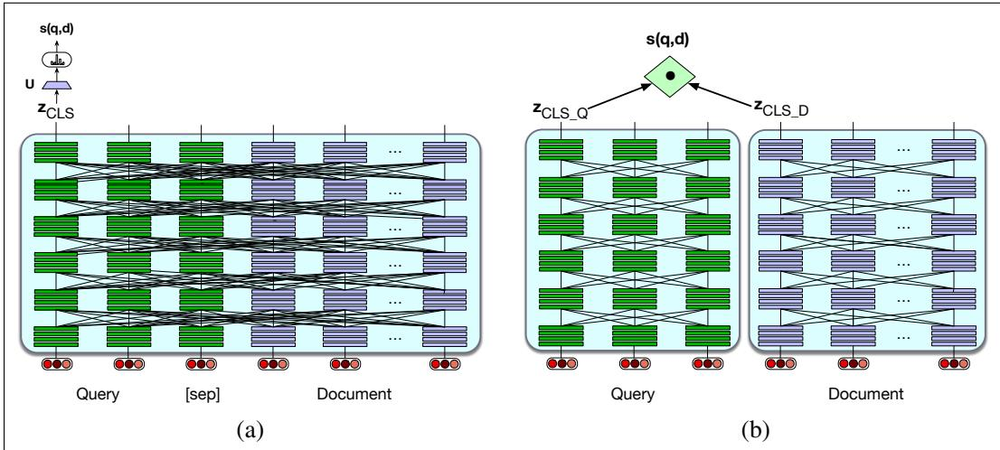
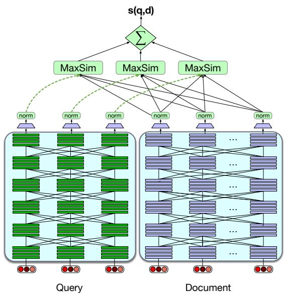

# 11.3 使用稠密向量进行信息检索

人们早已知道，用于 IR 的经典 tf-idf 或 BM25 算法存在一个概念缺陷：只有当查询与文档中的词完全重叠时，它们才能工作。换言之，提出查询（或问题）的用户必须准确猜出答案作者可能用过哪些词，这称为**词表不匹配问题**（vocabulary mismatch problem）（Furnas et al., 1987）。

解决办法是采用能够处理同义现象的方法：不使用（稀疏）词频向量，而使用（稠密）嵌入。这个思想早在上个世纪就以**潜在语义索引**（Latent Semantic Indexing）（Deerwester et al., 1990）之名用于检索；现代系统则通过 BERT 等编码器实现它。

最强大的方法是把查询和文档同时交给同一个编码器，使 Transformer 自注意力能够看到二者的全部词元，从而构建对查询与文档含义都敏感的表示。随后，可以在 [CLS] 词元之上放置一个线性层，为查询／文档元组预测相似度分数：

$$
\begin{array}{l} \mathbf {z} = \text { BERT } (\mathrm{q}; [ \text { SEP } ]; \mathrm{d}) [ \text { CLS } ] \\ \text { score } (q, d) = \text { softmax } (\mathbf {U} (\mathbf {z})) \end{array}\tag{11.18}
$$

图 11.11a 展示了这一架构。检索步骤通常不会在整篇文档上进行，而是把文档分割成更小的篇章，例如由 100 个词元组成、彼此不重叠的定长块；检索器编码并检索这些篇章，而不是整篇文档。查询与文档必须放进 BERT 的 512 词元窗口，例如可将查询截断到 64 个词元，并在必要时截断文档，使文档、查询、[CLS] 和 [SEP] 合计不超过 512 个词元。随后，可以收集由相关与不相关篇章组成的调优数据集，对 BERT 系统及其线性层 U 进行相关性任务微调。

**图 11.11 稠密检索的两种方法；层间连线以示意方式表示自注意力。（a）使用单个编码器联合编码查询和文档，并通过 CLS 词元上的线性层微调模型以产生相关性分数。除重新评分外，该方法的计算成本太高。（b）分别使用查询编码器和文档编码器，并以查询和文档的 CLS 词元输出之点积作为分数。该方法计算成本较低，但准确性也较低。**

图 11.11a 中完整 BERT 架构的问题是计算与时间成本过高。每收到一个查询，我们都必须把整个集合中的每一篇文档与新查询一起送入 BERT 编码器。这种巨大的资源消耗在实际场景中并不可行。

计算成本谱系的另一端是一种高效得多的架构——**双编码器**（bi-encoder）。该架构使用两个独立的编码器模型，一个编码查询，一个编码文档；集合中的文档只需编码一次。我们预先编码每篇文档，并存储所有文档向量。查询到来时，只需编码该查询，再以查询向量和预计算文档向量的点积作为每篇候选文档的分数（图 11.11b）。例如使用 BERT 时，可分别采用两个编码器 $\operatorname{BERT}_Q$ 与 $\operatorname{BERT}_D$，并使用各自编码器的 [CLS] 词元表示查询与文档（Karpukhin et al., 2020）：

$$
\begin{array}{c} \mathbf {z} _ {q} = \operatorname{BERT} _ {Q} (\mathrm{q}) [ \text {CLS} ] \\ \mathbf {z} _ {d} = \operatorname{BERT} _ {D} (\mathrm{d}) [ \text {CLS} ] \\ \operatorname{score} (q, d) = \mathbf {z} _ {q} \cdot \mathbf {z} _ {d} \end{array}\tag{11.19}
$$

双编码器比完整的查询／文档联合编码器便宜得多，但准确性也较低，因为其相关性判断无法充分利用查询中所有词元与文档中所有词元之间各种可能的意义交互。

完整编码器与双编码器之间还存在许多折中方法。一种方案是先使用 BM25 等成本较低的方法对文档作第一轮相关性排序，选出排名前 N 的文档，再用完整 BERT 评分等昂贵方法只对这 N 篇文档重新排序，而不是处理整个集合。

另一种折中方案是 Khattab and Zaharia（2020）及 Khattab et al.（2021）提出的 **ColBERT** 方法，如图 11.12 所示。该方法分别编码查询和文档，但不把整个查询或文档编码成单个向量，而是把二者分别编码成逐词元的上下文表示。为提高效率，可以预先存储各文档词的这些 BERT 表示。查询 q 与文档 d 之间的相关性分数，是 q 中词元与 d 中词元之间最大相似度（MaxSim）算子的总和。本质上，对于 q 中的每个词元，ColBERT 都会在 d 中找出上下文最相似的词元，再把这些相似度相加。相关文档会包含与查询在上下文中高度相似的词元。

**图 11.12 ColBERT 算法在推理时的示意图。查询与文档先经过彼此独立的 BERT 编码器，再对查询和文档中词元的上下文表示进行软对齐并求和，计算二者的相似度。训练以端到端方式进行。（图中未画出若干细节，例如在查询前添加 [CLS]、[Q:] 词元，在文档前添加 [CLS]、[D:] 词元。）本图改编自 Khattab and Zaharia（2020）。**

更正式地说，将问题 $q$ 词元化为 $[q_1,\ldots,q_n]$，在开头添加 [CLS] 和特殊 [Q] 词元，将其截断至 $N=32$ 个词元（若较短则用 [MASK] 词元填充），再通过 BERT 得到输出向量 $\mathbf q=[\mathbf q_1,\dots,\mathbf q_N]$。由词元 $[d_1,\ldots,d_m]$ 组成的篇章 $d$ 也按类似方式处理，包括添加 [CLS] 与特殊 [D] 词元。在 $d$、$q$ 之上应用一个线性层来控制输出维数，使向量保持较小以提高存储效率；再把向量缩放至单位长度，产生最终向量序列 $\mathbf E_q$（长度 $N$）与 $\mathbf E_d$（长度 $m$）。ColBERT 的评分机制为：

$$
\operatorname{score} (q, d) = \sum_ {i = 1} ^ {N} \max _ {j = 1} ^ {m} \mathbf {E} _ {q _ {i}} \cdot \mathbf {E} _ {d _ {j}}\tag{11.20}
$$

尽管交互机制没有可调参数，ColBERT 架构仍需接受端到端训练，从而微调 BERT 编码器，并从头训练线性层（以及特殊的 [Q]、[D] 嵌入）。训练数据是查询 q、正例文档 $d^+$ 和负例文档 $d^-$ 组成的三元组 $\langle q,d^+,d^-\rangle$；模型用式 11.20 为每篇文档产生分数，再使用交叉熵损失优化参数。

所有监督算法（如 ColBERT，或用于重新排序的完整交互版 BERT 算法）都需要训练数据，其形式是查询以及相关／不相关篇章或文档（正例／负例）。获取标签有多种半监督方法：一些数据集（如 11.5 节的 MS MARCO Ranking）包含金标准正例；负例可从某个现有 IR 系统的前 1000 条结果中随机采样。如果数据集没有带标签的正例，可以使用**相关性引导监督**（relevance-guided supervision）等迭代方法（Khattab et al., 2021），它利用许多数据集都含有短答案字符串这一事实。该方法先用现有 IR 系统收集包含短答案字符串的示例（取排名最前的若干项作正例）以及不含短答案字符串的示例（取排名最前的若干项作负例），用它们训练新的检索器，再迭代这一过程。

效率是一个重要问题，因为必须根据每篇可能文档与查询的相似度为其排序。对于稀疏词频向量，倒排索引可以非常高效地完成这项工作。对于稠密向量算法，找出与稠密查询向量点积最大的稠密文档向量集合，是一个**最近邻搜索**（nearest neighbor search）问题。因此，现代系统会使用 Faiss 等**近似最近邻向量搜索**算法（Johnson et al., 2017）。
