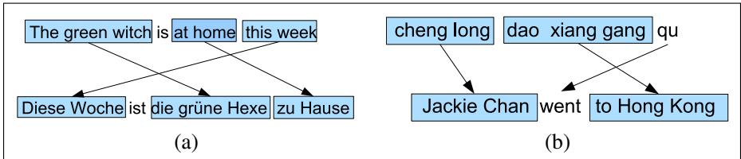
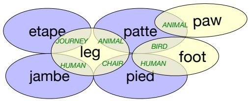

## 13.1 Language Divergences and Typology

There are about 7,000 languages in the world. Some aspects of human language seem to be universal, holding true for every one of these languages, or are statistical universals, holding true for most of these languages. Many universals arise from the functional role of language as a communicative system by humans. Every language, for example, seems to have words for referring to people, for talking about eating and drinking, for being polite or not. There are also structural linguistic universals; for example, every language seems to have nouns and verbs (Chapter 18), has ways to ask questions, or issue commands, has linguistic mechanisms for indicating agreement or disagreement.

Yet languages also differ in many ways (as has been pointed out since ancient times; see Fig. 13.1). Understanding what causes such translation divergences (Dorr, 1994) can help us build better MT models. We often distinguish the idiosyncratic and lexical differences that must be dealt with one by one (the word for “dog” differs wildly from language to language), from systematic differences that we can model in a general way (many languages put the verb before the grammatical object; others put the verb after the grammatical object). The study of these systematic cross-linguistic similarities and differences is called linguistic typology. This section sketches some typological facts that impact machine translation; the interested reader should also look into WALS, the World Atlas of Language Structures, which gives many typological facts about languages (Dryer and Haspelmath, 2013).

  
Figure 13.1 The Tower of Babel, Pieter Bruegel 1563. Wikimedia Commons, from the Kunsthistorisches Museum, Vienna.

## 13.1.1 Word Order Typology

As we hinted at in our example above comparing English and Japanese, languages differ in the basic word order of verbs, subjects, and objects in simple declarative clauses. German, French, English, and Mandarin, for example, are all SVO (Subject-Verb-Object) languages, meaning that the verb tends to come between the subject and object. Hindi and Japanese, by contrast, are SOV languages, meaning that the verb tends to come at the end of basic clauses, and Irish and Arabic are VSO languages. Two languages that share their basic word order type often have other similarities. For example, VO languages generally have prepositions, whereas OV languages generally have postpositions.

Let’s look in more detail at the example we saw above. In this SVO English sentence, the verb wrote is followed by its object a letter and the prepositional phrase to a friend, in which the preposition to is followed by its argument a friend. Arabic, with a VSO order, also has the verb before the object and prepositions. By contrast, in the Japanese example that follows, each of these orderings is reversed; the verb is preceded by its arguments, and the postposition follows its argument.

(13.3) English: He wrote a letter to a friend

Japanese: tomodachi ni tegami-o kaita friend to letter wrote

Arabic: katabt risala¯ li sadq˙ wrote letter to friend

Other kinds of ordering preferences vary idiosyncratically from language to language. In some SVO languages (like English and Mandarin) adjectives tend to appear before nouns, while in others languages like Spanish and Modern Hebrew, adjectives appear after the noun:

(13.4) Spanish bruja verde

English green witch

  
Figure 13.2 Examples of other word order differences: (a) In German, adverbs occur in initial position that in English are more natural later, and tensed verbs occur in second position. (b) In Mandarin, preposition phrases expressing goals often occur pre-verbally, unlike in English.

Fig. 13.2 shows examples of other word order differences. All of these word order differences between languages can cause problems for translation, requiring the system to do huge structural reorderings as it generates the output.

## 13.1.2 Lexical Divergences

Of course we also need to translate the individual words from one language to another. For any translation, the appropriate word can vary depending on the context. The English source-language word bass, for example, can appear in Spanish as the fish lubina or the musical instrument bajo. German uses two distinct words for what in English would be called a wall: Wand for walls inside a building, and Mauer for walls outside a building. Where English uses the word brother for any male sibling, Chinese and many other languages have distinct words for older brother and younger brother (Mandarin gege and didi, respectively). In all these cases, translating bass, wall, or brother from English would require a kind of specialization, disambiguating the different uses of a word. For this reason the fields of MT and Word Sense Disambiguation (Appendix I) are closely linked.

Sometimes one language places more grammatical constraints on word choice than another. We saw above that English marks nouns for whether they are singular or plural. Mandarin doesn’t. Or French and Spanish, for example, mark grammatical gender on adjectives, so an English translation into French requires specifying adjective gender.

The way that languages differ in lexically dividing up conceptual space may be more complex than this one-to-many translation problem, leading to many-to-many mappings. For example, Fig. 13.3 summarizes some of the complexities discussed by Hutchins and Somers (1992) in translating English leg, foot, and paw, to French. For example, when leg is used about an animal it’s translated as French patte; but about the leg of a journey, as French etape; if the leg is of a chair, we use French pied.

Further, one language may have a lexical gap, where no word or phrase, short of an explanatory footnote, can express the exact meaning of a word in the other language. For example, English does not have a word that corresponds neatly to Mandarin xiao\` or Japanese oyakok¯ o¯ (in English one has to make do with awkward phrases likefilial piety or loving child, or good son/daughter for both).

  
Figure 13.3 The complex overlap between English leg, foot, etc., and various French translations as discussed by Hutchins and Somers (1992).

Finally, languages differ systematically in how the conceptual properties of an event are mapped onto specific words. Talmy (1985, 1991) noted that languages can be characterized by whether direction of motion and manner of motion are marked on the verb or on the “satellites”: particles, prepositional phrases, or adverbial phrases. For example, a bottle floating out of a cave would be described in English with the direction marked on the particle out, while in Spanish the direction would be marked on the verb:

(13.5) English: The bottlefloated out.

Spanish: La botella salio´ flotando. The bottle exited floating.

Verb-framed languages mark the direction of motion on the verb (leaving the satellites to mark the manner of motion), like Spanish acercarse ‘approach’, alcanzar ‘reach’, entrar ‘enter’, salir ‘exit’. Satellite-framed languages mark the direction of motion on the satellite (leaving the verb to mark the manner of motion), like English crawl out, float off, jump down, run after. Languages like Japanese, Tamil, and the many languages in the Romance, Semitic, and Mayan languages families, are verb-framed; Chinese as well as non-Romance Indo-European languages like English, Swedish, Russian, Hindi, and Farsi are satellite framed (Talmy 1991, Slobin 1996).

## 13.1.3 Referential density

Finally, languages vary along a typological dimension related to the things they tend to omit. Some languages, like English, require that we use an explicit pronoun when talking about a referent that is given in the discourse. In other languages, however, we can sometimes omit pronouns altogether, as the following example from Spanish shows1:

(13.6) [El jefe]i dio con un libro. /0i Mostro su hallazgo a un descifrador ambulante.´

[The boss] came upon a book. [He] showed his find to a wandering decoder.

Languages that can omit pronouns are called pro-drop languages. Even among the pro-drop languages, there are marked differences in frequencies of omission. Japanese and Chinese, for example, tend to omit far more than does Spanish. This dimension of variation across languages is called the dimension of referential density. We say that languages that tend to use more pronouns are more referentially dense than those that use more zeros. Referentially sparse languages, like Chinese or Japanese, that require the hearer to do more inferential work to recover antecedents are also called cold languages. Languages that are more explicit and make it easier for the hearer are called hot languages. The terms hot and cold are borrowed from Marshall McLuhan’s 1964 distinction between hot media like movies, which fill in many details for the viewer, versus cold media like comics, which require the reader to do more inferential work to fill out the representation (Bickel, 2003).

Translating from languages with extensive pro-drop, like Chinese or Japanese, to non-pro-drop languages like English can be difficult since the model must somehow identify each zero and recover who or what is being talked about in order to insert the proper pronoun.
