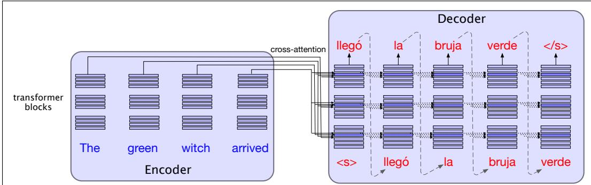
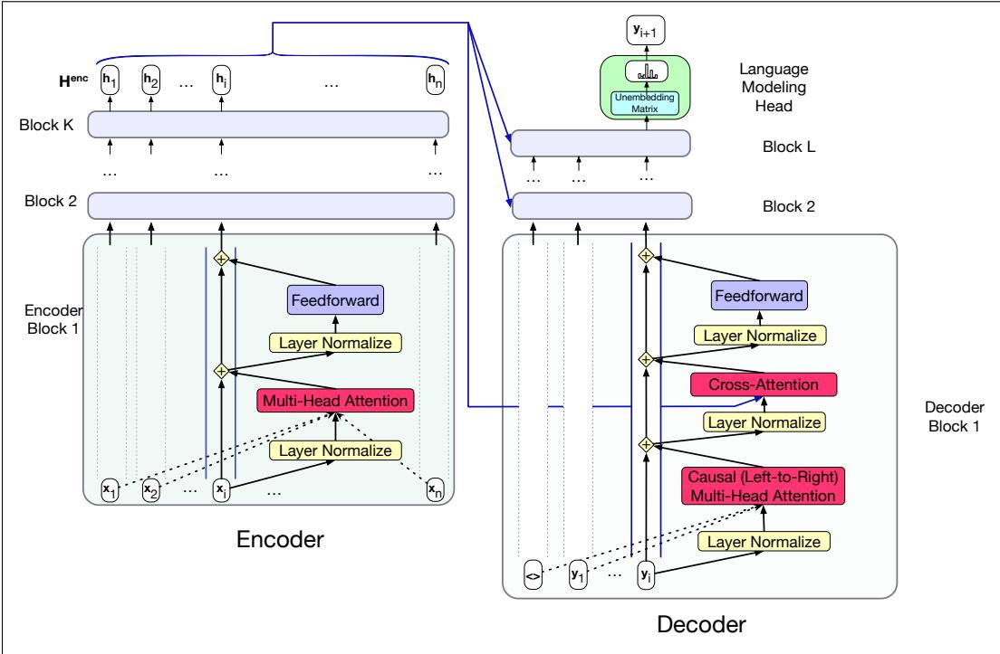

## 13.3 Details of the Encoder-Decoder Model

The standard architecture for MT is the encoder-decoder transformer. Fig. 13.5 shows the intuition of the architecture at a high level. You’ll see that the encoderdecoder architecture is made up of two transformers: an encoder, which is the same as the basic transformers from Chapter 7, and a decoder, which is augmented with a special new layer called the cross-attention layer. The encoder takes the source language input word tokens $\mathbf { X } = \mathbf { x } _ { 1 } , . . . , \mathbf { x } _ { n }$ and maps them to an output representation $\mathsf { \pmb { H } } ^ { e n c } = \mathsf { \pmb { h } } _ { 1 } , . . . , \mathsf { \pmb { h } } _ { n } ;$ via a stack of encoder blocks.

The decoder is essentially a conditional language model that attends to the encoder representation and generates the target words one by one, at each timestep conditioning on the source sentence and the previously generated target language words to generate a token. Decoding can use any of the decoding methods discussed in Chapter 7 like greedy, or temperature or nucleus sampling. But the most common decoding algorithm for MT is the beam search algorithm that we’ll introduce in Section 13.4.

  
Figure 13.5 The encoder-decoder transformer architecture for machine translation. The encoder uses the transformer blocks we saw in Chapter 7, while the decoder uses a more powerful block with an extra crossattention layer that can attend to all the encoder words. We’ll see this in more detail in the next section.

But the components of the architecture differ somewhat from the transformer block we’ve seen. First, in order to attend to the source language, the transformer blocks in the decoder have an extra cross-attention layer. Recall that the transformer block of Chapter 7 consists of a self-attention layer that attends to the input from the previous layer, preceded by layer norm, and followed by another layer norm and the feed forward layer. The decoder transformer block includes an extra layer with a special kind of attention, cross-attention (also sometimes called encoder-decoder attention or source attention). Cross-attention has the same form as the multi-head attention in a normal transformer block, except that while the queries as usual come from the previous layer of the decoder, the keys and values come from the output of the encoder.

That is, where in standard multi-head attention the input to each attention layer is $\mathbf { x } ,$ , in cross attention the input is the final output of the encoder ${ \mathsf { \mathbf { H } } } ^ { e n c } = { \mathsf { \mathbf { h } } } _ { 1 } , . . . , { \mathsf { \mathbf { h } } } _ { n }$ ${ \sf H } ^ { e n c }$ is of shape $[ n \times d ]$ , each row representing one input token. To link the keys and values from the encoder with the query from the prior layer of the decoder, we multiply the encoder output ${ \sf H } ^ { e n c }$ by the cross-attention layer’s key weights $\boldsymbol { \mathsf { W } } ^ { \mathsf { K } }$ and value weights $\boldsymbol { \mathsf { W } } ^ { \boldsymbol { \mathsf { v } } }$ . The query comes from the output from the prior decoder layer $\mathsf { \pm } d e c [ \ell - 1 ]$ , which is multiplied by the cross-attention layer’s query weights $\boldsymbol { \mathsf { W } } ^ { \mathbf { Q } }$

$$
\mathbf {Q} = \mathbf {H} ^ {d e c [ \ell - 1 ]} \mathbf {W} ^ {\mathbf {Q}}; \mathbf {K} = \mathbf {H} ^ {e n c} \mathbf {W} ^ {\mathbf {K}}; \mathbf {V} = \mathbf {H} ^ {e n c} \mathbf {W} ^ {\mathbf {V}}\tag{13.11}
$$

$$
\text { CrossAttention } (\mathbf {Q}, \mathbf {K}, \mathbf {V}) = \text { softmax } \left(\frac {\mathbf {Q} \mathbf {K} ^ {\intercal}}{\sqrt {d _ {k}}}\right) \mathbf {V}\tag{13.12}
$$

The cross attention thus allows the decoder to attend to each of the source language words as projected into the entire encoder final output representations. The other attention layer in each decoder block, the multi-head attention layer, is the same causal (left-to-right) attention that we saw in Chapter 7. The multi-head attention in the encoder, however, is allowed to look ahead at the entire source language text, so it is not masked.

To train an encoder-decoder model, we give the network the source text, and then starting with the separator token train it autoregressively to predict the next token, using cross-entropy loss. Recall that cross-entropy loss for language modeling is determined by the probability the model assigns to the correct next word. So at time t the CE loss is the negative log probability the model assigns to the next word in the training sequence:

  
Figure 13.6 The transformer block for the encoder and the decoder, showing the residual stream view. The final output of the encoder ${ \mathsf { \mathbf { H } } } ^ { e n c } = { \mathsf { \mathbf { h } } } _ { 1 } , . . . , { \mathsf { \mathbf { h } } } _ { n }$ is the context used in the decoder. The decoder is a standard transformer except with one extra layer, the cross-attention layer, which takes that encoder output $\mathsf { H } ^ { e n c }$ and uses it to form its K and V inputs.

$$
L _ {\mathrm{CE}} (\hat {\mathbf {y}} _ {t}, \mathbf {y} _ {t}) = - \log \hat {\mathbf {y}} _ {t} [ w _ {t + 1} ]\tag{13.13}
$$

teacher forcing

$\mathbf { A } \mathbf { s }$ in that case, we use teacher forcing in the decoder. Recall that in teacher forcing, at each time step in decoding we force the system to use the gold target token from training as the next input $x _ { t + 1 }$ , rather than allowing it to rely on the (possibly erroneous) decoder output $\hat { y _ { t } }$ .
