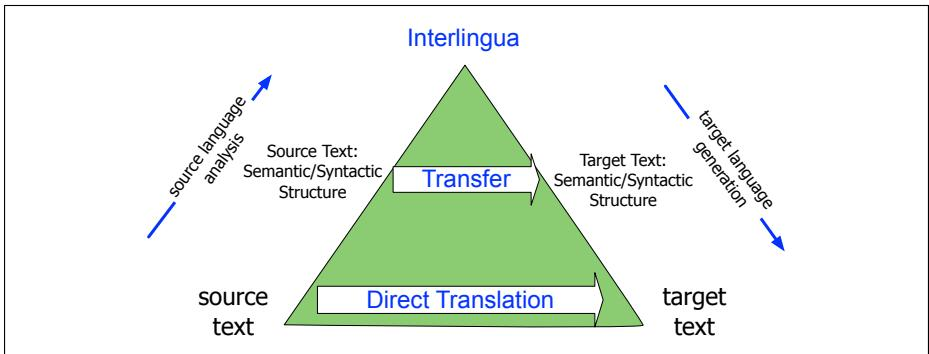

## Historical Notes

MT was proposed seriously by the late 1940s, soon after the birth of the computer (Weaver, 1949/1955). In 1954, the first public demonstration of an MT system prototype (Dostert, 1955) led to great excitement in the press (Hutchins, 1997). The next decade saw a great flowering of ideas, prefiguring most subsequent developments. But this work was ahead of its time—implementations were limited by, for example, the fact that pending the development of disks there was no good way to store dictionary information.

As high-quality MT proved elusive (Bar-Hillel, 1960), there grew a consensus on the need for better evaluation and more basic research in the new fields of formal and computational linguistics. This consensus culminated in the famously critical ALPAC (Automatic Language Processing Advisory Committee) report of 1966 (Pierce et al., 1966) that led in the mid 1960s to a dramatic cut in funding for MT in the US. As MT research lost academic respectability, the Association for Machine Translation and Computational Linguistics dropped MT from its name. Some MT developers, however, persevered, and there were early MT systems like Met´ eo,´ which translated weather forecasts from English to French (Chandioux, 1976), and industrial systems like Systran.

In the early years, the space of MT architectures spanned three general models. In direct translation, the system proceeds word-by-word through the sourcelanguage text, translating each word incrementally. Direct translation uses a large bilingual dictionary, each of whose entries is a small program with the job of translating one word. In transfer approaches, we first parse the input text and then apply rules to transform the source-language parse into a target language parse. We then generate the target language sentence from the parse tree. In interlingua approaches, we analyze the source language text into some abstract meaning representation, called an interlingua. We then generate into the target language from this interlingual representation. A common way to visualize these three early approaches was the Vauquois triangle shown in Fig. 13.13. The triangle shows the increasing depth of analysis required (on both the analysis and generation end) as we move from the direct approach through transfer approaches to interlingual approaches. In addition, it shows the decreasing amount of transfer knowledge needed as we move up the triangle, from huge amounts of transfer at the direct level (almost all knowledge is transfer knowledge for each word) through transfer (transfer rules only for parse trees or thematic roles) through interlingua (no specific transfer knowledge). We can view the encoder-decoder network as an interlingual approach, with attention acting as an integration of direct and transfer, allowing words or their representations to be directly accessed by the decoder.

  
Figure 13.13 The Vauquois (1968) triangle.

Statistical methods began to be applied around 1990, enabled first by the development of large bilingual corpora like the Hansard corpus of the proceedings of the Canadian Parliament, which are kept in both French and English, and then by the growth of the web. Early on, a number of researchers showed that it was possible to extract pairs of aligned sentences from bilingual corpora, using words or simple cues like sentence length (Kay and Roscheisen¨ 1988, Gale and Church 1991, Gale and Church 1993, Kay and Roscheisen¨ 1993).

At the same time, the IBM group, drawing directly on the noisy channel model for speech recognition, proposed two related paradigms for statistical MT. These include the generative algorithms that became known as IBM Models 1 through 5, implemented in the Candide system. The algorithms (except for the decoder) were published in full detail— encouraged by the US government who had partially funded the work— which gave them a huge impact on the research community (Brown et al. 1990, Brown et al. 1993).

The group also developed a discriminative approach, called MaxEnt (for maximum entropy, an alternative formulation of logistic regression), which allowed many features to be combined discriminatively rather than generatively (Berger et al., 1996), which was further developed by Och and Ney (2002).

By the turn of the century, most academic research on machine translation used statistical MT, either in the generative or discriminative mode. An extended version of the generative approach, called phrase-based translation was developed, based on inducing translations for phrase-pairs (Och 1998, Marcu and Wong 2002, Koehn et al. (2003), Och and Ney 2004, Deng and Byrne 2005, inter alia).

Once automatic metrics like BLEU were developed (Papineni et al., 2002), the discriminative log linear formulation (Och and Ney, 2004), drawing from the IBM MaxEnt work (Berger et al., 1996), was used to directly optimize evaluation metrics like BLEU in a method known as Minimum Error Rate Training, or MERT (Och, 2003), also drawing from speech recognition models (Chou et al., 1993). Toolkits like GIZA (Och and Ney, 2003) and Moses (Koehn et al. 2006, Zens and Ney 2007) were widely used.

There were also approaches around the turn of the century that were based on syntactic structure (Chapter 19). Models based on transduction grammars (also called synchronous grammars) assign a parallel syntactic tree structure to a pair of sentences in different languages, with the goal of translating the sentences by applying reordering operations on the trees. From a generative perspective, we can view a transduction grammar as generating pairs of aligned sentences in two languages. Some of the most widely used models included the inversion transduction grammar (Wu, 1996) and synchronous context-free grammars (Chiang, 2005),

Neural networks had been applied at various times to various aspects of machine translation; for example Schwenk et al. (2006) showed how to use neural language models to replace n-gram language models in a Spanish-English system based on IBM Model 4. The modern neural encoder-decoder approach was pioneered by Kalchbrenner and Blunsom (2013), who used a CNN encoder and an RNN decoder, and was first applied to MT by Bahdanau et al. (2015). The transformer encoderdecoder was proposed by Vaswani et al. (2017) (see the History section of Chapter 7).

Research on evaluation of machine translation began quite early. Miller and Beebe-Center (1956) proposed a number of methods drawing on work in psycholinguistics. These included the use of cloze and Shannon tasks to measure intelligibility as well as a metric of edit distance from a human translation, the intuition that underlies all modern overlap-based automatic evaluation metrics. The ALPAC report included an early evaluation study conducted by John Carroll that was extremely influential (Pierce et al., 1966, Appendix 10). Carroll proposed distinct measures for fidelity and intelligibility, and had raters score them subjectively on 9-point scales. Much early evaluation work focuses on automatic word-overlap metrics like BLEU (Papineni et al., 2002), NIST (Doddington, 2002), TER (Translation Error Rate) (Snover et al., 2006), Precision and Recall (Turian et al., 2003), and METEOR (Banerjee and Lavie, 2005); character n-gram overlap methods like chrF (Popovic´, 2015) came later. More recent evaluation work, echoing the ALPAC report, has emphasized the importance of careful statistical methodology and the use of human evaluation (Kocmi et al., 2021; Marie et al., 2021).

The early history of MT is surveyed in Hutchins 1986 and 1997; Nirenburg et al.

(2002) collects early readings. See Croft (1990) or Comrie (1989) for introductions to linguistic typology.
