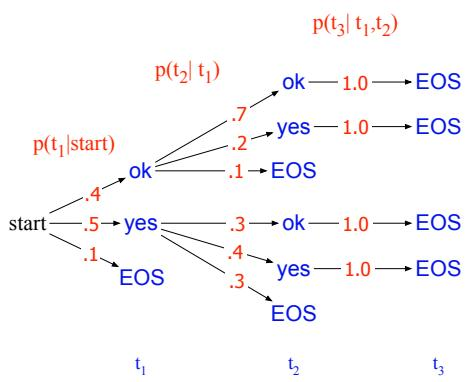
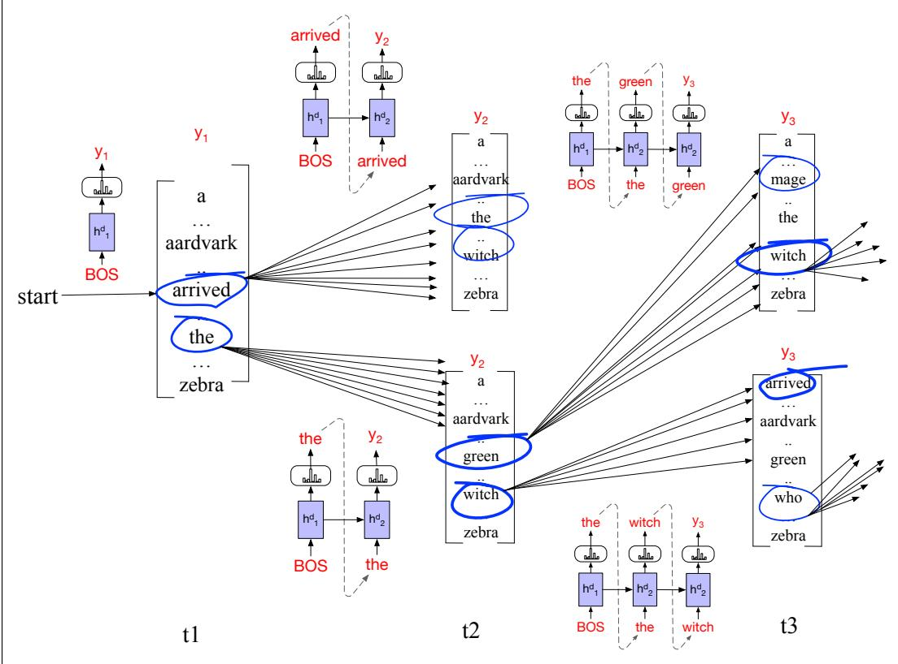
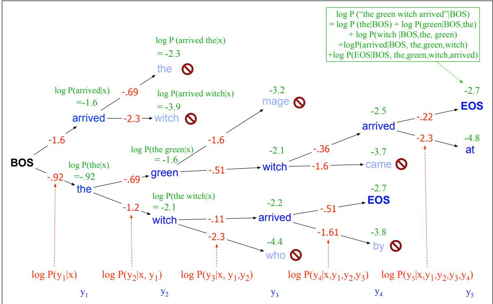

# 13.4 MT 解码：束搜索

回顾第 7 章的贪心解码：生成的每个时间步 t，都计算词表中每个词的概率，再选择概率最高的词（argmax）作为输出 $y_t$：

$$
\hat {w} _ {t} = \operatorname{argmax} _ {w \in V} P (w | \mathbf {w} _ {<   t})\tag{13.14}
$$

贪心解码的问题在于，词 t 处看似概率很高的选择，到 $t+1$ 时可能证明是错误的。**束搜索**（beam search）会保留多个选择，直到稍后能判断哪一个最好。

束搜索把解码建模为在可能生成结果空间中的搜索。该空间表示为搜索树，分支表示动作（生成一个词元），节点表示状态（已经生成某个前缀）。目标是寻找最佳动作序列，即概率最高的字符串。

## 问题示例

图 13.7 是一个虚构例子。概率最高的序列是 ok ok EOS（概率为 $.4\times.7\times1.0$），但贪心搜索找不到它，因为 yes 的局部概率最高（0.5），所以错误地选择 yes 作为第一个词。

**图 13.7 从词表 $V=\{yes,ok,<s>\}$ 生成目标字符串 $T=t_1,t_2,\dots$ 的搜索树，标出了在各状态生成每个词元的概率。贪心搜索选择 yes、yes，而不是全局概率最高的 ok、ok。**

对于第 18、19 章将介绍的词性标注或句法分析等问题，可以用动态规划搜索（维特比算法）解决。遗憾的是，动态规划不适用于输出决策之间存在长距离依赖的生成问题。唯一保证找到最优解的方法是穷举搜索：计算长度 T 的所有 $V^T$ 个可能句子的概率，但显然太慢。

## 解决方案：束搜索

因此，MT 系统通常使用 Lowerre（1976）最早提出的启发式搜索方法——束搜索。束搜索不是在每个时间步只选最佳词元，而是保留 k 个可能选项。这个固定的内存容量 k 称为**束宽**（beam width），借用了手电筒光束可以调宽或调窄的比喻。

解码第一步对整个词表计算 softmax，为每个词赋予概率，再从输出中选择最佳 k 项。这 k 个初始输出构成**搜索前沿**（search frontier），称为**假设**（hypothesis）。假设是一个迄今为止的输出序列（暂定译文）及其概率。

后续每一步，把 $k$ 个最佳假设分别交给不同解码器扩展；每个解码器都对整个词表生成 softmax，把假设扩展到每个可能的下一词元。这 $k\times V$ 个假设分别按 $P(y_i\mid\mathbf x,\mathbf y_{<i})$ 评分，即当前词选择概率乘以通向它的路径概率。随后将其剪枝为最佳 $k$ 个，使搜索前沿从不超过 $k$ 个假设，也从不需要超过 $k$ 个解码器。图 13.8 以 *The green witch arrived* 的开头和束宽 2 为例。

**图 13.8 束宽 $k=2$ 的束搜索解码。每个时间步选择最佳 k 个假设，为每个假设形成 V 种扩展，为 kV 个假设评分，再选最佳 2 项继续。时间 1 的前沿是初始状态下最佳的 arrived 与 the。扩展后计算 arrived the、arrived aardvark、the green、the witch 等假设的概率，再选择 the green、the witch 作为前沿。边上的图像示意各步为下一词评分所运行的解码器（为简洁起见未画交叉注意力）。**

这一过程持续到生成 EOS，表明已找到完整候选输出。此时从前沿移除完成的假设，束大小减一。搜索持续到束减为 0，最终得到 k 个假设。

为用对数概率给节点评分，利用概率链式法则把 $p(y\mid x)$ 分解成给定先前上下文时各词概率的乘积，再转成对数之和（输出长度为 t）：

$$
\begin{array}{l} \text { score } (y) = \log P (y | x) \\ = \log \left(P (y _ {1} | x) P (y _ {2} | y _ {1}, x) P (y _ {3} | y _ {1}, y _ {2}, x)... P (y _ {t} | y _ {1},..., y _ {t - 1}, x)\right) \\ = \sum_ {i = 1} ^ {t} \log P (y _ {i} | y _ {1},..., y _ {i - 1}, x) \end{array}\tag{13.15}
$$

所以每一步只需把当前前缀句子的对数概率与生成下一词元的对数概率相加。图 13.9 用虚构概率展示图 13.8 例句的评分。对数概率为负数或 0，两个对数概率中的最大值就是较大、更接近 0 的一个。

**图 13.9 束宽 $k=2$ 的束搜索评分。通过递增地加上每个下一词元的生成对数概率，维护束中各假设的对数概率；只有前 k 条路径会扩展到下一步。**

图 13.10 给出算法。这一版本的问题是，完成的假设长度可能不同。语言模型通常为较长字符串赋予较低概率，因此朴素算法会偏向较短的 y。（解码早期不存在该问题，因为束搜索采用广度优先，被比较的假设长度相同。）所以常使用长度归一化，例如把对数概率除以词数：

$$
\operatorname{score} (y) = \frac {1}{t} \log P (y | x) = \frac {1}{t} \sum_ {i = 1} ^ {t} \log P \left(y _ {i} \mid y _ {1}, \dots , y _ {i - 1}, x\right)\tag{13.16}
$$

MT 通常使用 5～10 的束宽，最终得到 k 个假设。可以把全部 k 个假设及其分数传给下游应用；如果只需一个译文，则传递概率最高者。

## 13.4.1 最小贝叶斯风险解码

**最小贝叶斯风险**（minimum Bayes risk, MBR）解码是另一种算法，表现可能优于束搜索，也通常优于 7.6 节的温度采样等解码算法。

其直觉是：不选择概率最高的译文，而选择预期错误最少的译文。例如，可让解码算法寻找在某项评估指标上得分最高的译文。13.6 节将介绍 chrF、BERTScore 等指标，用于测量候选译文与一组人工参考译文的拟合程度。能最大化该分数的译文——尤其是相对于假想的庞大完美人工译文集——即使不是特定概率估计器认为最可能的译文，也很可能是风险最小的好译文。

函数 BEAMDECODE(c, beam_width) 返回最佳路径
初始化状态、路径、已完成路径与前沿
当此前沿含未完成路径且束宽大于 0：
　扩展前沿中的每个状态，对词表中每个词建立后继状态
　用 ADDTOBEAM 只保留束宽范围内得分最高的状态
　将完成状态移入已完成路径，并相应缩小束宽
返回已完成路径

函数 ADDTOBEAM(state, frontier, width)：
若前沿未满则插入状态；否则仅当新状态优于最差状态时替换之。

图 13.10 束搜索解码。

实际中，我们不知道给定句子的完美译文集合。因此，MBR 通常选择与某组候选译文按拟合指标最相似的候选项。本质上，是用较小候选集合 Y 近似所有可能译文组成的巨大空间 U。

给定候选译文集合 Y 和相似度或对齐函数 util，选择与其他所有候选译文最相似的译文 $\hat y$：

$$
\hat {y} = \underset {y \in \mathcal {Y}} {\operatorname{argmax}} \sum_ {c \in \mathcal {Y}} \text { util } (y, c)\tag{13.17}
$$

util 可使用 chrF、BERTScore 或 BLEU。候选译文集可用 7.6 节的温度采样等基本算法采样，少至 32 或 64 个候选项即可取得良好结果。

MBR 解码也可用于其他 NLP 任务。事实上，它在应用于机器翻译（Kumar and Byrne, 2004）之前，已广泛用于语音识别（Stolcke et al., 1997; Goel and Byrne, 2000），并已证明适用于摘要、对话、图像描述等许多生成任务（Suzgun et al., 2023a）。
