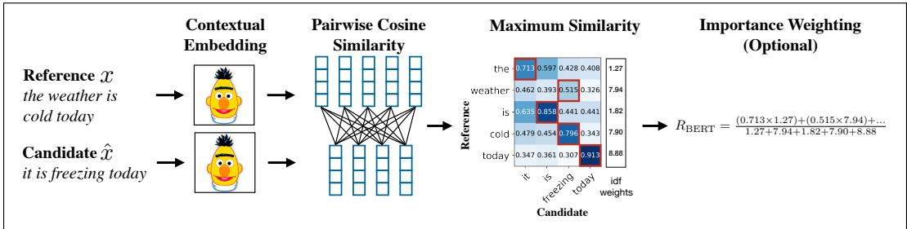

# 13.6 MT 评估

翻译沿两个维度评估：

1. **充分性**（adequacy）：译文准确捕捉源句意义的程度，也称忠实性。
2. **流畅性**（fluency）：译文在目标语言中是否符合语法、清楚、可读、自然。

人工评估最准确，但为方便起见也使用自动指标。

## 13.6.1 使用人工评估者

最准确的评估由人工评估者（如在线众包工作者）沿上述两个维度评价每篇译文。流畅性方面，可询问 MT 输出是否可理解、清晰、可读或自然，并给出从 1（完全无法理解）到 5（完全可理解）或 1～100 的量表，让评估者为每个句子或段落评分。

充分性也可采用量表评分。双语评估者可查看源句与候选目标句，按 5 点或 100 点量表判断源文信息保留了多少。若只有单语评估者，但拥有优质人工参考译文，可让他们比较参考译文与机器译文并评估信息保留程度。另一方案是排序：给出一对候选译文，请评估者选择偏好项。

培训人工评估者至关重要；缺乏翻译专业知识的人难以区分流畅性与充分性，因此培训应包含精心区分二者的例子。评估者也常意见不一，因为源句可能有歧义、世界知识不同、量表使用方式也不同。因此通常要移除离群评估者；若量表足够细，还可用分数减去均值并除以方差来归一化评估者。

另一方法是让人工对译文进行译后编辑：尽可能少地修改 MT 输出，直至其成为正确译文。译后编辑结果与原始 MT 输出之间的差异即可作为质量度量。

## 13.6.2 自动评估

人工评估最好，但耗时且昂贵，因此常以自动指标作为临时代理。它们不如人工准确，却有助于测试系统改进，甚至可作为训练的自动损失函数。本节介绍两类指标：基于字符／词语重叠的指标，以及基于嵌入相似度的指标。

## 基于字符重叠的 chrF

MT 评估最简单稳健的指标是 **chrF**（character F-score，字符 F 分数）（Popović, 2015）。它与 BLEU、METEOR、TER 等早期指标都基于 Miller and Beebe-Center（1956）的直觉：好的机器译文往往包含同一句人工译文中出现的字符与词。对于平行语料测试集，chrF 根据 MT 目标句与人工译文重叠的字符 n 元组数量为其评分。

给定假设与参考译文以及字符 n 元组最大长度 k，chrF 分别计算 k 个准确率与 k 个召回率的平均值：

**chrP**：假设中也出现在参考译文里的字符 1 元组、2 元组……k 元组比例之平均。

**chrR**：参考译文中也出现在假设里的字符 1 元组、2 元组……k 元组比例之平均。

再以参数 $\beta$ 加权组合二者计算 F 分数。通常设 $\beta=2$，即召回率权重为准确率的两倍：

$$
\operatorname{chrF} \beta = (1 + \beta^ {2}) \frac {\operatorname{chrP} \cdot \operatorname{chrR}}{\beta^ {2} \cdot \operatorname{chrP} + \operatorname{chrR}}\tag{13.20}
$$

当 $\beta=2$ 时：

$$
\mathrm{chrF2} = \frac {5 \cdot \mathrm{chrP} \cdot \mathrm{chrR}}{4 \cdot \mathrm{chrP} + \mathrm{chrR}}
$$

例如，以 *witness for the past* 为参考译文，用 $k=\beta=2$ 计算两个假设（实际 k 常取 6）：

$$
\begin{array}{l l} \text {REF: witness for the past,} \\ \text {HYP1: witness of the past,} & \text {chrF2,2 = .86} \\ \text {HYP2: past witness} & \text {chrF2,2 = .62} \end{array}
$$

chrF 忽略空格。REF 去空格后有 18 个一元组、17 个二元组；HYP1 有 17 个一元组、16 个二元组。二者匹配 17 个一元组和 13 个二元组，故一元准确率／召回率为 $17/17=1$、$17/18=.944$，二元准确率／召回率为 $13/16=.813$、$13/17=.765$。因此：

$$
\mathrm{chrP}=(17/17+13/16)/2=.906,\quad \mathrm{chrR}=(17/18+13/17)/2=.855
$$

$$
\mathrm{chrF2,2}=5\frac{\mathrm{chrP}*\mathrm{chrR}}{4\mathrm{chrP}+\mathrm{chrR}}=.86
$$

chrF 简单、稳健，在许多语言中与人工判断高度相关（Kocmi et al., 2021）。

## 另一种重叠指标：BLEU

chrF 之前常用基于词语重叠、仅考虑准确率的 **BLEU**（BiLingual Evaluation Understudy）（Papineni et al., 2002）。候选译文语料库的 BLEU 分数，是所有句子的词 n 元准确率与在整个语料库上计算的长度惩罚之函数。它分别计算一元组到四元组准确率并取几何平均，还会惩罚过短译文，并以特定方式截断 n 元组计数。

BLEU 基于词，因此对词元化非常敏感：采用不同词元化标准的系统无法比较，对形态复杂的语言也不够有效。尽管如此，尤其在译入英语时仍能看到 BLEU；此时应使用 SACREBLEU（Post, 2018）等强制统一词元化的软件包。

## MT 评估的统计显著性检验

chrF、BLEU 等重叠指标主要用于比较系统。要判断两个 MT 系统的 chrF 差异是否显著，可使用配对 bootstrap 检验或类似的随机化检验。回顾 4.11 节：从测试集（或开发集）有放回地反复采样，创建数千个伪测试集，并计算各自 chrF。去掉最高与最低各 2.5% 的分数，剩余范围即系统 chrF 的 95% 置信区间。比较系统 A、B 时，对同一批伪测试集计算二者 chrF，再统计 A 高于 B 的比例。

## chrF 的局限

chrF 很局部：移动一个很长的短语，分数可能几乎不变；它也无法评估文档的跨句属性，如语篇连贯性（第 25 章）。这类指标在比较差异很大的系统时表现也不佳，例如人工辅助翻译与机器翻译，或不同 MT 架构（Callison-Burch et al., 2006）。因此，它们最适合评估同一系统的改动。

## 13.6.3 基于嵌入的自动评估

精确字符 n 元组标准过严，因为好译文可能使用替代词或释义。METEOR（Banerjee and Lavie, 2005）等早期指标允许参考译文 x 与候选译文 $\tilde x$ 的同义词匹配；较新指标则用 BERT 等嵌入实现这一思想。

若有人工翻译质量数据，其样本为 $(x,\tilde x,r)$：x 是参考译文，$\tilde x$ 是候选机器译文，$r\in\mathbb R$ 是人工质量评分。COMET（Rei et al., 2020）、BLEURT（Sellam et al., 2020）可在这些数据上训练预测器，例如让 x、$\tilde x$ 经过额外预训练并在人标句上微调的 BERT，再用线性层预测 r；输出与人工标签高度相关。

没有人工标签时，可用嵌入相似度衡量 x 与 $\tilde x$。图 13.11 的 BERTSCORE（Zhang et al., 2020）让二者通过 BERT，为每个词元计算嵌入，并以余弦为词元对评分。x 中每个词元贪心匹配 $\tilde x$ 中最相似词元以计算召回率；反向匹配则计算准确率，进而得到 $F_1$：

$$
R _ {\text { BERT }} = \frac {1}{| x |} \sum_ {x _ {i} \in x} \max _ {\tilde {x} _ {j} \in \tilde {x}} x _ {i} \cdot \tilde {x} _ {j} \quad P _ {\text { BERT }} = \frac {1}{| \tilde {x} |} \sum_ {\tilde {x} _ {j} \in \tilde {x}} \max _ {x _ {i} \in x} x _ {i} \cdot \tilde {x} _ {j}\tag{13.21}
$$

**图 13.11 根据参考译文 x 与候选译文 $\hat x$ 计算 BERTSCORE 召回率（改自 Zhang et al., 2020 图 1）。该扩展版本还按词元 idf 加权。**
