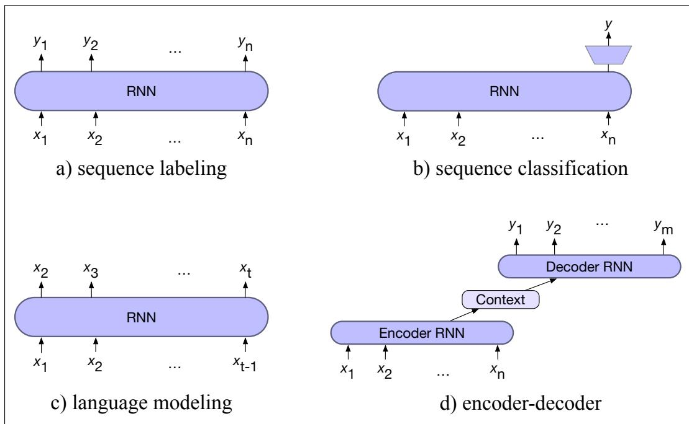

# CHAPTER 14 RNNs and LSTMs

Time will explain.

Jane Austen, Persuasion

Language is an inherently temporal phenomenon. Spoken language is a sequence of acoustic events over time, and we comprehend and produce both spoken and written language as a sequential input stream. The temporal nature of language is reflected in the metaphors we use; we talk of theflow ofconversations, newsfeeds, and twitter streams, all of which emphasize that language is a sequence that unfolds in time.

This chapter introduces a deep learning architecture, the recurrent neural network (RNN), and RNN variants like LSTMs, that offer a different way of representing time than feedforward and transformer networks. RNNs have a mechanism that deals directly with the sequential nature of language, allowing them to handle the temporal nature of language without the use of arbitrary fixed-sized windows. The recurrent network offers a new way to represent the prior context, in its recurrent connections, allowing the model’s decision to depend on information from hundreds of words in the past. We’ll see how to apply the model to the task of language modeling, to text classification tasks like sentiment analysis, and to sequence modeling tasks like part-of-speech tagging.

## 14.1 Recurrent Neural Networks

A recurrent neural network (RNN) is any network that contains a cycle within its network connections, meaning that the value of some unit is directly, or indirectly, dependent on its own earlier outputs as an input. While powerful, such networks are difficult to reason about and to train. However, within the general class of recurrent networks there are constrained architectures that have proven to be extremely effective when applied to language. In this section, we consider a class of recurrent networks referred to as Elman Networks (Elman, 1990) or simple recurrent networks. These networks are useful in their own right and serve as the basis for more complex approaches like the Long Short-Term Memory (LSTM) networks discussed later in this chapter. In this chapter when we use the term RNN we’ll be referring to these simpler more constrained networks (although you will often see the term RNN to mean any net with recurrent properties including LSTMs).

Fig. 14.1 illustrates the structure of an RNN. As with ordinary feedforward networks, an input vector representing the current input, xt, is multiplied by a weight matrix and then passed through a non-linear activation function to compute the values for a layer of hidden units. This hidden layer is then used to calculate a corresponding output, yt. In a departure from our earlier window-based approach, sequences are processed by presenting one item at a time to the network. We’ll use subscripts to represent time, thus $\mathbf { x } _ { t }$ will mean the input vector x at time t. The key difference from a feedforward network lies in the recurrent link shown in the figure with the dashed line. This link augments the input to the computation at the hidden layer with the value of the hidden layer from the preceding point in time.

  
Figure 14.1 Simple recurrent neural network after Elman (1990). The hidden layer includes a recurrent connection as part of its input. That is, the activation value of the hidden layer depends on the current input as well as the activation value of the hidden layer from the previous time step.

The hidden layer from the previous time step provides a form of memory, or context, that encodes earlier processing and informs the decisions to be made at later points in time. Critically, this approach does not impose a fixed-length limit on this prior context; the context embodied in the previous hidden layer can include information extending back to the beginning of the sequence.

Adding this temporal dimension makes RNNs appear to be more complex than non-recurrent architectures. But in reality, they’re not all that different. Given an input vector and the values for the hidden layer from the previous time step, we’re still performing the standard feedforward calculation introduced in Chapter 6. To see this, consider Fig. 14.2 which clarifies the nature of the recurrence and how it factors into the computation at the hidden layer. The most significant change lies in the new set of weights, U, that connect the hidden layer from the previous time step to the current hidden layer. These weights determine how the network makes use of past context in calculating the output for the current input. As with the other weights in the network, these connections are trained via backpropagation.

  
Figure 14.2 Simple recurrent neural network illustrated as a feedforward network. The hidden layer $\mathbf { h } _ { t - 1 }$ from the prior time step is multiplied by weight matrix U and then added to the feedforward component from the current time step.

## 14.1.1 Inference in RNNs

Forward inference (mapping a sequence of inputs to a sequence of outputs) in an RNN is nearly identical to what we’ve already seen with feedforward networks. To compute an output $\pmb { y } _ { t }$ for an input $\mathbf { x } _ { t } .$ , we need the activation value for the hidden layer $\mathbf { h } _ { t }$ . To calculate this, we multiply the input $\mathbf { x } _ { t }$ with the weight matrix W, and the hidden layer from the previous time step $\mathbf { h } _ { t - 1 }$ with the weight matrix U. We add these values together and pass them through a suitable activation function, g, to arrive at the activation value for the current hidden layer, ht. Once we have the values for the hidden layer, we proceed with the usual computation to generate the output vector.

$$
\mathbf {h} _ {t} = g \left(\mathbf {U h} _ {t - 1} + \mathbf {W x} _ {t}\right)\tag{14.1}
$$

$$
\mathbf {y} _ {t} = f (\mathbf {V h} _ {t})\tag{14.2}
$$

Let’s refer to the input, hidden and output layer dimensions as $d _ { i n } , \ d _ { h } .$ , and $d _ { o u t }$ respectively. Given this, our three parameter matrices are: $\boldsymbol { \mathsf { W } } \in \mathbb { R } ^ { d _ { h } \times d _ { i n } } , \boldsymbol { \mathsf { U } } \in \mathbb { R } ^ { d _ { h } \times d _ { h } }$ and $\pmb { \mathsf { v } } \in \mathbb { R } ^ { \dot { d } _ { o u t } \times d _ { h } }$

We compute $y _ { t }$ via a softmax computation that gives a probability distribution over the possible output classes.

$$
\mathbf {y} _ {t} = \operatorname{softmax} (\mathbf {V h} _ {t})\tag{14.3}
$$

The fact that the computation at time t requires the value of the hidden layer from time t 1 mandates an incremental inference algorithm that proceeds from the start of the sequence to the end as illustrated in Fig. 14.3. The sequential nature of simple recurrent networks can also be seen by unrolling the network in time as is shown in Fig. 14.4. In this figure, the various layers of units are copied for each time step to illustrate that they will have differing values over time. However, the various weight matrices are shared across time.

function FORWARDRNN(x, network) returns output sequence y
 $h_{0} \leftarrow 0$ 
for  $i \leftarrow 1$  to LENGTH(x) do
 $h_{i} \leftarrow g(Uh_{i-1} + Wx_{i})$ $y_{i} \leftarrow f(Vh_{i})$ 
return y

Figure 14.3 Forward inference in a simple recurrent network. The matrices U, V and W are shared across time, while new values for h and y are calculated with each time step.

## 14.1.2 Training

As with feedforward networks, we’ll use a training set, a loss function, and backpropagation to obtain the gradients needed to adjust the weights in these recurrent networks. As shown in Fig. 14.2, we now have 3 sets of weights to update: W, the weights from the input layer to the hidden layer, U, the weights from the previous hidden layer to the current hidden layer, and finally V, the weights from the hidden layer to the output layer.

Fig. 14.4 highlights two considerations that we didn’t have to worry about with backpropagation in feedforward networks. First, to compute the loss function for the output at time t we need the hidden layer from time t 1. Second, the hidden layer at time t influences both the output at time t and the hidden layer at time t + 1 (and hence the output and loss at t + 1). It follows from this that to assess the error accruing to ht, we’ll need to know its influence on both the current output as well as the ones thatfollow.

  
Figure 14.4 A simple recurrent neural network shown unrolled in time. Network layers are recalculated for each time step, while the weights U, V and W are shared across all time steps.

Tailoring the backpropagation algorithm to this situation leads to a two-pass algorithm for training the weights in RNNs. In the first pass, we perform forward inference, computing ht, yt, accumulating the loss at each step in time, saving the value of the hidden layer at each step for use at the next time step. In the second pass, we process the sequence in reverse, computing the required gradients as we go, computing and saving the error term for use in the hidden layer for each step backward in time. This general approach is commonly referred to as backpropagation through time (Werbos 1974, Rumelhart et al. 1986, Werbos 1990).

Fortunately, with modern computational frameworks and adequate computing resources, there is no need for a specialized approach to training RNNs. As illustrated in Fig. 14.4, explicitly unrolling a recurrent network into a feedforward computational graph eliminates any explicit recurrences, allowing the network weights to be trained directly. In such an approach, we provide a template that specifies the basic structure of the network, including all the necessary parameters for the input, output, and hidden layers, the weight matrices, as well as the activation and output functions to be used. Then, when presented with a specific input sequence, we can generate an unrolled feedforward network specific to that input, and use that graph to perform forward inference or training via ordinary backpropagation.

For applications that involve much longer input sequences, such as speech recognition, character-level processing, or streaming continuous inputs, unrolling an entire input sequence may not be feasible. In these cases, we can unroll the input into manageable fixed-length segments and treat each segment as a distinct training item.

## 14.2 RNNs as Language Models

Let’s see how to apply RNNs to the language modeling task. Recall from Chapter 3 that language models predict the next word in a sequence given some preceding context. For example, if the preceding context is “Thanks for all the” and we want to know how likely the next word is “fish” we would compute:

## P(fish Thanks for all the)

Language models give us the ability to assign such a conditional probability to every possible next word, giving us a distribution over the entire vocabulary. We can also assign probabilities to entire sequences by combining these conditional probabilities with the chain rule:

$$
P (w _ {1: n}) = \prod_ {i = 1} ^ {n} P (w _ {i} | w _ {<   i})
$$

The n-gram language models of Chapter 3 compute the probability of a word given counts of its occurrence with the n 1 prior words. The context is thus of size n 1. For the feedforward language models of Chapter $^ { 6 , }$ the context is the window size.

RNN language models (Mikolov et al., 2010) process the input sequence one word at a time, attempting to predict the next word from the current word and the previous hidden state. RNNs thus don’t have the limited context problem that n-gram models have, or the fixed context that feedforward language models have, since the hidden state can in principle represent information about all of the preceding words all the way back to the beginning of the sequence. Fig. 14.5 sketches this difference between a FFN language model and an RNN language model, showing that the RNN language model uses $h _ { t - 1 }$ , the hidden state from the previous time step, as a representation of the past context.

  
Figure 14.5 Simplified sketch of two LM architectures moving through a text, showing a schematic context of three tokens: (a) a feedforward neural language model which has a fixed context input to the weight matrix W, (b) an RNN language model, in which the hidden state $\mathbf { h } _ { t - 1 }$ summarizes the prior context.

## 14.2.1 Forward Inference in an RNN language model

Forward inference in a recurrent language model proceeds exactly as described in Section 14.1.1. The input sequence ${ \pmb { \mathsf { X } } } = [ { \pmb { \mathsf { x } } } _ { 1 } ; . . . ; { \pmb { \mathsf { x } } } _ { t } ; . . . ; { \pmb { \mathsf { x } } } _ { N } ]$ consists of a series of words each represented as a one-hot vector of size $| V | \times 1$ , and the output prediction, ˆy, is a vector representing a probability distribution over the vocabulary. At each step, the model uses the word embedding matrix E to retrieve the embedding for the current word, multiples it by the weight matrix W, and then adds it to the hidden layer from the previous step (weighted by weight matrix U) to compute a new hidden layer. This hidden layer is then used to generate an output layer which is passed through a softmax layer to generate a probability distribution over the entire vocabulary. That is, at time t:

$$
\mathbf {e} _ {t} = \mathbf {E x} _ {t}\tag{14.4}
$$

$$
\mathbf {h} _ {t} = g \left(\mathbf {U h} _ {t - 1} + \mathbf {W e} _ {t}\right)\tag{14.5}
$$

$$
\hat {\mathbf {y}} _ {t} = \operatorname{softmax} (\mathbf {V h} _ {t})\tag{14.6}
$$

When we do language modeling with RNNs (and we’ll see this again in Chapter 7 with transformers), it’s convenient to make the assumption that the embedding dimension $d _ { e }$ and the hidden dimension $d _ { h }$ are the same. So we’ll just call both of these the model dimension d. So the embedding matrix E is of shape $[ d \times | V | ]$ , and $\pmb { \ x } _ { \mathbf { t } }$ is a one-hot vector of shape $[ | V | \times 1 ]$ . The product $\mathbf { e } _ { t }$ is thus of shape $[ d \times 1 ]$ . W and U are of shape $[ d \times d ]$ , so $\mathbf { h } _ { t }$ is also of shape $[ d \times 1 ]$ . V is of shape $[ | V | \times d ]$ so the result of Vh is a vector of shape $[ | V | \times 1 ]$ . This vector can be thought of as a set of scores over the vocabulary given the evidence provided in h. Passing these scores through the softmax normalizes the scores into a probability distribution. The probability that a particular word k in the vocabulary is the next word is represented by $\hat { \mathbf { y } } _ { t } [ k ]$ , the kth component of $\hat { \mathbf { y } } _ { t }$ :

$$
P (w _ {t + 1} = k | w _ {1}, \dots , w _ {t}) = \hat {\mathbf {y}} _ {t} [ k ]\tag{14.7}
$$

The probability of an entire sequence is just the product of the probabilities of each item in the sequence, where we’ll use $\hat { \mathsf { y } } _ { i } [ { \boldsymbol w } _ { i } ]$ to mean the probability of the true word wi at time step i.

$$
\begin{array}{l} P (w _ {1: n}) = \prod_ {i = 1} ^ {n} P (w _ {i} | w _ {1: i - 1}) \\ = \prod_ {i = 1} ^ {n} \hat {\mathbf {y}} _ {i} [ w _ {i} ] \end{array}\tag{14.8}
$$

(14.9)

## 14.2.2 Training an RNN language model

To train an RNN as a language model, we use the same self-supervision (or selftraining) algorithm we saw in Section 7.7: we take a corpus of text as training material and at each time step t ask the model to predict the next word. We call such a model self-supervised because we don’t have to add any special gold labels to the data; the natural sequence of words is its own supervision! We simply train the model to minimize the error in predicting the true next word in the training sequence, using cross-entropy as the loss function. Recall that the cross-entropy loss measures the difference between a predicted probability distribution and the correct distribution.

$$
L _ {C E} (\hat {\mathbf {y}} _ {t}, \mathbf {y} _ {t}) = - \sum_ {w \in V} \mathbf {y} _ {t} [ w ] \log \hat {\mathbf {y}} _ {t} [ w ]\tag{14.10}
$$

  
Figure 14.6 Training RNNs as language models.

In the case of language modeling, the correct distribution yt comes from knowing the next word. This is represented as a one-hot vector corresponding to the vocabulary where the entry for the actual next word is 1, and all the other entries are 0. Thus, the cross-entropy loss for language modeling is determined by the probability the model assigns to the correct next word. So at time t the CE loss is the negative log probability the model assigns to the next word in the training sequence.

$$
L _ {C E} (\hat {\mathbf {y}} _ {t}, \mathbf {y} _ {t}) = - \log \hat {\mathbf {y}} _ {t} [ w _ {t + 1} ]\tag{14.11}
$$

Thus at each word position t of the input, the model takes as input the correct word $w _ { t }$ together with $h _ { t - 1 } ,$ encoding information from the preceding $w _ { 1 : t - 1 }$ , and uses them to compute a probability distribution over possible next words so as to compute the model’s loss for the next token $w _ { t + 1 }$ . Then we move to the next word, we ignore what the model predicted for the next word and instead use the correct word $w _ { t + 1 }$ along with the prior history encoded to estimate the probability of token $w _ { t + 2 }$ . This idea that we always give the model the correct history sequence to predict the next word (rather than feeding the model its best case from the previous time step) is called teacher forcing.

The weights in the network are adjusted to minimize the average CE loss over the training sequence via gradient descent. Fig. 14.6 illustrates this training regimen.

## 14.2.3 Weight Tying

Careful readers may have noticed that the input embedding matrix E and the final layer matrix V, which feeds the output softmax, are quite similar.

The columns of E represent the word embeddings for each word in the vocabulary learned during the training process with the goal that words that have similar meaning and function will have similar embeddings. And, since when we use RNNs for language modeling we make the assumption that the embedding dimension and the hidden dimension are the same (= the model dimension $d )$ , the embedding matrix E has shape $[ d \times | V | ]$ . And the final layer matrix V provides a way to score the likelihood of each word in the vocabulary given the evidence present in the final hidden layer of the network through the calculation of Vh. V is of shape $[ | V | \times d ]$ That ${ \mathrm { i s } } ,$ the rows of V are shaped like a transpose of E, meaning that V provides a

second set of learned word embeddings.

Instead of having two sets of embedding matrices, language models use a single embedding matrix, which appears at both the input and softmax layers. That is, we dispense with V and use E at the start of the computation and $\mathsf { E } ^ { \top }$ (because the shape of V is the transpose of E at the end. Using the same matrix (transposed) in two places is called weight tying.1 The weight-tied equations for an RNN language model then become:

$$
\mathbf {e} _ {t} = \mathbf {E x} _ {t}\tag{14.12}
$$

$$
\mathbf {h} _ {t} = g \left(\mathbf {U h} _ {t - 1} + \mathbf {W e} _ {t}\right)\tag{14.13}
$$

$$
\hat {\mathbf {y}} _ {t} = \operatorname{softmax} \left(\mathbf {E} ^ {\intercal} \mathbf {h} _ {t}\right)\tag{14.14}
$$

In addition to providing improved model perplexity, this approach significantly reduces the number of parameters required for the model.

## 14.3 RNNs for other NLP tasks

Now that we’ve seen the basic RNN architecture, let’s consider how to apply it to three types of NLP tasks: sequence classification tasks like sentiment analysis and topic classification, sequence labeling tasks like part-of-speech tagging, and text generation tasks, including with a new architecture called the encoder-decoder.

## 14.3.1 Sequence Labeling

In sequence labeling, the network’s task is to assign a label chosen from a small fixed set of labels to each element of a sequence. One classic sequence labeling tasks is part-of-speech (POS) tagging (assigning grammatical tags like NOUN and VERB to each word in a sentence). We’ll discuss part-of-speech tagging in detail in Chapter 18, but let’s give a motivating example here. In an RNN approach to sequence labeling, inputs are word embeddings and the outputs are tag probabilities generated by a softmax layer over the given tagset, as illustrated in Fig. 14.7.

In this figure, the inputs at each time step are pretrained word embeddings corresponding to the input tokens. The RNN block is an abstraction that represents an unrolled simple recurrent network consisting of an input layer, hidden layer, and output layer at each time step, as well as the shared U, V and W weight matrices that comprise the network. The outputs of the network at each time step represent the distribution over the POS tagset generated by a softmax layer.

To generate a sequence of tags for a given input, we run forward inference over the input sequence and select the most likely tag from the softmax at each step. Since we’re using a softmax layer to generate the probability distribution over the output tagset at each time step, we will again employ the cross-entropy loss during training.

## 14.3.2 RNNs for Sequence Classification

Another use of RNNs is to classify entire sequences rather than the tokens within them. This is the set of tasks commonly called text classification, like sentiment analysis or spam detection, in which we classify a text into two or three classes (like positive or negative), as well as classification tasks with a large number of categories, like document-level topic classification, or message routing for customer service applications.

  
Figure 14.7 Part-of-speech tagging as sequence labeling with a simple RNN. The goal of part-of-speech (POS) tagging is to assign a grammatical label to each word in a sentence, drawn from a predefined set of tags. (The tags for this sentence include NNP (proper noun), MD (modal verb) and others; we’ll give a complete description of the task of part-of-speech tagging in Chapter 18.) Pre-trained word embeddings serve as inputs and a softmax layer provides a probability distribution over the part-of-speech tags as output at each time step.

To apply RNNs in this setting, we pass the text to be classified through the RNN a word at a time generating a new hidden layer representation at each time step. We can then take the hidden layer for the last token of the text, hn, to constitute a compressed representation of the entire sequence. We can pass this representation $ { \mathbf { h } } _ { n }$ to a feedforward network that chooses a class via a softmax over the possible classes. Fig. 14.8 illustrates this approach.

  
Figure 14.8 Sequence classification using a simple RNN combined with a feedforward network. The final hidden state from the RNN is used as the input to a feedforward network that performs the classification.

Note that in this approach we don’t need intermediate outputs for the words in the sequence preceding the last element. Therefore, there are no loss terms associated with those elements. Instead, the loss function used to train the weights in the network is based entirely on the final text classification task. The output from the softmax output from the feedforward classifier together with a cross-entropy loss drives the training. The error signal from the classification is backpropagated all the way through the weights in the feedforward classifier through, to its input, and then through to the three sets of weights in the RNN as described earlier in Section 14.1.2. The training regimen that uses the loss from a downstream application to adjust the weights all the way through the network is referred to as end-to-end training.

Another option, instead of using just the hidden state of the last token $h _ { n }$ to represent the whole sequence, is to use some sort of pooling function of all the hidden states $h _ { i }$ for each word i in the sequence. For example, we can create a representation that pools all the n hidden states by taking their element-wise mean:

$$
\mathbf {h} _ {\text { mean }} = \frac {1}{n} \sum_ {i = 1} ^ {n} \mathbf {h} _ {i}\tag{14.15}
$$

Or we can take the element-wise max; the element-wise max of a set of n vectors is a new vector whose kth element is the max of the kth elements of all the n vectors.

The long contexts of RNNs makes it quite difficult to successfully backpropagate error all the way through the entire input; we’ll talk about this problem, and some standard solutions, in Section 14.5.

## 14.3.3 Generation with RNN-Based Language Models

RNN-based language models can also be used to generate text, Text generation, along with image generation and code generation, constitute a new area of AI that is often called generative AI. Those of you who have already read Chapter 7 will have already seen this, but we reintroduce it here for those who are reading in a different order.

Recall back in Chapter 3 we saw how to generate text from an n-gram language model by adapting a sampling technique suggested at about the same time by Claude Shannon (Shannon, 1951) and the psychologists George Miller and Jennifer Selfridge (Miller and Selfridge, 1950). We first randomly sample a word to begin a sequence based on its suitability as the start of a sequence. We then continue to sample words conditioned on our previous choices until we reach a pre-determined length, or an end of sequence token is generated.

Today, this approach of using a language model to incrementally generate words by repeatedly sampling the next word conditioned on our previous choices is called autoregressive generation or causal LM generation. The procedure is basically the same as that described on page 79, but adapted to a neural context:

• Sample a word in the output from the softmax distribution that results from using the beginning of sentence marker, <s>, as the first input.

• Use the word embedding for that first word as the input to the network at the next time step, and then sample the next word in the same fashion.

• Continue generating until the end of sentence marker, </s>, is sampled or a fixed length limit is reached.

Technically an autoregressive model is a model that predicts a value at time t based on a linear function of the previous values at times $t - 1 , t - 2$ , and so on. Although language models are not linear (since they have many layers of non-linearities), we loosely refer to this generation technique as autoregressive generation since the word generated at each time step is conditioned on the word selected by the network from the previous step. Fig. 14.9 illustrates this approach. In this figure, the details of the RNN’s hidden layers and recurrent connections are hidden within the blue block.

This simple architecture underlies state-of-the-art approaches to applications such as machine translation, summarization, and question answering. The key to these approaches is to prime the generation component with an appropriate context. That is, instead of simply using <s> to get things started we can provide a richer task-appropriate context; for translation the context is the sentence in the source language; for summarization it’s the long text we want to summarize.

  
Figure 14.9 Autoregressive generation with an RNN-based neural language model.

## 14.4 Stacked and Bidirectional RNN architectures

Recurrent networks are quite flexible. By combining the feedforward nature of unrolled computational graphs with vectors as common inputs and outputs, complex networks can be treated as modules that can be combined in creative ways. This section introduces two of the more common network architectures used in language processing with RNNs.

## 14.4.1 Stacked RNNs

In our examples thus far, the inputs to our RNNs have consisted of sequences of word or character embeddings (vectors) and the outputs have been vectors useful for predicting words, tags or sequence labels. However, nothing prevents us from using the entire sequence of outputs from one RNN as an input sequence to another one. Stacked RNNs consist of multiple networks where the output of one layer serves as the input to a subsequent layer, as shown in Fig. 14.10.

Stacked RNNs generally outperform single-layer networks. One reason for this success seems to be that the network induces representations at differing levels of abstraction across layers. Just as the early stages of the human visual system detect edges that are then used for finding larger regions and shapes, the initial layers of stacked networks can induce representations that serve as useful abstractions for further layers—representations that might prove difficult to induce in a single RNN. The optimal number of stacked RNNs is specific to each application and to each training set. However, as the number of stacks is increased the training costs rise

  
Figure 14.10 Stacked recurrent networks. The output of a lower level serves as the input to higher levels with the output of the last network serving as the final output.

quickly.

## 14.4.2 Bidirectional RNNs

The RNN uses information from the left (prior) context to make its predictions at time t. But in many applications we have access to the entire input sequence; in those cases we would like to use words from the context to the right of t. One way to do this is to run two separate RNNs, one left-to-right, and one right-to-left, and concatenate their representations.

In the left-to-right RNNs we’ve discussed so far, the hidden state at a given time t represents everything the network knows about the sequence up to that point. The state is a function of the inputs $x _ { 1 } , . . . , x _ { t }$ and represents the context of the network to the left of the current time.

$$
\mathbf {h} _ {t} ^ {f} = \mathrm{RNN} _ {\text {forward}} (\mathbf {x} _ {1}, \dots , \mathbf {x} _ {t})\tag{14.16}
$$

This new notation $ { \mathbf { h } } _ { t } ^ { f }$ simply corresponds to the normal hidden state at time t, representing everything the network has gleaned from the sequence so far.

To take advantage of context to the right of the current input, we can train an RNN on a reversed input sequence. With this approach, the hidden state at time t represents information about the sequence to the right of the current input:

$$
\mathbf {h} _ {t} ^ {b} = \mathrm{RNN} _ {\text {backward}} (\mathbf {x} _ {t}, \dots \mathbf {x} _ {n})\tag{14.17}
$$

Here, the hidden state $\boldsymbol { \mathsf { h } } _ { t } ^ { b }$ represents all the information we have discerned about the sequence from t to the end of the sequence.

A bidirectional RNN (Schuster and Paliwal, 1997) combines two independent RNNs, one where the input is processed from the start to the end, and the other from the end to the start. We then concatenate the two representations computed by the networks into a single vector that captures both the left and right contexts of an input at each point in time. Here we use either the semicolon ”;” or the equivalent symbol to mean vector concatenation:

$$
\begin{array}{r c l} \mathbf {h} _ {t} & = & [ \mathbf {h} _ {t} ^ {f}; \mathbf {h} _ {t} ^ {b} ] \\ & = & \mathbf {h} _ {t} ^ {f} \oplus \mathbf {h} _ {t} ^ {b} \end{array}\tag{14.18}
$$

Fig. 14.11 illustrates such a bidirectional network that concatenates the outputs of the forward and backward pass. Other simple ways to combine the forward and backward contexts include element-wise addition or multiplication. The output at each step in time thus captures information to the left and to the right of the current input. In sequence labeling applications, these concatenated outputs can serve as the basis for a local labeling decision.

  
Figure 14.11 A bidirectional RNN. Separate models are trained in the forward and backward directions, with the output of each model at each time point concatenated to represent the bidirectional state at that time point.

Bidirectional RNNs have also proven to be quite effective for sequence classification. Recall from Fig. 14.8 that for sequence classification we used the final hidden state of the RNN as the input to a subsequent feedforward classifier. A difficulty with this approach is that the final state naturally reflects more information about the end of the sentence than its beginning. Bidirectional RNNs provide a simple solution to this problem; as shown in Fig. 14.12, we simply combine the final hidden states from the forward and backward passes (for example by concatenation) and use that as input for follow-on processing.

## 14.5 The LSTM

In practice, it is quite difficult to train RNNs for tasks that require a network to make use of information distant from the current point of processing. Despite having access to the entire preceding sequence, the information encoded in hidden states tends to be fairly local, more relevant to the most recent parts of the input sequence and recent decisions. Yet distant information is critical to many language applications. Consider the following example in the context of language modeling.

(14.19) The flights the airline was canceling were full.

Assigning a high probability to was following airline is straightforward since airline provides a strong local context for the singular agreement. However, assigning an appropriate probability to were is quite difficult, not only because the plural flights is quite distant, but also because the singular noun airline is closer in the intervening context. Ideally, a network should be able to retain the distant information about plural flights until it is needed, while still processing the intermediate parts of the sequence correctly.

  
Figure 14.12 A bidirectional RNN for sequence classification. The final hidden units from the forward and backward passes are combined to represent the entire sequence. This combined representation serves as input to the subsequent classifier.

One reason for the inability of RNNs to carry forward critical information is that the hidden layers, and, by extension, the weights that determine the values in the hidden layer, are being asked to perform two tasks simultaneously: provide information useful for the current decision, and updating and carrying forward information required for future decisions.

A second difficulty with training RNNs arises from the need to backpropagate the error signal back through time. Recall from Section 14.1.2 that the hidden layer at time t contributes to the loss at the next time step since it takes part in that calculation. As a result, during the backward pass of training, the hidden layers are subject to repeated multiplications, as determined by the length of the sequence. A frequent result of this process is that the gradients are eventually driven to zero, a situation called the vanishing gradients problem.

To address these issues, more complex network architectures have been designed to explicitly manage the task of maintaining relevant context over time, by enabling the network to learn to forget information that is no longer needed and to remember information required for decisions still to come.

The most commonly used such extension to RNNs is the long short-term memory (LSTM) network (Hochreiter and Schmidhuber, 1997). LSTMs divide the context management problem into two subproblems: removing information no longer needed from the context, and adding information likely to be needed for later decision making. The key to solving both problems is to learn how to manage this context rather than hard-coding a strategy into the architecture. LSTMs accomplish this by first adding an explicit context layer to the architecture (in addition to the usual recurrent hidden layer), and through the use of specialized neural units that make use of gates to control the flow of information into and out of the units that comprise the network layers. These gates are implemented through the use of additional weights that operate sequentially on the input, and previous hidden layer, and previous context layers.

The gates in an LSTM share a common design pattern; each consists of a feedforward layer, followed by a sigmoid activation function, followed by a pointwise multiplication with the layer being gated. The choice of the sigmoid as the activation function arises from its tendency to push its outputs to either 0 or 1. Combining this with a pointwise multiplication has an effect similar to that of a binary mask. Values in the layer being gated that align with values near 1 in the mask are passed through nearly unchanged; values corresponding to lower values are essentially erased.

The first gate we’ll consider is the forget gate. The purpose of this gate is to delete information from the context that is no longer needed. The forget gate computes a weighted sum of the previous state’s hidden layer and the current input and passes that through a sigmoid. This mask is then multiplied element-wise by the context vector to remove the information from context that is no longer required. Element-wise multiplication of two vectors (represented by the operator , and sometimes called the Hadamard product) is the vector of the same dimension as the two input vectors, where each element i is the product of element i in the two input vectors:

$$
\mathbf {f} _ {t} = \sigma (\mathbf {U} _ {f} \mathbf {h} _ {t - 1} + \mathbf {W} _ {f} \mathbf {x} _ {t})
$$

$$
\mathbf {k} _ {t} = \mathbf {c} _ {t - 1} \odot \mathbf {f} _ {t}\tag{14.20}
$$

(14.21)

The next task is to compute the actual information we need to extract from the previous hidden state and current inputs—the same basic computation we’ve been using for all our recurrent networks.

$$
\mathbf {g} _ {t} = \tanh (\mathbf {U} _ {g} \mathbf {h} _ {t - 1} + \mathbf {W} _ {g} \mathbf {x} _ {t})\tag{14.22}
$$

Next, we generate the mask for the add gate to select the information to add to the current context.

$$
\begin{array}{l} \mathbf {i} _ {t} = \sigma (\mathbf {U} _ {i} \mathbf {h} _ {t - 1} + \mathbf {W} _ {i} \mathbf {x} _ {t}) \\ \mathbf {j} _ {t} = \mathbf {g} _ {t} \odot \mathbf {i} _ {t} \end{array}\tag{14.23}
$$

(14.24)

Next, we add this to the modified context vector to get our new context vector.

$$
\mathbf {c} _ {t} = \mathbf {j} _ {t} + \mathbf {k} _ {t}\tag{14.25}
$$

The final gate we’ll use is the output gate which is used to decide what information is required for the current hidden state (as opposed to what information needs to be preserved for future decisions).

$$
\mathbf {o} _ {t} = \sigma (\mathbf {U} _ {o} \mathbf {h} _ {t - 1} + \mathbf {W} _ {o} \mathbf {x} _ {t})\tag{14.26}
$$

$$
\mathbf {h} _ {t} = \mathbf {o} _ {t} \odot \operatorname{tanh} (\mathbf {c} _ {t})\tag{14.27}
$$

Fig. 14.13 illustrates the complete computation for a single LSTM unit. Given the appropriate weights for the various gates, an LSTM accepts as input the context layer, and hidden layer from the previous time step, along with the current input vector. It then generates updated context and hidden vectors as output.

It is the hidden state, ht, that provides the output for the LSTM at each time step. This output can be used as the input to subsequent layers in a stacked RNN, or at the final layer of a network $h _ { t }$ can be used to provide the final output of the LSTM.

  
Figure 14.13 A single LSTM unit displayed as a computation graph. The inputs to each unit consists of the current input, x, the previous hidden state, $h _ { t - 1 }$ , and the previous context, $c _ { t - 1 }$ . The outputs are a new hidden state, ht and an updated context, ct.  
Figure 14.14 Basic neural units used in feedforward, simple recurrent networks (SRN), and long short-term memory (LSTM).

## 14.5.1 Gated Units, Layers and Networks

The neural units used in LSTMs are obviously much more complex than those used in basic feedforward networks. Fortunately, this complexity is encapsulated within the basic processing units, allowing us to maintain modularity and to easily experiment with different architectures. To see this, consider Fig. 14.14 which illustrates the inputs and outputs associated with each kind of unit.

At the far left, (a) is the basic feedforward unit where a single set of weights and a single activation function determine its output, and when arranged in a layer there are no connections among the units in the layer. Next, (b) represents the unit in a simple recurrent network. Now there are two inputs and an additional set of weights to go with it. However, there is still a single activation function and output.

The increased complexity of the LSTM units is encapsulated within the unit itself. The only additional external complexity for the LSTM over the basic recurrent unit (b) is the presence of the additional context vector as an input and output.

This modularity is key to the power and widespread applicability of LSTM units. LSTM units (or other varieties, like GRUs) can be substituted into any of the network architectures described in Section 14.4. And, as with simple RNNs, multi-layered networks making use of gated units can be unrolled into deep feedforward networks and trained in the usual fashion with backpropagation. In practice, therefore, LSTMs rather than RNNs have become the standard unit for any modern system that makes use of recurrent networks.

## 14.6 Summary: Common RNN NLP Architectures

We’ve now introduced the RNN, seen advanced components like stacking multiple layers and using the LSTM version, and seen how the RNN can be applied to various tasks. Let’s take a moment to summarize the architectures for these applications.

Fig. 14.15 shows the three architectures we’ve discussed so far: sequence labeling, sequence classification, and language modeling. In sequence labeling (for example for part of speech tagging), we train a model to produce a label for each input word or token. In sequence classification, for example for sentiment analysis, we ignore the output for each token, and only take the value from the end of the sequence (and similarly the model’s training signal comes from backpropagation from that last token). In language modeling, we train the model to predict the next word at each token step. In the next section we’ll introduce a fourth architecture, the encoder-decoder.

  
Figure 14.15 Four architectures for NLP tasks. In sequence labeling (POS or named entity tagging) we map each input token $x _ { i }$ to an output token $y _ { i } .$ In sequence classification we map the entire input sequence to a single class. In language modeling we output the next token conditioned on previous tokens. In the encoder model we have two separate RNN models, one of which maps from an input sequence x to an intermediate representation we call the context, and a second of which maps from the context to an output sequence y.

## 14.7 The Encoder-Decoder Model with RNNs

In this section we introduce the encoder-decoder model, which is used when we are taking an input sequence and translating it to an output sequence that is of a different length than the input, and doesn’t align with it in a word-to-word way.

Those of you who already read Chapter 13 will have already seen this model in the transformer architecture, and its application to machine translation, but we introduce this architecture again here for those who come to the concepts in a different order and are reading about RNNs before transformers.

Recall that in the sequence labeling task, we have two sequences, but they are the same length (for example in part-of-speech tagging each token gets an associated tag), each input is associated with a specific output, and the labeling for that output takes mostly local information. Thus deciding whether a word is a verb or a noun, we look mostly at the word and the neighboring words.

By contrast, encoder-decoder models are used especially for tasks like machine translation, where the input sequence and output sequence can have different lengths and the mapping between a token in the input and a token in the output can be very indirect (in some languages the verb appears at the beginning of the sentence; in other languages at the end). We introduced machine translation in Chapter 13, but for now we’ll just point out that the mapping for a sentence in English to a sentence in Tagalog or Yoruba can have very different numbers of words, and the words can be in a very different order.

Encoder-decoder networks, sometimes called sequence-to-sequence networks, are models capable of generating contextually appropriate, arbitrary length, output sequences given an input sequence. Encoder-decoder networks have been applied to a very wide range of applications including summarization, question answering, and dialogue, but they are particularly popular for machine translation.

The key idea underlying these networks is the use of an encoder network that takes an input sequence and creates a contextualized representation of it, often called the context. This representation is then passed to a decoder which generates a taskspecific output sequence. Fig. 14.16 illustrates the architecture.

  
Figure 14.16 The encoder-decoder architecture. The context is a function of the hidden representations of the input, and may be used by the decoder in a variety of ways.

Encoder-decoder networks consist of three conceptual components:

1. An encoder that accepts an input sequence, $x _ { 1 : n } ,$ and generates a corresponding sequence of contextualized representations, $h _ { 1 : n }$ . LSTMs, convolutional networks, and transformers can all be employed as encoders.

2. A context vector, c, which is a function of $h _ { 1 : n } .$ and conveys the essence of the input to the decoder.

3. A decoder, which accepts c as input and generates an arbitrary length sequence of hidden states $h _ { 1 : m } ,$ from which a corresponding sequence of output states $y _ { 1 : m } ,$ can be obtained. Just as with encoders, decoders can be realized by any kind of sequence architecture.

In this section we’ll describe an encoder-decoder network based on a pair of RNNs; we already saw encoder-decoders for MT in Chapter 13. We’ll build up the equations for encoder-decoder models by starting with the conditional RNN language model $p ( y )$ , the probability of a sequence y.

Recall that in any language model, we can break down the probability as follows:

$$
p (y) = p \left(y _ {1}\right) p \left(y _ {2} \mid y _ {1}\right) p \left(y _ {3} \mid y _ {1}, y _ {2}\right) \dots p \left(y _ {m} \mid y _ {1}, \dots , y _ {m - 1}\right)\tag{14.28}
$$

In RNN language modeling, at a particular time t, we pass the prefix of $t - 1$ tokens through the language model, using forward inference to produce a sequence of hidden states, ending with the hidden state corresponding to the last word of the prefix. We then use the final hidden state of the prefix as our starting point to generate the next token.

More formally, if g is an activation function like tanh or ReLU, a function of the input at time t and the hidden state at time t 1, and the softmax is over the set of possible vocabulary items, then at time t the output ${ \bf y } _ { t }$ and hidden state $\mathbf { h } _ { t }$ are computed as:

$$
\mathbf {h} _ {t} = g (\mathbf {h} _ {t - 1}, \mathbf {x} _ {t})\tag{14.29}
$$

$$
\hat {\mathbf {y}} _ {t} = \operatorname{softmax} (\mathbf {h} _ {t})\tag{14.30}
$$

We only have to make one slight change to turn this language model with autoregressive generation into an encoder-decoder model that is a translation model that can translate from a source text in one language to a target text in a second: add a sentence separation marker at the end of the source text, and then simply concatenate the target text.

Let’s use <s> for our sentence separator token, and let’s think about translating an English source text (“the green witch arrived”), to a Spanish sentence (“llego´ la bruja verde” (which can be glossed word-by-word as ‘arrived the witch green’). We could also illustrate encoder-decoder models with a question-answer pair, or a text-summarization pair.

Let’s use x to refer to the source text (in this case in English) plus the separator token <s>, and y to refer to the target text y (in this case in Spanish). Then an encoder-decoder model computes the probability $p ( y | x )$ as follows:

$$
p (y | x) = p \left(y _ {1} | x\right) p \left(y _ {2} \mid y _ {1}, x\right) p \left(y _ {3} \mid y _ {1}, y _ {2}, x\right) \dots p \left(y _ {m} \mid y _ {1}, \dots , y _ {m - 1}, x\right)\tag{14.31}
$$

Fig. 14.17 shows the setup for a simplified version of the encoder-decoder model (we’ll see the full model, which requires the new concept of attention, in the next section).

Fig. 14.17 shows an English source text (“the green witch arrived”), a sentence separator token (<s>, and a Spanish target text (“llego la bruja verde´ ”). To translate a source text, we run it through the network performing forward inference to generate hidden states until we get to the end of the source. Then we begin autoregressive generation, asking for a word in the context of the hidden layer from the end of the source input as well as the end-of-sentence marker. Subsequent words are conditioned on the previous hidden state and the embedding for the last word generated.

  
Figure 14.17 Translating a single sentence (inference time) in the basic RNN version of encoder-decoder approach to machine translation. Source and target sentences are concatenated with a separator token in between, and the decoder uses context information from the encoder’s last hidden state.

Let’s formalize and generalize this model a bit in Fig. 14.18. (To help keep things straight, we’ll use the superscripts e and d where needed to distinguish the hidden states of the encoder and the decoder.) The elements of the network on the left process the input sequence x and comprise the encoder. While our simplified figure shows only a single network layer for the encoder, stacked architectures are the norm, where the output states from the top layer of the stack are taken as the final representation, and the encoder consists of stacked biLSTMs where the hidden states from top layers from the forward and backward passes are concatenated to provide the contextualized representations for each time step.

  
Figure 14.18 A more formal version of translating a sentence at inference time in the basic RNN-based encoder-decoder architecture. The final hidden state of the encoder RNN, ${ h _ { n } ^ { e } } ,$ serves as the context for the decoder in its role as $h _ { 0 } ^ { d }$ in the decoder RNN, and is also made available to each decoder hidden state.

The entire purpose of the encoder is to generate a contextualized representation of the input. This representation is embodied in the final hidden state of the encoder, $\mathbf { h } _ { n } ^ { e } .$ . This representation, also called c for context, is then passed to the decoder.

The simplest version of the decoder network would take this state and use it just to initialize the first hidden state of the decoder; the first decoder RNN cell would use c as its prior hidden state $\begin{array} { r } { \mathbf { h } _ { 0 } ^ { d } . } \end{array}$ . The decoder would then autoregressively generate a sequence of outputs, an element at a time, until an end-of-sequence marker is generated. Each hidden state is conditioned on the previous hidden state and the output generated in the previous state.

As Fig. 14.18 shows, we do something more complex: we make the context vector c available to more than just the first decoder hidden state, to ensure that the influence of the context vector, c, doesn’t wane as the output sequence is generated. We do this by adding c as a parameter to the computation of the current hidden state. using the following equation:

$$
\mathbf {h} _ {t} ^ {d} = g (\hat {y} _ {t - 1}, \mathbf {h} _ {t - 1} ^ {d}, \mathbf {c})\tag{14.32}
$$

Now we’re ready to see the full equations for this version of the decoder in the basic encoder-decoder model, with context available at each decoding timestep. Recall that g is a stand-in for some flavor of RNN and $\hat { y } _ { t - 1 }$ is the embedding for the output sampled from the softmax at the previous step:

$$
\begin{array}{r c l} \mathbf {c} & = & \mathbf {h} _ {n} ^ {e} \\ \mathbf {h} _ {0} ^ {d} & = & \mathbf {c} \\ \mathbf {h} _ {t} ^ {d} & = & g (\hat {\mathbf {y}} _ {t - 1}, \mathbf {h} _ {t - 1} ^ {d}, \mathbf {c}) \\ \hat {\mathbf {y}} _ {t} & = & \text { softmax } (\mathbf {h} _ {t} ^ {d}) \end{array}\tag{14.33}
$$

Thus $\hat { \mathbf { y } } _ { t }$ is a vector of probabilities over the vocabulary, representing the probability of each word occurring at time t. To generate text, we sample from this distribution $\hat { \mathbf { y } } _ { t }$ . For example, the greedy choice is simply to choose the most probable word to generate at each timestep. We discussed other sampling methods in Section 7.6.

## 14.7.1 Training the Encoder-Decoder Model

Encoder-decoder architectures are trained end-to-end. Each training example is a tuple of paired strings, a source and a target. Concatenated with a separator token, these source-target pairs can now serve as training data.

For MT, the training data typically consists of sets of sentences and their translations. These can be drawn from standard datasets of aligned sentence pairs, as we’ll discuss in Section 13.2.2. Once we have a training set, the training itself proceeds as with any RNN-based language model. The network is given the source text and then starting with the separator token is trained autoregressively to predict the next word, as shown in Fig. 14.19.

Note the differences between training (Fig. 14.19) and inference (Fig. 14.17) with respect to the outputs at each time step. The decoder during inference uses its own estimated output $\hat { y _ { t } }$ as the input for the next time step $x _ { t + 1 }$ . Thus the decoder will tend to deviate more and more from the gold target sentence as it keeps generating more tokens. In training, therefore, it is more common to use teacher forcing in the decoder. Teacher forcing means that we force the system to use the gold target token from training as the next input $x _ { t + 1 }$ , rather than allowing it to rely on the (possibly erroneous) decoder output $\hat { y _ { t } }$ . This speeds up training.

  
Figure 14.19 Training the basic RNN encoder-decoder approach to machine translation. Note that in the decoder we usually don’t propagate the model’s softmax outputs $\hat { y } _ { t } .$ , but use teacher forcing to force each input to the correct gold value for training. We compute the softmax output distribution over $\hat { y }$ in the decoder in order to compute the loss at each token, which can then be averaged to compute a loss for the sentence. This loss is then propagated through the decoder parameters and the encoder parameters.

## 14.8 Attention

The simplicity of the encoder-decoder model is its clean separation of the encoder— which builds a representation of the source text—from the decoder, which uses this context to generate a target text. In the model as we’ve described it so far, this context vector is $h _ { n } .$ , the hidden state of the last $( n ^ { \mathrm { t h } } )$ time step of the source text. This final hidden state is thus acting as a bottleneck: it must represent absolutely everything about the meaning of the source text, since the only thing the decoder knows about the source text is what’s in this context vector (Fig. 14.20). Information at the beginning of the sentence, especially for long sentences, may not be equally well represented in the context vector.

  
Figure 14.20 Requiring the context c to be only the encoder’s final hidden state forces all the information from the entire source sentence to pass through this representational bottleneck.

The attention mechanism is a solution to the bottleneck problem, a way of allowing the decoder to get information from all the hidden states of the encoder, not just the last hidden state.

In the attention mechanism, as in the vanilla encoder-decoder model, the context vector c is a single vector that is a function of the hidden states of the encoder. But instead of being taken from the last hidden state, it’s a weighted average of all the hidden states of the encoder. And this weighted average is also informed by part of the decoder state as well, the state of the decoder right before the current token i. That is, $\pmb { \mathrm { c } } _ { i } = f ( \pmb { \mathrm { h } } _ { 1 } ^ { e } \dots \pmb { \mathrm { h } } _ { n } ^ { e } , \pmb { \mathrm { h } } _ { i - 1 } ^ { d } )$ . The weights focus on (‘attend to’) a particular part of the source text that is relevant for the token i that the decoder is currently producing. Attention thus replaces the static context vector with one that is dynamically derived from the encoder hidden states, but also informed by and hence different for each token in decoding.

This context vector, ci, is generated anew with each decoding step i and takes all of the encoder hidden states into account in its derivation. We then make this context available during decoding by conditioning the computation of the current decoder hidden state on it (along with the prior hidden state and the previous output generated by the decoder), as we see in this equation (and Fig. 14.21):

$$
\mathbf {h} _ {i} ^ {d} = g (\hat {y} _ {i - 1}, \mathbf {h} _ {i - 1} ^ {d}, \mathbf {c} _ {i})\tag{14.34}
$$

  
Figure 14.21 The attention mechanism allows each hidden state of the decoder to see a different, dynamic, context, which is a function of all the encoder hidden states.

The first step in computing $\mathbf { c } _ { i }$ is to compute how much to focus on each encoder state, how relevant each encoder state is to the decoder state captured in $\mathbf { h } _ { i - 1 } ^ { d }$ . We capture relevance by computing— at each state i during decoding—a score $( \mathbf { h } _ { i - 1 } ^ { d } , \mathbf { h } _ { j } ^ { e } )$ for each encoder state j.

The simplest such score, called dot-product attention, implements relevance as similarity: measuring how similar the decoder hidden state is to an encoder hidden state, by computing the dot product between them:

$$
\operatorname{score} \left(\mathbf {h} _ {i - 1} ^ {d}, \mathbf {h} _ {j} ^ {e}\right) = \mathbf {h} _ {i - 1} ^ {d} \cdot \mathbf {h} _ {j} ^ {e}\tag{14.35}
$$

The score that results from this dot product is a scalar that reflects the degree of similarity between the two vectors. The vector of these scores across all the encoder hidden states gives us the relevance of each encoder state to the current step of the decoder.

To make use of these scores, we’ll normalize them with a softmax to create a vector of weights, $\alpha _ { i j }$ , that tells us the proportional relevance of each encoder hidden state $j$ to the prior hidden decoder state, $h _ { i - 1 } ^ { d }$ 1.

$$
\begin{array}{r c l} \alpha_ {i j} & = & \text {softmax} (\text {score} (\mathbf {h} _ {i - 1} ^ {d}, \mathbf {h} _ {j} ^ {e})) \\ & = & \frac {\exp (\text {score} (\mathbf {h} _ {i - 1} ^ {d} , \mathbf {h} _ {j} ^ {e})}{\sum_ {k} \exp (\text {score} (\mathbf {h} _ {i - 1} ^ {d} , \mathbf {h} _ {k} ^ {e}))} \end{array}\tag{14.36}
$$

Finally, given the distribution in $\alpha ,$ we can compute a fixed-length context vector for the current decoder state by taking a weighted average over all the encoder hidden states.

$$
\mathbf {c} _ {i} = \sum_ {j} \alpha_ {i j} \mathbf {h} _ {j} ^ {e}\tag{14.37}
$$

With this, we finally have a fixed-length context vector that takes into account information from the entire encoder state that is dynamically updated to reflect the needs of the decoder at each step of decoding. Fig. 14.22 illustrates an encoderdecoder network with attention, focusing on the computation of one context vector $\mathbf { c } _ { i } .$

  
Figure 14.22 A sketch of the encoder-decoder network with attention, focusing on the computation of $\mathbf { c } _ { i } .$ The context value $\mathbf { c } _ { i }$ is one of the inputs to the computation of $\mathbf { h } _ { i } ^ { d }$ . It is computed by taking the weighted sum of all the encoder hidden states, each weighted by their dot product with the prior decoder hidden state $\hslash _ { i - 1 } ^ { d } .$

It’s also possible to create more sophisticated scoring functions for attention models. Instead of simple dot product attention, we can get a more powerful function that computes the relevance of each encoder hidden state to the decoder hidden state by parameterizing the score with its own set of weights, $\boldsymbol { \mathsf { W } } _ { s }$

$$
\operatorname{score} \left(\mathbf {h} _ {i - 1} ^ {d}, \mathbf {h} _ {j} ^ {e}\right) = \mathbf {h} _ {i - 1} ^ {d} \mathbf {W} _ {s} \mathbf {h} _ {j} ^ {e}\tag{14.38}
$$

The weights $W _ { s } ,$ which are then trained during normal end-to-end training, give the network the ability to learn which aspects of similarity between the decoder and encoder states are important to the current application. This bilinear model also allows the encoder and decoder to use different dimensional vectors, whereas the simple dot-product attention requires that the encoder and decoder hidden states have the same dimensionality.

## 14.9 Summary

This chapter has introduced the concepts of recurrent neural networks and how they can be applied to language problems. Here’s a summary of the main points that we covered:

• In simple Recurrent Neural Networks sequences are processed one element at a time, with the output of each neural unit at time t based both on the current input at t and the hidden layer from time t 1.

• RNNs can be trained with a straightforward extension of the backpropagation algorithm, known as backpropagation through time (BPTT).

• Simple recurrent networks fail on long inputs because of problems like vanishing gradients; instead modern systems use more complex gated architectures such as LSTMs that explicitly decide what to remember and forget in their hidden and context layers.

• Common language-based applications for RNNs include:

– Probabilistic language modeling: assigning a probability to a sequence, or to the next element of a sequence given the preceding words.

– Auto-regressive generation using a trained language model.

– Sequence labeling like part-of-speech tagging, where each element of a sequence is assigned a label.

– Sequence classification, where an entire text is assigned to a category, as in spam detection, sentiment analysis or topic classification.

– Encoder-decoder architectures, where an input is mapped to an output of different length and alignment.

## Historical Notes

Influential investigations of RNNs were conducted in the context of the Parallel Distributed Processing (PDP) group at UC San Diego in the 1980’s. Much of this work was directed at human cognitive modeling rather than practical NLP applications (Rumelhart and McClelland 1986c, McClelland and Rumelhart 1986). Models using recurrence at the hidden layer in a feedforward network (Elman networks) were introduced by Elman (1990). Similar architectures were investigated by Jordan (1986) with a recurrence from the output layer, and Mathis and Mozer (1995) with the addition of a recurrent context layer prior to the hidden layer. The possibility of unrolling a recurrent network into an equivalent feedforward network is discussed in (Rumelhart and McClelland, 1986c).

In parallel with work in cognitive modeling, RNNs were investigated extensively in the continuous domain in the signal processing and speech communities (Giles et al. 1994, Robinson et al. 1996). Schuster and Paliwal (1997) introduced bidirectional RNNs and described results on the TIMIT phoneme transcription task.

While theoretically interesting, the difficulty with training RNNs and managing context over long sequences impeded progress on practical applications. This situation changed with the introduction of LSTMs in Hochreiter and Schmidhuber (1997) and Gers et al. (2000). Impressive performance gains were demonstrated on tasks at the boundary of signal processing and language processing including phoneme recognition (Graves and Schmidhuber, 2005), handwriting recognition (Graves et al., 2007) and most significantly speech recognition (Graves et al., 2013).

Interest in applying neural networks to practical NLP problems surged with the work of Collobert and Weston (2008) and Collobert et al. (2011). These efforts made use of learned word embeddings, convolutional networks, and end-to-end training. They demonstrated near state-of-the-art performance on a number of standard shared tasks including part-of-speech tagging, chunking, named entity recognition and semantic role labeling without the use of hand-engineered features.

Approaches that married LSTMs with pretrained collections of word-embeddings based on word2vec (Mikolov et al., 2013a) and GloVe (Pennington et al., 2014) quickly came to dominate many common tasks: part-of-speech tagging (Ling et al.,

2015), syntactic chunking (Søgaard and Goldberg, 2016), named entity recognition (Chiu and Nichols, 2016; Ma and Hovy, 2016), opinion mining (Irsoy and Cardie, 2014), semantic role labeling (Zhou and Xu, 2015a) and AMR parsing (Foland and Martin, 2016). As with the earlier surge of progress involving statistical machine learning, these advances were made possible by the availability of training data provided by CONLL, SemEval, and other shared tasks, as well as shared resources such as Ontonotes (Pradhan et al., 2007b), and PropBank (Palmer et al., 2005).

The modern neural encoder-decoder approach was pioneered by Kalchbrenner and Blunsom (2013), who used a CNN encoder and an RNN decoder. Cho et al. (2014) (who coined the name “encoder-decoder”) and Sutskever et al. (2014) then showed how to use extended RNNs for both encoder and decoder. The idea that a generative decoder should take as input a soft weighting of the inputs, the central idea of attention, was first developed by Graves (2013) in the context of handwriting recognition. Bahdanau et al. (2015) extended the idea, named it “attention” and applied it to MT.