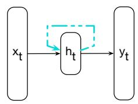
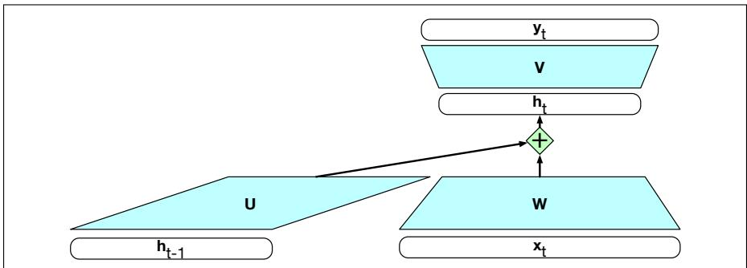
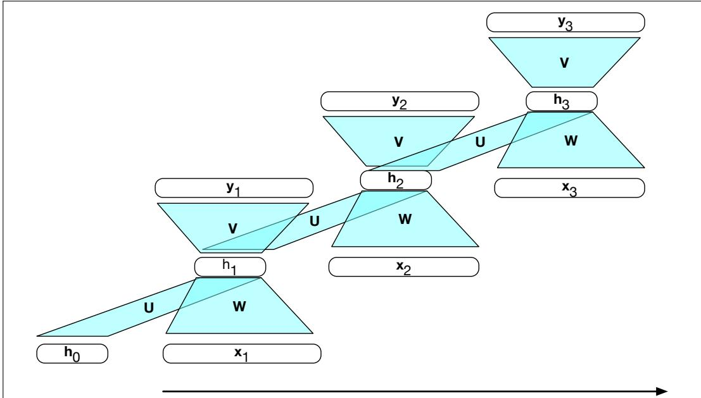

## 14.1 Recurrent Neural Networks

A recurrent neural network (RNN) is any network that contains a cycle within its network connections, meaning that the value of some unit is directly, or indirectly, dependent on its own earlier outputs as an input. While powerful, such networks are difficult to reason about and to train. However, within the general class of recurrent networks there are constrained architectures that have proven to be extremely effective when applied to language. In this section, we consider a class of recurrent networks referred to as Elman Networks (Elman, 1990) or simple recurrent networks. These networks are useful in their own right and serve as the basis for more complex approaches like the Long Short-Term Memory (LSTM) networks discussed later in this chapter. In this chapter when we use the term RNN we’ll be referring to these simpler more constrained networks (although you will often see the term RNN to mean any net with recurrent properties including LSTMs).

Fig. 14.1 illustrates the structure of an RNN. As with ordinary feedforward networks, an input vector representing the current input, xt, is multiplied by a weight matrix and then passed through a non-linear activation function to compute the values for a layer of hidden units. This hidden layer is then used to calculate a corresponding output, yt. In a departure from our earlier window-based approach, sequences are processed by presenting one item at a time to the network. We’ll use subscripts to represent time, thus $\mathbf { x } _ { t }$ will mean the input vector x at time t. The key difference from a feedforward network lies in the recurrent link shown in the figure with the dashed line. This link augments the input to the computation at the hidden layer with the value of the hidden layer from the preceding point in time.

  
Figure 14.1 Simple recurrent neural network after Elman (1990). The hidden layer includes a recurrent connection as part of its input. That is, the activation value of the hidden layer depends on the current input as well as the activation value of the hidden layer from the previous time step.

The hidden layer from the previous time step provides a form of memory, or context, that encodes earlier processing and informs the decisions to be made at later points in time. Critically, this approach does not impose a fixed-length limit on this prior context; the context embodied in the previous hidden layer can include information extending back to the beginning of the sequence.

Adding this temporal dimension makes RNNs appear to be more complex than non-recurrent architectures. But in reality, they’re not all that different. Given an input vector and the values for the hidden layer from the previous time step, we’re still performing the standard feedforward calculation introduced in Chapter 6. To see this, consider Fig. 14.2 which clarifies the nature of the recurrence and how it factors into the computation at the hidden layer. The most significant change lies in the new set of weights, U, that connect the hidden layer from the previous time step to the current hidden layer. These weights determine how the network makes use of past context in calculating the output for the current input. As with the other weights in the network, these connections are trained via backpropagation.

  
Figure 14.2 Simple recurrent neural network illustrated as a feedforward network. The hidden layer $\mathbf { h } _ { t - 1 }$ from the prior time step is multiplied by weight matrix U and then added to the feedforward component from the current time step.

## 14.1.1 Inference in RNNs

Forward inference (mapping a sequence of inputs to a sequence of outputs) in an RNN is nearly identical to what we’ve already seen with feedforward networks. To compute an output $\pmb { y } _ { t }$ for an input $\mathbf { x } _ { t } .$ , we need the activation value for the hidden layer $\mathbf { h } _ { t }$ . To calculate this, we multiply the input $\mathbf { x } _ { t }$ with the weight matrix W, and the hidden layer from the previous time step $\mathbf { h } _ { t - 1 }$ with the weight matrix U. We add these values together and pass them through a suitable activation function, g, to arrive at the activation value for the current hidden layer, ht. Once we have the values for the hidden layer, we proceed with the usual computation to generate the output vector.

$$
\mathbf {h} _ {t} = g \left(\mathbf {U h} _ {t - 1} + \mathbf {W x} _ {t}\right)\tag{14.1}
$$

$$
\mathbf {y} _ {t} = f (\mathbf {V h} _ {t})\tag{14.2}
$$

Let’s refer to the input, hidden and output layer dimensions as $d _ { i n } , \ d _ { h } .$ , and $d _ { o u t }$ respectively. Given this, our three parameter matrices are: $\boldsymbol { \mathsf { W } } \in \mathbb { R } ^ { d _ { h } \times d _ { i n } } , \boldsymbol { \mathsf { U } } \in \mathbb { R } ^ { d _ { h } \times d _ { h } }$ and $\pmb { \mathsf { v } } \in \mathbb { R } ^ { \dot { d } _ { o u t } \times d _ { h } }$

We compute $y _ { t }$ via a softmax computation that gives a probability distribution over the possible output classes.

$$
\mathbf {y} _ {t} = \operatorname{softmax} (\mathbf {V h} _ {t})\tag{14.3}
$$

The fact that the computation at time t requires the value of the hidden layer from time t 1 mandates an incremental inference algorithm that proceeds from the start of the sequence to the end as illustrated in Fig. 14.3. The sequential nature of simple recurrent networks can also be seen by unrolling the network in time as is shown in Fig. 14.4. In this figure, the various layers of units are copied for each time step to illustrate that they will have differing values over time. However, the various weight matrices are shared across time.

function FORWARDRNN(x, network) returns output sequence y
 $h_{0} \leftarrow 0$ 
for  $i \leftarrow 1$  to LENGTH(x) do
 $h_{i} \leftarrow g(Uh_{i-1} + Wx_{i})$ $y_{i} \leftarrow f(Vh_{i})$ 
return y

Figure 14.3 Forward inference in a simple recurrent network. The matrices U, V and W are shared across time, while new values for h and y are calculated with each time step.

## 14.1.2 Training

As with feedforward networks, we’ll use a training set, a loss function, and backpropagation to obtain the gradients needed to adjust the weights in these recurrent networks. As shown in Fig. 14.2, we now have 3 sets of weights to update: W, the weights from the input layer to the hidden layer, U, the weights from the previous hidden layer to the current hidden layer, and finally V, the weights from the hidden layer to the output layer.

Fig. 14.4 highlights two considerations that we didn’t have to worry about with backpropagation in feedforward networks. First, to compute the loss function for the output at time t we need the hidden layer from time t 1. Second, the hidden layer at time t influences both the output at time t and the hidden layer at time t + 1 (and hence the output and loss at t + 1). It follows from this that to assess the error accruing to ht, we’ll need to know its influence on both the current output as well as the ones thatfollow.

  
Figure 14.4 A simple recurrent neural network shown unrolled in time. Network layers are recalculated for each time step, while the weights U, V and W are shared across all time steps.

Tailoring the backpropagation algorithm to this situation leads to a two-pass algorithm for training the weights in RNNs. In the first pass, we perform forward inference, computing ht, yt, accumulating the loss at each step in time, saving the value of the hidden layer at each step for use at the next time step. In the second pass, we process the sequence in reverse, computing the required gradients as we go, computing and saving the error term for use in the hidden layer for each step backward in time. This general approach is commonly referred to as backpropagation through time (Werbos 1974, Rumelhart et al. 1986, Werbos 1990).

Fortunately, with modern computational frameworks and adequate computing resources, there is no need for a specialized approach to training RNNs. As illustrated in Fig. 14.4, explicitly unrolling a recurrent network into a feedforward computational graph eliminates any explicit recurrences, allowing the network weights to be trained directly. In such an approach, we provide a template that specifies the basic structure of the network, including all the necessary parameters for the input, output, and hidden layers, the weight matrices, as well as the activation and output functions to be used. Then, when presented with a specific input sequence, we can generate an unrolled feedforward network specific to that input, and use that graph to perform forward inference or training via ordinary backpropagation.

For applications that involve much longer input sequences, such as speech recognition, character-level processing, or streaming continuous inputs, unrolling an entire input sequence may not be feasible. In these cases, we can unroll the input into manageable fixed-length segments and treat each segment as a distinct training item.
