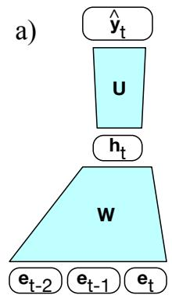
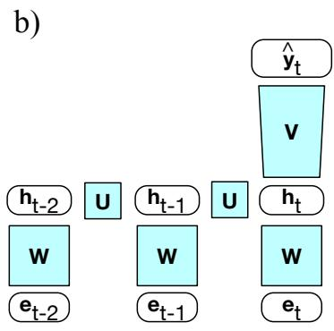
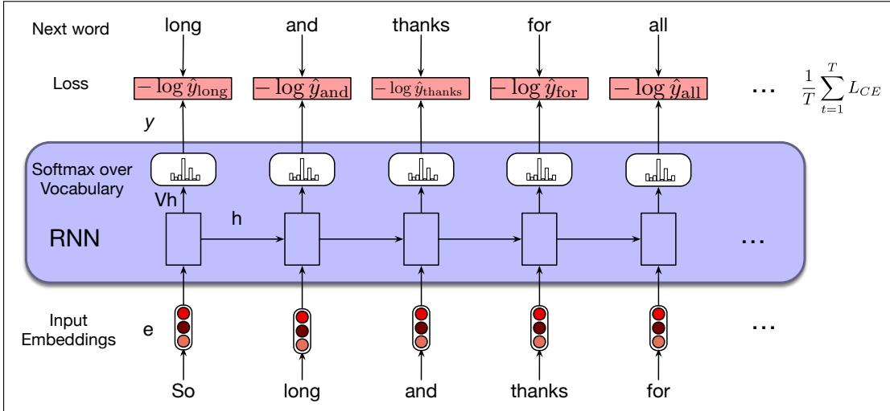

## 14.2 RNNs as Language Models

Let’s see how to apply RNNs to the language modeling task. Recall from Chapter 3 that language models predict the next word in a sequence given some preceding context. For example, if the preceding context is “Thanks for all the” and we want to know how likely the next word is “fish” we would compute:

## P(fish Thanks for all the)

Language models give us the ability to assign such a conditional probability to every possible next word, giving us a distribution over the entire vocabulary. We can also assign probabilities to entire sequences by combining these conditional probabilities with the chain rule:

$$
P (w _ {1: n}) = \prod_ {i = 1} ^ {n} P (w _ {i} | w _ {<   i})
$$

The n-gram language models of Chapter 3 compute the probability of a word given counts of its occurrence with the n 1 prior words. The context is thus of size n 1. For the feedforward language models of Chapter $^ { 6 , }$ the context is the window size.

RNN language models (Mikolov et al., 2010) process the input sequence one word at a time, attempting to predict the next word from the current word and the previous hidden state. RNNs thus don’t have the limited context problem that n-gram models have, or the fixed context that feedforward language models have, since the hidden state can in principle represent information about all of the preceding words all the way back to the beginning of the sequence. Fig. 14.5 sketches this difference between a FFN language model and an RNN language model, showing that the RNN language model uses $h _ { t - 1 }$ , the hidden state from the previous time step, as a representation of the past context.

  
Figure 14.5 Simplified sketch of two LM architectures moving through a text, showing a schematic context of three tokens: (a) a feedforward neural language model which has a fixed context input to the weight matrix W, (b) an RNN language model, in which the hidden state $\mathbf { h } _ { t - 1 }$ summarizes the prior context.

## 14.2.1 Forward Inference in an RNN language model

Forward inference in a recurrent language model proceeds exactly as described in Section 14.1.1. The input sequence ${ \pmb { \mathsf { X } } } = [ { \pmb { \mathsf { x } } } _ { 1 } ; . . . ; { \pmb { \mathsf { x } } } _ { t } ; . . . ; { \pmb { \mathsf { x } } } _ { N } ]$ consists of a series of words each represented as a one-hot vector of size $| V | \times 1$ , and the output prediction, ˆy, is a vector representing a probability distribution over the vocabulary. At each step, the model uses the word embedding matrix E to retrieve the embedding for the current word, multiples it by the weight matrix W, and then adds it to the hidden layer from the previous step (weighted by weight matrix U) to compute a new hidden layer. This hidden layer is then used to generate an output layer which is passed through a softmax layer to generate a probability distribution over the entire vocabulary. That is, at time t:

$$
\mathbf {e} _ {t} = \mathbf {E x} _ {t}\tag{14.4}
$$

$$
\mathbf {h} _ {t} = g \left(\mathbf {U h} _ {t - 1} + \mathbf {W e} _ {t}\right)\tag{14.5}
$$

$$
\hat {\mathbf {y}} _ {t} = \operatorname{softmax} (\mathbf {V h} _ {t})\tag{14.6}
$$

When we do language modeling with RNNs (and we’ll see this again in Chapter 7 with transformers), it’s convenient to make the assumption that the embedding dimension $d _ { e }$ and the hidden dimension $d _ { h }$ are the same. So we’ll just call both of these the model dimension d. So the embedding matrix E is of shape $[ d \times | V | ]$ , and $\pmb { \ x } _ { \mathbf { t } }$ is a one-hot vector of shape $[ | V | \times 1 ]$ . The product $\mathbf { e } _ { t }$ is thus of shape $[ d \times 1 ]$ . W and U are of shape $[ d \times d ]$ , so $\mathbf { h } _ { t }$ is also of shape $[ d \times 1 ]$ . V is of shape $[ | V | \times d ]$ so the result of Vh is a vector of shape $[ | V | \times 1 ]$ . This vector can be thought of as a set of scores over the vocabulary given the evidence provided in h. Passing these scores through the softmax normalizes the scores into a probability distribution. The probability that a particular word k in the vocabulary is the next word is represented by $\hat { \mathbf { y } } _ { t } [ k ]$ , the kth component of $\hat { \mathbf { y } } _ { t }$ :

$$
P (w _ {t + 1} = k | w _ {1}, \dots , w _ {t}) = \hat {\mathbf {y}} _ {t} [ k ]\tag{14.7}
$$

The probability of an entire sequence is just the product of the probabilities of each item in the sequence, where we’ll use $\hat { \mathsf { y } } _ { i } [ { \boldsymbol w } _ { i } ]$ to mean the probability of the true word wi at time step i.

$$
\begin{array}{l} P (w _ {1: n}) = \prod_ {i = 1} ^ {n} P (w _ {i} | w _ {1: i - 1}) \\ = \prod_ {i = 1} ^ {n} \hat {\mathbf {y}} _ {i} [ w _ {i} ] \end{array}\tag{14.8}
$$

(14.9)

## 14.2.2 Training an RNN language model

To train an RNN as a language model, we use the same self-supervision (or selftraining) algorithm we saw in Section 7.7: we take a corpus of text as training material and at each time step t ask the model to predict the next word. We call such a model self-supervised because we don’t have to add any special gold labels to the data; the natural sequence of words is its own supervision! We simply train the model to minimize the error in predicting the true next word in the training sequence, using cross-entropy as the loss function. Recall that the cross-entropy loss measures the difference between a predicted probability distribution and the correct distribution.

$$
L _ {C E} (\hat {\mathbf {y}} _ {t}, \mathbf {y} _ {t}) = - \sum_ {w \in V} \mathbf {y} _ {t} [ w ] \log \hat {\mathbf {y}} _ {t} [ w ]\tag{14.10}
$$

  
Figure 14.6 Training RNNs as language models.

In the case of language modeling, the correct distribution yt comes from knowing the next word. This is represented as a one-hot vector corresponding to the vocabulary where the entry for the actual next word is 1, and all the other entries are 0. Thus, the cross-entropy loss for language modeling is determined by the probability the model assigns to the correct next word. So at time t the CE loss is the negative log probability the model assigns to the next word in the training sequence.

$$
L _ {C E} (\hat {\mathbf {y}} _ {t}, \mathbf {y} _ {t}) = - \log \hat {\mathbf {y}} _ {t} [ w _ {t + 1} ]\tag{14.11}
$$

Thus at each word position t of the input, the model takes as input the correct word $w _ { t }$ together with $h _ { t - 1 } ,$ encoding information from the preceding $w _ { 1 : t - 1 }$ , and uses them to compute a probability distribution over possible next words so as to compute the model’s loss for the next token $w _ { t + 1 }$ . Then we move to the next word, we ignore what the model predicted for the next word and instead use the correct word $w _ { t + 1 }$ along with the prior history encoded to estimate the probability of token $w _ { t + 2 }$ . This idea that we always give the model the correct history sequence to predict the next word (rather than feeding the model its best case from the previous time step) is called teacher forcing.

The weights in the network are adjusted to minimize the average CE loss over the training sequence via gradient descent. Fig. 14.6 illustrates this training regimen.

## 14.2.3 Weight Tying

Careful readers may have noticed that the input embedding matrix E and the final layer matrix V, which feeds the output softmax, are quite similar.

The columns of E represent the word embeddings for each word in the vocabulary learned during the training process with the goal that words that have similar meaning and function will have similar embeddings. And, since when we use RNNs for language modeling we make the assumption that the embedding dimension and the hidden dimension are the same (= the model dimension $d )$ , the embedding matrix E has shape $[ d \times | V | ]$ . And the final layer matrix V provides a way to score the likelihood of each word in the vocabulary given the evidence present in the final hidden layer of the network through the calculation of Vh. V is of shape $[ | V | \times d ]$ That ${ \mathrm { i s } } ,$ the rows of V are shaped like a transpose of E, meaning that V provides a

second set of learned word embeddings.

Instead of having two sets of embedding matrices, language models use a single embedding matrix, which appears at both the input and softmax layers. That is, we dispense with V and use E at the start of the computation and $\mathsf { E } ^ { \top }$ (because the shape of V is the transpose of E at the end. Using the same matrix (transposed) in two places is called weight tying.1 The weight-tied equations for an RNN language model then become:

$$
\mathbf {e} _ {t} = \mathbf {E x} _ {t}\tag{14.12}
$$

$$
\mathbf {h} _ {t} = g \left(\mathbf {U h} _ {t - 1} + \mathbf {W e} _ {t}\right)\tag{14.13}
$$

$$
\hat {\mathbf {y}} _ {t} = \operatorname{softmax} \left(\mathbf {E} ^ {\intercal} \mathbf {h} _ {t}\right)\tag{14.14}
$$

In addition to providing improved model perplexity, this approach significantly reduces the number of parameters required for the model.
