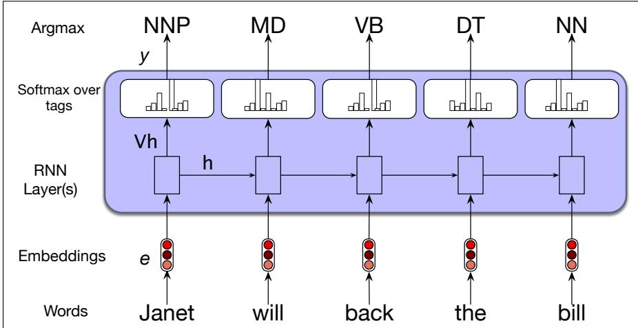
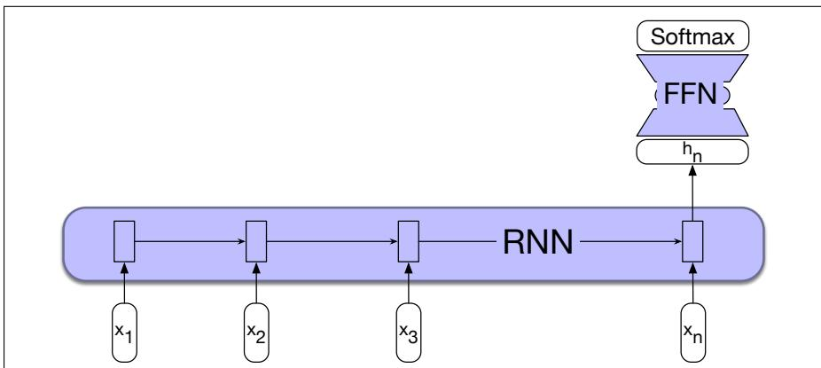
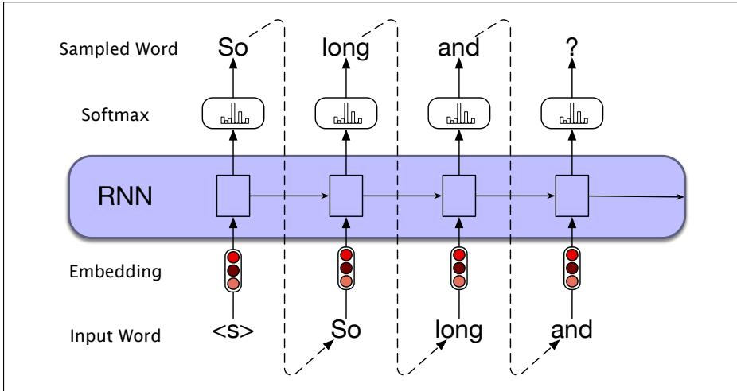

## 14.3 RNNs for other NLP tasks

Now that we’ve seen the basic RNN architecture, let’s consider how to apply it to three types of NLP tasks: sequence classification tasks like sentiment analysis and topic classification, sequence labeling tasks like part-of-speech tagging, and text generation tasks, including with a new architecture called the encoder-decoder.

## 14.3.1 Sequence Labeling

In sequence labeling, the network’s task is to assign a label chosen from a small fixed set of labels to each element of a sequence. One classic sequence labeling tasks is part-of-speech (POS) tagging (assigning grammatical tags like NOUN and VERB to each word in a sentence). We’ll discuss part-of-speech tagging in detail in Chapter 18, but let’s give a motivating example here. In an RNN approach to sequence labeling, inputs are word embeddings and the outputs are tag probabilities generated by a softmax layer over the given tagset, as illustrated in Fig. 14.7.

In this figure, the inputs at each time step are pretrained word embeddings corresponding to the input tokens. The RNN block is an abstraction that represents an unrolled simple recurrent network consisting of an input layer, hidden layer, and output layer at each time step, as well as the shared U, V and W weight matrices that comprise the network. The outputs of the network at each time step represent the distribution over the POS tagset generated by a softmax layer.

To generate a sequence of tags for a given input, we run forward inference over the input sequence and select the most likely tag from the softmax at each step. Since we’re using a softmax layer to generate the probability distribution over the output tagset at each time step, we will again employ the cross-entropy loss during training.

## 14.3.2 RNNs for Sequence Classification

Another use of RNNs is to classify entire sequences rather than the tokens within them. This is the set of tasks commonly called text classification, like sentiment analysis or spam detection, in which we classify a text into two or three classes (like positive or negative), as well as classification tasks with a large number of categories, like document-level topic classification, or message routing for customer service applications.

  
Figure 14.7 Part-of-speech tagging as sequence labeling with a simple RNN. The goal of part-of-speech (POS) tagging is to assign a grammatical label to each word in a sentence, drawn from a predefined set of tags. (The tags for this sentence include NNP (proper noun), MD (modal verb) and others; we’ll give a complete description of the task of part-of-speech tagging in Chapter 18.) Pre-trained word embeddings serve as inputs and a softmax layer provides a probability distribution over the part-of-speech tags as output at each time step.

To apply RNNs in this setting, we pass the text to be classified through the RNN a word at a time generating a new hidden layer representation at each time step. We can then take the hidden layer for the last token of the text, hn, to constitute a compressed representation of the entire sequence. We can pass this representation $ { \mathbf { h } } _ { n }$ to a feedforward network that chooses a class via a softmax over the possible classes. Fig. 14.8 illustrates this approach.

  
Figure 14.8 Sequence classification using a simple RNN combined with a feedforward network. The final hidden state from the RNN is used as the input to a feedforward network that performs the classification.

Note that in this approach we don’t need intermediate outputs for the words in the sequence preceding the last element. Therefore, there are no loss terms associated with those elements. Instead, the loss function used to train the weights in the network is based entirely on the final text classification task. The output from the softmax output from the feedforward classifier together with a cross-entropy loss drives the training. The error signal from the classification is backpropagated all the way through the weights in the feedforward classifier through, to its input, and then through to the three sets of weights in the RNN as described earlier in Section 14.1.2. The training regimen that uses the loss from a downstream application to adjust the weights all the way through the network is referred to as end-to-end training.

Another option, instead of using just the hidden state of the last token $h _ { n }$ to represent the whole sequence, is to use some sort of pooling function of all the hidden states $h _ { i }$ for each word i in the sequence. For example, we can create a representation that pools all the n hidden states by taking their element-wise mean:

$$
\mathbf {h} _ {\text { mean }} = \frac {1}{n} \sum_ {i = 1} ^ {n} \mathbf {h} _ {i}\tag{14.15}
$$

Or we can take the element-wise max; the element-wise max of a set of n vectors is a new vector whose kth element is the max of the kth elements of all the n vectors.

The long contexts of RNNs makes it quite difficult to successfully backpropagate error all the way through the entire input; we’ll talk about this problem, and some standard solutions, in Section 14.5.

## 14.3.3 Generation with RNN-Based Language Models

RNN-based language models can also be used to generate text, Text generation, along with image generation and code generation, constitute a new area of AI that is often called generative AI. Those of you who have already read Chapter 7 will have already seen this, but we reintroduce it here for those who are reading in a different order.

Recall back in Chapter 3 we saw how to generate text from an n-gram language model by adapting a sampling technique suggested at about the same time by Claude Shannon (Shannon, 1951) and the psychologists George Miller and Jennifer Selfridge (Miller and Selfridge, 1950). We first randomly sample a word to begin a sequence based on its suitability as the start of a sequence. We then continue to sample words conditioned on our previous choices until we reach a pre-determined length, or an end of sequence token is generated.

Today, this approach of using a language model to incrementally generate words by repeatedly sampling the next word conditioned on our previous choices is called autoregressive generation or causal LM generation. The procedure is basically the same as that described on page 79, but adapted to a neural context:

• Sample a word in the output from the softmax distribution that results from using the beginning of sentence marker, <s>, as the first input.

• Use the word embedding for that first word as the input to the network at the next time step, and then sample the next word in the same fashion.

• Continue generating until the end of sentence marker, </s>, is sampled or a fixed length limit is reached.

Technically an autoregressive model is a model that predicts a value at time t based on a linear function of the previous values at times $t - 1 , t - 2$ , and so on. Although language models are not linear (since they have many layers of non-linearities), we loosely refer to this generation technique as autoregressive generation since the word generated at each time step is conditioned on the word selected by the network from the previous step. Fig. 14.9 illustrates this approach. In this figure, the details of the RNN’s hidden layers and recurrent connections are hidden within the blue block.

This simple architecture underlies state-of-the-art approaches to applications such as machine translation, summarization, and question answering. The key to these approaches is to prime the generation component with an appropriate context. That is, instead of simply using <s> to get things started we can provide a richer task-appropriate context; for translation the context is the sentence in the source language; for summarization it’s the long text we want to summarize.

  
Figure 14.9 Autoregressive generation with an RNN-based neural language model.
