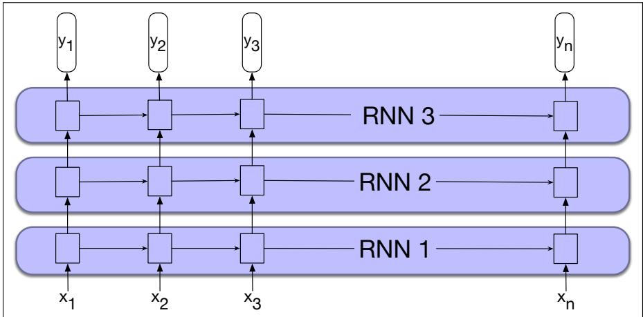
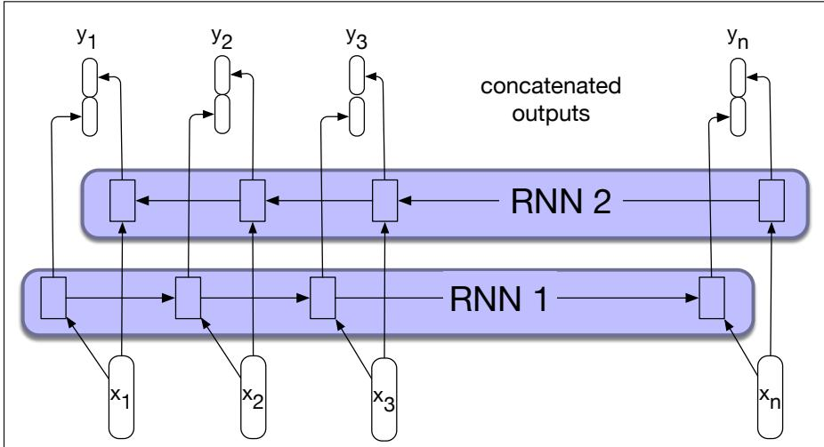

## 14.4 Stacked and Bidirectional RNN architectures

Recurrent networks are quite flexible. By combining the feedforward nature of unrolled computational graphs with vectors as common inputs and outputs, complex networks can be treated as modules that can be combined in creative ways. This section introduces two of the more common network architectures used in language processing with RNNs.

## 14.4.1 Stacked RNNs

In our examples thus far, the inputs to our RNNs have consisted of sequences of word or character embeddings (vectors) and the outputs have been vectors useful for predicting words, tags or sequence labels. However, nothing prevents us from using the entire sequence of outputs from one RNN as an input sequence to another one. Stacked RNNs consist of multiple networks where the output of one layer serves as the input to a subsequent layer, as shown in Fig. 14.10.

Stacked RNNs generally outperform single-layer networks. One reason for this success seems to be that the network induces representations at differing levels of abstraction across layers. Just as the early stages of the human visual system detect edges that are then used for finding larger regions and shapes, the initial layers of stacked networks can induce representations that serve as useful abstractions for further layers—representations that might prove difficult to induce in a single RNN. The optimal number of stacked RNNs is specific to each application and to each training set. However, as the number of stacks is increased the training costs rise

  
Figure 14.10 Stacked recurrent networks. The output of a lower level serves as the input to higher levels with the output of the last network serving as the final output.

quickly.

## 14.4.2 Bidirectional RNNs

The RNN uses information from the left (prior) context to make its predictions at time t. But in many applications we have access to the entire input sequence; in those cases we would like to use words from the context to the right of t. One way to do this is to run two separate RNNs, one left-to-right, and one right-to-left, and concatenate their representations.

In the left-to-right RNNs we’ve discussed so far, the hidden state at a given time t represents everything the network knows about the sequence up to that point. The state is a function of the inputs $x _ { 1 } , . . . , x _ { t }$ and represents the context of the network to the left of the current time.

$$
\mathbf {h} _ {t} ^ {f} = \mathrm{RNN} _ {\text {forward}} (\mathbf {x} _ {1}, \dots , \mathbf {x} _ {t})\tag{14.16}
$$

This new notation $ { \mathbf { h } } _ { t } ^ { f }$ simply corresponds to the normal hidden state at time t, representing everything the network has gleaned from the sequence so far.

To take advantage of context to the right of the current input, we can train an RNN on a reversed input sequence. With this approach, the hidden state at time t represents information about the sequence to the right of the current input:

$$
\mathbf {h} _ {t} ^ {b} = \mathrm{RNN} _ {\text {backward}} (\mathbf {x} _ {t}, \dots \mathbf {x} _ {n})\tag{14.17}
$$

Here, the hidden state $\boldsymbol { \mathsf { h } } _ { t } ^ { b }$ represents all the information we have discerned about the sequence from t to the end of the sequence.

A bidirectional RNN (Schuster and Paliwal, 1997) combines two independent RNNs, one where the input is processed from the start to the end, and the other from the end to the start. We then concatenate the two representations computed by the networks into a single vector that captures both the left and right contexts of an input at each point in time. Here we use either the semicolon ”;” or the equivalent symbol to mean vector concatenation:

$$
\begin{array}{r c l} \mathbf {h} _ {t} & = & [ \mathbf {h} _ {t} ^ {f}; \mathbf {h} _ {t} ^ {b} ] \\ & = & \mathbf {h} _ {t} ^ {f} \oplus \mathbf {h} _ {t} ^ {b} \end{array}\tag{14.18}
$$

Fig. 14.11 illustrates such a bidirectional network that concatenates the outputs of the forward and backward pass. Other simple ways to combine the forward and backward contexts include element-wise addition or multiplication. The output at each step in time thus captures information to the left and to the right of the current input. In sequence labeling applications, these concatenated outputs can serve as the basis for a local labeling decision.

  
Figure 14.11 A bidirectional RNN. Separate models are trained in the forward and backward directions, with the output of each model at each time point concatenated to represent the bidirectional state at that time point.

Bidirectional RNNs have also proven to be quite effective for sequence classification. Recall from Fig. 14.8 that for sequence classification we used the final hidden state of the RNN as the input to a subsequent feedforward classifier. A difficulty with this approach is that the final state naturally reflects more information about the end of the sentence than its beginning. Bidirectional RNNs provide a simple solution to this problem; as shown in Fig. 14.12, we simply combine the final hidden states from the forward and backward passes (for example by concatenation) and use that as input for follow-on processing.
