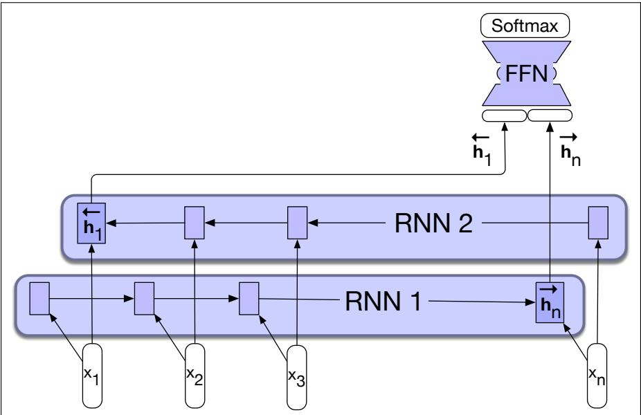
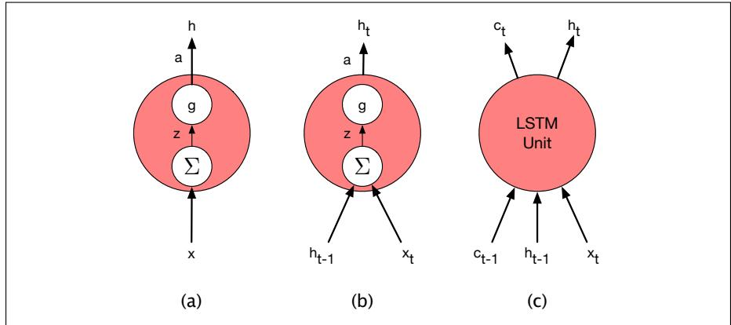
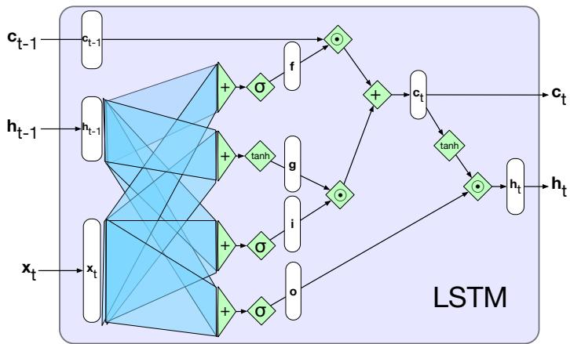

## 14.5 The LSTM

In practice, it is quite difficult to train RNNs for tasks that require a network to make use of information distant from the current point of processing. Despite having access to the entire preceding sequence, the information encoded in hidden states tends to be fairly local, more relevant to the most recent parts of the input sequence and recent decisions. Yet distant information is critical to many language applications. Consider the following example in the context of language modeling.

(14.19) The flights the airline was canceling were full.

Assigning a high probability to was following airline is straightforward since airline provides a strong local context for the singular agreement. However, assigning an appropriate probability to were is quite difficult, not only because the plural flights is quite distant, but also because the singular noun airline is closer in the intervening context. Ideally, a network should be able to retain the distant information about plural flights until it is needed, while still processing the intermediate parts of the sequence correctly.

  
Figure 14.12 A bidirectional RNN for sequence classification. The final hidden units from the forward and backward passes are combined to represent the entire sequence. This combined representation serves as input to the subsequent classifier.

One reason for the inability of RNNs to carry forward critical information is that the hidden layers, and, by extension, the weights that determine the values in the hidden layer, are being asked to perform two tasks simultaneously: provide information useful for the current decision, and updating and carrying forward information required for future decisions.

A second difficulty with training RNNs arises from the need to backpropagate the error signal back through time. Recall from Section 14.1.2 that the hidden layer at time t contributes to the loss at the next time step since it takes part in that calculation. As a result, during the backward pass of training, the hidden layers are subject to repeated multiplications, as determined by the length of the sequence. A frequent result of this process is that the gradients are eventually driven to zero, a situation called the vanishing gradients problem.

To address these issues, more complex network architectures have been designed to explicitly manage the task of maintaining relevant context over time, by enabling the network to learn to forget information that is no longer needed and to remember information required for decisions still to come.

The most commonly used such extension to RNNs is the long short-term memory (LSTM) network (Hochreiter and Schmidhuber, 1997). LSTMs divide the context management problem into two subproblems: removing information no longer needed from the context, and adding information likely to be needed for later decision making. The key to solving both problems is to learn how to manage this context rather than hard-coding a strategy into the architecture. LSTMs accomplish this by first adding an explicit context layer to the architecture (in addition to the usual recurrent hidden layer), and through the use of specialized neural units that make use of gates to control the flow of information into and out of the units that comprise the network layers. These gates are implemented through the use of additional weights that operate sequentially on the input, and previous hidden layer, and previous context layers.

The gates in an LSTM share a common design pattern; each consists of a feedforward layer, followed by a sigmoid activation function, followed by a pointwise multiplication with the layer being gated. The choice of the sigmoid as the activation function arises from its tendency to push its outputs to either 0 or 1. Combining this with a pointwise multiplication has an effect similar to that of a binary mask. Values in the layer being gated that align with values near 1 in the mask are passed through nearly unchanged; values corresponding to lower values are essentially erased.

The first gate we’ll consider is the forget gate. The purpose of this gate is to delete information from the context that is no longer needed. The forget gate computes a weighted sum of the previous state’s hidden layer and the current input and passes that through a sigmoid. This mask is then multiplied element-wise by the context vector to remove the information from context that is no longer required. Element-wise multiplication of two vectors (represented by the operator , and sometimes called the Hadamard product) is the vector of the same dimension as the two input vectors, where each element i is the product of element i in the two input vectors:

$$
\mathbf {f} _ {t} = \sigma (\mathbf {U} _ {f} \mathbf {h} _ {t - 1} + \mathbf {W} _ {f} \mathbf {x} _ {t})
$$

$$
\mathbf {k} _ {t} = \mathbf {c} _ {t - 1} \odot \mathbf {f} _ {t}\tag{14.20}
$$

(14.21)

The next task is to compute the actual information we need to extract from the previous hidden state and current inputs—the same basic computation we’ve been using for all our recurrent networks.

$$
\mathbf {g} _ {t} = \tanh (\mathbf {U} _ {g} \mathbf {h} _ {t - 1} + \mathbf {W} _ {g} \mathbf {x} _ {t})\tag{14.22}
$$

Next, we generate the mask for the add gate to select the information to add to the current context.

$$
\begin{array}{l} \mathbf {i} _ {t} = \sigma (\mathbf {U} _ {i} \mathbf {h} _ {t - 1} + \mathbf {W} _ {i} \mathbf {x} _ {t}) \\ \mathbf {j} _ {t} = \mathbf {g} _ {t} \odot \mathbf {i} _ {t} \end{array}\tag{14.23}
$$

(14.24)

Next, we add this to the modified context vector to get our new context vector.

$$
\mathbf {c} _ {t} = \mathbf {j} _ {t} + \mathbf {k} _ {t}\tag{14.25}
$$

The final gate we’ll use is the output gate which is used to decide what information is required for the current hidden state (as opposed to what information needs to be preserved for future decisions).

$$
\mathbf {o} _ {t} = \sigma (\mathbf {U} _ {o} \mathbf {h} _ {t - 1} + \mathbf {W} _ {o} \mathbf {x} _ {t})\tag{14.26}
$$

$$
\mathbf {h} _ {t} = \mathbf {o} _ {t} \odot \operatorname{tanh} (\mathbf {c} _ {t})\tag{14.27}
$$

Fig. 14.13 illustrates the complete computation for a single LSTM unit. Given the appropriate weights for the various gates, an LSTM accepts as input the context layer, and hidden layer from the previous time step, along with the current input vector. It then generates updated context and hidden vectors as output.

It is the hidden state, ht, that provides the output for the LSTM at each time step. This output can be used as the input to subsequent layers in a stacked RNN, or at the final layer of a network $h _ { t }$ can be used to provide the final output of the LSTM.

  
Figure 14.13 A single LSTM unit displayed as a computation graph. The inputs to each unit consists of the current input, x, the previous hidden state, $h _ { t - 1 }$ , and the previous context, $c _ { t - 1 }$ . The outputs are a new hidden state, ht and an updated context, ct.  
Figure 14.14 Basic neural units used in feedforward, simple recurrent networks (SRN), and long short-term memory (LSTM).

## 14.5.1 Gated Units, Layers and Networks

The neural units used in LSTMs are obviously much more complex than those used in basic feedforward networks. Fortunately, this complexity is encapsulated within the basic processing units, allowing us to maintain modularity and to easily experiment with different architectures. To see this, consider Fig. 14.14 which illustrates the inputs and outputs associated with each kind of unit.

At the far left, (a) is the basic feedforward unit where a single set of weights and a single activation function determine its output, and when arranged in a layer there are no connections among the units in the layer. Next, (b) represents the unit in a simple recurrent network. Now there are two inputs and an additional set of weights to go with it. However, there is still a single activation function and output.

The increased complexity of the LSTM units is encapsulated within the unit itself. The only additional external complexity for the LSTM over the basic recurrent unit (b) is the presence of the additional context vector as an input and output.

This modularity is key to the power and widespread applicability of LSTM units. LSTM units (or other varieties, like GRUs) can be substituted into any of the network architectures described in Section 14.4. And, as with simple RNNs, multi-layered networks making use of gated units can be unrolled into deep feedforward networks and trained in the usual fashion with backpropagation. In practice, therefore, LSTMs rather than RNNs have become the standard unit for any modern system that makes use of recurrent networks.
