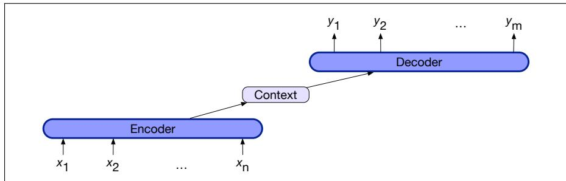
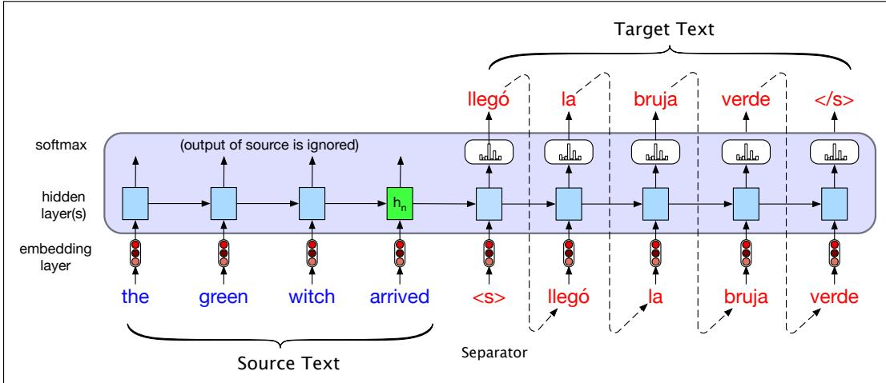
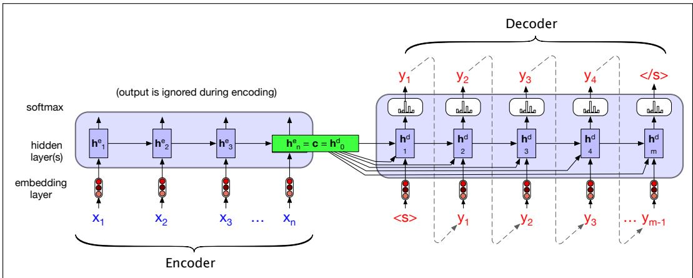
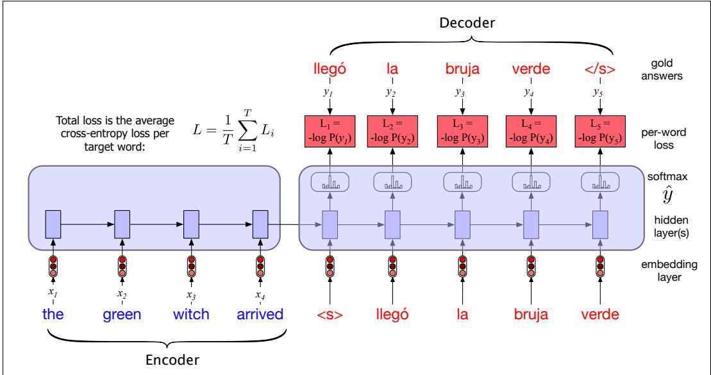

## 14.7 The Encoder-Decoder Model with RNNs

In this section we introduce the encoder-decoder model, which is used when we are taking an input sequence and translating it to an output sequence that is of a different length than the input, and doesn’t align with it in a word-to-word way.

Those of you who already read Chapter 13 will have already seen this model in the transformer architecture, and its application to machine translation, but we introduce this architecture again here for those who come to the concepts in a different order and are reading about RNNs before transformers.

Recall that in the sequence labeling task, we have two sequences, but they are the same length (for example in part-of-speech tagging each token gets an associated tag), each input is associated with a specific output, and the labeling for that output takes mostly local information. Thus deciding whether a word is a verb or a noun, we look mostly at the word and the neighboring words.

By contrast, encoder-decoder models are used especially for tasks like machine translation, where the input sequence and output sequence can have different lengths and the mapping between a token in the input and a token in the output can be very indirect (in some languages the verb appears at the beginning of the sentence; in other languages at the end). We introduced machine translation in Chapter 13, but for now we’ll just point out that the mapping for a sentence in English to a sentence in Tagalog or Yoruba can have very different numbers of words, and the words can be in a very different order.

Encoder-decoder networks, sometimes called sequence-to-sequence networks, are models capable of generating contextually appropriate, arbitrary length, output sequences given an input sequence. Encoder-decoder networks have been applied to a very wide range of applications including summarization, question answering, and dialogue, but they are particularly popular for machine translation.

The key idea underlying these networks is the use of an encoder network that takes an input sequence and creates a contextualized representation of it, often called the context. This representation is then passed to a decoder which generates a taskspecific output sequence. Fig. 14.16 illustrates the architecture.

  
Figure 14.16 The encoder-decoder architecture. The context is a function of the hidden representations of the input, and may be used by the decoder in a variety of ways.

Encoder-decoder networks consist of three conceptual components:

1. An encoder that accepts an input sequence, $x _ { 1 : n } ,$ and generates a corresponding sequence of contextualized representations, $h _ { 1 : n }$ . LSTMs, convolutional networks, and transformers can all be employed as encoders.

2. A context vector, c, which is a function of $h _ { 1 : n } .$ and conveys the essence of the input to the decoder.

3. A decoder, which accepts c as input and generates an arbitrary length sequence of hidden states $h _ { 1 : m } ,$ from which a corresponding sequence of output states $y _ { 1 : m } ,$ can be obtained. Just as with encoders, decoders can be realized by any kind of sequence architecture.

In this section we’ll describe an encoder-decoder network based on a pair of RNNs; we already saw encoder-decoders for MT in Chapter 13. We’ll build up the equations for encoder-decoder models by starting with the conditional RNN language model $p ( y )$ , the probability of a sequence y.

Recall that in any language model, we can break down the probability as follows:

$$
p (y) = p \left(y _ {1}\right) p \left(y _ {2} \mid y _ {1}\right) p \left(y _ {3} \mid y _ {1}, y _ {2}\right) \dots p \left(y _ {m} \mid y _ {1}, \dots , y _ {m - 1}\right)\tag{14.28}
$$

In RNN language modeling, at a particular time t, we pass the prefix of $t - 1$ tokens through the language model, using forward inference to produce a sequence of hidden states, ending with the hidden state corresponding to the last word of the prefix. We then use the final hidden state of the prefix as our starting point to generate the next token.

More formally, if g is an activation function like tanh or ReLU, a function of the input at time t and the hidden state at time t 1, and the softmax is over the set of possible vocabulary items, then at time t the output ${ \bf y } _ { t }$ and hidden state $\mathbf { h } _ { t }$ are computed as:

$$
\mathbf {h} _ {t} = g (\mathbf {h} _ {t - 1}, \mathbf {x} _ {t})\tag{14.29}
$$

$$
\hat {\mathbf {y}} _ {t} = \operatorname{softmax} (\mathbf {h} _ {t})\tag{14.30}
$$

We only have to make one slight change to turn this language model with autoregressive generation into an encoder-decoder model that is a translation model that can translate from a source text in one language to a target text in a second: add a sentence separation marker at the end of the source text, and then simply concatenate the target text.

Let’s use <s> for our sentence separator token, and let’s think about translating an English source text (“the green witch arrived”), to a Spanish sentence (“llego´ la bruja verde” (which can be glossed word-by-word as ‘arrived the witch green’). We could also illustrate encoder-decoder models with a question-answer pair, or a text-summarization pair.

Let’s use x to refer to the source text (in this case in English) plus the separator token <s>, and y to refer to the target text y (in this case in Spanish). Then an encoder-decoder model computes the probability $p ( y | x )$ as follows:

$$
p (y | x) = p \left(y _ {1} | x\right) p \left(y _ {2} \mid y _ {1}, x\right) p \left(y _ {3} \mid y _ {1}, y _ {2}, x\right) \dots p \left(y _ {m} \mid y _ {1}, \dots , y _ {m - 1}, x\right)\tag{14.31}
$$

Fig. 14.17 shows the setup for a simplified version of the encoder-decoder model (we’ll see the full model, which requires the new concept of attention, in the next section).

Fig. 14.17 shows an English source text (“the green witch arrived”), a sentence separator token (<s>, and a Spanish target text (“llego la bruja verde´ ”). To translate a source text, we run it through the network performing forward inference to generate hidden states until we get to the end of the source. Then we begin autoregressive generation, asking for a word in the context of the hidden layer from the end of the source input as well as the end-of-sentence marker. Subsequent words are conditioned on the previous hidden state and the embedding for the last word generated.

  
Figure 14.17 Translating a single sentence (inference time) in the basic RNN version of encoder-decoder approach to machine translation. Source and target sentences are concatenated with a separator token in between, and the decoder uses context information from the encoder’s last hidden state.

Let’s formalize and generalize this model a bit in Fig. 14.18. (To help keep things straight, we’ll use the superscripts e and d where needed to distinguish the hidden states of the encoder and the decoder.) The elements of the network on the left process the input sequence x and comprise the encoder. While our simplified figure shows only a single network layer for the encoder, stacked architectures are the norm, where the output states from the top layer of the stack are taken as the final representation, and the encoder consists of stacked biLSTMs where the hidden states from top layers from the forward and backward passes are concatenated to provide the contextualized representations for each time step.

  
Figure 14.18 A more formal version of translating a sentence at inference time in the basic RNN-based encoder-decoder architecture. The final hidden state of the encoder RNN, ${ h _ { n } ^ { e } } ,$ serves as the context for the decoder in its role as $h _ { 0 } ^ { d }$ in the decoder RNN, and is also made available to each decoder hidden state.

The entire purpose of the encoder is to generate a contextualized representation of the input. This representation is embodied in the final hidden state of the encoder, $\mathbf { h } _ { n } ^ { e } .$ . This representation, also called c for context, is then passed to the decoder.

The simplest version of the decoder network would take this state and use it just to initialize the first hidden state of the decoder; the first decoder RNN cell would use c as its prior hidden state $\begin{array} { r } { \mathbf { h } _ { 0 } ^ { d } . } \end{array}$ . The decoder would then autoregressively generate a sequence of outputs, an element at a time, until an end-of-sequence marker is generated. Each hidden state is conditioned on the previous hidden state and the output generated in the previous state.

As Fig. 14.18 shows, we do something more complex: we make the context vector c available to more than just the first decoder hidden state, to ensure that the influence of the context vector, c, doesn’t wane as the output sequence is generated. We do this by adding c as a parameter to the computation of the current hidden state. using the following equation:

$$
\mathbf {h} _ {t} ^ {d} = g (\hat {y} _ {t - 1}, \mathbf {h} _ {t - 1} ^ {d}, \mathbf {c})\tag{14.32}
$$

Now we’re ready to see the full equations for this version of the decoder in the basic encoder-decoder model, with context available at each decoding timestep. Recall that g is a stand-in for some flavor of RNN and $\hat { y } _ { t - 1 }$ is the embedding for the output sampled from the softmax at the previous step:

$$
\begin{array}{r c l} \mathbf {c} & = & \mathbf {h} _ {n} ^ {e} \\ \mathbf {h} _ {0} ^ {d} & = & \mathbf {c} \\ \mathbf {h} _ {t} ^ {d} & = & g (\hat {\mathbf {y}} _ {t - 1}, \mathbf {h} _ {t - 1} ^ {d}, \mathbf {c}) \\ \hat {\mathbf {y}} _ {t} & = & \text { softmax } (\mathbf {h} _ {t} ^ {d}) \end{array}\tag{14.33}
$$

Thus $\hat { \mathbf { y } } _ { t }$ is a vector of probabilities over the vocabulary, representing the probability of each word occurring at time t. To generate text, we sample from this distribution $\hat { \mathbf { y } } _ { t }$ . For example, the greedy choice is simply to choose the most probable word to generate at each timestep. We discussed other sampling methods in Section 7.6.

## 14.7.1 Training the Encoder-Decoder Model

Encoder-decoder architectures are trained end-to-end. Each training example is a tuple of paired strings, a source and a target. Concatenated with a separator token, these source-target pairs can now serve as training data.

For MT, the training data typically consists of sets of sentences and their translations. These can be drawn from standard datasets of aligned sentence pairs, as we’ll discuss in Section 13.2.2. Once we have a training set, the training itself proceeds as with any RNN-based language model. The network is given the source text and then starting with the separator token is trained autoregressively to predict the next word, as shown in Fig. 14.19.

Note the differences between training (Fig. 14.19) and inference (Fig. 14.17) with respect to the outputs at each time step. The decoder during inference uses its own estimated output $\hat { y _ { t } }$ as the input for the next time step $x _ { t + 1 }$ . Thus the decoder will tend to deviate more and more from the gold target sentence as it keeps generating more tokens. In training, therefore, it is more common to use teacher forcing in the decoder. Teacher forcing means that we force the system to use the gold target token from training as the next input $x _ { t + 1 }$ , rather than allowing it to rely on the (possibly erroneous) decoder output $\hat { y _ { t } }$ . This speeds up training.

  
Figure 14.19 Training the basic RNN encoder-decoder approach to machine translation. Note that in the decoder we usually don’t propagate the model’s softmax outputs $\hat { y } _ { t } .$ , but use teacher forcing to force each input to the correct gold value for training. We compute the softmax output distribution over $\hat { y }$ in the decoder in order to compute the loss at each token, which can then be averaged to compute a loss for the sentence. This loss is then propagated through the decoder parameters and the encoder parameters.
