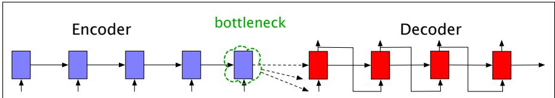
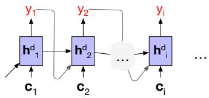
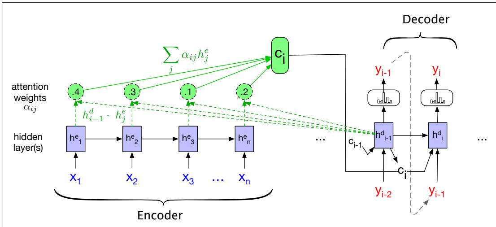

## 14.8 Attention

The simplicity of the encoder-decoder model is its clean separation of the encoder— which builds a representation of the source text—from the decoder, which uses this context to generate a target text. In the model as we’ve described it so far, this context vector is $h _ { n } .$ , the hidden state of the last $( n ^ { \mathrm { t h } } )$ time step of the source text. This final hidden state is thus acting as a bottleneck: it must represent absolutely everything about the meaning of the source text, since the only thing the decoder knows about the source text is what’s in this context vector (Fig. 14.20). Information at the beginning of the sentence, especially for long sentences, may not be equally well represented in the context vector.

  
Figure 14.20 Requiring the context c to be only the encoder’s final hidden state forces all the information from the entire source sentence to pass through this representational bottleneck.

The attention mechanism is a solution to the bottleneck problem, a way of allowing the decoder to get information from all the hidden states of the encoder, not just the last hidden state.

In the attention mechanism, as in the vanilla encoder-decoder model, the context vector c is a single vector that is a function of the hidden states of the encoder. But instead of being taken from the last hidden state, it’s a weighted average of all the hidden states of the encoder. And this weighted average is also informed by part of the decoder state as well, the state of the decoder right before the current token i. That is, $\pmb { \mathrm { c } } _ { i } = f ( \pmb { \mathrm { h } } _ { 1 } ^ { e } \dots \pmb { \mathrm { h } } _ { n } ^ { e } , \pmb { \mathrm { h } } _ { i - 1 } ^ { d } )$ . The weights focus on (‘attend to’) a particular part of the source text that is relevant for the token i that the decoder is currently producing. Attention thus replaces the static context vector with one that is dynamically derived from the encoder hidden states, but also informed by and hence different for each token in decoding.

This context vector, ci, is generated anew with each decoding step i and takes all of the encoder hidden states into account in its derivation. We then make this context available during decoding by conditioning the computation of the current decoder hidden state on it (along with the prior hidden state and the previous output generated by the decoder), as we see in this equation (and Fig. 14.21):

$$
\mathbf {h} _ {i} ^ {d} = g (\hat {y} _ {i - 1}, \mathbf {h} _ {i - 1} ^ {d}, \mathbf {c} _ {i})\tag{14.34}
$$

  
Figure 14.21 The attention mechanism allows each hidden state of the decoder to see a different, dynamic, context, which is a function of all the encoder hidden states.

The first step in computing $\mathbf { c } _ { i }$ is to compute how much to focus on each encoder state, how relevant each encoder state is to the decoder state captured in $\mathbf { h } _ { i - 1 } ^ { d }$ . We capture relevance by computing— at each state i during decoding—a score $( \mathbf { h } _ { i - 1 } ^ { d } , \mathbf { h } _ { j } ^ { e } )$ for each encoder state j.

The simplest such score, called dot-product attention, implements relevance as similarity: measuring how similar the decoder hidden state is to an encoder hidden state, by computing the dot product between them:

$$
\operatorname{score} \left(\mathbf {h} _ {i - 1} ^ {d}, \mathbf {h} _ {j} ^ {e}\right) = \mathbf {h} _ {i - 1} ^ {d} \cdot \mathbf {h} _ {j} ^ {e}\tag{14.35}
$$

The score that results from this dot product is a scalar that reflects the degree of similarity between the two vectors. The vector of these scores across all the encoder hidden states gives us the relevance of each encoder state to the current step of the decoder.

To make use of these scores, we’ll normalize them with a softmax to create a vector of weights, $\alpha _ { i j }$ , that tells us the proportional relevance of each encoder hidden state $j$ to the prior hidden decoder state, $h _ { i - 1 } ^ { d }$ 1.

$$
\begin{array}{r c l} \alpha_ {i j} & = & \text {softmax} (\text {score} (\mathbf {h} _ {i - 1} ^ {d}, \mathbf {h} _ {j} ^ {e})) \\ & = & \frac {\exp (\text {score} (\mathbf {h} _ {i - 1} ^ {d} , \mathbf {h} _ {j} ^ {e})}{\sum_ {k} \exp (\text {score} (\mathbf {h} _ {i - 1} ^ {d} , \mathbf {h} _ {k} ^ {e}))} \end{array}\tag{14.36}
$$

Finally, given the distribution in $\alpha ,$ we can compute a fixed-length context vector for the current decoder state by taking a weighted average over all the encoder hidden states.

$$
\mathbf {c} _ {i} = \sum_ {j} \alpha_ {i j} \mathbf {h} _ {j} ^ {e}\tag{14.37}
$$

With this, we finally have a fixed-length context vector that takes into account information from the entire encoder state that is dynamically updated to reflect the needs of the decoder at each step of decoding. Fig. 14.22 illustrates an encoderdecoder network with attention, focusing on the computation of one context vector $\mathbf { c } _ { i } .$

  
Figure 14.22 A sketch of the encoder-decoder network with attention, focusing on the computation of $\mathbf { c } _ { i } .$ The context value $\mathbf { c } _ { i }$ is one of the inputs to the computation of $\mathbf { h } _ { i } ^ { d }$ . It is computed by taking the weighted sum of all the encoder hidden states, each weighted by their dot product with the prior decoder hidden state $\hslash _ { i - 1 } ^ { d } .$

It’s also possible to create more sophisticated scoring functions for attention models. Instead of simple dot product attention, we can get a more powerful function that computes the relevance of each encoder hidden state to the decoder hidden state by parameterizing the score with its own set of weights, $\boldsymbol { \mathsf { W } } _ { s }$

$$
\operatorname{score} \left(\mathbf {h} _ {i - 1} ^ {d}, \mathbf {h} _ {j} ^ {e}\right) = \mathbf {h} _ {i - 1} ^ {d} \mathbf {W} _ {s} \mathbf {h} _ {j} ^ {e}\tag{14.38}
$$

The weights $W _ { s } ,$ which are then trained during normal end-to-end training, give the network the ability to learn which aspects of similarity between the decoder and encoder states are important to the current application. This bilinear model also allows the encoder and decoder to use different dimensional vectors, whereas the simple dot-product attention requires that the encoder and decoder hidden states have the same dimensionality.
