CHAPTER

# 15 Phonetics and Speech FeatureExtraction

The characters that make up the texts we’ve been discussing in this book aren’t just random symbols. They are also an amazing scientific invention: a theoretical model of the elements that make up human speech.

The earliest writing systems we know of (Sumerian, Chinese, Mayan) were mainly logographic: one symbol representing a whole word. But from the earliest stages we can find, some symbols were also used to represent the sounds

that made up words. The cuneiform sign to the right pronounced ba and meaning “ration” in Sumerian could also function purely as the sound /ba/. The earliest Chinese characters we have, carved into bones for divination, similarly

contain phonetic elements. Purely sound-based writing systems, whether syllabic (like Japanese hiragana), alphabetic (like the Roman alphabet), or consonantal (like Semitic writing systems), trace back to these early logo-syllabic systems, often as two cultures came together. Thus, the Arabic, Aramaic, Hebrew, Greek, and Roman systems all derive from a West Semitic script that is presumed to have been modified by Western Semitic mercenaries from a cursive form of Egyptian hieroglyphs. The Japanese syllabaries were modified from a cursive form of Chinese phonetic characters, which themselves were used in Chinese to phonetically represent the Sanskrit in the Buddhist scriptures that came to China in the Tang dynasty.

This implicit idea that the spoken word is composed of smaller units of speech underlies algorithms for both speech recognition (transcribing waveforms into text) and text-to-speech (converting text into waveforms). In this chapter we give a computational perspective on phonetics, the study of the speech sounds used in the languages of the world, how they are produced in the human vocal tract, how they are realized acoustically, and how they can be digitized and processed.

## 15.1 Speech Sounds and Phonetic Transcription

A letter like ‘p’ or ‘a’ is already a useful model of the sounds of human speech, and indeed we’ll see in Chapter 16 how to map between letters and waveforms. Nonetheless, it is helpful to represent sounds slightly more abstractly. We’ll represent the pronunciation of a word as a string of phones, which are speech sounds, each represented with symbols adapted from the Roman alphabet.

The standard phonetic representation for transcribing the world’s languages is the International Phonetic Alphabet (IPA), an evolving standard first developed in 1888. But in this chapter we’ll instead represent phones with the ARPAbet (Shoup, 1980), a simple phonetic alphabet (Fig. 15.1) that conveniently uses ASCII symbols to represent an American-English subset of the IPA.

Many of the IPA and ARPAbet symbols are equivalent to familiar Roman letters. So, for example, the ARPAbet phone [p] represents the consonant sound at the beginning of platypus, puma, and plantain, the middle of leopard, or the end of antelope. In general, however, the mapping between the letters of English orthography and phones is relatively opaque; a single letter can represent very different sounds in different contexts. The English letter c corresponds to phone [k] in cougar [k uw g axr], but phone [s] in cell [s eh l]. Besides appearing as c and k, the phone [k] can appear as part of x (fox [f aa k s]), as ck (jackal [jh ae k el]) and as cc (raccoon [r ae k uw n]). Many other languages, for example, Spanish, are much more transparent in their sound-orthography mapping than English.

<table><tr><td>ARPAbet Symbol</td><td>IPA Symbol</td><td>Word</td><td>ARPAbet Transcription</td><td>ARPAbet Symbol</td><td>IPA Symbol</td><td>Word</td><td>ARPAbet Transcription</td></tr><tr><td>[p]</td><td>[p]</td><td>parsley</td><td>[p aa r s l iy]</td><td>[iy]</td><td>[i]</td><td>lily</td><td>[l ih l iy]</td></tr><tr><td>[t]</td><td>[t]</td><td>tea</td><td>[t iy]</td><td>[ih]</td><td>[ɪ]</td><td>lily</td><td>[l ih l iy]</td></tr><tr><td>[k]</td><td>[k]</td><td>cook</td><td>[k uh k]</td><td>[ey]</td><td>[eɪ]</td><td>daisy</td><td>[d ey z iy]</td></tr><tr><td>[b]</td><td>[b]</td><td>bay</td><td>[b ey]</td><td>[eh]</td><td>[ɛ]</td><td>pen</td><td>[p eh n]</td></tr><tr><td>[d]</td><td>[d]</td><td>dill</td><td>[d ih l]</td><td>[ae]</td><td>[æ]</td><td>aster</td><td>[ae s t axr]</td></tr><tr><td>[g]</td><td>[g]</td><td>garlic</td><td>[g aa r l ix k]</td><td>[aa]</td><td>[ɑ]</td><td>poppy</td><td>[p aa p iy]</td></tr><tr><td>[m]</td><td>[m]</td><td>mint</td><td>[m ih n t]</td><td>[ao]</td><td>[ɔ]</td><td>orchid</td><td>[ao r k ix d]</td></tr><tr><td>[n]</td><td>[n]</td><td>nutmeg</td><td>[n ah t m eh g]</td><td>[uh]</td><td>[ʊ]</td><td>wood</td><td>[w uh d]</td></tr><tr><td>[ng]</td><td>[ŋ]</td><td>baking</td><td>[b ey k ix ng]</td><td>[ow]</td><td>[oʊ]</td><td>lotus</td><td>[l ow dx ax s]</td></tr><tr><td>[f]</td><td>[f]</td><td>flour</td><td>[f l aw axr]</td><td>[uw]</td><td>[u]</td><td>tulip</td><td>[t uw l ix p]</td></tr><tr><td>[v]</td><td>[v]</td><td>clove</td><td>[k l ow v]</td><td>[ah]</td><td>[ʌ]</td><td>butter</td><td>[b ah dx axr]</td></tr><tr><td>[th]</td><td>[θ]</td><td>thick</td><td>[th ih k]</td><td>[er]</td><td>[ɜː]</td><td>bird</td><td>[b er d]</td></tr><tr><td>[dh]</td><td>[ð]</td><td>those</td><td>[dh ow z]</td><td>[ay]</td><td>[aɪ]</td><td>iris</td><td>[ay r ix s]</td></tr><tr><td>[s]</td><td>[s]</td><td>soup</td><td>[s uw p]</td><td>[aw]</td><td>[aʊ]</td><td>flower</td><td>[f l aw axr]</td></tr><tr><td>[z]</td><td>[z]</td><td>eggs</td><td>[eh g z]</td><td>[oy]</td><td>[oɪ]</td><td>soil</td><td>[s oy l]</td></tr><tr><td>[sh]</td><td>[ʃ]</td><td>squash</td><td>[s k w aa sh]</td><td>[ax]</td><td>[ə]</td><td>pita</td><td>[p iy t ax]</td></tr><tr><td>[zh]</td><td>[ʒ]</td><td>ambrosia</td><td>[ae m b r ow zh ax]</td><td></td><td></td><td></td><td></td></tr><tr><td>[ch]</td><td>[tʃ]</td><td>cherry</td><td>[ch eh r iy]</td><td></td><td></td><td></td><td></td></tr><tr><td>[jh]</td><td>[dʒ]</td><td>jar</td><td>[jh aa r]</td><td></td><td></td><td></td><td></td></tr><tr><td>[l]</td><td>[l]</td><td>licorice</td><td>[l ih k axr ix sh]</td><td></td><td></td><td></td><td></td></tr><tr><td>[w]</td><td>[w]</td><td>kiwi</td><td>[k iy w iy]</td><td></td><td></td><td></td><td></td></tr><tr><td>[r]</td><td>[r]</td><td>rice</td><td>[r ay s]</td><td></td><td></td><td></td><td></td></tr><tr><td>[y]</td><td>[j]</td><td>yellow</td><td>[y eh l ow]</td><td></td><td></td><td></td><td></td></tr><tr><td>[h]</td><td>[h]</td><td>honey</td><td>[h ah n iy]</td><td></td><td></td><td></td><td></td></tr></table>

Figure 15.1 ARPAbet and IPA symbols for English consonants (left) and vowels (right).

There are a wide variety of phonetic resources for phonetic transcription. Online pronunciation dictionaries give phonetic transcriptions for words. The LDC distributes pronunciation lexicons for Egyptian Arabic, Dutch, English, German, Japanese, Korean, Mandarin, and Spanish. For English, the CELEX dictionary (Baayen et al., 1995) has pronunciations for 160,595 wordforms, with syllabification, stress, and morphological and part-of-speech information. The open-source CMU Pronouncing Dictionary (CMU, 1993) has pronunciations for about 134,000 wordforms, while the fine-grained 110,000 word UNISYN dictionary (Fitt, 2002), freely available for research purposes, gives syllabifications, stress, and also pronunciations for dozens of dialects of English.

Another useful resource is a phonetically annotated corpus, in which a collection of waveforms is hand-labeled with the corresponding string of phones. The TIMIT corpus (NIST, 1990), originally a joint project between Texas Instruments (TI), MIT, and SRI, is a corpus of 6300 read sentences, with 10 sentences each from

630 speakers. The 6300 sentences were drawn from a set of 2342 sentences, some selected to have particular dialect shibboleths, others to maximize phonetic diphone coverage. Each sentence in the corpus was phonetically hand-labeled, the sequence of phones was automatically aligned with the sentence wavefile, and then the automatic phone boundaries were manually hand-corrected (Seneff and Zue, 1988). The result is a time-aligned transcription: a transcription in which each phone is associated with a start and end time in the waveform, like the example in Fig. 15.2.

<table><tr><td>she</td><td>had</td><td>your</td><td>dark</td><td>suit</td><td>in</td><td>greasy</td><td>wash</td><td>water</td><td>all</td><td>year</td></tr><tr><td>sh iy</td><td>hv ae dcl</td><td>jh axr</td><td>dcl d aa r kcl</td><td>s ux q</td><td>en</td><td>gcl g r iy s ix</td><td>w aa sh</td><td>q w aa dx axr q</td><td>aa l</td><td>y ix axr</td></tr></table>

Figure 15.2 Phonetic transcription from the TIMIT corpus, using special ARPAbet features for narrow transcription, such as the palatalization of [d] in had, unreleased final stop in dark, glottalization of final [t] in sui to [q], and flap of [t] in water. The TIMIT corpus also includes time-alignments (not shown).

The Switchboard Transcription Project phonetically annotated corpus consists of 3.5 hours of sentences extracted from the Switchboard corpus (Greenberg et al., 1996), together with transcriptions time-aligned at the syllable level. Figure 15.3 shows an example .

<table><tr><td>0.470</td><td>0.640</td><td>0.720</td><td>0.900</td><td>0.953</td><td>1.279</td><td>1.410</td><td>1.630</td></tr><tr><td>dh er</td><td>k aa</td><td>n ax</td><td>v ih m</td><td>b ix</td><td>t w iy n</td><td>r ay</td><td>n aw</td></tr></table>

Figure 15.3 Phonetic transcription of the Switchboard phrase they’re kind of in between right now. Note vowel reduction in they’re and of, coda deletion in kind and right, and resyllabification (the [v] of of attaches as the onset of in). Time is given in number of seconds from the beginning of sentence to the start of each syllable.

The Buckeye corpus (Pitt et al. 2007, Pitt et al. 2005) is a phonetically transcribed corpus of spontaneous American speech, containing about 300,000 words from 40 talkers. Phonetically transcribed corpora are also available for other languages, including the Kiel corpus of German and Mandarin corpora transcribed by the Chinese Academy of Social Sciences (Li et al., 2000).

## 15.2 Articulatory Phonetics

Articulatory phonetics is the study of how these phones are produced as the various organs in the mouth, throat, and nose modify the airflow from the lungs.

## The Vocal Organs

Figure 15.4 shows the organs of speech. Sound is produced by the rapid movement of air. Humans produce most sounds in spoken languages by expelling air from the lungs through the windpipe (technically, the trachea) and then out the mouth or nose. As it passes through the trachea, the air passes through the larynx, commonly known as the Adam’s apple or voice box. The larynx contains two small folds of muscle, the vocal folds (often referred to non-technically as the vocal cords), which can be moved together or apart. The space between these two folds is called the glottis. If the folds are close together (but not tightly closed), they will vibrate as air passes through them; if they are far apart, they won’t vibrate. Sounds made with the vocal folds together and vibrating are called voiced; sounds made without this vocal cord vibration are called unvoiced or voiceless. Voiced sounds include [b], [d], [g], [v], [z], and all the English vowels, among others. Unvoiced sounds include [p], [t], [k], [f], [s], and others.

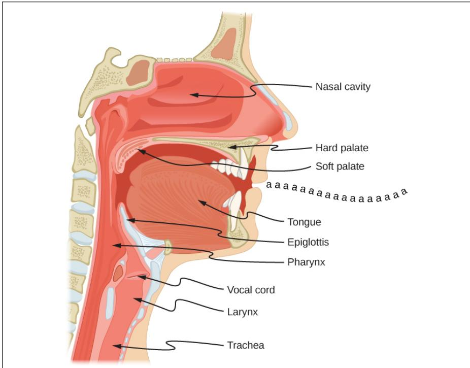  
Figure 15.4 The vocal organs, shown in side view. (Figure from OpenStax University Physics, CC BY 4.0)

The area above the trachea is called the vocal tract; it consists of the oral tract and the nasal tract. After the air leaves the trachea, it can exit the body through the mouth or the nose. Most sounds are made by air passing through the mouth. Sounds made by air passing through the nose are called nasal sounds; nasal sounds (like English [m], [n], and [ng]) use both the oral and nasal tracts as resonating cavities.

Phones are divided into two main classes: consonants and vowels. Both kinds of sounds are formed by the motion of air through the mouth, throat or nose. Consonants are made by restriction or blocking of the airflow in some way, and can be voiced or unvoiced. Vowels have less obstruction, are usually voiced, and are generally louder and longer-lasting than consonants. The technical use of these terms is much like the common usage; [p], [b], [t], [d], [k], [g], [f], [v], [s], [z], [r], [l], etc., are consonants; [aa], [ae], [ao], [ih], [aw], [ow], [uw], etc., are vowels. Semivowels (such as [y] and [w]) have some of the properties of both; they are voiced like vowels, but they are short and less syllabic like consonants.

## Consonants: Place of Articulation

Because consonants are made by restricting airflow, we can group them into classes by their point of maximum restriction, their place of articulation (Fig. 15.5).

Labial: Consonants whose main restriction is formed by the two lips coming together have a bilabial place of articulation. In English these include [p] as in possum, [b] as in bear, and [m] as in marmot. The English labiodental consonants [v] and [f] are made by pressing the bottom lip against the upper row of teeth and letting the air flow through the space in the upper teeth.

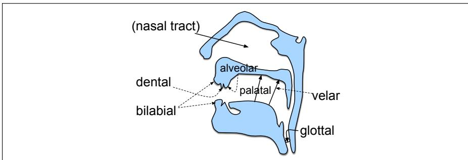  
Figure 15.5 Major English places of articulation.

Dental: Sounds that are made by placing the tongue against the teeth are dentals. The main dentals in English are the [th] of thing and the [dh] of though, which are made by placing the tongue behind the teeth with the tip slightly between the teeth.

Alveolar: The alveolar ridge is the portion of the roof of the mouth just behind the upper teeth. Most speakers of American English make the phones [s], [z], [t], and [d] by placing the tip of the tongue against the alveolar ridge. The word coronal is often used to refer to both dental and alveolar.

Palatal: The roof of the mouth (the palate) rises sharply from the back of the alveolar ridge. The palato-alveolar sounds [sh] (shrimp), [ch] (china), [zh] (Asian), and [jh] (jar) are made with the blade of the tongue against the rising back of the alveolar ridge. The palatal sound [y] of yak is made by placing the front of the tongue up close to the palate.

Velar: The velum, or soft palate, is a movable muscular flap at the very back of the roof of the mouth. The sounds [k] (cuckoo), [g] (goose), and [N] (kingfisher) are made by pressing the back of the tongue up against the velum.

Glottal: The glottal stop [q] is made by closing the glottis (by bringing the vocal folds together).

## Consonants: Manner of Articulation

Consonants are also distinguished by how the restriction in airflow is made, for example, by a complete stoppage of air or by a partial blockage. This feature is called the manner of articulation of a consonant. The combination of place and manner of articulation is usually sufficient to uniquely identify a consonant. Following are the major manners of articulation for English consonants:

A stop is a consonant in which airflow is completely blocked for a short time. This blockage is followed by an explosive sound as the air is released. The period of blockage is called the closure, and the explosion is called the release. English has voiced stops like [b], [d], and [g] as well as unvoiced stops like [p], [t], and [k]. Stops are also called plosives.

The nasal sounds [n], [m], and [ng] are made by lowering the velum and allowing air to pass into the nasal cavity.

In fricatives, airflow is constricted but not cut off completely. The turbulent airflow that results from the constriction produces a characteristic “hissing” sound. The English labiodental fricatives [f] and [v] are produced by pressing the lower lip against the upper teeth, allowing a restricted airflow between the upper teeth. The dental fricatives [th] and [dh] allow air to flow around the tongue between the teeth. The alveolar fricatives [s] and [z] are produced with the tongue against the alveolar ridge, forcing air over the edge of the teeth. In the palato-alveolar fricatives [sh] and [zh], the tongue is at the back of the alveolar ridge, forcing air through a groove formed in the tongue. The higher-pitched fricatives (in English [s], [z], [sh] and [zh]) are called sibilants. Stops that are followed immediately by fricatives are called affricates; these include English [ch] (chicken) and [jh] (giraffe).

In approximants, the two articulators are close together but not close enough to cause turbulent airflow. In English [y] (yellow), the tongue moves close to the roof of the mouth but not close enough to cause the turbulence that would characterize a fricative. In English [w] (wood), the back of the tongue comes close to the velum. American [r] can be formed in at least two ways; with just the tip of the tongue extended and close to the palate or with the whole tongue bunched up near the palate. [l] is formed with the tip of the tongue up against the alveolar ridge or the teeth, with one or both sides of the tongue lowered to allow air to flow over it. [l] is called a lateral sound because of the drop in the sides of the tongue.

A tap or flap [dx] is a quick motion of the tongue against the alveolar ridge. The consonant in the middle of the word lotus ([l ow dx ax s]) is a tap in most dialects of American English; speakers of many U.K. dialects would use a [t] instead.

## Vowels

Like consonants, vowels can be characterized by the position of the articulators as they are made. The three most relevant parameters for vowels are what is called vowel height, which correlates roughly with the height of the highest part of the tongue, vowel frontness or backness, indicating whether this high point is toward the front or back of the oral tract and whether the shape of the lips is rounded or not. Figure 15.6 shows the position of the tongue for different vowels.

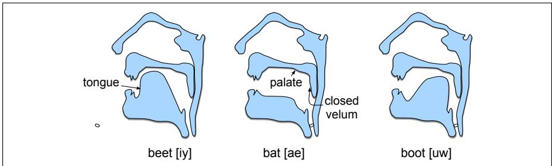  
Figure 15.6 Tongue positions for English high front [iy], low front [ae] and high back [uw].

In the vowel [iy], for example, the highest point of the tongue is toward the front of the mouth. In the vowel [uw], by contrast, the high-point of the tongue is located toward the back of the mouth. Vowels in which the tongue is raised toward the front are called front vowels; those in which the tongue is raised toward the back are called back vowels. Note that while both [ih] and [eh] are front vowels, the tongue is higher for [ih] than for [eh]. Vowels in which the highest point of the tongue is comparatively high are called high vowels; vowels with mid or low values of maximum tongue height are called mid vowels or low vowels, respectively.

Figure 15.7 shows a schematic characterization of the height of different vowels. It is schematic because the abstract property height correlates only roughly with actual tongue positions; it is, in fact, a more accurate reflection of acoustic facts. Note that the chart has two kinds of vowels: those in which tongue height is represented as a point and those in which it is represented as a path. A vowel in which the tongue position changes markedly during the production of the vowel is a diphthong. En-

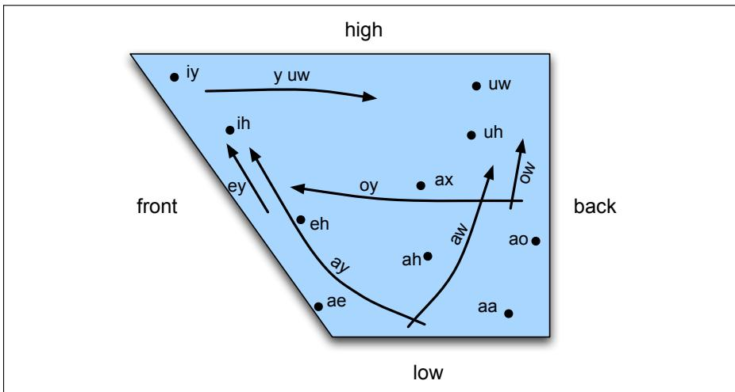  
Figure 15.7 The schematic “vowel space” for English vowels.

glish is particularly rich in diphthongs.

The second important articulatory dimension for vowels is the shape of the lips. Certain vowels are pronounced with the lips rounded (the same lip shape used for whistling). These rounded vowels include [uw], [ao], and [ow].

## Syllables

Consonants and vowels combine to make a syllable. A syllable is a vowel-like (or sonorant) sound together with some of the surrounding consonants that are most closely associated with it. The word dog has one syllable, [d aa g] (in our dialect); the word catnip has two syllables, [k ae t] and [n ih p]. We call the vowel at the core of a syllable the nucleus. Initial consonants, if any, are called the onset. Onsets with more than one consonant (as in strike [s t r ay k]), are called complex onsets. The coda is the optional consonant or sequence of consonants following the nucleus. Thus [d] is the onset of dog, and [g] is the coda. The rime, or rhyme, is the nucleus plus coda. Figure 15.8 shows some sample syllable structures.

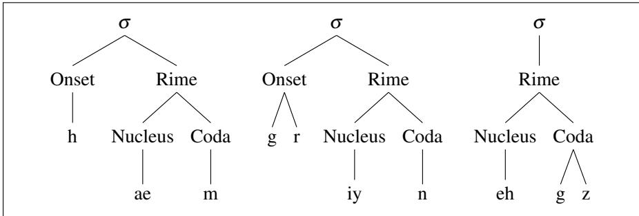  
Figure 15.8 Syllable structure of ham, green, eggs. σ=syllable.

The task of automatically breaking up a word into syllables is called syllabification. Syllable structure is also closely related to the phonotactics of a language. The term phonotactics means the constraints on which phones can follow each other in a language. For example, English has strong constraints on what kinds of consonants can appear together in an onset; the sequence [zdr], for example, cannot be a legal English syllable onset. Phonotactics can be represented by a language model or finite-state model of phone sequences.

## 15.3 Prosody

Prosody is the study of the intonational and rhythmic aspects of language, and in particular the use of F0, energy, and duration to convey pragmatic, affective, or conversation-interactional meanings.1 We’ll introduce these acoustic quantities in detail in the next section when we turn to acoustic phonetics, but briefly we can think of energy as the acoustic quality that we perceive as loudness, and F0 as the frequency of the sound that is produced, the acoustic quality that we hear as the pitch of an utterance. Prosody can be used to mark discourse structure, like the difference between statements and questions, or the way that a conversation is structured. Prosody is used to mark the saliency of a particular word or phrase. Prosody is heavily used for paralinguistic functions like conveying affective meanings like happiness, surprise, or anger. And prosody plays an important role in managing turn-taking in conversation.

## 15.3.1 Prosodic Prominence: Accent, Stress and Schwa

In a natural utterance of American English, some words sound more prominent than others, and certain syllables in these words are also more prominent than others. What we mean by prominence is that these words or syllables are perceptually more salient to the listener. Speakers make a word or syllable more salient in English by saying it louder, saying it slower (so it has a longer duration), or by varying F0 during the word, making it higher or more variable.

Accent We represent prominence via a linguistic marker called pitch accent. Words or syllables that are prominent are said to bear (be associated with) a pitch accent. Thus this utterance might be pronounced by accenting the underlined words:

(15.1) I’m a little surprised to hear it characterized as happy.

Lexical Stress The syllables that bear pitch accent are called accented syllables. Not every syllable of a word can be accented: pitch accent has to be realized on the syllable that has lexical stress. Lexical stress is a property of the word’s pronunciation in dictionaries; the syllable that has lexical stress is the one that will be louder or longer if the word is accented. For example, the word surprised is stressed on its second syllable, not its first. (Try stressing the other syllable by saying SURprised; hopefully that sounds wrong to you). Thus, if the word surprised receives a pitch accent in a sentence, it is the second syllable that will be stronger. The following example shows underlined accented words with the stressed syllable bearing the accent (the louder, longer syllable) in boldface:

(15.2) I’m a little surprised to hear it characterized as happy.

Stress is marked in dictionaries. The CMU dictionary (CMU, 1993), for example, marks vowels with 0 (unstressed) or 1 (stressed) as in entries for counter: [K AW1 N T ER0], or table: [T EY1 B AH0 L]. Difference in lexical stress can affect word meaning; the noun content is pronounced [K AA1 N T EH0 N T], while the adjective is pronounced [K AA0 N T EH1 N T].

Reduced Vowels and Schwa Unstressed vowels can be weakened even further to reduced vowels, the most common of which is schwa ([ax]), as in the second vowel of parakeet: [p ae r ax k iy t]. In a reduced vowel the articulatory gesture isn’t as complete as for a full vowel. Not all unstressed vowels are reduced; any vowel, and diphthongs in particular, can retain its full quality even in unstressed position. For example, the vowel [iy] can appear in stressed position as in the word eat [iy t] or in unstressed position as in the word carry [k ae r iy].

In summary, there is a continuum of prosodic prominence, for which it is often useful to represent levels like accented, stressed, full vowel, and reduced vowel.

## 15.3.2 Prosodic Structure

Spoken sentences have prosodic structure: some words seem to group naturally together, while some words seem to have a noticeable break or disjuncture between them. Prosodic structure is often described in terms of prosodic phrasing, meaning that an utterance has a prosodic phrase structure in a similar way to it having a syntactic phrase structure. For example, the sentence I wanted to go to London, but could only get tickets for France seems to have two main intonation phrases, their boundary occurring at the comma. Furthermore, in the first phrase, there seems to be another set of lesser prosodic phrase boundaries (often called intermediate phrases) that split up the words as I wanted to go to London. These kinds of intonation phrases are often correlated with syntactic structure constituents (Price et al. 1991, Bennett and Elfner 2019).

Automatically predicting prosodic boundaries can be important for tasks like TTS. Modern approaches use sequence models that take either raw text or text annotated with features like parse trees as input, and make a break/no-break decision at each word boundary. They can be trained on data labeled for prosodic structure like the Boston University Radio News Corpus (Ostendorf et al., 1995).

## 15.3.3 Tune

Two utterances with the same prominence and phrasing patterns can still differ prosodically by having different tunes. The tune of an utterance is the rise and fall of its F0 over time. A very obvious example of tune is the difference between statements and yes-no questions in English. The same words can be said with a final F0 rise to indicate a yes-no question (called a question rise):

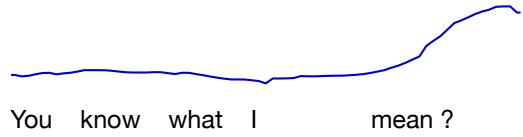

or a final drop in F0 (called a final fall) to indicate a declarative intonation:

Languages make wide use of tune to express meaning (Xu, 2005). In English, for example, besides this well-known rise for yes-no questions, a phrase containing a list of nouns separated by commas often has a short rise called a continuation rise after each noun. Other examples include the characteristic English contours for expressing contradiction and expressing surprise.

## Linking Prominence and Tune

Pitch accents come in different varieties that are related to tune; high pitched accents, for example, have different functions than low pitched accents. There are many typologies of accent classes in different languages. One such typology is part of the ToBI (Tone and Break Indices) theory of intonation (Silverman et al. 1992). Each word in ToBI can be associated with one of five types of pitch accents shown in Fig. 15.9. Each utterance in ToBI consists of a sequence of intonational phrases, each of which ends in one of four boundary tones shown in Fig. 15.9, representing the utterance final aspects of tune. There are version of ToBI for many languages.

<table><tr><td></td><td>Pitch Accents</td><td colspan="2">Boundary Tones</td></tr><tr><td>H*</td><td>peak accent</td><td>L-L%</td><td>“final fall”: “declarative contour” of American English</td></tr><tr><td>L*</td><td>low accent</td><td>L-H%</td><td>continuation rise</td></tr><tr><td>L*+H</td><td>scooped accent</td><td>H-H%</td><td>“question rise”: cantonical yes-no question contour</td></tr><tr><td>L+H*</td><td>rising peak accent</td><td>H-L%</td><td>final level plateau</td></tr><tr><td>H+!H*</td><td>step down</td><td></td><td></td></tr></table>

Figure 15.9 The accent and boundary tones labels from the ToBI transcription system for American English intonation (Beckman and Ayers 1997, Beckman and Hirschberg 1994).

## 15.4 Acoustic Phonetics and Signals

We begin with a very brief introduction to the acoustic waveform and its digitization and frequency analysis; the interested reader is encouraged to consult the references at the end of the chapter.

## 15.4.1 Waves

Acoustic analysis is based on the sine and cosine functions. Figure 15.10 shows a plot of a sine wave, in particular the function

$$
y = A * \sin (2 \pi f t)\tag{15.3}
$$

where we have set the amplitude A to 1 and the frequency f to 10 cycles per second.

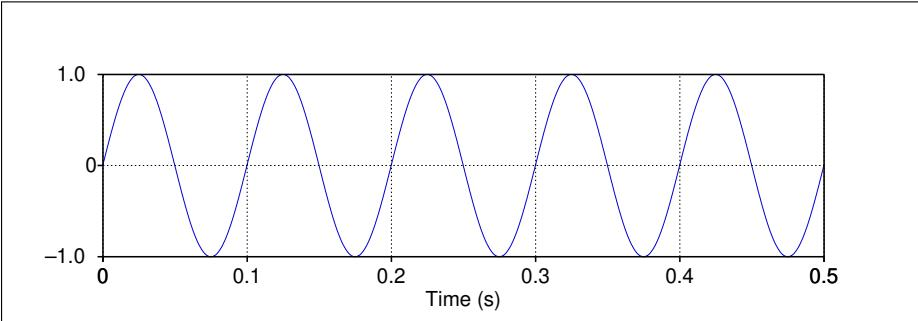  
Figure 15.10 A sine wave with a frequency of 10 Hz and an amplitude of 1.

Recall from basic mathematics that two important characteristics of a wave are its frequency and amplitude. The frequency is the number of times a second that a wave repeats itself, that is, the number of cycles. We usually measure frequency in cycles per second. The signal in Fig. 15.10 repeats itself 5 times in .5 seconds, hence 10 cycles per second. Cycles per second are usually called hertz (shortened to Hz), so the frequency in Fig. 15.10 would be described as 10 Hz. The amplitude A of a sine wave is the maximum value on the Y axis. The period T of the wave is the time it takes for one cycle to complete, defined as

$$
T = \frac {1}{f}\tag{15.4}
$$

Each cycle in Fig. 15.10 lasts a tenth of a second; hence T = .1 seconds.

## 15.4.2 Speech Sound Waves

Let’s turn from hypothetical waves to sound waves. The input to a speech recognizer, like the input to the human ear, is a complex series of changes in air pressure. These changes in air pressure obviously originate with the speaker and are caused by the specific way that air passes through the glottis and out the oral or nasal cavities. We represent sound waves by plotting the change in air pressure over time. One metaphor which sometimes helps in understanding these graphs is that of a vertical plate blocking the air pressure waves (perhaps in a microphone in front of a speaker’s mouth, or the eardrum in a hearer’s ear). The graph measures the amount of compression or rarefaction (uncompression) of the air molecules at this plate. Figure 15.11 shows a short segment of a waveform taken from the Switchboard corpus of telephone speech of the vowel [iy] from someone saying “she just had a baby”.

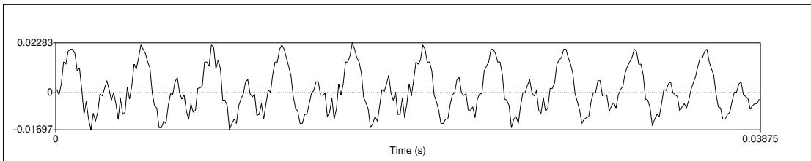  
Figure 15.11 A waveform of the vowel [iy] from an utterance shown later in Fig. 15.15 on page 342. The y-axis shows the level of air pressure above and below normal atmospheric pressure. The x-axis shows time. Notice that the wave repeats regularly.

The first step in digitizing a sound wave like Fig. 15.11 is to convert the analog representations (first air pressure and then analog electric signals in a microphone) into a digital signal. This analog-to-digital conversion has two steps: sampling and quantization. To sample a signal, we measure its amplitude at a particular time; the sampling rate is the number of samples taken per second. To accurately measure a wave, we must have at least two samples in each cycle: one measuring the positive part of the wave and one measuring the negative part. More than two samples per cycle increases the amplitude accuracy, but fewer than two samples causes the frequency of the wave to be completely missed. Thus, the maximum frequency wave that can be measured is one whose frequency is half the sample rate (since every cycle needs two samples). This maximum frequency for a given sampling rate is called the Nyquist frequency. Most information in human speech is in frequencies below 10,000 Hz; thus, a 20,000 Hz sampling rate would be necessary for complete accuracy. But telephone speech is filtered by the switching network, and only frequencies less than 4,000 Hz are transmitted by telephones. Thus, an 8,000 Hz sampling rate is sufficient for telephone-bandwidth speech like the Switchboard corpus, while 16,000 Hz sampling is often used for microphone speech.

Even an 8,000 Hz sampling rate requires 8000 amplitude measurements for each second of speech, so it is important to store amplitude measurements efficiently. They are usually stored as integers, either 8 bit (values from -128–127) or 16 bit (values from -32768–32767). This process of representing real-valued numbers as integers is called quantization because the difference between two integers acts as a minimum granularity (a quantum size) and all values that are closer together than this quantum size are represented identically.

Once data is quantized, it is stored in various formats. One parameter of these formats is the sample rate and sample size discussed above; telephone speech is often sampled at 8 kHz and stored as 8-bit samples, and microphone data is often sampled at 16 kHz and stored as 16-bit samples. Another parameter is the number of channels. For stereo data or for two-party conversations, we can store both channels in the same file or we can store them in separate files. A final parameter is individual sample storage—linearly or compressed. One common compression format used for telephone speech is µ-law (often written u-law but still pronounced mu-law). The intuition of log compression algorithms like µ-law is that human hearing is more sensitive at small intensities than large ones; the log represents small values with more faithfulness at the expense of more error on large values. The linear (unlogged) values are generally referred to as linear PCM values (PCM stands for pulse code modulation, but never mind that). Here’s the equation for compressing a linear PCM sample value x to 8-bit µ-law, (where µ=255 for 8 bits):

$$
F (x) = \frac {\operatorname{sgn} (x) \log (1 + \mu | x |)}{\log (1 + \mu)} - 1 \leq x \leq 1\tag{15.5}
$$

There are a number of standard file formats for storing the resulting digitized wavefile, such as Microsoft’s .wav and Apple’s AIFF all of which have special headers; simple headerless “raw” files are also used. For example, the .wav format is a subset of Microsoft’s RIFF format for multimedia files; RIFF is a general format that can represent a series of nested chunks of data and control information. Figure 15.12 shows a simple .wav file with a single data chunk together with its format chunk.

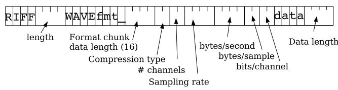  
Figure 15.12 Microsoft wavefile header format, assuming simple file with one chunk. Following this 44-byte header would be the data chunk.

## 15.4.3 Frequency and Amplitude; Pitch and Loudness

Sound waves, like all waves, can be described in terms of frequency, amplitude, and the other characteristics that we introduced earlier for pure sine waves. In sound waves, these are not quite as simple to measure as they were for sine waves. Let’s consider frequency. Note in Fig. 15.11 that although not exactly a sine, the wave is nonetheless periodic, repeating 10 times in the 38.75 milliseconds (.03875 seconds)

captured in the figure. Thus, the frequency of this segment of the wave is 10/.03875 or 258 Hz.

Where does this periodic 258 Hz wave come from? It comes from the speed of vibration of the vocal folds; since the waveform in Fig. 15.11 is from the vowel [iy], it is voiced. Recall that voicing is caused by regular openings and closing of the vocal folds. When the vocal folds are open, air is pushing up through the lungs, creating a region of high pressure. When the folds are closed, there is no pressure from the lungs. Thus, when the vocal folds are vibrating, we expect to see regular peaks in amplitude of the kind we see in Fig. 15.11, each major peak corresponding to an opening of the vocal folds. The frequency of the vocal fold vibration, or the frequency of the complex wave, is called the fundamental frequency of the waveform, often abbreviated F0. We can plot F0 over time in a pitch track. Figure 15.13 shows the pitch track of a short question, “Three o’clock?” represented below the waveform. Note the rise in F0 at the end of the question.

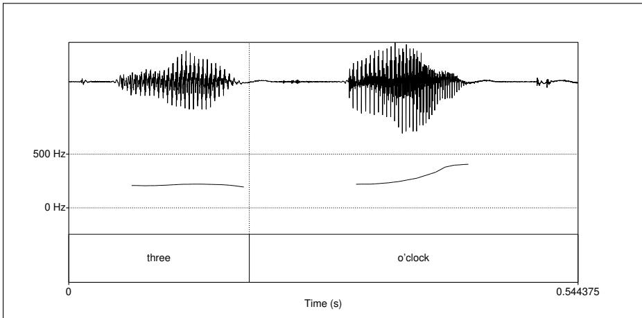  
Figure 15.13 Pitch track of the question “Three o’clock?”, shown below the wavefile. Note the rise in F0 at the end of the question. Note the lack of pitch trace during the very quiet part (the “o’” of “o’clock”; automatic pitch tracking is based on counting the pulses in the voiced regions, and doesn’t work if there is no voicing (or insufficient sound).

The vertical axis in Fig. 15.11 measures the amount of air pressure variation; pressure is force per unit area, measured in Pascals (Pa). A high value on the vertical axis (a high amplitude) indicates that there is more air pressure at that point in time, a zero value means there is normal (atmospheric) air pressure, and a negative value means there is lower than normal air pressure (rarefaction).

In addition to this value of the amplitude at any point in time, we also often need to know the average amplitude over some time range, to give us some idea of how great the average displacement of air pressure is. But we can’t just take the average of the amplitude values over a range; the positive and negative values would (mostly) cancel out, leaving us with a number close to zero. Instead, we generally use the RMS (root-mean-square) amplitude, which squares each number before averaging (making it positive), and then takes the square root at the end.

$$
\text { RMS   amplitude } _ {i = 1} ^ {N} = \sqrt {\frac {1}{N} \sum_ {i = 1} ^ {N} x _ {i} ^ {2}}\tag{15.6}
$$

The power of the signal is related to the square of the amplitude. If the number

of samples of a sound is N, the power is

$$
\text { Power } = \frac {1}{N} \sum_ {i = 1} ^ {N} x _ {i} ^ {2}\tag{15.7}
$$

Rather than power, we more often refer to the intensity of the sound, which normalizes the power to the human auditory threshold and is measured in dB. If $P _ { 0 }$ is the auditory threshold pressure (which is $2 \times 1 0 ^ { - 5 } \mathrm { P a } )$ , then intensity is defined as follows:

$$
\text { Intensity } = 1 0 \log_ {1 0} \frac {1}{N P _ {0}} \sum_ {i = 1} ^ {N} x _ {i} ^ {2}\tag{15.8}
$$

Figure 15.14 shows an intensity plot for the sentence “Is it a long movie?” from the CallHome corpus, again shown below the waveform plot.

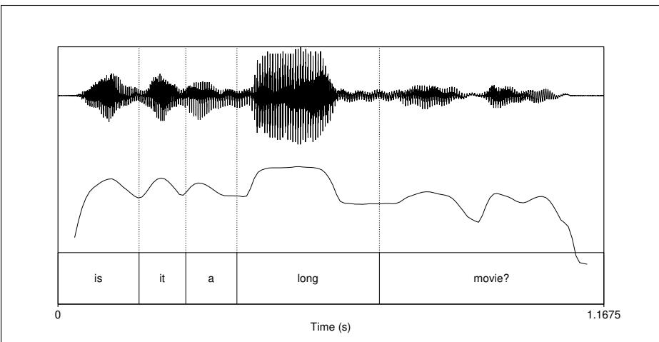  
Figure 15.14 Intensity plot for the sentence “Is it a long movie?”. Note the intensity peaks at each vowel and the especially high peak for the word long.

Two important perceptual properties, pitch and loudness, are related to frequency and intensity. The pitch of a sound is the mental sensation, or perceptual correlate, of fundamental frequency; in general, if a sound has a higher fundamental frequency we perceive it as having a higher pitch. We say “in general” because the relationship is not linear, since human hearing has different acuities for different frequencies. Roughly speaking, human pitch perception is most accurate between 100 Hz and 1000 Hz and in this range pitch correlates linearly with frequency. Human hearing represents frequencies above 1000 Hz less accurately, and above this range, pitch correlates logarithmically with frequency. Logarithmic representation means that the differences between high frequencies are compressed and hence not as accurately perceived. There are various psychoacoustic models of pitch perception scales. One common model is the mel scale (Stevens et al. 1937, Stevens and Volkmann 1940). A mel is a unit of pitch defined such that pairs of sounds which are perceptually equidistant in pitch are separated by an equal number of mels. The mel frequency m can be computed from the raw acoustic frequency as follows:

$$
m = 1 1 2 7 \ln (1 + \frac {f}{7 0 0})\tag{15.9}
$$

As we’ll see in Chapter 16, the mel scale plays an important role in speech recognition.

The loudness of a sound is the perceptual correlate of the power. So sounds with higher amplitudes are perceived as louder, but again the relationship is not linear. First of all, as we mentioned above when we defined µ-law compression, humans have greater resolution in the low-power range; the ear is more sensitive to small power differences. Second, it turns out that there is a complex relationship between power, frequency, and perceived loudness; sounds in certain frequency ranges are perceived as being louder than those in other frequency ranges.

Various algorithms exist for automatically extracting F0. In a slight abuse of terminology, these are called pitch extraction algorithms. The autocorrelation method of pitch extraction, for example, correlates the signal with itself at various offsets. The offset that gives the highest correlation gives the period of the signal. There are various publicly available pitch extraction toolkits; for example, an augmented autocorrelation pitch tracker is provided with Praat (Boersma and Weenink, 2005).

## 15.4.4 Interpretation of Phones from a Waveform

Much can be learned from a visual inspection of a waveform. For example, vowels are pretty easy to spot. Recall that vowels are voiced; another property of vowels is that they tend to be long and are relatively loud (as we can see in the intensity plot in Fig. 15.14). Length in time manifests itself directly on the x-axis, and loudness is related to (the square of) amplitude on the y-axis. We saw in the previous section that voicing is realized by regular peaks in amplitude of the kind we saw in Fig. 15.11, each major peak corresponding to an opening of the vocal folds. Figure 15.15 shows the waveform of the short sentence “she just had a baby”. We have labeled this waveform with word and phone labels. Notice that each of the six vowels in Fig. 15.15, [iy], [ax], [ae], [ax], [ey], [iy], all have regular amplitude peaks indicating voicing.

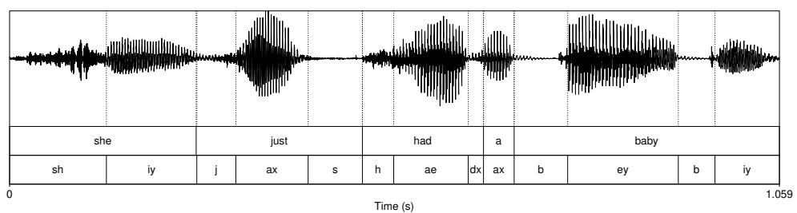  
Figure 15.15 A waveform of the sentence “She just had a baby” from the Switchboard corpus (conversation 4325). The speaker is female, was 20 years old in 1991, which is approximately when the recording was made, and speaks the South Midlands dialect of American English.

For a stop consonant, which consists of a closure followed by a release, we can often see a period of silence or near silence followed by a slight burst of amplitude. We can see this for both of the [b]’s in baby in Fig. 15.15.

Another phone that is often quite recognizable in a waveform is a fricative. Recall that fricatives, especially very strident fricatives like [sh], are made when a narrow channel for airflow causes noisy, turbulent air. The resulting hissy sounds have a noisy, irregular waveform. This can be seen somewhat in Fig. 15.15; it’s even clearer in Fig. 15.16, where we’ve magnified just the first word she.

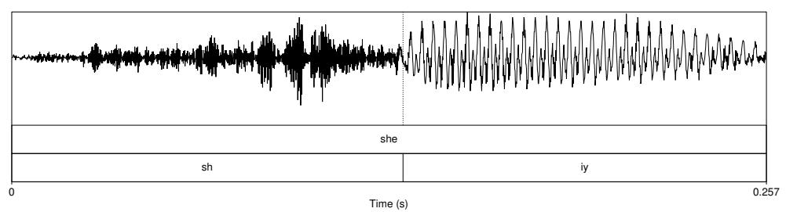  
Figure 15.16 A more detailed view of the first word “she” extracted from the wavefile in Fig. 15.15. Notice the difference between the random noise of the fricative [sh] and the regular voicing of the vowel [iy].

## 15.4.5 Spectra and the Frequency Domain

While some broad phonetic features (such as energy, pitch, and the presence of voicing, stop closures, or fricatives) can be interpreted directly from the waveform, most computational applications such as speech recognition (as well as human auditory processing) are based on a different representation of the sound in terms of its component frequencies. The insight of Fourier analysis is that every complex wave can be represented as a sum of many sine waves of different frequencies. Consider the waveform in Fig. 15.17. This waveform was created (in Praat) by summing two sine waveforms, one of frequency 10 Hz and one of frequency 100 Hz.

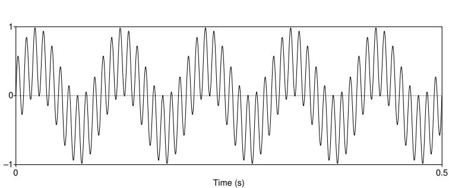  
Figure 15.17 A waveform that is the sum of two sine waveforms, one of frequency 10 Hz (note five repetitions in the half-second window) and one of frequency 100 Hz, both of amplitude 1.

We can represent these two component frequencies with a spectrum. The spectrum of a signal is a representation of each of its frequency components and their amplitudes. Figure 15.18 shows the spectrum of Fig. 15.17. Frequency in Hz is on the x-axis and amplitude on the y-axis. Note the two spikes in the figure, one at 10 Hz and one at 100 Hz. Thus, the spectrum is an alternative representation of the original waveform, and we use the spectrum as a tool to study the component frequencies of a sound wave at a particular time point.

Let’s look now at the frequency components of a speech waveform. Figure 15.19 shows part of the waveform for the vowel [ae] of the word had, cut out from the sentence shown in Fig. 15.15.

Note that there is a complex wave that repeats about ten times in the figure; but there is also a smaller repeated wave that repeats four times for every larger pattern (notice the four small peaks inside each repeated wave). The complex wave has a frequency of about 234 Hz (we can figure this out since it repeats roughly 10 times in .0427 seconds, and 10 cycles/.0427 seconds = 234 Hz).

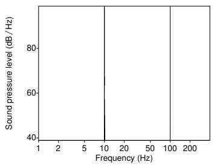  
Figure 15.18 The spectrum of the waveform in Fig. 15.17.

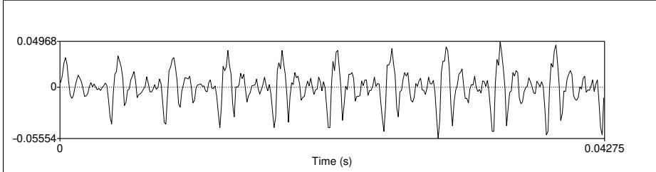  
Figure 15.19 The waveform of part of the vowel [ae] from the word had cut out from the waveform shown in Fig. 15.15.

The smaller wave then should have a frequency of roughly four times the frequency of the larger wave, or roughly 936 Hz. Then, if you look carefully, you can see two little waves on the peak of many of the 936 Hz waves. The frequency of this tiniest wave must be roughly twice that of the 936 Hz wave, hence 1872 Hz.

Figure 15.20 shows a smoothed spectrum for the waveform in Fig. 15.19, computed with a discrete Fourier transform (DFT).

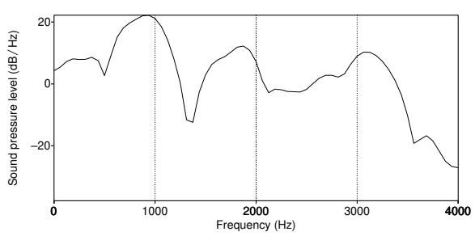  
Figure 15.20 A spectrum for the vowel [ae] from the word had in the waveform of She jus had a baby in Fig. 15.15.

The x-axis of a spectrum shows frequency, and the y-axis shows some measure of the magnitude of each frequency component (in decibels (dB), a logarithmic measure of amplitude that we saw earlier). Thus, Fig. 15.20 shows significant frequency components at around 930 Hz, 1860 Hz, and 3020 Hz, along with many other lower-magnitude frequency components. These first two components are just what we noticed in the time domain by looking at the wave in Fig. 15.19!

Why is a spectrum useful? It turns out that these spectral peaks that are easily visible in a spectrum are characteristic of different phones; phones have characteristic spectral “signatures”. Just as chemical elements give off different wavelengths of light when they burn, allowing us to detect elements in stars by looking at the spectrum of the light, we can detect the characteristic signature of the different phones by looking at the spectrum of a waveform. This use of spectral information is essential to both human and machine speech recognition. In human audition, the function of the cochlea, or inner ear, is to compute a spectrum of the incoming waveform. Similarly, the acoustic features used in speech recognition are spectral representations.

Let’s look at the spectrum of different vowels. Since some vowels change over time, we’ll use a different kind of plot called a spectrogram. While a spectrum shows the frequency components of a wave at one point in time, a spectrogram is a way of envisioning how the different frequencies that make up a waveform change over time. The x-axis shows time, as it did for the waveform, but the y-axis now shows frequencies in hertz. The darkness of a point on a spectrogram corresponds to the amplitude of the frequency component. Very dark points have high amplitude, light points have low amplitude. Thus, the spectrogram is a useful way of visualizing the three dimensions (time x frequency x amplitude).

Figure 15.21 shows spectrograms of three American English vowels, [ih], [ae], and [uh]. Note that each vowel has a set of dark bars at various frequency bands, slightly different bands for each vowel. Each of these represents the same kind of spectral peak that we saw in Fig. 15.19.

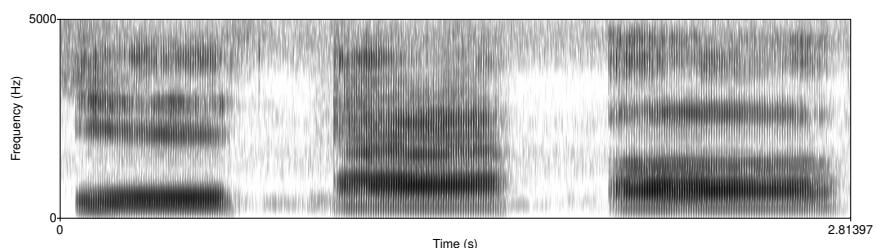  
Figure 15.21 Spectrograms for three American English vowels, [ih], [ae], and [uh]

Each dark bar (or spectral peak) is called a formant. As we discuss below, a formant is a frequency band that is particularly amplified by the vocal tract. Since different vowels are produced with the vocal tract in different positions, they will produce different kinds of amplifications or resonances. Let’s look at the first two formants, called F1 and F2. Note that F1, the dark bar closest to the bottom, is in a different position for the three vowels; it’s low for [ih] (centered at about 470 Hz) and somewhat higher for [ae] and [uh] (somewhere around 800 Hz). By contrast, F2, the second dark bar from the bottom, is highest for [ih], in the middle for [ae], and lowest for [uh].

We can see the same formants in running speech, although the reduction and coarticulation processes make them somewhat harder to see. Figure 15.22 shows the spectrogram of “she just had a baby”, whose waveform was shown in Fig. 15.15. F1 and F2 (and also F3) are pretty clear for the [ax] of just, the [ae] of had, and the [ey] of baby.

What specific clues can spectral representations give for phone identification? First, since different vowels have their formants at characteristic places, the spectrum can distinguish vowels from each other. We’ve seen that [ae] in the sample waveform had formants at 930 Hz, 1860 Hz, and 3020 Hz. Consider the vowel [iy] at the beginning of the utterance in Fig. 15.15. The spectrum for this vowel is shown in Fig. 15.23. The first formant of [iy] is 540 Hz, much lower than the first formant for [ae], and the second formant (2581 Hz) is much higher than the second formant for [ae]. If you look carefully, you can see these formants as dark bars in Fig. 15.22 just around 0.5 seconds.

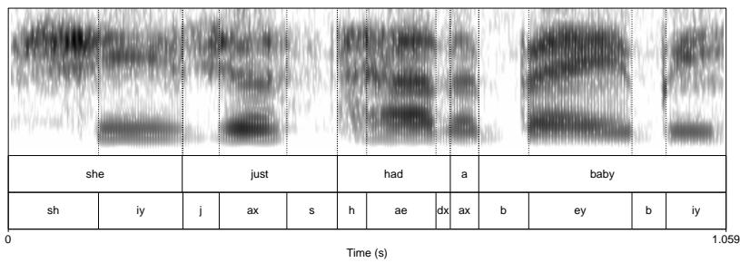  
Figure 15.22 A spectrogram of the sentence “she just had a baby” whose waveform was shown in Fig. 15.15. We can think of a spectrogram as a collection of spectra (time slices), like Fig. 15.20 placed end to end.

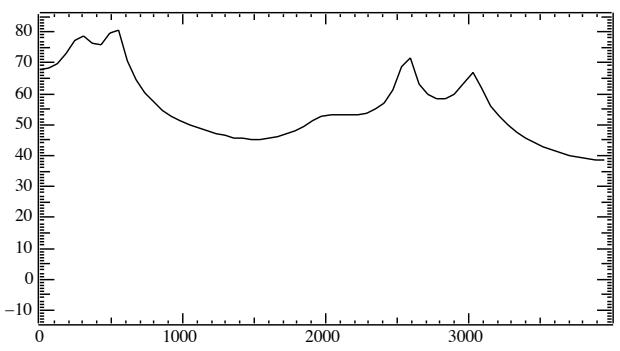  
Figure 15.23 A smoothed (LPC) spectrum for the vowel [iy] at the start of She just had a baby. Note that the first formant (540 Hz) is much lower than the first formant for [ae] shown in Fig. 15.20, and the second formant (2581 Hz) is much higher than the second formant for [ae].

The location of the first two formants (called F1 and F2) plays a large role in determining vowel identity, although the formants still differ from speaker to speaker. Higher formants tend to be caused more by general characteristics of a speaker’s vocal tract rather than by individual vowels. Formants also can be used to identify the nasal phones [n], [m], and [ng] and the liquids [l] and [r].

## 15.4.6 The Source-Filter Model

Why do different vowels have different spectral signatures? As we briefly mentioned above, the formants are caused by the resonant cavities of the mouth. The sourcefilter model is a way of explaining the acoustics of a sound by modeling how the pulses produced by the glottis (the source) are shaped by the vocal tract (the filter).

Let’s see how this works. Whenever we have a wave such as the vibration in air caused by the glottal pulse, the wave also has harmonics. A harmonic is another wave whose frequency is a multiple of the fundamental wave. Thus, for example, a

115 Hz glottal fold vibration leads to harmonics (other waves) of 230 Hz, 345 Hz, 460 Hz, and so on on. In general, each of these waves will be weaker, that is, will have much less amplitude than the wave at the fundamental frequency.

It turns out, however, that the vocal tract acts as a kind of filter or amplifier; indeed any cavity, such as a tube, causes waves of certain frequencies to be amplified and others to be damped. This amplification process is caused by the shape of the cavity; a given shape will cause sounds of a certain frequency to resonate and hence be amplified. Thus, by changing the shape of the cavity, we can cause different frequencies to be amplified.

When we produce particular vowels, we are essentially changing the shape of the vocal tract cavity by placing the tongue and the other articulators in particular positions. The result is that different vowels cause different harmonics to be amplified. So a wave of the same fundamental frequency passed through different vocal tract positions will result in different harmonics being amplified.

We can see the result of this amplification by looking at the relationship between the shape of the vocal tract and the corresponding spectrum. Figure 15.24 shows the vocal tract position for three vowels and a typical resulting spectrum. The formants are places in the spectrum where the vocal tract happens to amplify particular harmonic frequencies.

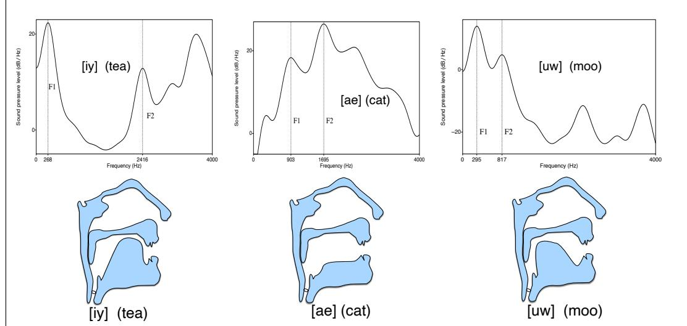  
Figure 15.24 Visualizing the vocal tract position as a filter: the tongue positions for three English vowels and the resulting smoothed spectra showing F1 and F2.

## 15.5 Feature Extraction for Speech Recognition: Log Mel Spectrum

The same tools that we used to analyze the acoustic phonetics of the waveforms are also often used as inputs to speech processing algorithms. In this section we introduce a signal processing pipeline that is often used as part of tasks like automatic speech recognition (ASR), as we will see in Chapter 16. The first step in speech processing is often to transform the input waveform into a sequence of acoustic feature vectors, each vector representing the information in a small time window of the signal. Sometimes speech recognition or processing algorithms will start with the waveform, in which case that processing is done by the convolutional networks (convnets) that we will introduce in Chapter 16.

Other systems begin instead at a higher level, with the log mel spectrum. So in this section we introduce this commonly used feature vector: sequences of log mel spectrum vectors. In the following section we’ll introduce an alternative vector, the MFCC representation. We’ll introduce these concepts at a relatively high level; a speech signal processing course is recommended for more details.

We begin by repeating from Section 15.4.2 the process of digitizing and quantizing an analog speech waveform.

## 15.5.1 Sampling and Quantization

The input to a speech recognizer is a complex series of changes in air pressure. These changes in air pressure obviously originate with the speaker and are caused by the specific way that air passes through the glottis and out the oral or nasal cavities. We represent sound waves by plotting the change in air pressure over time. One metaphor which sometimes helps in understanding these graphs is that of a vertical plate blocking the air pressure waves (perhaps in a microphone in front of a speaker’s mouth, or the eardrum in a hearer’s ear). The graph measures the amount of compression or rarefaction (uncompression) of the air molecules at this plate. Figure 15.25 (repeated from Fig. 15.11) shows a short segment of a waveform taken from the Switchboard corpus of telephone speech of the vowel [iy] from someone saying “she just had a baby”.

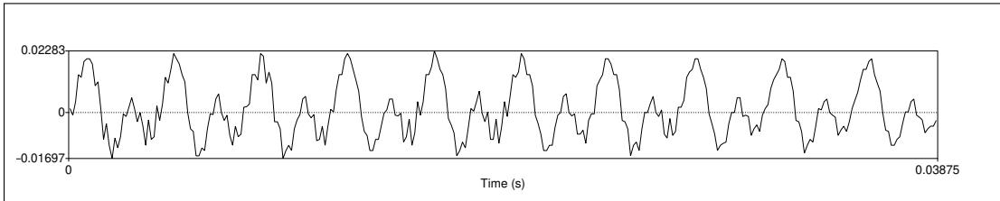  
Figure 15.25 A waveform of an instance of the vowel [iy] (the last vowel in the word “baby”). The y-axis shows the level of air pressure above and below normal atmospheric pressure. The x-axis shows time. Notice that the wave repeats regularly. Repeated from Fig. 15.11.

The first step in digitizing a sound wave like Fig. 15.11 is to convert the analog representations (first air pressure and then analog electric signals in a microphone) into a digital signal. This analog-to-digital conversion has two steps: sampling and quantization. To sample a signal, we measure its amplitude at a particular time; the sampling rate is the number of samples taken per second. To accurately measure a wave, we must have at least two samples in each cycle: one measuring the positive part of the wave and one measuring the negative part. More than two samples per cycle increases the amplitude accuracy, but fewer than two samples causes the frequency of the wave to be completely missed. Thus, the maximum frequency wave that can be measured is one whose frequency is half the sample rate (since every cycle needs two samples). This maximum frequency for a given sampling rate is called the Nyquist frequency. Most information in human speech is in frequencies below 10,000 Hz; thus, a 20,000 Hz sampling rate would be necessary for complete accuracy. But telephone speech is filtered by the switching network, and only frequencies less than 4,000 Hz are transmitted by telephones. Thus, an 8,000 Hz sampling rate is sufficient for telephone-bandwidth speech like the Switchboard corpus, while 16,000 Hz sampling is often used for microphone speech.

Although using higher sampling rates produces higher ASR accuracy, we can’t combine different sampling rates for training and testing ASR systems. Thus if we are testing on a telephone corpus like Switchboard (8 KHz sampling), we must downsample our training corpus to 8 KHz. Similarly, if we are training on multiple corpora and one of them includes telephone speech, we downsample all the wideband corpora to 8KHz.

Amplitude measurements are stored as integers, either 8 bit (values from -128– 127) or 16 bit (values from -32768–32767). This process of representing real-valued numbers as integers is called quantization; all values that are closer together than the minimum granularity (the quantum size) are represented identically. We refer to each sample at time index n in the digitized, quantized waveform as x[n].

Once data is quantized, it is stored in various formats. One parameter of these formats is the sample rate and sample size discussed above; telephone speech is often sampled at 8 kHz and stored as 8-bit samples, and microphone data is often sampled at 16 kHz and stored as 16-bit samples. Another parameter is the number of channels. For stereo data or for two-party conversations, we can store both channels in the same file or we can store them in separate files. A final parameter is individual sample storage—linearly or compressed. One common compression format used for telephone speech is $\mu { \mathrm { - } } \ l { \mathrm { a w } }$ (often written u-law but still pronounced mu-law). The intuition of log compression algorithms like µ-law is that human hearing is more sensitive at small intensities than large ones; the log represents small values with more faithfulness at the expense of more error on large values. The linear (unlogged) values are generally referred to as linear PCM values (PCM stands for pulse code modulation, but never mind that). Here’s the equation for compressing a linear PCM sample value x to 8-bit µ-law, (where $\mu { = } 2 5 5$ for 8 bits):

$$
F (x) = \frac {\operatorname{sgn} (x) \log (1 + \mu | x |)}{\log (1 + \mu)} - 1 \leq x \leq 1\tag{15.10}
$$

## 15.5.2 Windowing

From the digitized, quantized representation of the waveform, we need to extract spectral features from a small window of speech that characterizes part of a particular phoneme. Inside this small window, we can roughly think of the signal as stationary (that is, its statistical properties are constant within this region). (By contrast, in general, speech is a non-stationary signal, meaning that its statistical properties are not constant over time). We extract this roughly stationary portion of speech by using a window which is non-zero inside a region and zero elsewhere, running this window across the speech signal and multiplying it by the input waveform to produce a windowed waveform.

The speech extracted from each window is called a frame. The windowing is characterized by three parameters: the window size or frame size of the window (its width in milliseconds), the frame stride, (also called shift or offset) between successive windows, and the shape of the window.

To extract the signal we multiply the value of the signal at time $n , s [ n ]$ by the value of the windowing function at time $n , w [ n ]$ :

$$
y [ n ] = w [ n ] s [ n ]\tag{15.11}
$$

The window shape sketched in Fig. 15.26 is rectangular; you can see the extracted windowed signal looks just like the original signal. The rectangular window, however, abruptly cuts off the signal at its boundaries, which creates problems when we do Fourier analysis. For this reason, for acoustic feature creation we more commonly use the Hamming window, which shrinks the values of the signal toward zero at the window boundaries, avoiding discontinuities. Figure 15.27 shows both; the equations are as follows (assuming a window that is L frames long):

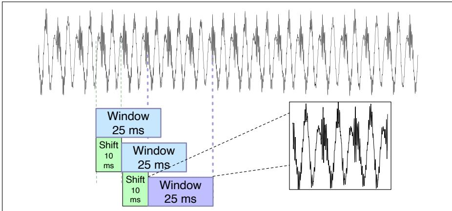  
Figure 15.26 Windowing, showing a 25 ms rectangular window with a 10ms stride.

$$
\begin{array}{l l} \text {rectangular} & w [ n ] = \left\{ \begin{array}{l l} 1 & 0 \leq n \leq L - 1 \\ 0 & \text {otherwise} \end{array} \right. \\ \text {Hamming} & w [ n ] = \left\{ \begin{array}{l l} 0. 5 4 - 0. 4 6 \cos (\frac {2 \pi n}{L}) & 0 \leq n \leq L - 1 \\ 0 & \text {otherwise} \end{array} \right. \end{array}\tag{15.12}
$$

(15.13)

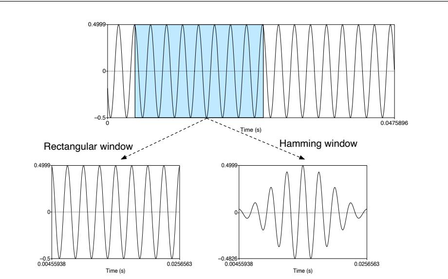  
Figure 15.27 Windowing a sine wave with the rectangular or Hamming windows.

## 15.5.3 Discrete Fourier Transform

The next step is to extract spectral information for our windowed signal; we need to know how much energy the signal contains at different frequency bands. The tool for extracting spectral information for discrete frequency bands for a discrete-time (sampled) signal is the discrete Fourier transform or DFT.

The input to the DFT is a windowed signal x[n]...x[m], and the output, for each of N discrete frequency bands, is a complex number X[k] representing the magnitude and phase of that frequency component in the original signal. If we plot the magnitude against the frequency, we can visualize the spectrum (see Chapter 15 for more on spectra). For example, Fig. 15.28 shows a 25 ms Hamming-windowed portion of a signal and its spectrum as computed by a DFT (with some additional smoothing).

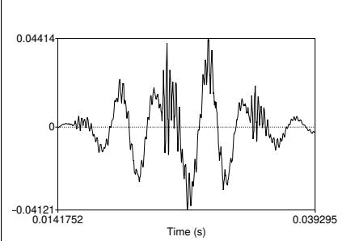  
(a)

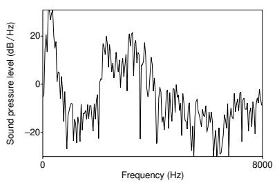  
(b)  
Figure 15.28 (a) A 25 ms Hamming-windowed portion of a signal from the vowel [iy] and (b) its spectrum computed by a DFT.

We do not introduce the mathematical details of the DFT here, except to note that Fourier analysis relies on Euler’s formula, with j as the imaginary unit:

$$
e ^ {j \theta} = \cos \theta + j \sin \theta\tag{15.14}
$$

As a brief reminder for those students who have already studied signal processing, the DFT is defined as follows:

$$
X [ k ] = \sum_ {n = 0} ^ {N - 1} x [ n ] e ^ {- j \frac {2 \pi}{N} k n}\tag{15.15}
$$

A commonly used algorithm for computing the DFT is the fast Fourier transform or FFT. This implementation of the DFT is very efficient but only works for values of N that are powers of 2.

## 15.5.4 Mel Filter Bank and Log

The results of the FFT tell us the energy at each frequency band. Human hearing, however, is not equally sensitive at all frequency bands; it is less sensitive at higher frequencies. This bias toward low frequencies helps human recognition, since information in low frequencies (like formants) is crucial for distinguishing vowels or nasals, while information in high frequencies (like stop bursts or fricative noise) is less crucial for successful recognition. Modeling this human perceptual property improves speech recognition performance in the same way.

We implement this intuition by collecting energies, not equally at each frequency band, but according to the mel scale, an auditory frequency scale. A mel (Stevens et al. 1937, Stevens and Volkmann 1940) is a unit of pitch. Pairs of sounds that are perceptually equidistant in pitch are separated by an equal number of mels. The mel frequency m can be computed from the raw acoustic frequency by a log transformation:

$$
m e l (f) = 1 1 2 7 \ln (1 + \frac {f}{7 0 0})\tag{15.16}
$$

We implement this intuition by creating a bank of filters that collect energy from each frequency band, spread logarithmically so that we have very fine resolution at low frequencies, and less resolution at high frequencies. Figure 15.29 shows a sample bank of triangular filters that implement this idea, that can be multiplied by the spectrum to get a mel spectrum.

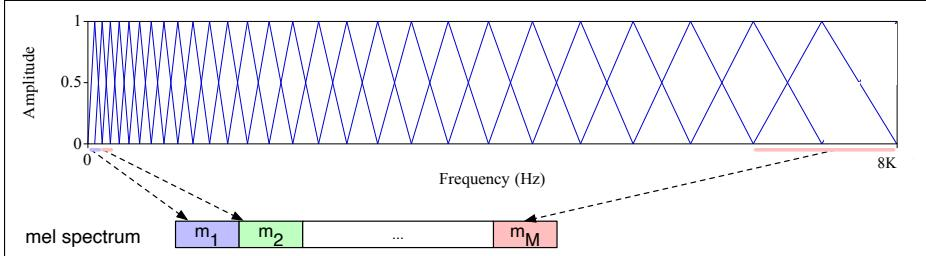  
Figure 15.29 The mel filter bank (Davis and Mermelstein, 1980). Each triangular filter, spaced logarithmically along the mel scale, collects energy from a given frequency range.

Finally, we take the log of each of the mel spectrum values. The human response to signal level is logarithmic (like the human response to frequency). Humans are less sensitive to slight differences in amplitude at high amplitudes than at low amplitudes. In addition, using a log makes the feature estimates less sensitive to variations in input such as power variations due to the speaker’s mouth moving closer or further from the microphone.

We call each scalar output from a particular filter a channel, and so the output for each input frame from the filterbank is a vector of, say 80 or 128 channels, each of which represents the log energy of a particular (mel-spaced) frequency band.

Before we send this log mel channel vector to the downstream neural network layers, it’s common for speech systems to rescale them so they have comparable ranges. A common type of normalization for speech is to scale the input to be between -1 and 1 with zero mean across the entire pretraining dataset (see Section 4.3.2 in Chapter 4).

## 15.6 MFCC: Mel Frequency Cepstral Coefficients

MFCC The MFCC, mel frequency cepstral coefficients, is a useful representation of the waveform that emphasizes aspects of the signal that are relevant for detection of phonetic units. The MFCC is a 39-dimensional feature vector consisting of:

<table><tr><td>12 cepstral coefficients</td><td>1 energy coefficient</td></tr><tr><td>12 delta cepstral coefficients</td><td>1 delta energy coefficient</td></tr><tr><td>12 double delta cepstral coefficients</td><td>1 double delta energy coefficient</td></tr></table>

Below we sketch how these features are computed; students interested in more detail are encouraged to follow up with a signal processing course.

## The Cepstrum: Inverse Discrete Fourier Transform

MFCC coefficients are based on the cepstrum. One way to think about the cepstrum is as a useful way of separating the source and filter. Recall from Section 15.4.6 that the speech waveform is created when a glottal source waveform of a particular fundamental frequency is passed through the vocal tract, which because of its shape has a particular filtering characteristic. But many characteristics of the glottal source (its fundamental frequency, the details of the glottal pulse, etc.) are not important for distinguishing different phones. Instead, the most useful information for phone detection is the filter, that is, the exact position of the vocal tract. If we knew the shape of the vocal tract, we would know which phone was being produced. This suggests that useful features for phone detection would find a way to deconvolve (separate) the source and filter and show us only the vocal tract filter. It turns out that the cepstrum is one way to do this.

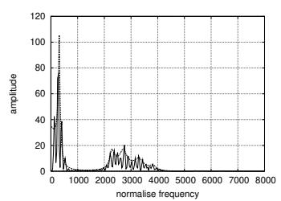  
(a)

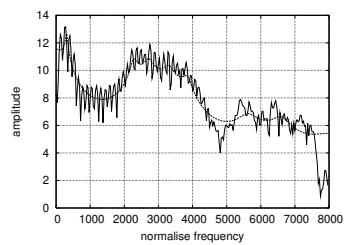  
(b)

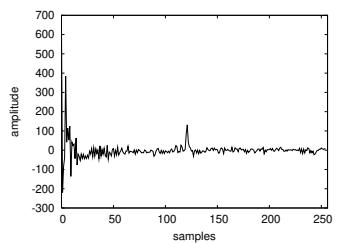  
(c)  
Figure 15.30 The magnitude spectrum (a), log magnitude spectrum (b), and cepstrum (c), from Taylor (2009), by permission. The two spectra have a smoothed spectral envelope laid on top to help visualize the spectrum.

For simplicity, let’s consider as input the log magnitude spectrum and ignore the mel scaling. The cepstrum can be thought of as the spectrum of the log of the spectrum. This may sound confusing. But let’s begin with the easy part: the log of the spectrum. That is, the cepstrum begins with a standard magnitude spectrum, such as the one for a vowel shown in Fig. 15.30(a) from Taylor (2009). We then take the log, that is, replace each amplitude value in the magnitude spectrum with its log, as shown in Fig. 15.30(b).

The next step is to visualize the log spectrum as if itself were a waveform. In other words, consider the log spectrum in Fig. 15.30(b). Let’s imagine removing the axis labels that tell us that this is a spectrum (frequency on the x-axis) and imagine that we are dealing with just a normal speech signal with time on the x-axis. What can we now say about the spectrum of this “pseudo-signal”? Notice that there is a high frequency repetitive component in this wave: small waves that repeat about 8 times in each 1000 along the x-axis, for a frequency of about 120 Hz. This high frequency component is caused by the fundamental frequency of the signal and represents the little peaks in the spectrum at each harmonic of the signal. In addition, there are some lower frequency components in this “pseudo-signal”; for example, the envelope or formant structure has about four large peaks in the window, for a much lower frequency.

Figure 15.30(c) shows the cepstrum: the spectrum that we have been describing of the log spectrum. This cepstrum (the word cepstrum is formed by reversing the first four letters of spectrum) is shown with samples along the x-axis. This is because by taking the spectrum of the log spectrum, we have left the frequency domain of the spectrum, and gone back to the time domain. It turns out that the

correct unit of a cepstrum is the sample.

Examining this cepstrum, we see that there is indeed a large peak around 120, corresponding to the F0 and representing the glottal pulse. There are other various components at lower values on the x-axis. These represent the vocal tract filter (the position of the tongue and the other articulators). Thus, if we are interested in detecting phones, we can make use of just the lower cepstral values. If we are interested in detecting pitch, we can use the higher cepstral values.

For the purposes of MFCC extraction, we generally just take the first 12 cepstral values. These 12 coefficients will represent information solely about the vocal tract filter, cleanly separated from information about the glottal source.

It turns out that cepstral coefficients have the extremely useful property that the variance of the different coefficients tends to be uncorrelated. This is not true for the spectrum, where spectral coefficients at different frequency bands are correlated.

For those who have had signal processing, the cepstrum is more formally defined as the inverse DFT of the log magnitude of the DFT of a signal; hence, for a windowed frame of speech x[n],

$$
c [ n ] = \sum_ {n = 0} ^ {N - 1} \log \left(\left| \sum_ {n = 0} ^ {N - 1} x [ n ] e ^ {- j \frac {2 \pi}{N} k n} \right|\right) e ^ {j \frac {2 \pi}{N} k n}\tag{15.17}
$$

Energy To the 12 cepstral coefficients from the prior section we add a 13th feature: the energy from the frame. Energy is a useful cue for phone detection (for example vowels and sibilants have more energy than stops). The energy in a frame is the sum over time of the power of the samples in the frame; thus, for a signal x in a window from time sample $t _ { 1 }$ to time sample $t _ { 2 }$ , the energy is

$$
E n e r g y = \sum_ {t = t _ {1}} ^ {t _ {2}} x ^ {2} [ t ]\tag{15.18}
$$

Delta features We also add features related to the change in cepstral features over time. Changes in the speech signal, like the slope of a formant at its transitions, or the change from a stop closure to stop burst, can again provide a useful cue for phone identity. To each of the 13 features (12 cepstral features plus energy) a delta or velocity feature and a double delta or acceleration feature. Each of the 13 delta features represents the change between frames in the corresponding cepstral/energy feature, and each of the 13 double delta features represents the change between frames in the corresponding delta features. These deltas can be simply computed by just subtracting the value at a frame from the prior value, but in practice it’s common to fit a polynomial and take its first and second derivative.

## 15.7 Summary

This chapter has introduced many of the important concepts of phonetics and computational phonetics.

• We can represent the pronunciation of words in terms of units called phones. The standard system for representing phones is the International Phonetic Alphabet or IPA. The most common computational system for transcription of English is the ARPAbet, which conveniently uses ASCII symbols.

• Phones can be described by how they are produced articulatorily by the vocal organs; consonants are defined in terms of their place and manner of articulation and voicing; vowels by their height, backness, and roundness.

• Speech sounds can also be described acoustically. Sound waves can be described in terms of frequency, amplitude, or their perceptual correlates, pitch and loudness.

• The spectrum of a sound describes its different frequency components. While some phonetic properties are recognizable from the waveform, both humans and machines rely on spectral analysis for phone detection.

• A spectrogram is a plot of a spectrum over time. Vowels are described by characteristic harmonics called formants.

## Historical Notes

The major insights of articulatory phonetics date to the linguists of 800–150 B.C. India. They invented the concepts of place and manner of articulation, worked out the glottal mechanism of voicing, and understood the concept of assimilation. European science did not catch up with the Indian phoneticians until over 2000 years later, in the late 19th century. The Greeks did have some rudimentary phonetic knowledge; by the time of Plato’s Theaetetus and Cratylus, for example, they distinguished vowels from consonants, and stop consonants from continuants. The Stoics developed the idea of the syllable and were aware of phonotactic constraints on possible words. An unknown Icelandic scholar of the 12th century exploited the concept of the phoneme and proposed a phonemic writing system for Icelandic, including diacritics for length and nasality. But his text remained unpublished until 1818 and even then was largely unknown outside Scandinavia (Robins, 1967). The modern era of phonetics is usually said to have begun with Sweet, who proposed what is essentially the phoneme in his Handbook ofPhonetics 1877. He also devised an alphabet for transcription and distinguished between broad and narrow transcription, proposing many ideas that were eventually incorporated into the IPA. Sweet was considered the best practicing phonetician of his time; he made the first scientific recordings of languages for phonetic purposes and advanced the state of the art of articulatory description. He was also infamously difficult to get along with, a trait that is well captured in Henry Higgins, the stage character that George Bernard Shaw modeled after him. The phoneme was first named by the Polish scholar Baudouin de Courtenay, who published his theories in 1894.

Introductory phonetics textbooks include Ladefoged (1993) and Clark and Yallop (1995). Wells (1982) is the definitive three-volume source on dialects of English.

Many of the classic insights in acoustic phonetics had been developed by the late 1950s or early 1960s; just a few highlights include techniques like the sound spectrograph (Koenig et al., 1946), theoretical insights like the working out of the source-filter theory and other issues in the mapping between articulation and acoustics ((Fant, 1960), Stevens et al. 1953, Stevens and House 1955, Heinz and Stevens 1961, Stevens and House 1961) the F1xF2 space of vowel formants (Peterson and Barney, 1952), the understanding of the phonetic nature of stress and the use of duration and intensity as cues (Fry, 1955), and a basic understanding of issues in phone perception (Miller and Nicely 1955,Liberman et al. 1952). Lehiste (1967) is a collection of classic papers on acoustic phonetics. Many of the seminal papers of Gunnar Fant have been collected in Fant (2004).

Speech feature-extraction algorithms were developed in the 1960s and early 1970s, including the efficient fast Fourier transform (FFT) (Cooley and Tukey, 1965), the application of cepstral processing to speech (Oppenheim et al., 1968), and the development of LPC for speech coding (Atal and Hanauer, 1971).

Excellent textbooks on acoustic phonetics include Johnson (2003) and Ladefoged (1996). Coleman (2005) includes an introduction to computational processing of acoustics and speech from a linguistic perspective. Stevens (1998) lays out an influential theory of speech sound production. There are a number of software packages for acoustic phonetic analysis. Many of the figures in this book were generated by the Praat package (Boersma and Weenink, 2005), which includes pitch, spectral, and formant analysis, as well as a scripting language.

## Exercises

15.1 Find the mistakes in the ARPAbet transcriptions of the following words:

a. “three” [dh r i] d. “study” [s t uh d i] g. “slight” [s l iy t] b. “sing” [s ih n g] e. “though” [th ow] c. “eyes” [ay s] f. “planning” [p pl aa n ih ng]

15.2 Ira Gershwin’s lyric for Let’s Call the Whole Thing Off talks about two pronunciations (each) of the words “tomato”, “potato”, and “either”. Transcribe into the ARPAbet both pronunciations of each of these three words.

15.3 Transcribe the following words in the ARPAbet:

1. dark 2. suit 3. greasy 4. wash 5. water

15.4 Take a wavefile of your choice. Some examples are on the textbook website. Download the Praat software, and use it to transcribe the wavefiles at the word level and into ARPAbet phones, using Praat to help you play pieces of each wavefile and to look at the wavefile and the spectrogram.

15.5 Record yourself saying five of the English vowels: [aa], [eh], [ae], [iy], [uw]. Find F1 and F2 for each of your vowels.