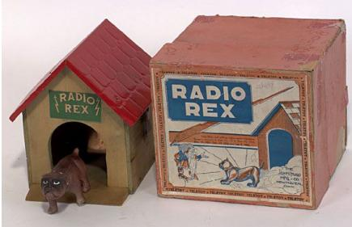
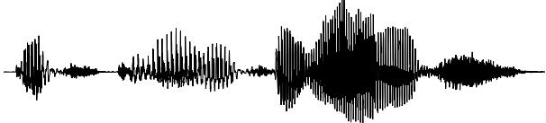
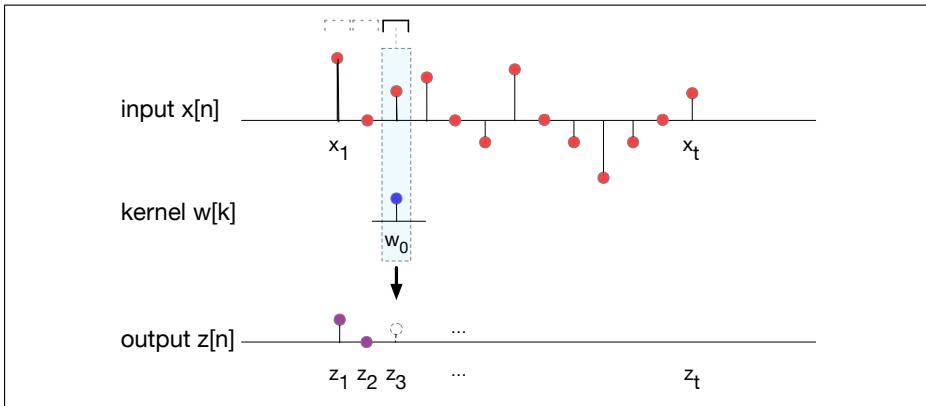
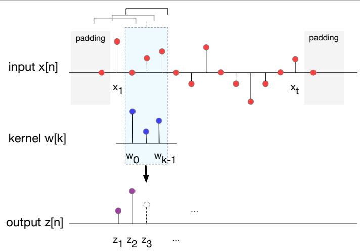
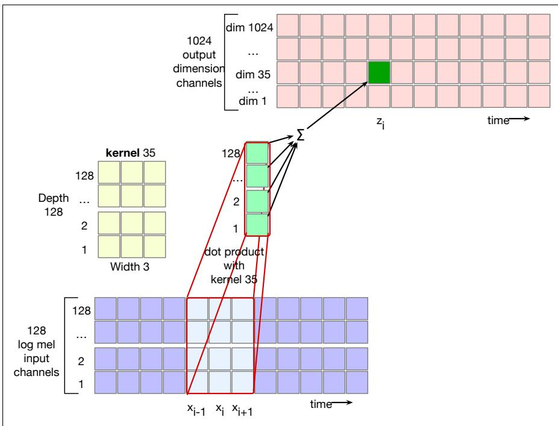
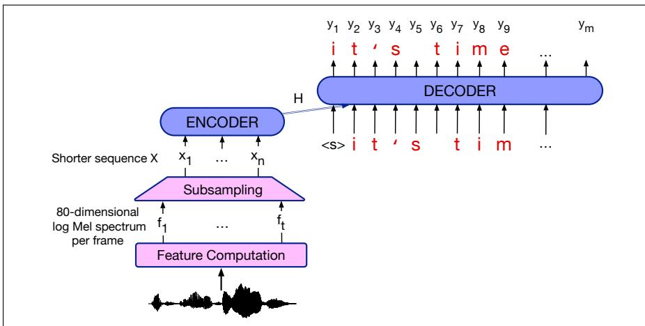
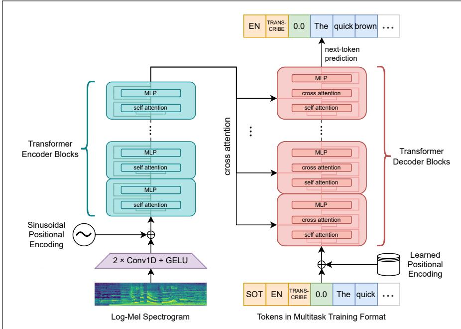
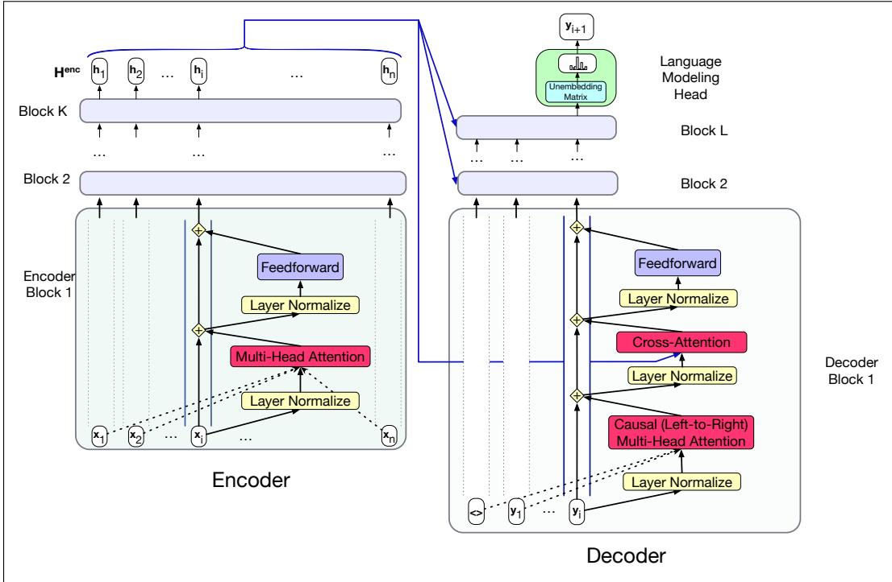
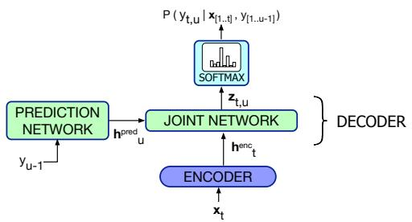

16

# Automatic Speech Recognition

I KNOW not whether

I see your meaning: if I do, it lies

Upon the wordy wavelets of your voice,

Dim as an evening shadow in a brook,

Thomas Lovell Beddoes, 1851

Understanding spoken language, or at least transcribing the words into writing, is one of the earliest goals of computer language processing. In fact, speech processing

predates the computer by many decades! The first machine that recognized speech was a toy from the 1920s. “Radio Rex”, shown to the right, was a celluloid dog that moved (by means of a spring) when the spring was released by 500 Hz acoustic energy. Since 500 Hz is roughly the first formant of the vowel [eh] in “Rex”, Rex seemed to come when he was called (David, Jr. and Selfridge, 1962).

In modern times, we expect more of our automatic systems. The task of automatic speech recognition (ASR) is to map any waveform like this:

to the appropriate string of words:

## It’s time for lunch!

Automatic transcription of speech by any speaker in any environment is still far from solved, but ASR technology has matured to the point where it is now viable for many practical tasks. Speech is a natural interface for communicating with appliances, or with digital assistants or chatbots, especially on cellphones, where keyboards are less convenient. ASR is also useful for general transcription, for example for automatically generating captions for audio or video text (transcribing movies or videos or live discussions). Transcription is important in fields like law where dictation plays an important role. Finally, ASR is important as part of augmentative communication (interaction between computers and humans with some disability resulting in difficulties or inabilities in typing or audition). The blind Milton famously dictated Paradise Lost to his daughters, and Henry James dictated his later novels after a repetitive stress injury.

In the next sections we’ll introduce the various goals of the ASR task, describe how acoustic features are extracted, and introduce the convolutional neural net architecture which is commonly used as an initial layer in speech recognition tasks.

We’ll then introduce two families of methods for ASR. The first is the encoderdecoder paradigm, and we’ll introduce the baseline attention-based encoder decoder algorithm, sometimes called Listen Attend and Spell after an early implementation. We’ll also introduce a more advanced encoder-decoder system, OpenAI’s Whisper system (Radford et al., 2023) as well an open system based on the same architecture, OWSM (the Open Whisper-style Speech Model) (Peng et al., 2023). (These models have additional capabilities including translation, as we’ll discuss later). The second is the use of self-supervised speech models (sometimes called SSL for selfsupervised learning) like Wav2Vec2.0 or HuBERT, which are encoders that learn abstract representations of speech that can be used for ASR by pairing them with the CTC loss function for decoding.

We’ll conclude with the standard word error rate metric used to evaluate ASR.

## 16.1 The Automatic Speech Recognition Task

Before describing algorithms for ASR, let’s talk about how the ASR task itself varies. One dimension of variation is vocabulary size. Some ASR tasks have long been solved with extremely high accuracy, like those with a 2-word vocabulary (yes versus no) or an 11 word vocabulary like digit recognition (recognizing sequences of digits including zero to nine plus oh). Open-ended tasks like accurately transcribing videos or human conversations, with large vocabularies of 60,000 or more words, are much harder.

A second dimension of variation is who the speaker is talking to. Humans speaking to machines (either dictating or talking to a dialogue system) are easier to recognize than humans speaking to humans. Read speech, in which humans are reading out loud, for example in audio books, is also relatively easy to recognize. Recognizing the speech of two humans talking to each other in conversational speech, for example, for transcribing a business meeting, is the hardest. It seems that when humans talk to machines, or read without an audience present, they simplify their speech quite a bit, talking more slowly and more clearly.

A third dimension of variation is channel and noise. Speech is easier to recognize if it’s recorded in a quiet room with head-mounted microphones than if it’s recorded by a distant microphone on a noisy city street, or in a car with the window open.

A final dimension of variation is accent or speaker-class characteristics. Speech is easier to recognize if the speaker is speaking the same dialect or variety that the system was trained on. Speech by speakers of regional or ethnic dialects, or speech by children can be quite difficult to recognize if the system is only trained on speakers of standard dialects, or only adult speakers.

A number of publicly available corpora with human-created transcripts are used to create ASR test and training sets to explore this variation; we mention a few of them here since you will encounter them in the literature. LibriSpeech is a large open-source read-speech 16 kHz dataset with over 1000 hours of audio books from the LibriVox project, which has volunteers read and record copyright-free books (Panayotov et al., 2015). It has transcripts aligned at the sentence level. It is divided into an easier (“clean”) and a more difficult portion (“other”) with the clean portion of higher recording quality and with accents closer to US English. The division was done when the corpus was first released by running a speech recognizer (trained on read speech from the Wall Street Journal) on all the audio, computing the word error rate (WER, formally defined below) for each speaker based on the gold transcripts, and dividing the speakers roughly in half, with recordings from lower-WER speakers called “clean” and recordings from higher-WER speakers “other”.

The Switchboard corpus of prompted telephone conversations between strangers was collected in the early 1990s; it contains 2430 conversations averaging 6 minutes each, totaling 240 hours of 8 kHz speech and about 3 million words (Godfrey et al., 1992). Switchboard has the singular advantage of an enormous amount of auxiliary hand-done linguistic labeling, including parses, dialogue act tags, phonetic and prosodic labeling, and discourse and information structure. The CALLHOME corpus was collected in the late 1990s and consists of 120 unscripted 30-minute telephone conversations between native speakers of English who were usually close friends or family (Canavan et al., 1997).

A variety of corpora try to include input that is more natural. The CHiME Challenge is a series of difficult shared tasks with corpora that deal with robustness in ASR. The CHiME 6 task, for example, is ASR of conversational speech in real home environments (specifically dinner parties). The corpus contains recordings of twenty different dinner parties in real homes, each with four participants, and in three locations (kitchen, dining area, living room), recorded with distant microphones.

The AMI Meeting Corpus contains 100 hours of recorded group meetings (some natural meetings, some specially organized), with manual transcriptions and some additional hand-labels (Renals et al., 2007). CORAAL is a collection of over 150 sociolinguistic interviews with African American speakers, with the goal of studying African American English (AAE), the many variations of language used in African American communities and others (Kendall and Farrington, 2020). The interviews are anonymized with transcripts aligned at the utterance level.

There are a wide variety of corpora available in other languages. In Chinese, for example, the HKUST Mandarin Telephone Speech corpus has 1206 transcribed ten-minute telephone conversations between speakers of Mandarin across China including conversations between friends and between strangers (Liu et al., 2006). The AISHELL-1 corpus contains 170 hours of Mandarin read speech of sentences taken from various domains, read by different speakers mainly from northern China (Bu et al., 2017).

Finally, there are many multilingual corpora. Common Voice (Ardila et al., 2020) is a freely available crowd-sourced corpus of transcribed read speech, stored in MPEG-3 format and designed for ASR. Crowd-working volunteers record themselves reading scripted speech, with scripts often extracted from Wikipedia articles. The recordings are then verified by other contributors. As of the writing of this chapter, Common Voice includes 33,150 hours of speech from 133 languages. FLEURS (Conneau et al., 2023) is a parallel speech dataset, built on the MT benchmark FLoRes-101 (Goyal et al., 2022), which has 3001 sentences extracted from English Wikipedia and translated into 101 other languages by human translators. For a subset of 2009 of the sentences in each of the 102 languages, FLEURS has recordings of 3 different native speakers reading the sentence, in total about 12 hours of speech per language.

Figure 16.1 shows the rough percentage of incorrect words (the word error rate, or WER, defined on page 378) from roughly state-of-the-art systems as of the time of this writing on some of these tasks. Note that the error rate on English read speech (like the LibriSpeech clean audiobook corpus) is around 2% ; transcription of speech read in English is highly accurate. By contrast, the error rate for transcribing conversations between humans is higher; 5.8 to 11% for the Switchboard and CALLHOME corpora or AMI meetings. The error rate is higher yet again for speakers of varieties like African American English, and yet again for difficult conversational tasks like transcription of 4-speaker dinner party speech, which can have error rates as high as 25.5%. Character error rates (CER) are also higher for Mandarin natural conversation than for Mandarin read speech. Error rates are even higher for lower resource languages; we’ve shown a handful of examples.

<table><tr><td>English Tasks</td><td>WER%</td></tr><tr><td>LibriSpeech audiobooks 960hour clean</td><td>1.4</td></tr><tr><td>LibriSpeech audiobooks 960hour other</td><td>2.6</td></tr><tr><td>Switchboard telephone conversations between strangers</td><td>5.8</td></tr><tr><td>CALLHOME telephone conversations between family</td><td>11</td></tr><tr><td>AMI meetings</td><td>11</td></tr><tr><td>Sociolinguistic interviews, CORAAL (AAE)</td><td>16.2</td></tr><tr><td>CHiME6 dinner parties with distant microphones</td><td>25.5</td></tr><tr><td>Sample tasks in other languages</td><td>WER%</td></tr><tr><td>Common Voice 15 Vietnamese</td><td>39.8</td></tr><tr><td>Common Voice 15 Swahili</td><td>51.2</td></tr><tr><td>FLEURS Bengali</td><td>50</td></tr><tr><td>Chinese (Mandarin) Tasks</td><td>CER%</td></tr><tr><td>AISHELL-1 Mandarin read speech corpus</td><td>3.9</td></tr><tr><td>HKUST Mandarin Chinese telephone conversations</td><td>18.5</td></tr></table>

Figure 16.1 Rough Word Error Rates (WER = % of words misrecognized) reported around 2023-4 for ASR on various American English and other language recognition tasks, and character error rates (CER) for two Chinese recognition tasks.

## 16.2 Convolutional Neural Networks

CNN The convolutional neural network, or CNN (and sometimes shortened as convnet), is a network architecture that is particularly useful for extracting features in speech and vision applications. A convolutional layer for speech takes as input a representation of the audio input (either as the raw audio or as Mel spectra) and produces as output a sequence of latent representations of the input speech. In ASR systems like Whisper, wav2vec2.0, or HuBERT, convolutional layers are stacked as an initial set of layers producing speech representations that are then passed to transformer layers.

A standard feedforward layer is fully connected; every input is connected to every output. By contrast, a convolutional network makes use of the idea of a kernel, a kind of smaller network that we pass over the input. For example in image classification tasks, we pass the kernel horizontally and vertically over the image to recognize visual features, and so we describe a visual as a 2d (for 2 dimensional) convolutional network. For speech, we will slide our kernel over the signal in the time dimension to extract speech features, so CNNs for speech are 1d convolutional networks.

Let’s flesh out this intuition a bit more. We’ll start with a very schematic version of a convolutional layer that takes as input a single sequence of vectors x1 ...xt and produces as output a single sequence of vectors $\mathbf { z } _ { 1 } \ldots \mathbf { z } _ { t }$ , of the same length t. Afterwards we’ll see how to deal with more complex inputs and outputs.

A CNN uses a kernel, a small vector of weights $\pmb { w } _ { 1 } \ldots \pmb { w } _ { k }$ , to extract features. It does this by convolving this kernel with the input. The convolution of a kernel with

a signal has 3 steps:

1. Flip the kernel left-to-right

2. Pass the kernel frame by frame (temporally) across the input

• At each frame computing the dot product of the kernel with the local input values

3. The output is the resulting sequence of dot products

We can think of the convolution process as finding regions in the signal that are similar to the kernel, since the dot product is high when two vectors are similar. The convolution operation is represented by the \* operator (an unfortunate overloading of this symbol that also refers to simple multiplication). Let’s see how to compute $\mathbf { x } * \mathbf { w } ,$ , the convolution of a single vector x with a kernel vector w. Let’s first think about the simple case of a kernel width of 1. We compute each output element $\mathbf { z } _ { j }$ as the product of the kernel with $\mathbf { x } _ { j } \mathbf { : }$

$$
\text { convolution   with   width - 1   kernel: } \quad \mathbf {z} _ {j} = \mathbf {x} _ {j} \mathbf {w} _ {0} \quad \forall j: 1 \leq j \leq t\tag{16.1}
$$

Fig. 16.2 shows an intuition of this computation.  
  
Figure 16.2 A schematic view of convolution with a kernel (filter) w whose width is 1. The kernel is walked across the input, and the output at each frame $\mathbf { z } _ { i }$ is the dot product of the kernel with the input frame. With a kernel of length 1 we don’t have to worry about flipping the kernel, and the dot product is just the scalar product. The figure shows the computation of $\mathbf { z } _ { 3 }$ as $\mathbf { x } _ { 3 } \times \mathbf { w } _ { 1 }$

Let’s now turn to longer kernels. Although we’ve described the first step of the convolution as flipping the kernel, in fact in ASR systems (or in component libraries like pytorch) we skip this step. Technically this means that the algorithm we are using is not in fact convolution, it’s instead cross-correlation, which is the name for an algorithm of walking a kernel across a signal, computing its dot product frame by frame, without flipping it first. The difference doesn’t matter, since the parameters of the kernel will be learned during training, and so the model could easily learn a kernel with the parameters in either order. Still, for historical reasons we still call this process a 1d convolution rather than cross-correlation.

Let’s see a more general equation for these longer kernels. To avoid the convolution being undefined at the left and right edges of the signal, we can pad the input by adding a small number $p$ of zeros at the beginning and end of the signal, so that we can start the center of the kernel at the first element $\mathbf { x } _ { 1 }$ , and there will be a defined value to the left of $\mathbf { x } _ { 1 }$ . This also turns out to make it simple to have the output length as the same as the input length. To do this, it’s convenient to define the kernel vector as having an odd number of elements of length $k = 2 p + 1$ , thus with the center element having $p$ elements on either side. Each element $z _ { j }$ of the output vector z is then computed as the following dot product:

$$
\mathbf {z} _ {j} = \sum_ {i = - p} ^ {p} \mathbf {x} _ {j + i} \mathbf {w} _ {i + p}\tag{16.2}
$$

Fig. 16.3 shows the computation of the convolution x w with a kernel whose width is 3, and with padding of 1 frame at the beginning and end of x with a value of zero.

  
Figure 16.3 A schematic view of convolution with a kernel (filter) width of $^ { 3 , }$ and with a padding of 1, showing a zero value added at the start and end of the signal. The (already flipped) kernel is walked across the input, and the output at each frame $\mathbf { z } _ { i }$ is the dot product of the kernel with the input in the window. The figure shows the computation of $\mathbf { z } _ { 3 }$

Note that the size k (the receptive field) of the kernel is designed to be small compared to the signal. For example for the convolutional layers in Whisper, the kernel width is 3 frames, meaning the kernel is a vector of length 3 (we say that the kernel has a receptive field of 3). That means that the kernel is being compared to 3 frames of speech. In Whisper there is a frame every 10 ms and each frame represent a window of 25ms of speech information. That means each kernel is extracting information from about 45 ms of speech $( 1 0 + 1 0 + 1 2 . 5 + 1 2 . 5 )$ . That’s long enough to extract various phonetic features like formant transitions or stop closures or aspiration.

We’ve now described a simplified view of convolution in which the input is a single vector x and the output is a single vector z, both corresponding to a signal over time. In practice, the input to a convolutional layer is commonly the output from a log mel spectrum, which means it has many (say 128) channels, one for each log mel filters output. The kernel will have separate vectors for each of these input channels. We say that the kernel has a depth of 128, meaning that the kernel is of shape [128,3].

To get the output of the kernel, we sum over all the input channels. That is, we get a single output ${ \pmb z } ^ { c }$ for each of the input channels $\mathbf { x } ^ { c }$ by convolving the kernel w with it, and then we sum up all the resulting outputs:

$$
\mathbf {z} = \sum_ {c = 1} ^ {C _ {i}} \mathbf {x} ^ {c} * \mathbf {w}\tag{16.3}
$$

The output at frame $j , z _ { j } ,$ , thus integrates information from all of the input channels.

Finally, the output from a convolution layer is also more complex than just a vector consisting of a single scalar value to represent each frame. Instead, the output of the convolution layer for a given input frame needs to be an embedding, a latent representation of that frame. As with all neural models, latent representations should have the model dimensionality, whatever that is. For example the model dimensionality of Whisper is 1280, and so the convolutional layer needs to have one output channel for each of these 1280 dimensions of the model. In order to do this, we’ll actually learn one separate kernel for each of the model dimensions. That is, we’ll learn 1280 separate kernels, each kernel having the depth of the number of input channels (for example 128), and a filter-width (say of 3). That way, the embedding representation of each frame will have 1280 independently computed features of the input signal. We show a schematic in Fig. 16.4

  
Figure 16.4 A schematic view of a convolutional net with 128 input channels and 1024 output channels. We see how at time point i one of the 1024 kernels (“kernel $3 5 ^ { \mathrm { , } \mathrm { , } }$ , each of depth 128 and width 3) is dot-product-ed with (each of) the 128 log mel spectrum input vectors, and then summed to produce a single value for one dimension of the output embedding at time i.

A 1d convolution layer can also have a stride. Stride is the amount that we move the kernel over the input between each step. The figures above show a stride of 1, meaning that we first position the kernel over x1, then x2, then x3, and so on. For a stride of 2, we would first position the kernel over $\mathbf { x } _ { 1 } ,$ , then $\mathbf { x } _ { 3 } .$ , then $\mathbf { x } _ { 5 } ,$ , and so on. A longer stride means a shorter output sequence; a stride of two means the output sequence z will be half the length of the input sequence x. Convolutional layers with strides greater than 1 are commonly used to shorten an input sequence. This is useful partly because a shorter signal takes less memory and computational bandwidth, but also, as we’ll see in the next section, because it helps address the mismatch between the length of acoustic frame embeddings (10 ms) and letters or words, which cover much more of the signal.

Finally, in practice a convolutional layer can be followed by an output nonlinearity, like a ReLU layer.

## 16.3 The Encoder-Decoder Architecture for ASR

The first ASR architecture we introduce is the encoder-decoder architecture, the same architecture introduced for MT in Chapter 13. Fig. 16.5 sketches this architecture, called attention-based encoder decoder or AED, or listen attend and spell (LAS) after the two papers which first applied it to speech (Chorowski et al. 2014, Chan et al. 2016).

The input to the architecture x is a sequence of t acoustic feature vectors $\pmb { \times } =$ $\mathbf { x } _ { 1 } , \mathbf { x } _ { 2 } , . . . , \mathbf { x } _ { t } .$ , one vector per 10 ms frame. We often start from the log mel spectral features described in the previous section, although it’s also possible to start from a raw wavefile. The output sequence Y can be either letters or tokens (BPE or sentencepiece); we’ll assume letters just to simplify the explanation here. Thus the output sequence $Y = ( \langle \mathrm { S O S } \rangle , y _ { 1 } , . . . , y _ { m } \langle \mathrm { E O S } \rangle )$ ), assuming special start of sequence and end of sequence tokens sos and eos and each $y _ { i }$ is a character; for English we might choose the set:

$$
y _ {i} \in \{a, b, c,..., z, 0,..., 9, \langle \text { space } \rangle , \langle \text { comma } \rangle , \langle \text { period } \rangle , \langle \text { apostrophe } \rangle , \langle \text { unk } \rangle \}
$$

  
Figure 16.5 Schematic architecture for an encoder-decoder speech recognizer.

This architecture is also used in the Whisper model from OpenAI (Radford et al., 2023). Fig. 16.6 shows a subpart of the Whisper architecture (Whisper also does other speech tasks like speech translation and voice activity detection, which we’ll discuss in the next chapter). Whisper models and inference code are publicly released, but the training code and training data are not. However, there are opensource projects that use a Whisper-style architecture, like the Open Whisper-style AGE begin end begin endSpeech Model (OWSM), which reproduces Whisper-style training but offers a fully time time timeopen-source toolkit and publicly available data (Peng et al., 2023).

  
Figure 16.6 A sketch of the Whisper architecture from Radford et al. (2023). Because Whisper is a multitask system that also does translation, Whisper’s transcription format has a Start of Transcript (SOT) token, a language tag, and then an instruction token for whether to X → Xagetranscribe or translate.

## CH TIMESTAMPS16.3.1 Input and Convolutional Layers

ion Text-only transcriptionX → EnglishThe encoder-decoder architecture is particularly appropriate when input and output )sequences have stark length differences, as they do for speech, with long acoustic feature sequences mapping to much shorter sequences of letters or words. For example English, words are on average 5 letters or 1.3 BPE tokens long (Bostrom and -to-sequence Transformer model is trained on many different speech processing tasks,Durrett, 2020) and, in natural conversation, the average word lasts about 250 miltranslation, spoken language identification, and voice activity detection. All of theseliseconds (Yuan et al., 2006), or 25 frames of 10ms. So the speech signal in 10ms s to be predicted by the decoder, allowing for a single model to replace many differentframes is about 5 (25/5) to 19 (25/1.3) times longer than the text signal in words or he multtokens.

3.Because this length difference is so extreme for speech, encoder-decoder architectures for speech usually have a compression stage that shortens the acoustic feature sequence before the encoder stage. (We can additionally make use of a loss function that is designed to deal well with compression, like the CTC loss function we’ll introduce later.)

r to studyThe goal of the subsampling is to produce a shorter sequence $\mathbf { X } = \mathbf { x } _ { 1 } , . . . , \mathbf { x } _ { n }$ that Table 1 for an During early development and evaluation we observed thatwill be the input to the transformer encoder. A very simple baseline algorithm is a s accelerators Whisper models had a tendency to transcribe plausible butmethod sometimes called low frame rate (Pundak and Sainath, 2016): for time i we almost always incorrect gstack (concatenate) the acoustic feature vector $f _ { i }$ sses for the names of spwith the prior two vectors $f _ { i - 1 }$ rs.and $f _ { i - 2 }$ to make a new vector three times longer. Then we simply delete $f _ { i - 1 }$ and $f _ { i - 2 }$ Thus instead of (say) a 40-dimensional acoustic feature vector every 10 ms, we have a longer vector (say 120-dimensional) every 30 ms, with a shorter sequence length $\begin{array} { r } { n = \frac { t } { 3 } } \end{array}$

But the most common way of creating a shorter input sequence is to use the convolutional layers we introduced in the previous section. When a convolutional layer has a stride greater than 1, the output sequence becomes shorter than the input sequence. Let’s see this in two commonly used ASR systems.

The Whisper system (Radford et al., 2023) has an audio context window of 30 seconds. It extracts 128 channel log mel features for each frame, with a 25ms window and a stride of 10ms. These are then normalized to 0 mean and a range of -1 to 1. A stride of 10 ms (100 frames per second) means there are 3000 input frames in a 30 second context window. These 3000 frames are passed to two convolutional layers, each one followed by a nonlinearity (Whisper uses GELU (Gaussian Error Linear Unit), which is a smoother version of ReLU). The first convolutional layer has 128 input channels and uses a stride of 1, with number of output channels being the model dimensionality, and the window length is 3000. For the second convolutional layer the number of input and output channels is the model dimensionality, and there is a stride of 2. The stride of 2 in the second convolutional layer makes the output sequence half the length of the input sequence, bringing the output window length down to 1500 and producing an audio token every 20 ms. Sinusoidal position embeddings are added to these audio encodings before the output of this front end is passed to the transformer encoder.

HuBERT (Hsu et al., 2021) uses an alternative front end architecture, in which convolutional layers are used to completely replace the computation of the spectrum. So the input is raw 16kHz sampled audio, and it is passed through seven 512-channel layers with strides [5,2,2,2,2,2,2] and kernel widths [10,3,3,3,3,2,2] which learn both to extract spectral information, and to shorten the input sequence by 320x, from 16kHz (= one representation per .0625 ms) down to a 20 ms framerate. Positional encodings are added to the input, and then a GELU and layer norm are applied before the output is passed to the transformer encoder.

## 16.3.2 Inference

After the convolutional stage, encoder-decoders for speech use the same architecture (transformer with cross-attention) as for MT.

Let’s remind ourselves of the encoder-decoder architecture that we introduced in Chapter 13. It uses two transformers: an encoder, which is the same as the basic transformer from Chapter 7, and a decoder, which has one addition: a new layer called the cross-attention layer. The encoder takes the acoustic input $\mathbf { X } = \mathbf { x } _ { 1 } , . . . , \mathbf { x } _ { n }$ and maps them to an output representation ${ \mathsf { \mathbf { H } } } ^ { e n c } = { \mathsf { \mathbf { h } } } _ { 1 } , . . . , { \mathsf { \mathbf { h } } } _ { n } ;$ ; via a stack of encoder blocks.

The decoder is essentially a conditional language model that attends to the encoder representation and generates the target text (letters or tokens) one by one, at each timestep conditioning on the audio representations from the encoder and the previously generated text to generate a new letter or token.

The transformer blocks in the decoder have an extra layer with a special kind of attention, cross-attention. Cross-attention has the same form as the multi-head attention in a normal transformer block, except that while the queries as usual come from the previous layer of the decoder, the keys and values come from the output of the encoder.

That is, where in standard multi-head attention the input to each attention layer is X, in cross attention the input is the final output of the encoder ${ \mathsf { \mathbf { H } } } ^ { e n c } = { \mathsf { \mathbf { h } } } _ { 1 } , . . . , { \mathsf { \mathbf { h } } } _ { n }$ Henc is of shape $[ n \times d ]$ , each row representing one acoustic input token. To link the keys and values from the encoder with the query from the prior layer of the decoder, we multiply the encoder output ${ \sf H } ^ { e n c }$ by the cross-attention layer’s key weights $\boldsymbol { \mathsf { W } } ^ { \mathsf { K } }$ and value weights $\boldsymbol { \mathsf { W } } ^ { \boldsymbol { \mathsf { v } } }$ . The query comes from the output from the prior decoder layer $\mathsf { \pm } d e c [ \ell - 1 ]$ , which is multiplied by the cross-attention layer’s query weights $\boldsymbol { \mathsf { W } } ^ { \mathbf { Q } }$

  
Figure 16.7 The transformer block for the encoder and the decoder, showing the residual stream view. The final output of the encoder ${ \mathsf { \mathbf { H } } } ^ { e n c } = { \mathsf { \mathbf { h } } } _ { 1 } , . . . , { \mathsf { \mathbf { h } } } _ { n }$ is the context used in the decoder. The decoder is a standard transformer except with one extra layer, the cross-attention layer, which takes that encoder output $\mathsf { H } ^ { e n c }$ and uses it to form its K and V inputs.

$$
\mathbf {Q} = \mathbf {H} ^ {d e c [ \ell - 1 ]} \mathbf {W} ^ {\mathbf {Q}}; \mathbf {K} = \mathbf {H} ^ {e n c} \mathbf {W} ^ {\mathbf {K}}; \mathbf {V} = \mathbf {H} ^ {e n c} \mathbf {W} ^ {\mathbf {V}}\tag{16.4}
$$

$$
\text { CrossAttention } (\mathbf {Q}, \mathbf {K}, \mathbf {V}) = \text { softmax } \left(\frac {\mathbf {Q} \mathbf {K} ^ {\intercal}}{\sqrt {d _ {k}}}\right) \mathbf {V}\tag{16.5}
$$

The cross attention thus allows the decoder to attend to the acoustic input as projected into the entire encoder final output representations. The other attention layer in each decoder block, the multi-head attention layer, is the same causal (left-toright) attention that we saw in Chapter 7. But the multi-head attention in the encoder, however, is allowed to look ahead at the entire source audio, so it is not masked.

For inference, the probability of the output string y is decomposed as:

$$
p (y _ {1}, \dots , y _ {n}) = \prod_ {i = 1} ^ {n} p (y _ {i} | y _ {1}, \dots , y _ {i - 1}, \mathbf {X})\tag{16.6}
$$

We can produce each letter of the output via greedy decoding:

$$
\hat {y} _ {i} = \operatorname{argmax} _ {\text { char } \in \text { Alphabet }} P (\text { char } | y _ {1}... y _ {i - 1}, \mathbf {X})\tag{16.7}
$$

Alternatively encoder-decoders like Whisper or OWSM also use beam search as described in the next section. This is particularly relevant when we are adding a language model.

Adding a language model Since an encoder-decoder model is essentially a conditional language model, encoder-decoders implicitly learn a language model for the output domain of letters from their training data. However, the training data (speech paired with text transcriptions) may not include sufficient text to train a good language model. After all, it’s easier to find enormous amounts of pure text training data than it is to find text paired with speech. Thus we can can usually improve a model at least slightly by incorporating a very large language model.

The simplest way to do this is to use beam search to get a final beam of hypothesized sentences; this beam is sometimes called an n-best list. We then use a language model to rescore each hypothesis on the beam. The scoring is done by interpolating the score assigned by the language model with the encoder-decoder score used to create the beam, with a weight λ tuned on a held-out set. Also, since most models prefer shorter sentences, ASR systems normally have some way of adding a length factor. One way to do this is to normalize the probability by the number of characters in the hypothesis $| Y | _ { c }$ The following is the scoring function for Listen, Attend, and Spell (Chan et al., 2016):

$$
\operatorname{score} (Y | \mathbf {X}) = \frac {1}{| Y | _ {c}} \log P (Y | \mathbf {X}) + \lambda \log P _ {\mathrm{LM}} (Y)\tag{16.8}
$$

## 16.3.3 Learning

Encoder-decoders for speech are trained with the normal cross-entropy loss generally used for conditional language models. At timestep i of decoding, the loss is the log probability of the correct token (letter) yi:

$$
L _ {C E} = - \log p (\mathbf {y} _ {i} | y _ {1}, \dots , \mathbf {y} _ {i - 1}, \mathbf {X})\tag{16.9}
$$

The loss for the entire sentence is the sum of these losses:

$$
L _ {C E} = - \sum_ {i = 1} ^ {m} \log p (\mathbf {y} _ {i} | \mathbf {y} _ {1}, \dots , \mathbf {y} _ {i - 1}, \mathbf {X})\tag{16.10}
$$

This loss is then backpropagated through the entire end-to-end model to train the entire encoder-decoder.

As we described in Chapter 13, we normally use teacher forcing, in which the decoder history is forced to be the correct gold $y _ { i }$ rather than the predicted $\hat { y } _ { i }$ . It’s also possible to use a mixture of the gold and decoder output, for example using the gold output 90% of the time, but with probability .1 taking the decoder output instead:

$$
L _ {C E} = - \log p (\mathbf {y} _ {i} | \mathbf {y} _ {1}, \dots , \hat {\mathbf {y}} _ {i - 1}, \mathbf {X})\tag{16.11}
$$

Modern data sizes are quite large. For example Whisper-v2 is trained on a corpus of 680,000 hours of speech, mostly from English, but also including 118,000 hours from 96 other languages. Data quality is important, so systems that scrape web data for training implement methods to remove ASR-generated transcripts from their training corpora, such as filtering data that is all uppercase or all lowercase. The open OWSM system is trained on 180k hours, mainly hand-transcribed publicly available data, including such datasets as LibriSpeech and Multilingual LibriSpeech, Common Voice, FLEURS, Switchboard, AMI, and others; see (Peng et al., 2023) for details.

## 16.4 Self-supervised models: HuBERT

An alternative to the encoder-decoder architecture are the class of self-supervised speech models. These models don’t directly learn to map an acoustic input to a string of letters and tokens. Instead, they first bootstrap a set of discrete phonetic units from the acoustic input, learning to map from waveforms to these induced units. This pretraining phase doesn’t require transcripts; just unlabeled speech files. After they are pretrained, these models can then be fine-tuned to do ASR on a smaller set of labeled data, audio paired with transcripts. These models have the advantage that they can take advantage of large amounts of untranscribed audio for most of their training.

Here we’ll introduce one self-supervised model called HuBERT (Hsu et al., 2021). HuBERT and similar models like wav2vec 2.0 (Baevski et al., 2020) use the same intuition as the masked language models like BERT introduced in Chapter 9: we mask out some part of the input and train the model to guess what was hidden by the mask.

  
Figure 16.8 Schematic architecture for the HuBERT inference pass in training. A 16kHz wavfile is passed through a series of convolutional layers, some frames are replaced with a MASK token, and then the sequence is passed though a transformer stack, and then a linear layer that projects the transformer output to an output embedding. This embedding is compared via cosine with the embeddings for each of the 100/500 phonetic classes to produce a logit which is passed through softmax to get a probability distribution over the classes at each frame.

## 16.4.1 HuBERT forward pass

Let’s first show just the forward pass for HuBERT used during training, and then we’ll see this in its full training context with the backwards pass. As discussed earlier, the input to the HuBERT forward pass is raw 16kHz wavefiles as input, and the output at each 20ms time frame will be a probability distribution over a set of induced phonetic classes C (100 classes or 500 classes, depending on the stage). Fig. 16.8 shows a sketch of the components. The wavefile is passed through 7 512-channel convolutional layers which learn both to extract spectral information, and to shorten the input sequence down to a 20 ms frame, after which positional encodings are added, and then GELU and layer norm. Selected tokens are then replaced with a mask token, a trained embedding that is shared by all masked frames. The whole sequence is passed through a transformer stack, and the output is passed through a linear projection layer A. The output embedding at each 20ms frame is then compared via cosine with each of the embeddings for the 100 (/500) phonetic classes, resulting in a set of 100 logits representing the similarity of the current 20ms audio timestep to each class. These are then passed through a softmax to get a probability distribution over the classes.

## 16.4.2 Learning for HuBERT

Let’s first discuss how we induce the 100 or 500 phonetic classes that are the target of training. To bootstrap these units, HuBERT starts with mel frequency cepstral coefficients, or MFCC vectors, a 39-dimensional feature vector that emphasizes aspects of the signal that are relevant for detection of phonetic units. These vectors can be extracted from the acoustic signal as summarized in Section 15.6. We extract MFCC vectors for the entire acoustic training dataset (the original HuBERT implementation used 960 hours of LibriSpeech data resulting in 172 million vectors). Next we cluster the MFCC vectors using the k-means clustering algorithm described below in Section 16.4.3. Clustering means to group the vectors into k classes. The output of clustering is a codebook of k vectors, called codewords or templates or prototypes, each representing a cluster. Each of these k clusters is an acoustic unit that we can use as the gold targets for training.

Now let’s consider the entire training process. After the acoustic input is run through the CNN layers, a span of tokens in the context window is chosen to be masked, and for those tokens the CNN output is replaced by a MASK embedding. The entire context window is passed through the transformer layers, and the transformer output $h _ { t } ^ { L }$ at each timestep t is multiplied by the projection layer matrix A to project it into the class embedding space. The resulting representation is then compared to the embedding for each of the classes in C (using cosine), and a softmax (with temperature parameter τ=0.1) is used to turn the similarity into a probability:

$$
p (c | \mathbf {X}, t) = \frac {\exp (\text { sim } (\mathbf {A h} _ {t} , \mathbf {e} _ {c}) / \tau)}{\sum_ {c ^ {\prime} = 1} ^ {C} \exp (\text { sim } (\mathbf {A h} _ {t} , \mathbf {e} _ {c ^ {\prime}}) / \tau)}\tag{16.12}
$$

As Fig. 16.9 shows, in parallel with this forward pass, the input waveform is passed through an MFCC to create a 39-dimensional vector which is then mapped to one of the 100 classes by choosing the most similar centroid in the codebook. The loss function is then the sum, over the set of masked tokens M, of the probability that the model assigns to these correct units:

$$
L = \sum_ {t \in M} \log p (z _ {t} | \mathbf {X})\tag{16.13}
$$

Thus, as in masked language modeling, the model is being trained to predict the units associated with the masked frames. This loss is then backpropagated through the model

  
Figure 16.9 The first phase of HuBERT training. A codebook of 100 units (defined as clusters of 39-dimensional MFCC vectors) is used as the targets for training. For each timestep t, computes the probability of that class, and uses the logprob as the loss.

Once the model has been initially trained to map to MFCC vector centroids, a second stage of training occurs, where we take the representations produced by the model, cluster them into 500 clusters, and use those instead as the target for training. The intuition is that the initial MFCC clusters will bias the model toward phonetic representations, but after enough training the model will learn more accurate and fine-grained representations. Fig. 16.10 shows the intuition.

  
Figure 16.10 Creating the targets for the two stages of HuBERT training. In the first stage, 100 acoustic units are created by computing 39-dimensional MFCC vectors for the entire training data and then clustering them with k-means. In the second stage, 500 units are created by passing a subsample of the training data through the HuBERT model after the first stage training, taking the output of an intermediate transformer layer (layer 6) and clustering them with k-means.

After HuBERT has been pretrained, the projection and cosine layers are removed and a randomly initialized linear + softmax layer is added, mapping into 29 classes (corresponding to the 26 English letters and a few extra characters) for the ASR task. The CNNs are frozen and the rest of the model is fine-tuned for ASR using the CTC loss function to be described in Section 16.5.

  
Figure 16.11 The HuBERT fine-tuning pass after pretraining. The projection layer and cosine steps are removed, leaving only a randomly initialized projection/softmax layer. The CNN layers are frozen, and the rest of the model is fine-tuned on a dataset of audio with transcripts, trained with the CTC loss (Section 16.5) to produce letters as output. The parameters that are updated in fine-tuning are shown in red (the projection layer and the transformer stack).

## 16.4.3 K-means clustering

In this section we give the k-means clustering algorithm more formally. K-means is a family of algorithms for grouping a set of vector data into k clusters. Clustering is useful whenever we want to treat a group of elements in the same way. In speech processing it is very commonly used whenever we need to convert a set of vectors over real values into a set of discrete symbols. Besides its use here in HuBERT, we’ll return to it in Chapter 18 as an algorithm for creating discrete acoustic tokens for TTS.

We generally use the name k-means to mean a simple version of the family: a two-step iterative algorithm that is given a set of N vectors $\mathbf { v } ^ { ( 1 ) } . . \mathbf { v } ^ { ( N ) }$ each of d dimensions, i.e. i, $\pmb { \mathsf { v } } ^ { ( i ) } \in \mathbb { R } ^ { d }$ , and a constant k, where usually $N > > k$

The two-step algorithm is based on iteratively updating a set of k centroid vectors. A centroid is the geometric center of a set of a points in n-dimensional space.

The algorithm has two steps. In the assignment step, given a set of k current centroids and a dataset of vectors, it assigns each vector to the cluster whose codeword is the closest (by squared Euclidean distance). In the re-estimation step, it recomputes the codeword for each cluster by recomputing the mean vector. Note that the resulting mean vector need not be an actual point from the dataset. We iterate back and forth between these two steps.

Here’s the algorithm:

Initialization: For each cluster k choose a random vector $\mu _ { k } \in \mathbb { R } ^ { d }$ to be the codeword (also called template or prototype) for the cluster. The result is a codebook that has one codeword for each of the k clusters.

Then repeat iteratively until convergence:

1. Assignment: For each vector $\mathbf { v } ^ { ( \mathfrak { i } ) }$ in the dataset assign it to one of the k clusters by choosing the one with the nearest codeword $\mu .$ . Most simply we can define ‘nearest’ as the cluster whose codeword has the smallest squared Euclidean distance to $\mathbf { v } ^ { ( \mathfrak { i } ) }$

$$
\operatorname{cluster} ^ {(i)} = \underset {1 <   j <   k} {\operatorname{argmin}} | | \mathbf {v} ^ {(i)} - \boldsymbol {\mu} _ {j} | | ^ {2}\tag{16.14}
$$

where $| | \boldsymbol { \mathsf { v } } | |$ is the L2 norm of the vector $\textstyle \sum _ { j = 1 } ^ { d } \mathbf { v } _ { j } ^ { 2 }$

2. Re-estimation: Re-estimate the codeword for each cluster by recomputing the mean (centroid) of all the vectors in the cluster. If $S _ { i }$ is the set of vectors in cluster $i ,$ then

$$
\begin{array}{c} \forall i: \\ \mu_ {i} = \frac {1}{| S _ {i} |} \sum_ {\mathbf {v} \in S _ {i}} \mathbf {v} \end{array}\tag{16.15}
$$

## 16.5 CTC

We pointed out in the previous section that speech recognition has two particular properties that make it very appropriate for the encoder-decoder architecture, where the encoder produces an encoding of the input that the decoder uses attention to explore. First, in speech we have a very long acoustic input sequence X mapping to a much shorter sequence of letters $Y ,$ and second, it’s hard to know exactly which part of X maps to which part of Y.

In this section we briefly introduce an alternative to encoder-decoder: an algorithm and loss function called CTC, short for Connectionist Temporal Classification (Graves et al., 2006), that deals with these problems in a very different way. The intuition of CTC is to output a single character for every frame of the input, so that the output is the same length as the input, and then to apply a collapsing function that combines sequences of identical letters, resulting in a shorter sequence.

Let’s imagine inference on someone saying the word dinner, and let’s suppose we had a function that chooses the most probable letter for each input spectral frame representation $x _ { i }$ . We’ll call the sequence of letters corresponding to each input frame an alignment, because it tells us where in the acoustic signal each letter aligns to. Fig. 16.12 shows one such alignment, and what happens if we use a collapsing function that just removes consecutive duplicate letters.

Well, that doesn’t work; our naive algorithm has transcribed the speech as diner, not dinner! Collapsing doesn’t handle double letters. There’s also another problem with our naive function; it doesn’t tell us what symbol to align with silence in the input. We don’t want to be transcribing silence as random letters!

The CTC algorithm solves both problems by adding to the transcription alphabet a special symbol for a blank, which we’ll represent as . The blank can be used in the alignment whenever we don’t want to transcribe a letter. Blank can also be used between letters; since our collapsing function collapses only consecutive duplicate letters, it won’t collapse across . More formally, let’s define the mapping $B : a  y$ between an alignment a and an output y, which collapses all repeated letters and then removes all blanks. Fig. 16.13 sketches this collapsing function B.

  
Figure 16.12 A naive algorithm for collapsing an alignment between input and letters.

  
Figure 16.13 The CTC collapsing function B, showing the space blank character ; repeated (consecutive) characters in an alignment A are removed to form the output Y.

The CTC collapsing function is many-to-one; lots of different alignments map to the same output string. For example, the alignment shown in Fig. 16.13 is not the only alignment that results in the string dinner. Fig. 16.14 shows some other alignments that would produce the same output.

  
Figure 16.14 Three other legitimate alignments producing the transcript dinner.

It’s useful to think of the set of all alignments that might produce the same output Y. We’ll use the inverse image of our B function, called $B ^ { - 1 }$ , and represent that set as $B ^ { - 1 } ( Y )$

## 16.5.1 CTC Inference

Before we see how to compute $P _ { \mathrm { C T C } } ( Y | \mathbf { X } )$ let’s first see how CTC assigns a probability to one particular alignment $\hat { A } = \{ \hat { a } _ { 1 } , \dots , \hat { a } _ { n } \}$ . CTC makes a strong conditional independence assumption: it assumes that, given the input $\mathbf { x } ,$ the CTC model output at at time t is independent of the output labels at any other time $a _ { i }$ . Thus:

$$
P _ {\mathrm{CTC}} (\mathbf {A} | \mathbf {X}) = \prod_ {t = 1} ^ {T} p (a _ {t} | \mathbf {X})\tag{16.16}
$$

Thus to find the best alignment $\hat { A } = \{ \hat { a } _ { 1 } , \dots , \hat { a } _ { T } \}$ we can greedily choose the character with the max probability at each time step t:

$$
\hat {a} _ {t} = \underset {c \in C} {\operatorname{argmax}} p _ {t} (c | \mathbf {X})\tag{16.17}
$$

We then pass the resulting sequence A to the CTC collapsing function B to get the output sequence Y.

Let’s talk about how this simple inference algorithm for finding the best alignment A would be implemented. Because we are making a decision at each time point, we can treat CTC as a sequence-modeling task, where we output one letter $\hat { \mathbf { y } } _ { t }$ at time t corresponding to each input token $\mathbf { x } _ { t } ,$ , eliminating the need for a full decoder. Fig. 16.15 sketches this architecture, where we take an encoder, produce a hidden state ht at each timestep, and decode by taking a softmax over the character vocabulary at each time step.

  
Figure 16.15 Inference with CTC: using an encoder-only model, with decoding done by simple softmaxes over the hidden state ht at each output step.

Alas, there is a potential flaw with the inference algorithm sketched in (Eq. 16.17) and Fig. 16.14. The problem is that we chose the most likely alignment A, but the most likely alignment may not correspond to the most likely final collapsed output string Y. That’s because there are many possible alignments that lead to the same output string, and hence the most likely output string might not correspond to the most probable alignment. For example, imagine the most probable alignment A for an input $\pmb { \mathrm { X } } = [ x _ { 1 } x _ { 2 } x _ { 3 } ]$ is the string [a b ϵ] but the next two most probable alignments are [b ϵ b] and [ϵ b b]. The output $Y = [ \mathbf { b } \ \mathbf { b } ]$ , summing over those two alignments, might be more probable than $Y = [ \mathbf { a } \mathbf { b } ]$

For this reason, the most probable output sequence Y is the one that has, not the single best CTC alignment, but the highest sum over the probability of all its possible alignments:

$$
\begin{array}{r l} P _ {C T C} (Y | \mathbf {X}) & = \sum_ {A \in B ^ {- 1} (Y)} P (A | \mathbf {X}) \\ & = \sum_ {A \in B ^ {- 1} (Y)} \prod_ {t = 1} ^ {T} p (a _ {t} | h _ {t}) \\ \hat {Y} & = \underset {Y} {\operatorname{argmax}} P _ {C T C} (Y | \mathbf {X}) \end{array}\tag{16.18}
$$

Alas, summing over all alignments is very expensive (there are a lot of alignments), so we approximate this sum by using a version of Viterbi beam search that cleverly keeps in the beam the high-probability alignments that map to the same output string, and sums those as an approximation of (Eq. 16.18). See Hannun (2017) for a clear explanation of this extension of beam search for CTC.

Because of the strong conditional independence assumption mentioned earlier (that the output at time t is independent of the output at time t 1, given the input), CTC does not implicitly learn a language model over the data (unlike the attentionbased encoder-decoder architectures). It is therefore essential when using CTC to interpolate a language model (and some sort of length factor $L ( Y ) )$ using interpolation weights that are trained on a devset:

$$
\operatorname{score} _ {\mathrm{CTC}} (Y | \mathbf {X}) = \log P _ {\mathrm{CTC}} (Y | \mathbf {X}) + \lambda_ {1} \log P _ {\mathrm{LM}} (Y) \lambda_ {2} L (Y)\tag{16.19}
$$

## 16.5.2 CTC Training

To train a CTC-based ASR system, we use negative log-likelihood loss with a special CTC loss function. Thus the loss for an entire dataset D is the sum of the negative log-likelihoods of the correct output Y for each input X:

$$
L _ {\mathrm{CTC}} = \sum_ {(X, Y) \in D} - \log P _ {\mathrm{CTC}} (Y | \mathbf {X})\tag{16.20}
$$

To compute CTC loss function for a single input pair (X,Y), we need the probability of the output Y given the input X. As we saw in Eq. 16.18, to compute the probability of a given output Y we need to sum over all the possible alignments that would collapse to Y. In other words:

$$
P _ {\mathrm{CTC}} (Y | \mathbf {X}) = \sum_ {A \in B ^ {- 1} (Y)} \prod_ {t = 1} ^ {T} p \left(a _ {t} \mid h _ {t}\right)\tag{16.21}
$$

Naively summing over all possible alignments is not feasible (there are too many alignments). However, we can efficiently compute the sum by using dynamic programming to merge alignments, with a version of the forward-backward algorithm also used to train HMMs (Appendix A) and CRFs. The original dynamic programming algorithms for both training and inference are laid out in (Graves et al., 2006); see (Hannun, 2017) for a detailed explanation of both.

## 16.5.3 Combining CTC and Encoder-Decoder

It’s also possible to combine the two architectures/loss functions we’ve described, the cross-entropy loss from the encoder-decoder architecture, and the CTC loss. Fig. 16.16 shows a sketch. For training, we can simply weight the two losses with a λ tuned on a devset:

$$
L = - \lambda \log P _ {e n c d e c} (Y | \mathbf {X}) - (1 - \lambda) \log P _ {c t c} (Y | \mathbf {X})\tag{16.22}
$$

For inference, we can combine the two with the language model (or the length penalty), again with learned weights:

$$
\hat {Y} = \underset {Y} {\operatorname{argmax}} \left[ \lambda \log P _ {\text { encdec }} (Y | \mathbf {X}) + (1 - \lambda) \log P _ {\mathrm{CTC}} (Y | \mathbf {X}) + \gamma \log P _ {\mathrm{LM}} (Y) \right]\tag{16.23}
$$

  
Figure 16.16 Combining the CTC and encoder-decoder loss functions.

## 16.5.4 Streaming Models: RNN-T for improving CTC

Because of the strong independence assumption in CTC (assuming that the output at time t is independent of the output at time t 1), recognizers based on CTC don’t achieve as high an accuracy as the attention-based encoder-decoder recognizers. CTC recognizers have the advantage, however, that they can be used for streaming. Streaming means recognizing words on-line rather than waiting until the end of the sentence to recognize them. Streaming is crucial for many applications, from commands to dictation, where we want to start recognition while the user is still talking. Algorithms that use attention need to compute the hidden state sequence over the entire input first in order to provide the attention distribution context, before the decoder can start decoding. By contrast, a CTC algorithm can input letters from left to right immediately.

If we want to do streaming, we need a way to improve CTC recognition to remove the conditional independent assumption, enabling it to know about output history. The RNN-Transducer (RNN-T), shown in Fig. 16.17, is just such a model (Graves 2012, Graves et al. 2013). The RNN-T has two main components: a CTC acoustic model, and a separate language model component called the predictor that conditions on the output token history. At each time step t, the CTC encoder outputs a hidden state $h _ { t } ^ { \mathrm { e n c } }$ given the input $x _ { 1 } . . . x _ { t }$ . The language model predictor takes as input the previous output token (not counting blanks), outputting a hidden state $h _ { u } ^ { \mathrm { p r e d } }$ The two are passed through another network whose output is then passed through a softmax to predict the next character.

$$
\begin{array}{l} P _ {R N N - T} (Y | \mathbf {X}) = \sum_ {A \in B ^ {- 1} (Y)} P (A | \mathbf {X}) \\ = \sum_ {A \in B ^ {- 1} (Y)} \prod_ {t = 1} ^ {T} p (a _ {t} | h _ {t}, y _ {<   u _ {t}}) \end{array}
$$

## 16.6 ASR Evaluation: Word Error Rate

The standard evaluation metric for speech recognition systems is the word error rate. The word error rate is based on how much the word string returned by the recognizer (the hypothesized word string) differs from a reference transcription. The first step in computing word error is to compute the minimum edit distance in words between the hypothesized and correct strings, giving us the minimum number of word substitutions, word insertions, and word deletions necessary to map between the correct and hypothesized strings. The word error rate (WER) is then defined as follows (note that because the equation includes insertions, the error rate can be greater than 100%):

  
Figure 16.17 The RNN-T model computing the output token distribution at time t by integrating the output of a CTC acoustic encoder and a separate ‘predictor’ language model.

$$
\text { Word   Error   Rate } = 1 0 0 \times \frac {\text { Insertions } + \text { Substitutions } + \text { Deletions }}{\text { Total   Words   in   Correct   Transcript }}
$$

alignment

Here is a sample alignment between a reference and a hypothesis utterance from the CallHome corpus, showing the counts used to compute the error rate:

<table><tr><td>REF:</td><td>i ***</td><td>**</td><td colspan="3">UM the PHONE IS</td><td colspan="3">i LEFT THE portable ****</td><td colspan="3">PHONE UPSTAIRS last night</td></tr><tr><td>HYP:</td><td>i GOT</td><td colspan="3">IT TO the *****</td><td colspan="7">FULLREST i LOVE TO portable FORM OF STORES last night</td></tr><tr><td>Eval:</td><td>I</td><td>I</td><td>S</td><td>D</td><td>S</td><td>S</td><td>S</td><td>I</td><td>S</td><td>S</td><td></td></tr></table>

This utterance has six substitutions, three insertions, and one deletion:

$$
\text {Word Error Rate} = 100 \frac{6 + 3 + 1}{13} = 76.9\%
$$

The standard method for computing word error rates is a free script called sclite, available from the National Institute of Standards and Technologies (NIST) (NIST, 2005). Sclite is given a series of reference (hand-transcribed, gold-standard) sentences and a matching set of hypothesis sentences. Besides performing alignments, and computing word error rate, sclite performs a number of other useful tasks. For example, for error analysis it gives useful information such as confusion matrices showing which words are often misrecognized for others, and summarizes statistics of words that are often inserted or deleted. sclite also gives error rates by speaker (if sentences are labeled for speaker ID), as well as useful statistics like the sentence error rate, the percentage of sentences with at least one word error.

## Text normalization before evaluation

It’s normal for systems to normalize text before computing word error rate. There are a variety of packages for implementing normalization rules. For example some standard English normalization rules include:

1. Removing metalanguage [non-language, notes, transcription comments] that occur between matching brackets ([, ])

2. Remove or standardize interjections or filled pauses $( ^ { \left. } \mathrm { u h } ^ { \right. } , ^ { \left. } \mathrm { u m } ^ { \right. } , ^ { \left. } \mathrm { e r r } ^ { \right. } )$

3. Standardize contracted and non-contracted forms of English (“I’m”/“I am”)

4. Normalize non-standard-words (number, quantities, dates, times) [e.g., “\$100 “One hundred dollars”]

5. Unify US and UK spelling conventions

## Statistical significance for ASR: MAPSSWE or MacNemar

As with other language processing algorithms, we need to know whether a particular improvement in word error rate is significant or not.

The standard statistical tests for determining if two word error rates are different is the Matched-Pair Sentence Segment Word Error (MAPSSWE) test, introduced in Gillick and Cox (1989).

The MAPSSWE test is a parametric test that looks at the difference between the number of word errors the two systems produce, averaged across a number of segments. The segments may be quite short or as long as an entire utterance; in general, we want to have the largest number of (short) segments in order to justify the normality assumption and to maximize power. The test requires that the errors in one segment be statistically independent of the errors in another segment. Since ASR systems tend to use trigram LMs, we can approximate this requirement by defining a segment as a region bounded on both sides by words that both recognizers get correct (or by turn/utterance boundaries). Here’s an example from NIST (2007) with four regions:

<table><tr><td></td><td colspan="2">I</td><td colspan="2">II</td><td colspan="2">III</td><td colspan="2">IV</td></tr><tr><td>REF:</td><td>|it was</td><td>|the best</td><td>|of</td><td>|times it</td><td>|was the worst</td><td>|of times</td><td>|</td><td>|it was</td></tr><tr><td></td><td></td><td></td><td></td><td></td><td></td><td></td><td></td><td></td></tr><tr><td>SYS A:</td><td>|ITS</td><td>|the best</td><td>|of</td><td>|times it</td><td>|IS the worst</td><td>|of times</td><td>|OR</td><td>|it was</td></tr><tr><td></td><td></td><td></td><td></td><td></td><td></td><td></td><td></td><td></td></tr><tr><td>SYS B:</td><td>|it was</td><td>|the best</td><td>|</td><td>|times it</td><td>|WON the TEST</td><td>|of times</td><td>|</td><td>|it was</td></tr></table>

In region I, system A has two errors (a deletion and an insertion) and system B has zero; in region III, system A has one error (a substitution) and system B has two. Let’s define a sequence of variables Z representing the difference between the errors in the two systems as follows:

$N _ { A } ^ { i }$ the number of errors made on segment i by system A

$N _ { B } ^ { i }$ the number of errors made on segment i by system B

$Z \qquad N _ { A } ^ { i } - N _ { B } ^ { i } , i = 1 , 2 , \cdots , n$ where n is the number of segments

In the example above, the sequence of Z values is $\{ 2 , - 1 , - 1 , 1 \}$ . Intuitively, if the two systems are identical, we would expect the average difference, that is, the average of the Z values, to be zero. If we call the true average of the differences $m u _ { z } ,$ we would thus like to know whether $m u _ { z } = 0$ . Following closely the original proposal and notation of Gillick and Cox (1989), we can estimate the true average from our limited sample as $\textstyle { \hat { \mu } } _ { z } = \sum _ { i = 1 } ^ { n } Z _ { i } / n$ . The estimate of the variance of the $Z _ { i } { } ^ { \dag } \mathrm { s }$ s is

$$
\sigma_ {z} ^ {2} = \frac {1}{n - 1} \sum_ {i = 1} ^ {n} (Z _ {i} - \mu_ {z}) ^ {2}\tag{16.24}
$$

Let

$$
W = \frac {\hat {\mu} _ {z}}{\sigma_ {z} / \sqrt {n}}\tag{16.25}
$$

For a large enough $n \left( > 5 0 \right)$ , W will approximately have a normal distribution with unit variance. The null hypothesis is $H _ { 0 } : \mu _ { z } = 0 .$ , and it can thus be rejected if

$2 * P ( Z \geq | w | ) \leq 0 . 0 5$ (two-tailed) or $P ( Z \geq | w | ) \leq 0 . 0 5$ (one-tailed), where Z is standard normal and w is the realized value W; these probabilities can be looked up in the standard tables of the normal distribution.

Earlier work sometimes used McNemar’s test for significance, but McNemar’s is only applicable when the errors made by the system are independent, which is not true in continuous speech recognition, where errors made on a word are extremely dependent on errors made on neighboring words.

Could we improve on word error rate as a metric? It would be nice, for example, to have something that didn’t give equal weight to every word, perhaps valuing content words like Tuesday more than function words like a or of. While researchers generally agree that this would be a good idea, it has proved difficult to agree on a metric that works in every application of ASR.

## 16.7 Summary

This chapter introduced the fundamental algorithms of automatic speech recognition (ASR).

• The task of speech recognition (or speech-to-text) is to map acoustic waveforms to sequences of graphemes.

• The input to a speech recognizer is a series of acoustic waves. that are sampled, quantized, and converted to a spectral representation like the log mel spectrum.

• Two common paradigms for speech recognition are the encoder-decoder with attention model, and models based on the CTC loss function. Attentionbased models have higher accuracies, but models based on CTC more easily adapt to streaming: outputting graphemes online instead of waiting until the acoustic input is complete.

• ASR is evaluated using the Word Error Rate; the edit distance between the hypothesis and the gold transcription.

## Historical Notes

A number of speech recognition systems were developed by the late 1940s and early 1950s. An early Bell Labs system could recognize any of the 10 digits from a single speaker (Davis et al., 1952). This system had 10 speaker-dependent stored patterns, one for each digit, each of which roughly represented the first two vowel formants in the digit. They achieved 97%–99% accuracy by choosing the pattern that had the highest relative correlation coefficient with the input. Fry (1959) and Denes (1959) built a phoneme recognizer at University College, London, that recognized four vowels and nine consonants based on a similar pattern-recognition principle. Fry and Denes’s system was the first to use phoneme transition probabilities to constrain the recognizer.

The late 1960s and early 1970s produced a number of important paradigm shifts. First were a number of feature-extraction algorithms, including the efficient fast Fourier transform (FFT) (Cooley and Tukey, 1965), the application of cepstral processing to speech (Oppenheim et al., 1968), and the development of LPC for speech coding (Atal and Hanauer, 1971). Second were a number of ways of handling warping; stretching or shrinking the input signal to handle differences in speaking rate and segment length when matching against stored patterns. The natural algorithm for solving this problem was dynamic programming, and, as we saw in Appendix A, the algorithm was reinvented multiple times to address this problem. The first application to speech processing was by Vintsyuk (1968), although his result was not picked up by other researchers, and was reinvented by Velichko and Zagoruyko (1970) and Sakoe and Chiba (1971) (and 1984). Soon afterward, Itakura (1975) combined this dynamic programming idea with the LPC coefficients that had previously been used only for speech coding. The resulting system extracted LPC features from incoming words and used dynamic programming to match them against stored LPC templates. The non-probabilistic use of dynamic programming to match a template against incoming speech is called dynamic time warping.

The third innovation of this period was the rise of the HMM. Hidden Markov models seem to have been applied to speech independently at two laboratories around 1972. One application arose from the work of statisticians, in particular Baum and colleagues at the Institute for Defense Analyses in Princeton who applied HMMs to various prediction problems (Baum and Petrie 1966, Baum and Eagon 1967). James Baker learned of this work and applied the algorithm to speech processing (Baker, 1975a) during his graduate work at CMU. Independently, Frederick Jelinek and collaborators (drawing from their research in information-theoretical models influenced by the work of Shannon (1948)) applied HMMs to speech at the IBM Thomas J. Watson Research Center (Jelinek et al., 1975). One early difference was the decoding algorithm; Baker’s DRAGON system used Viterbi (dynamic programming) decoding, while the IBM system applied Jelinek’s stack decoding algorithm (Jelinek, 1969). Baker then joined the IBM group for a brief time before founding the speech-recognition company Dragon Systems.

The use of the HMM, with Gaussian Mixture Models (GMMs) as the phonetic component, slowly spread through the speech community, becoming the dominant paradigm by the 1990s. One cause was encouragement by ARPA, the Advanced Research Projects Agency of the U.S. Department of Defense. ARPA started a five-year program in 1971 to build 1000-word, constrained grammar, few speaker speech understanding (Klatt, 1977), and funded four competing systems of which Carnegie-Mellon University’s Harpy system (Lowerre, 1976), which used a simplified version of Baker’s HMM-based DRAGON system was the best of the tested systems. ARPA (and then DARPA) funded a number of new speech research programs, beginning with 1000-word speaker-independent read-speech tasks like “Resource Management” (Price et al., 1988), recognition of sentences read from the Wall Street Journal (WSJ), Broadcast News domain (LDC 1998, Graff 1997) (transcription of actual news broadcasts, including quite difficult passages such as on-the-street interviews) and the Switchboard, CallHome, CallFriend, and Fisher domains (Godfrey et al. 1992, Cieri et al. 2004) (natural telephone conversations between friends or strangers). Each of the ARPA tasks involved an approximately annual bakeoff at which systems were evaluated against each other. The ARPA competitions resulted in wide-scale borrowing of techniques among labs since it was easy to see which ideas reduced errors the previous year, and the competitions were probably an important factor in the eventual spread of the HMM paradigm.

By around 1990 neural alternatives to the HMM/GMM architecture for ASR arose, based on a number of earlier experiments with neural networks for phoneme recognition and other speech tasks. Architectures included the time-delay neural network (TDNN)—the first use of convolutional networks for speech— (Waibel et al. 1989, Lang et al. 1990), RNNs (Robinson and Fallside, 1991), and the hybrid HMM/MLP architecture in which a feedforward neural network is trained as a phonetic classifier whose outputs are used as probability estimates for an HMM-based architecture (Morgan and Bourlard 1990, Bourlard and Morgan 1994, Morgan and Bourlard 1995).

While the hybrid systems showed performance close to the standard HMM/GMM models, the problem was speed: large hybrid models were too slow to train on the CPUs of that era. For example, the largest hybrid system, a feedforward network, was limited to a hidden layer of 4000 units, producing probabilities over only a few dozen monophones. Yet training this model still required the research group to design special hardware boards to do vector processing (Morgan and Bourlard, 1995). A later analytic study showed the performance of such simple feedforward MLPs for ASR increases sharply with more than 1 hidden layer, even controlling for the total number of parameters (Maas et al., 2017). But the computational resources of the time were insufficient for more layers.

Over the next two decades a combination of Moore’s law and the rise of GPUs allowed deep neural networks with many layers. Performance was getting close to traditional systems on smaller tasks like TIMIT phone recognition by 2009 (Mohamed et al., 2009), and by 2012, the performance of hybrid systems had surpassed traditional HMM/GMM systems (Jaitly et al. 2012, Dahl et al. 2012, inter alia). Originally it seemed that unsupervised pretraining of the networks using a technique like deep belief networks was important, but by 2013, it was clear that for hybrid HMM/GMM feedforward networks, all that mattered was to use a lot of data and enough layers, although a few other components did improve performance: using log mel features instead of MFCCs, using dropout, and using rectified linear units (Deng et al. 2013, Maas et al. 2013, Dahl et al. 2013).

Meanwhile early work had proposed the CTC loss function by 2006 (Graves et al., 2006), and by 2012 the RNN-Transducer was defined and applied to phone recognition (Graves 2012, Graves et al. 2013), and then to end-to-end speech recognition rescoring (Graves and Jaitly, 2014), and then recognition (Maas et al., 2015), with advances such as specialized beam search (Hannun et al., 2014). (Our description of CTC in the chapter draws on Hannun (2017), which we encourage the interested reader to follow).

The encoder-decoder architecture was applied to speech at about the same time by two different groups, in the Listen Attend and Spell system of Chan et al. (2016) and the attention-based encoder decoder architecture of Chorowski et al. (2014) and Bahdanau et al. (2016). By 2018 Transformers were included in this encoderdecoder architecture. Karita et al. (2019) is a nice comparison of RNNs vs Transformers in encoder-architectures for ASR, TTS, and speech-to-speech translation.

Popular toolkits for speech processing include Kaldi (Povey et al., 2011) and ESPnet (Watanabe et al. 2018, Hayashi et al. 2020).