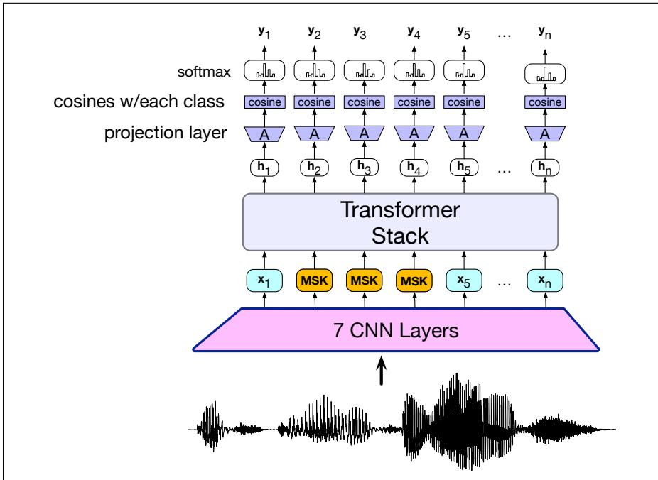
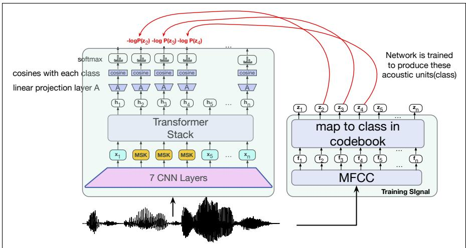
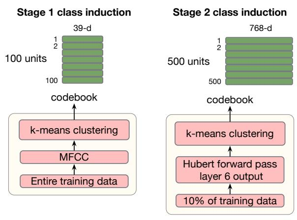
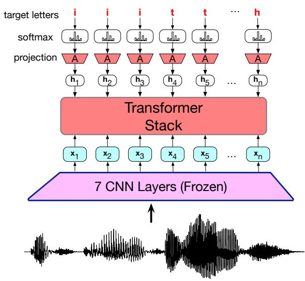

## 16.4 Self-supervised models: HuBERT

An alternative to the encoder-decoder architecture are the class of self-supervised speech models. These models don’t directly learn to map an acoustic input to a string of letters and tokens. Instead, they first bootstrap a set of discrete phonetic units from the acoustic input, learning to map from waveforms to these induced units. This pretraining phase doesn’t require transcripts; just unlabeled speech files. After they are pretrained, these models can then be fine-tuned to do ASR on a smaller set of labeled data, audio paired with transcripts. These models have the advantage that they can take advantage of large amounts of untranscribed audio for most of their training.

Here we’ll introduce one self-supervised model called HuBERT (Hsu et al., 2021). HuBERT and similar models like wav2vec 2.0 (Baevski et al., 2020) use the same intuition as the masked language models like BERT introduced in Chapter 9: we mask out some part of the input and train the model to guess what was hidden by the mask.

  
Figure 16.8 Schematic architecture for the HuBERT inference pass in training. A 16kHz wavfile is passed through a series of convolutional layers, some frames are replaced with a MASK token, and then the sequence is passed though a transformer stack, and then a linear layer that projects the transformer output to an output embedding. This embedding is compared via cosine with the embeddings for each of the 100/500 phonetic classes to produce a logit which is passed through softmax to get a probability distribution over the classes at each frame.

## 16.4.1 HuBERT forward pass

Let’s first show just the forward pass for HuBERT used during training, and then we’ll see this in its full training context with the backwards pass. As discussed earlier, the input to the HuBERT forward pass is raw 16kHz wavefiles as input, and the output at each 20ms time frame will be a probability distribution over a set of induced phonetic classes C (100 classes or 500 classes, depending on the stage). Fig. 16.8 shows a sketch of the components. The wavefile is passed through 7 512-channel convolutional layers which learn both to extract spectral information, and to shorten the input sequence down to a 20 ms frame, after which positional encodings are added, and then GELU and layer norm. Selected tokens are then replaced with a mask token, a trained embedding that is shared by all masked frames. The whole sequence is passed through a transformer stack, and the output is passed through a linear projection layer A. The output embedding at each 20ms frame is then compared via cosine with each of the embeddings for the 100 (/500) phonetic classes, resulting in a set of 100 logits representing the similarity of the current 20ms audio timestep to each class. These are then passed through a softmax to get a probability distribution over the classes.

## 16.4.2 Learning for HuBERT

Let’s first discuss how we induce the 100 or 500 phonetic classes that are the target of training. To bootstrap these units, HuBERT starts with mel frequency cepstral coefficients, or MFCC vectors, a 39-dimensional feature vector that emphasizes aspects of the signal that are relevant for detection of phonetic units. These vectors can be extracted from the acoustic signal as summarized in Section 15.6. We extract MFCC vectors for the entire acoustic training dataset (the original HuBERT implementation used 960 hours of LibriSpeech data resulting in 172 million vectors). Next we cluster the MFCC vectors using the k-means clustering algorithm described below in Section 16.4.3. Clustering means to group the vectors into k classes. The output of clustering is a codebook of k vectors, called codewords or templates or prototypes, each representing a cluster. Each of these k clusters is an acoustic unit that we can use as the gold targets for training.

Now let’s consider the entire training process. After the acoustic input is run through the CNN layers, a span of tokens in the context window is chosen to be masked, and for those tokens the CNN output is replaced by a MASK embedding. The entire context window is passed through the transformer layers, and the transformer output $h _ { t } ^ { L }$ at each timestep t is multiplied by the projection layer matrix A to project it into the class embedding space. The resulting representation is then compared to the embedding for each of the classes in C (using cosine), and a softmax (with temperature parameter τ=0.1) is used to turn the similarity into a probability:

$$
p (c | \mathbf {X}, t) = \frac {\exp (\text { sim } (\mathbf {A h} _ {t} , \mathbf {e} _ {c}) / \tau)}{\sum_ {c ^ {\prime} = 1} ^ {C} \exp (\text { sim } (\mathbf {A h} _ {t} , \mathbf {e} _ {c ^ {\prime}}) / \tau)}\tag{16.12}
$$

As Fig. 16.9 shows, in parallel with this forward pass, the input waveform is passed through an MFCC to create a 39-dimensional vector which is then mapped to one of the 100 classes by choosing the most similar centroid in the codebook. The loss function is then the sum, over the set of masked tokens M, of the probability that the model assigns to these correct units:

$$
L = \sum_ {t \in M} \log p (z _ {t} | \mathbf {X})\tag{16.13}
$$

Thus, as in masked language modeling, the model is being trained to predict the units associated with the masked frames. This loss is then backpropagated through the model

  
Figure 16.9 The first phase of HuBERT training. A codebook of 100 units (defined as clusters of 39-dimensional MFCC vectors) is used as the targets for training. For each timestep t, computes the probability of that class, and uses the logprob as the loss.

Once the model has been initially trained to map to MFCC vector centroids, a second stage of training occurs, where we take the representations produced by the model, cluster them into 500 clusters, and use those instead as the target for training. The intuition is that the initial MFCC clusters will bias the model toward phonetic representations, but after enough training the model will learn more accurate and fine-grained representations. Fig. 16.10 shows the intuition.

  
Figure 16.10 Creating the targets for the two stages of HuBERT training. In the first stage, 100 acoustic units are created by computing 39-dimensional MFCC vectors for the entire training data and then clustering them with k-means. In the second stage, 500 units are created by passing a subsample of the training data through the HuBERT model after the first stage training, taking the output of an intermediate transformer layer (layer 6) and clustering them with k-means.

After HuBERT has been pretrained, the projection and cosine layers are removed and a randomly initialized linear + softmax layer is added, mapping into 29 classes (corresponding to the 26 English letters and a few extra characters) for the ASR task. The CNNs are frozen and the rest of the model is fine-tuned for ASR using the CTC loss function to be described in Section 16.5.

  
Figure 16.11 The HuBERT fine-tuning pass after pretraining. The projection layer and cosine steps are removed, leaving only a randomly initialized projection/softmax layer. The CNN layers are frozen, and the rest of the model is fine-tuned on a dataset of audio with transcripts, trained with the CTC loss (Section 16.5) to produce letters as output. The parameters that are updated in fine-tuning are shown in red (the projection layer and the transformer stack).

## 16.4.3 K-means clustering

In this section we give the k-means clustering algorithm more formally. K-means is a family of algorithms for grouping a set of vector data into k clusters. Clustering is useful whenever we want to treat a group of elements in the same way. In speech processing it is very commonly used whenever we need to convert a set of vectors over real values into a set of discrete symbols. Besides its use here in HuBERT, we’ll return to it in Chapter 18 as an algorithm for creating discrete acoustic tokens for TTS.

We generally use the name k-means to mean a simple version of the family: a two-step iterative algorithm that is given a set of N vectors $\mathbf { v } ^ { ( 1 ) } . . \mathbf { v } ^ { ( N ) }$ each of d dimensions, i.e. i, $\pmb { \mathsf { v } } ^ { ( i ) } \in \mathbb { R } ^ { d }$ , and a constant k, where usually $N > > k$

The two-step algorithm is based on iteratively updating a set of k centroid vectors. A centroid is the geometric center of a set of a points in n-dimensional space.

The algorithm has two steps. In the assignment step, given a set of k current centroids and a dataset of vectors, it assigns each vector to the cluster whose codeword is the closest (by squared Euclidean distance). In the re-estimation step, it recomputes the codeword for each cluster by recomputing the mean vector. Note that the resulting mean vector need not be an actual point from the dataset. We iterate back and forth between these two steps.

Here’s the algorithm:

Initialization: For each cluster k choose a random vector $\mu _ { k } \in \mathbb { R } ^ { d }$ to be the codeword (also called template or prototype) for the cluster. The result is a codebook that has one codeword for each of the k clusters.

Then repeat iteratively until convergence:

1. Assignment: For each vector $\mathbf { v } ^ { ( \mathfrak { i } ) }$ in the dataset assign it to one of the k clusters by choosing the one with the nearest codeword $\mu .$ . Most simply we can define ‘nearest’ as the cluster whose codeword has the smallest squared Euclidean distance to $\mathbf { v } ^ { ( \mathfrak { i } ) }$

$$
\operatorname{cluster} ^ {(i)} = \underset {1 <   j <   k} {\operatorname{argmin}} | | \mathbf {v} ^ {(i)} - \boldsymbol {\mu} _ {j} | | ^ {2}\tag{16.14}
$$

where $| | \boldsymbol { \mathsf { v } } | |$ is the L2 norm of the vector $\textstyle \sum _ { j = 1 } ^ { d } \mathbf { v } _ { j } ^ { 2 }$

2. Re-estimation: Re-estimate the codeword for each cluster by recomputing the mean (centroid) of all the vectors in the cluster. If $S _ { i }$ is the set of vectors in cluster $i ,$ then

$$
\begin{array}{c} \forall i: \\ \mu_ {i} = \frac {1}{| S _ {i} |} \sum_ {\mathbf {v} \in S _ {i}} \mathbf {v} \end{array}\tag{16.15}
$$
