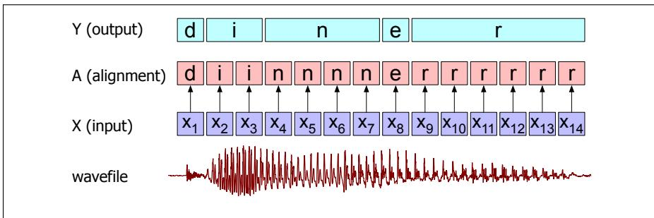
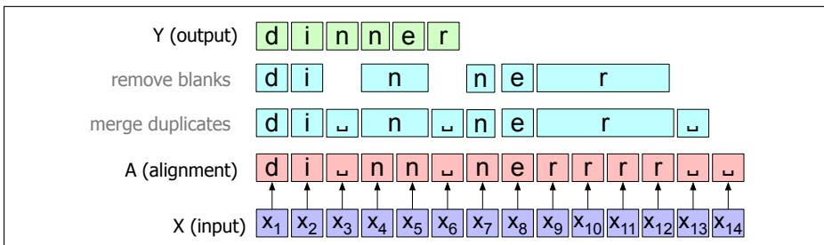
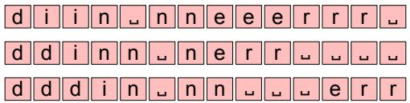
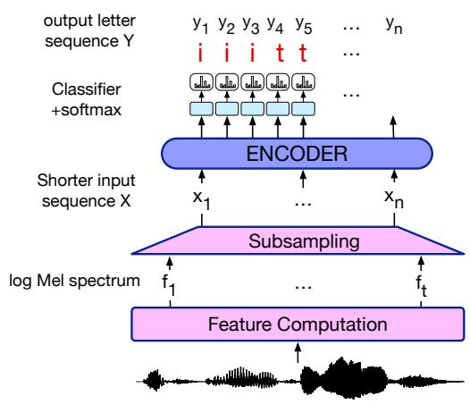
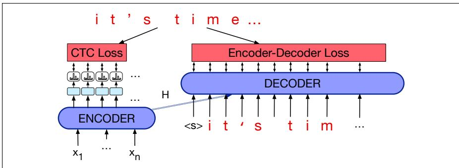

## 16.5 CTC

We pointed out in the previous section that speech recognition has two particular properties that make it very appropriate for the encoder-decoder architecture, where the encoder produces an encoding of the input that the decoder uses attention to explore. First, in speech we have a very long acoustic input sequence X mapping to a much shorter sequence of letters $Y ,$ and second, it’s hard to know exactly which part of X maps to which part of Y.

In this section we briefly introduce an alternative to encoder-decoder: an algorithm and loss function called CTC, short for Connectionist Temporal Classification (Graves et al., 2006), that deals with these problems in a very different way. The intuition of CTC is to output a single character for every frame of the input, so that the output is the same length as the input, and then to apply a collapsing function that combines sequences of identical letters, resulting in a shorter sequence.

Let’s imagine inference on someone saying the word dinner, and let’s suppose we had a function that chooses the most probable letter for each input spectral frame representation $x _ { i }$ . We’ll call the sequence of letters corresponding to each input frame an alignment, because it tells us where in the acoustic signal each letter aligns to. Fig. 16.12 shows one such alignment, and what happens if we use a collapsing function that just removes consecutive duplicate letters.

Well, that doesn’t work; our naive algorithm has transcribed the speech as diner, not dinner! Collapsing doesn’t handle double letters. There’s also another problem with our naive function; it doesn’t tell us what symbol to align with silence in the input. We don’t want to be transcribing silence as random letters!

The CTC algorithm solves both problems by adding to the transcription alphabet a special symbol for a blank, which we’ll represent as . The blank can be used in the alignment whenever we don’t want to transcribe a letter. Blank can also be used between letters; since our collapsing function collapses only consecutive duplicate letters, it won’t collapse across . More formally, let’s define the mapping $B : a  y$ between an alignment a and an output y, which collapses all repeated letters and then removes all blanks. Fig. 16.13 sketches this collapsing function B.

  
Figure 16.12 A naive algorithm for collapsing an alignment between input and letters.

  
Figure 16.13 The CTC collapsing function B, showing the space blank character ; repeated (consecutive) characters in an alignment A are removed to form the output Y.

The CTC collapsing function is many-to-one; lots of different alignments map to the same output string. For example, the alignment shown in Fig. 16.13 is not the only alignment that results in the string dinner. Fig. 16.14 shows some other alignments that would produce the same output.

  
Figure 16.14 Three other legitimate alignments producing the transcript dinner.

It’s useful to think of the set of all alignments that might produce the same output Y. We’ll use the inverse image of our B function, called $B ^ { - 1 }$ , and represent that set as $B ^ { - 1 } ( Y )$

## 16.5.1 CTC Inference

Before we see how to compute $P _ { \mathrm { C T C } } ( Y | \mathbf { X } )$ let’s first see how CTC assigns a probability to one particular alignment $\hat { A } = \{ \hat { a } _ { 1 } , \dots , \hat { a } _ { n } \}$ . CTC makes a strong conditional independence assumption: it assumes that, given the input $\mathbf { x } ,$ the CTC model output at at time t is independent of the output labels at any other time $a _ { i }$ . Thus:

$$
P _ {\mathrm{CTC}} (\mathbf {A} | \mathbf {X}) = \prod_ {t = 1} ^ {T} p (a _ {t} | \mathbf {X})\tag{16.16}
$$

Thus to find the best alignment $\hat { A } = \{ \hat { a } _ { 1 } , \dots , \hat { a } _ { T } \}$ we can greedily choose the character with the max probability at each time step t:

$$
\hat {a} _ {t} = \underset {c \in C} {\operatorname{argmax}} p _ {t} (c | \mathbf {X})\tag{16.17}
$$

We then pass the resulting sequence A to the CTC collapsing function B to get the output sequence Y.

Let’s talk about how this simple inference algorithm for finding the best alignment A would be implemented. Because we are making a decision at each time point, we can treat CTC as a sequence-modeling task, where we output one letter $\hat { \mathbf { y } } _ { t }$ at time t corresponding to each input token $\mathbf { x } _ { t } ,$ , eliminating the need for a full decoder. Fig. 16.15 sketches this architecture, where we take an encoder, produce a hidden state ht at each timestep, and decode by taking a softmax over the character vocabulary at each time step.

  
Figure 16.15 Inference with CTC: using an encoder-only model, with decoding done by simple softmaxes over the hidden state ht at each output step.

Alas, there is a potential flaw with the inference algorithm sketched in (Eq. 16.17) and Fig. 16.14. The problem is that we chose the most likely alignment A, but the most likely alignment may not correspond to the most likely final collapsed output string Y. That’s because there are many possible alignments that lead to the same output string, and hence the most likely output string might not correspond to the most probable alignment. For example, imagine the most probable alignment A for an input $\pmb { \mathrm { X } } = [ x _ { 1 } x _ { 2 } x _ { 3 } ]$ is the string [a b ϵ] but the next two most probable alignments are [b ϵ b] and [ϵ b b]. The output $Y = [ \mathbf { b } \ \mathbf { b } ]$ , summing over those two alignments, might be more probable than $Y = [ \mathbf { a } \mathbf { b } ]$

For this reason, the most probable output sequence Y is the one that has, not the single best CTC alignment, but the highest sum over the probability of all its possible alignments:

$$
\begin{array}{r l} P _ {C T C} (Y | \mathbf {X}) & = \sum_ {A \in B ^ {- 1} (Y)} P (A | \mathbf {X}) \\ & = \sum_ {A \in B ^ {- 1} (Y)} \prod_ {t = 1} ^ {T} p (a _ {t} | h _ {t}) \\ \hat {Y} & = \underset {Y} {\operatorname{argmax}} P _ {C T C} (Y | \mathbf {X}) \end{array}\tag{16.18}
$$

Alas, summing over all alignments is very expensive (there are a lot of alignments), so we approximate this sum by using a version of Viterbi beam search that cleverly keeps in the beam the high-probability alignments that map to the same output string, and sums those as an approximation of (Eq. 16.18). See Hannun (2017) for a clear explanation of this extension of beam search for CTC.

Because of the strong conditional independence assumption mentioned earlier (that the output at time t is independent of the output at time t 1, given the input), CTC does not implicitly learn a language model over the data (unlike the attentionbased encoder-decoder architectures). It is therefore essential when using CTC to interpolate a language model (and some sort of length factor $L ( Y ) )$ using interpolation weights that are trained on a devset:

$$
\operatorname{score} _ {\mathrm{CTC}} (Y | \mathbf {X}) = \log P _ {\mathrm{CTC}} (Y | \mathbf {X}) + \lambda_ {1} \log P _ {\mathrm{LM}} (Y) \lambda_ {2} L (Y)\tag{16.19}
$$

## 16.5.2 CTC Training

To train a CTC-based ASR system, we use negative log-likelihood loss with a special CTC loss function. Thus the loss for an entire dataset D is the sum of the negative log-likelihoods of the correct output Y for each input X:

$$
L _ {\mathrm{CTC}} = \sum_ {(X, Y) \in D} - \log P _ {\mathrm{CTC}} (Y | \mathbf {X})\tag{16.20}
$$

To compute CTC loss function for a single input pair (X,Y), we need the probability of the output Y given the input X. As we saw in Eq. 16.18, to compute the probability of a given output Y we need to sum over all the possible alignments that would collapse to Y. In other words:

$$
P _ {\mathrm{CTC}} (Y | \mathbf {X}) = \sum_ {A \in B ^ {- 1} (Y)} \prod_ {t = 1} ^ {T} p \left(a _ {t} \mid h _ {t}\right)\tag{16.21}
$$

Naively summing over all possible alignments is not feasible (there are too many alignments). However, we can efficiently compute the sum by using dynamic programming to merge alignments, with a version of the forward-backward algorithm also used to train HMMs (Appendix A) and CRFs. The original dynamic programming algorithms for both training and inference are laid out in (Graves et al., 2006); see (Hannun, 2017) for a detailed explanation of both.

## 16.5.3 Combining CTC and Encoder-Decoder

It’s also possible to combine the two architectures/loss functions we’ve described, the cross-entropy loss from the encoder-decoder architecture, and the CTC loss. Fig. 16.16 shows a sketch. For training, we can simply weight the two losses with a λ tuned on a devset:

$$
L = - \lambda \log P _ {e n c d e c} (Y | \mathbf {X}) - (1 - \lambda) \log P _ {c t c} (Y | \mathbf {X})\tag{16.22}
$$

For inference, we can combine the two with the language model (or the length penalty), again with learned weights:

$$
\hat {Y} = \underset {Y} {\operatorname{argmax}} \left[ \lambda \log P _ {\text { encdec }} (Y | \mathbf {X}) + (1 - \lambda) \log P _ {\mathrm{CTC}} (Y | \mathbf {X}) + \gamma \log P _ {\mathrm{LM}} (Y) \right]\tag{16.23}
$$

  
Figure 16.16 Combining the CTC and encoder-decoder loss functions.

## 16.5.4 Streaming Models: RNN-T for improving CTC

Because of the strong independence assumption in CTC (assuming that the output at time t is independent of the output at time t 1), recognizers based on CTC don’t achieve as high an accuracy as the attention-based encoder-decoder recognizers. CTC recognizers have the advantage, however, that they can be used for streaming. Streaming means recognizing words on-line rather than waiting until the end of the sentence to recognize them. Streaming is crucial for many applications, from commands to dictation, where we want to start recognition while the user is still talking. Algorithms that use attention need to compute the hidden state sequence over the entire input first in order to provide the attention distribution context, before the decoder can start decoding. By contrast, a CTC algorithm can input letters from left to right immediately.

If we want to do streaming, we need a way to improve CTC recognition to remove the conditional independent assumption, enabling it to know about output history. The RNN-Transducer (RNN-T), shown in Fig. 16.17, is just such a model (Graves 2012, Graves et al. 2013). The RNN-T has two main components: a CTC acoustic model, and a separate language model component called the predictor that conditions on the output token history. At each time step t, the CTC encoder outputs a hidden state $h _ { t } ^ { \mathrm { e n c } }$ given the input $x _ { 1 } . . . x _ { t }$ . The language model predictor takes as input the previous output token (not counting blanks), outputting a hidden state $h _ { u } ^ { \mathrm { p r e d } }$ The two are passed through another network whose output is then passed through a softmax to predict the next character.

$$
\begin{array}{l} P _ {R N N - T} (Y | \mathbf {X}) = \sum_ {A \in B ^ {- 1} (Y)} P (A | \mathbf {X}) \\ = \sum_ {A \in B ^ {- 1} (Y)} \prod_ {t = 1} ^ {T} p (a _ {t} | h _ {t}, y _ {<   u _ {t}}) \end{array}
$$
