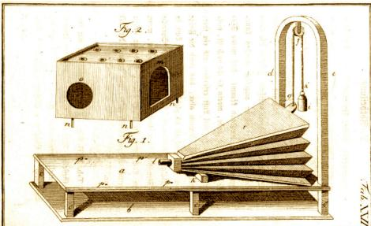
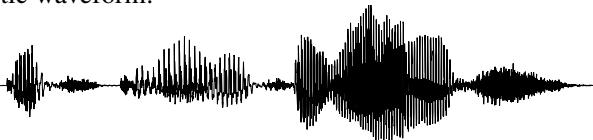

“Words mean more than what is set down on paper. It takes the human voice to infuse them with shades of deeper meaning.”

Maya Angelou, I Know Why the Caged Bird Sings

The task of mapping from text to speech is a task with an even longer history than speech to text. In Vienna in 1769, Wolfgang von Kempelen built for the Empress Maria Theresa the famous Mechanical Turk, a chess-playing automaton consisting of a wooden box filled with gears, behind which sat a robot mannequin who played chess by moving pieces with his mechanical arm. The Turk toured Europe and the Americas for decades, defeating Napoleon Bonaparte and even playing Charles Babbage. The Mechanical Turk might have been one of the early successes of artificial intelligence were it not for the fact that it was, alas, a hoax, powered by a human chess player hidden inside the box.

What is less well known is that von Kempelen, an extraordinarily

prolific inventor, also built between 1769 and 1790 what was definitely not a hoax: the first full-sentence speech synthesizer, shown partially to the right. His device consisted of a bellows to simulate the lungs, a rubber mouthpiece and a nose aperture, a reed to simulate the vocal folds, various whistles for the fricatives, and a

small auxiliary bellows to provide the puff of air for plosives. By moving levers with both hands to open and close apertures, and adjusting the flexible leather “vocal tract”, an operator could produce different consonants and vowels.

More than two centuries later, we no longer build our synthesizers out of wood and leather, nor do we need human operators. The modern task of text-to-speech or TTS, also called speech synthesis, is exactly the reverse of ASR; to map text:

It’s time for lunch!

to an acoustic waveform:

TTS has a wide variety of applications. It is used in spoken language models that interact with people, for reading text out loud, for games, and to produce speech for sufferers of neurological disorders, like the late astrophysicist Steven Hawking after he lost the use of his voice because of ALS.

In this chapter we introduce an algorithm for TTS that, like the ASR algorithms of the prior chapter, are trained on enormous amounts of speech datasets. We’ll also briefly touch on other speech applications.
