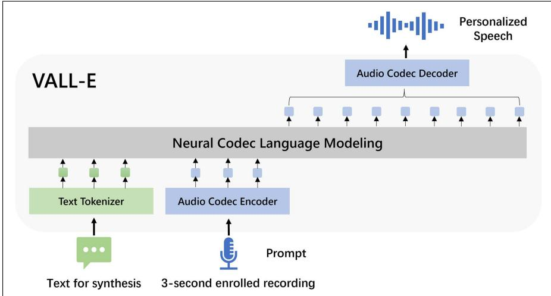

## 17.1 TTS overview

The task of text-to-speech is to generate a speech waveform that corresponds to a desired text, using in a particular voice specified by the user.

Historically TTS was done by collecting hundreds of hours of speech from a single talker in a lab and training a large system on it. The resulting TTS system only worked in one voice; if you wanted a second voice, you went back and collected data from a second talker.

The modern method is instead to train a speaker-independent synthesizer on tens of thousands of hours of speech from thousands of talkers. To create speech in a new voice unseen in training, we use a very small amount of speech from the desired talker to guide the creation of the voice. So the input to a modern TTS system is a text prompt and perhaps 3 seconds of speech from the voice we’d like to generate the speech in. This TTS task is called zero-shot TTS because the desired voice may3, 2025 705 never have been seen in training.

The way modern TTS systems address this task is to use language modeling, and in particular conditional generation. The intuition is to take an enormous dataset of speech, and use an audio tokenizer based on an audio codec to induce discrete audio tokens from that speech that represent the speech. Then we can train a language model whose vocabulary includes both speech tokens and text tokens.

We train this language model to take as input two sequences, a text transcriptnthesizers and a small sample of speech from the desired talker, to tokenize both the text and the speech into discrete tokens, and then to conditionally generate discrete samples of the speech corresponding to the text string, in the desired voice., Long Zhou, Shujie Liu , Member, IEEE,

At inference time we prompt this language model with a tokenized text string andEEE, Lei He , Sheng Zhao, and Furu Wei a sample of the desired voice (tokenized by the codec into discrete audio tokens) and conditionally generate to produce the desired audio tokens. Then these tokens can be converted into a waveform.

  
Figure 17.1 VALL-E architecture for personalized TTS (figure from Chen et al. (2025)).

→        →  Fig. 17.1 from Chen et al. (2025) shows the intuition for one such TTS system, →           called VALL-E. VALL-E is trained on 60K hours of English speech, from over 7000 unique talkers. Systems like VALL-E have 2 components:

1. The audio tokenizer, generally based on an audio codec, a system we’ll describe in the next section. Codecs have three parts: an encoder (that turns speech into embedding vectors), a quantizer (that turns the embeddings into discrete tokens) and decoders (that turns the discrete tokens back into speech).

2. The 2-stage conditional language model that can generate audio tokens corresponding to the desired text. We’ll sketch this in Section 17.3.
