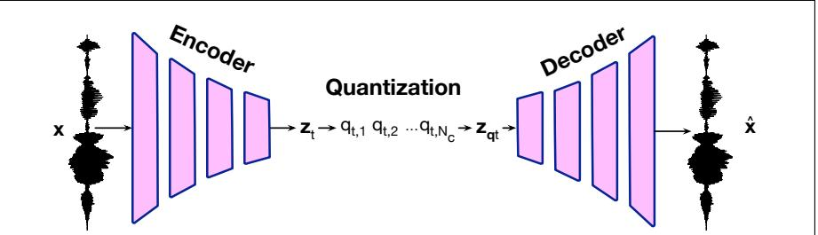
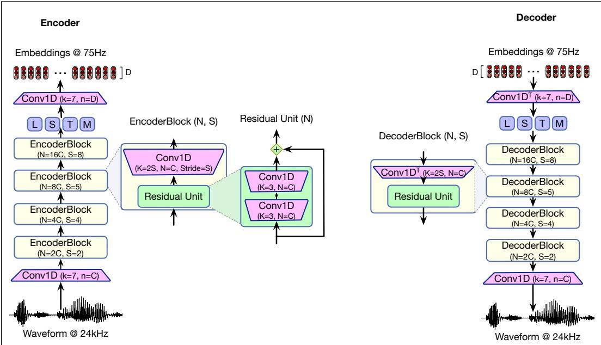
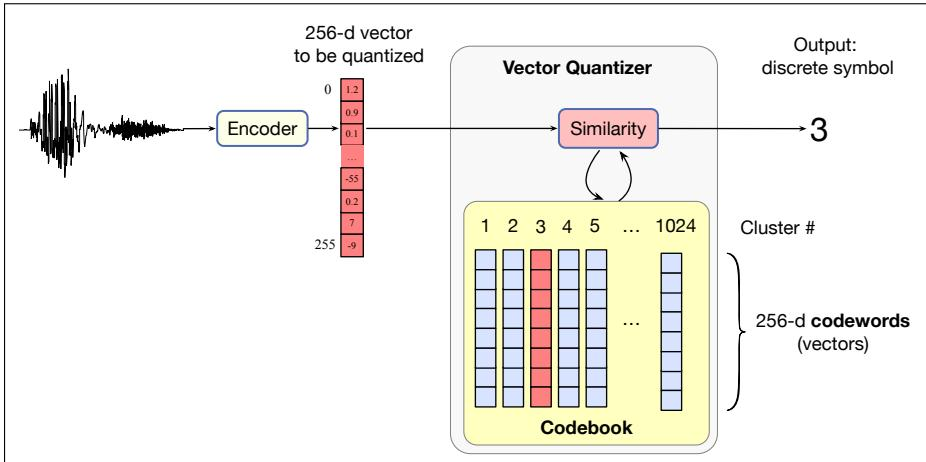
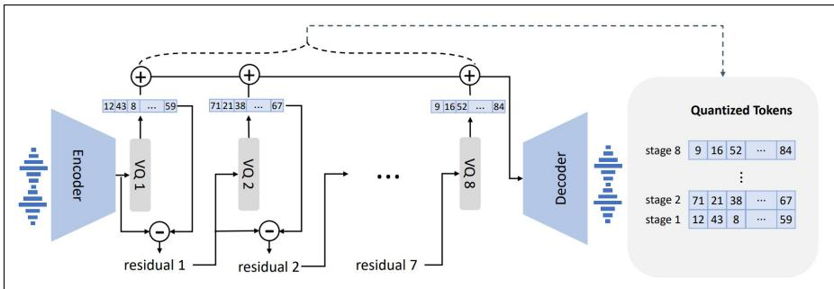
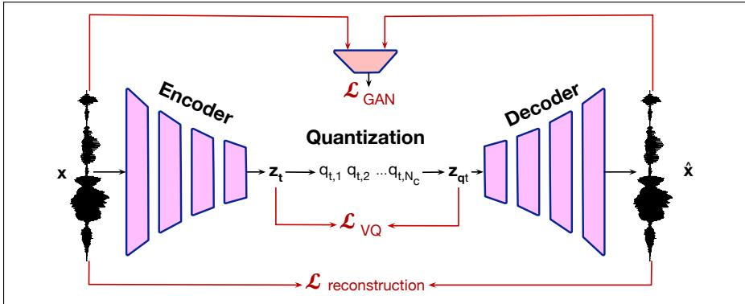

## 17.2 Using a codec to learn discrete audio tokens

Modern TTS systems are based around converting the waveform into a sequence of discrete audio tokens. This idea of manipulating discrete audio tokens is also useful for other speech-enabled systems like spoken language models, which take text or speech input and can generate text or speech output to solve tasks like speechto-speech translation, diarization, or spoken question answering. Having discrete tokens means that we can make use of language model technology, since language models are specialized for sequences of discrete tokens. Audio tokenizers are thus an important component of the modern speech toolkit.

The standard way to learn audio tokens is from a neural audio codec (the word is formed from coder/decoder). Historically a codec was a hardware device that digitized analog symbols. More generally we use the word to mean a mechanism for encoding analog speech signals into a digitized compressed representation that can be efficiently stored and sent. Codecs are still used for compression, but for TTS and also for spoken language models, we employ them for converting speech into discrete tokens.

Of course the digital representation of speech we described in Chapter 15 is already discrete. For example 16 kHz speech stored in 16-bit format could be thought of as a series of $2 ^ { 1 6 } = 6 5 , 5 3 6$ symbols, with $1 6 { , } 0 0 0$ of those symbols per second of speech. But a system that generates 16,000 symbols per second makes the speech signal too long to be feasibly processed by a language model, especially one based on transformers with their inefficient quadratic attention. Instead we want symbols that represent longer chunks of speech, perhaps something on the order of a few hundred tokens a second.

  
Figure 17.2 Standard architecture of an audio tokenizer performing inference, figure adapted from Mousavi et al. (2025). An input waveform x is encoded (generally using a series of downsampling convolution networks) into a series of embeddings $\mathbf { z _ { t } } .$ . Each embedding is then passed through a quantizer to produce a series of quantized tokens $q _ { t }$ . To regenerate the speech signal, the quantized tokens are re-mapped back to a vector $\pmb { z _ { \mathbf { q } _ { t } } }$ and then decoded (usually using a series of upsampling convolution networks) back to a waveform. We’ll discuss how the architecture is trained in Section 17.2.4.

Fig. 17.2 adapted from Mousavi et al. (2025). shows the standard architecture of an audio tokenizer. Audio tokenizers take as input an audio waveform, and are trained to recreate the same audio waveform out, via an intermediate representation consisting of discrete tokens created by vector quantization.

Audio tokenizers have three stages:

1. an encoder maps the acoustic waveform, a series of T values $\mathbf { x } = x _ { 1 } , x _ { 2 } , . . . , x _ { T }$ to a sequence of τ embeddings $\pmb { z } = \pmb { z _ { 1 } } , \pmb { z _ { 2 } } , . . . , \pmb { z _ { \tau } }$ . τ is typically 100-1000 times smaller than $T .$

2. a vector quantizer that takes each embedding $\mathbf { z _ { t } }$ corresponding to part of the waveform, and represents it by a sequence of discrete tokens each taken from one of the $N _ { c }$ codebooks, $q _ { t } = q _ { t , 1 } , q _ { t , 2 } , . . . , q _ { t , N _ { c } }$ . The vector quantizer also sums the vector codewords from each codebook to create a quantizer output vector $\pmb { z _ { \mathsf { q } _ { t } } }$

3. a decoder that generates a lossy reconstructed waveform span xˆ from the quantizer output vector $\pmb { z _ { \mathbf { q } _ { t } } }$

Audio tokenizers are generally learned end-to-end, using loss functions that reward a tokenization that allows the system to reconstruct the input waveform.

In the following subsections we’ll go through the components of one particular tokenizer, the ENCODEC tokenizer of Defossez et al.´ (2023).

## 17.2.1 The Encoder and Decoder for the ENCODEC model

  
Figure 17.3 The encoder and decoder stages of the ENCODEC model. The goal of the encoder is to downsample an input waveform by encoded it as a series of embeddings zt at 75Hz, i.e. 75 embeddings a second. Because the original signal was represented at ${ 2 4 \mathrm { k H z } } ,$ this is a downsampling of $\frac { 2 4 0 0 0 } { 7 5 } = 3 2 0$ times. Between the encoder and decoder is a quantization step producing a lossy embedding $\mathbf { z } _ { \mathbf { q } _ { t } }$ . The goal of the decoder is to take the lossy embedding ${ \bf z } _ { q } t$ and upsample it, converting it back to a waveform.

The encoder and decoder of the ENCODEC model (Defossez et al.´ , 2023) are sketched in Fig. 17.3. The goal of the encoder is to downsample a span of waveform at time $t ,$ which is at 24kHz—one second of speech has 24,000 real values—to an embedding representation $\mathbf { z } _ { t }$ at 75Hz—one second of audio is represented by 75 vectors, each of dimensionality D. For the purposes of this explanation, we’ll use $D = 2 5 6 .$

This downsampling is accomplished by having a series of encoder blocks that are made up of convolutional layers with strides larger than 1 that iteratively downsample the audio, as we discussed at the end of Section 16.2. The convolution blocks are sketched in Fig. 17.3, and include a long series of convolutions as well as residual units that add a convolution to the prior input.

The output of the encoder is an embedding zt at time t, 75 of which are produced per second. This embedding is then quantized (as discussed in the next section), turning each embedding $\mathbf { z } _ { t }$ into a series of $N _ { c }$ discrete symbols $q _ { t } = q _ { t , 1 } , q _ { t , 2 } , . . . , q _ { t , N _ { c } }$ and also turning the series of symbols into a new quantizer output vector $\pmb { z _ { \mathbf { q } _ { t } } }$ . Finally, the decoder takes the output embedding from the quantizer $\pmb { z _ { \mathbf { q } _ { t } } }$ and generates a waveform via a symmetric set of convnets that upsample the audio.

In summary, a 24kHz waveform comes through, we encode/downsample it into a vector $\mathbf { z } _ { t }$ of dimensionality $D = 2 5 6 .$ , quantize it into discrete symbols $q _ { t }$ , turn it back into a vector $\pmb { z _ { \mathbf { q } _ { t } } }$ of dimensionality $D = 2 5 6$ , and then decode/upsample that vector back into a waveform at 24kHz.

## 17.2.2 Vector Quantization

The goal of the vector quantization or VQ step is to turn a series of vectors into a series of discrete symbols.

Historically vector quantization (Gray, 1984) was used to compress a speech signal, to reduce the bit rate for transmission or storage. To compress a sequence of vector representations of speech, we turn each vector into an integer, an index representing a class or cluster. Then instead of transmitting a big vector of floating point numbers, we transmit that integer index. At the other end of the transmission, we reconstitute the vector from the index.

For TTS and other modern speech applications we use vector quantization for a different reason: because VQ conveniently creates discrete tokens, and those fit well into the language modeling paradigm, since language models do well at predicting sequences of discrete tokens.

In practice for the ENCODEC model and other audio tokenizers, we use a powerful form of vector quantization called residual vector quantization that we’ll define in the following section. But it will be helpful to first see the basic VQ algorithm before we extend it.

Vector quantization has a training phase and an inference phase. We already introduced the core of the basic VQ training algorithm when we described k-means clustering of vectors in Section 16.4.3, since k-means clustering is the most common algorithm used to implement VQ. To review, in VQ training, we run a big set of speech wavefiles through an encoder to generate N vectors, each one corresponding to some frame of speech. Then we cluster all these N vectors into k clusters; k is set by the designer as a parameter to the algorithm as the number of discrete symbols we want, generally with $k < < N$ . In the simplest VQ algorithm, we use the iterative k-means algorithm to learn the clusters. Recall from Section 16.4.3 that k-means is a two-step algorithm based on iteratively updating a set of k centroid vectors. A centroid is the geometric center of a set of a points in n-dimensional space.

The k-means algorithm for clustering starts by assigning a random vector to each cluster k. Then there are two iterative steps. In the assignment step, given a set of k current centroids and the entire dataset of vectors, each vector is assigned to the cluster whose codeword is the closest (by squared Euclidean distance). In the reestimation step, the codeword for each cluster is recomputed by recalculating a new mean vector. The result is that the clusters and their centroids slowly adjust to the training space. We iterate back and forth between these two steps until the algorithm converges.

  
Figure 17.4 The basic VQ algorithm at inference time, after the codebook has been learned. The input is a span of speech encoded by the encoder into a vector of dimensionality D = 256. This vector is compared with each codeword (cluster centroid) in the codebook. The codeword for cluster 3 is most similar, so the VQ outputs 3 as the discrete representation of this vector.

VQ can also be used as part of end-to-end training, as we will discuss below, in which case instead of iterative k-means, we instead recompute the means during minibatch training via online algorithms like exponential moving averages.

At the end of clustering, the cluster index can be used as a discrete symbol. Each cluster is also associated with a codeword, the vector which is the centroid of all the vectors in the cluster. We call the list of cluster ids (tokens) together with their codeword the codebook, and we often call the cluster id the code.

In inference, when a new vector comes in, we compare it to each vector in the codebook. Whichever codeword is closest, we assign it to that codeword’s associated cluster. Fig. 17.4 shows an intuition of this inference step in the context of speech encoding:

1. an input speech waveform is encoded into a vector v,

2. this input vector v is compared to each of the 1024 possible codewords in the codebook,

3. v is found to be most similar to codeword 3,

4. and so the output of VQ is the discrete symbol 3 as a representation of v.

As we will see below, for training the ENCODEC model end-to-end we will need a way to turn this discrete symbol back into a waveform. For simple VQ we do that by directly using the codeword for that cluster, passing that codeword to the decoder for it to reconstruct the waveform. Of course the codeword vector won’t exactly match the original vector encoding of the input speech span, especially with only 1024 possible codewords, but the hope is that it’s at least close if our codebook is good, and the decoder will still produce reasonable speech. Nonetheless, more powerful methods are usually used, as we’ll see in the next section.

## 17.2.3 Residual Vector Quantization

In practice, simple VQ doesn’t produce good enough reconstructions, at least not with codebook sizes of 1024. 1024 codeword vectors just isn’t enough to represent the wide variety of embeddings we get from encoding all possible speech waveforms. So what the ENCODEC model (and many other audio tokenization methods) use instead is a more sophisticated variant called residual vector quantization, or RVQ. In residual vector quantization, we use multiple codebooks arranged in a kind of hierarchy.

  
Figure 17.5 Residual VQ (figure from Chen et al. (2025)). We run VQ on the encoder output embedding to produce a discrete symbol and the corresponding codeword. We then look at the residual, the difference between the encoder output embedding $z _ { t }$ and the codeword chosen by VQ. We then take a second codebook and run VQ on this residual. We repeat the we can explicitly control the contprocess until we have 8 tokens.

The idea is very simple. We run standard VQ with a codebook just as in Fig. 17.4 of TTS model. Tjandra et al. [2019] quantizes unlabeled speech into discrete tokens by a VQVAEin the prior section. Then for an input embedding zt we take the codeword vector model [van den Oord et al., 20that is produced, let’s call it ${ \mathbf { z } } _ { \mathbf { q } \mathbf { 1 } _ { t } }$ nd trainfor the $\mathbf { z } _ { t }$ model with the token-to-speech sequence. Theyas quantified by codebook 1, and take the difference between the two:

$$
\text { residual } = \mathbf {z} _ {t} - \mathbf {z} _ {\mathbf {q}} ^ {(1)} _ {t}.\tag{17.1}
$$

zero-shot TTS.This residual is the error in the VQ; the part of the original vector that the VQ didn’t capture. The residual is kind of a rounding error; it’s as if in VQ we ‘round’ the vector to the nearest codeword, and that creates some error. So we then take that residual vector and pass it through another vector quantizer! That gives us a second to output 216 = 65, 536 probabilities per timestep to synthesize the raw audio. In addition, the audiocodeword that represents the residual part of the vector. We then take the residual sample rate exceeding ten thousand leads to an extraordinarily long sequence length, making it morefrom the second codeword, and do this again. The total result is 8 codewords (the original codeword and the 7 residuals).

nstruct high-quality raw audio. It is widely used in speech generative models, such as WaveNetThat means for RVQ we represent the original speech span by a sequence of 8 [van den Oord et al., 2016], but the inference speed is still slow since the sequence length is notdiscrete symbols (instead of 1 discrete symbol in basic VQ). Fig. 17.5 shows the intuition.

k [Lakhotia et al., 2021, Du et al., 2022] shows the codes from self-supervised models can alsoWhat do we do when we want to reconstruct the speech? The method used in reconstruct content, and the inference speed is faster than WaveNet. However, the speaker identity hasENCODEC RVQ is again simple: we take the 8 codewords and add them together! The resulting vector $\pmb { z _ { \mathbf { q } _ { t } } }$ is then passed through the decoder to generate a waveform.

## speech in discrete tokens. To compress audio for network transmission, codec m17.2.4 Training the ENCODEC model of audio tokens

The ENCODEC model (like similar audio tokenizer models) is trained end to end. information about the speaker and recording conditions. Compared to other quantization methods,The input is a waveform, a span of speech of perhaps 1 or 10 seconds extracted from the audio codec shows the following advantages: 1) It contains abundant speaker information anda longer original waveform. The desired output is the same waveform span, since the model is a kind of autoencoder that learns to map to itself. The model is trained to do this reconstruction on large speech datasets like Common Voice (Ardila et al., 2020) (over 30,000 hours of speech in 133 languages) as well as other audio data like Audio Set (Gemmeke et al., 2017) (1.7 million 10 sec excerpts from YouTube videos labeled from a large ontology including natural, animal, and machine sounds, music, and so on).

  
Figure 17.6 Architecture of audio tokenizer training, figure adapted from Mousavi et al. (2025). The audio tokenizer is trained with a weighted combination of various loss functions, summarized in the figure and described below.

The ENCODEC model, like most audio tokenizers, is trained with a number of loss functions, as suggested in Fig. 17.6. The reconstruction loss $L _ { \mathrm { { r e c o n s t r u c t i o n } } }$ measures how similar the output waveform is to the input waveform, for example by the sum-squared difference between the original and reconstructed audio:

$$
L _ {\text { reconstruction }} (\mathbf {x}, \hat {\mathbf {x}}) = \sum_ {t = 1} ^ {T} | | x _ {t} - \hat {x} _ {t} | | ^ {2}\tag{17.2}
$$

Similarity can additionally be measured in the frequency domain, by comparing the original and reconstructed mel-spectrogram, again using sum-squared (L2) distance or L1 distance or some combination.

Another kind of loss is the adversarial loss $L _ { \mathrm { G A N } }$ . For this loss we train a generative adversarial network, a generator and a binary discriminator D, which is a classifier to distinguish between the true wavefile x and a generated one. We want to train the model to fool this discriminator, so the better the discriminator, the worse our reconstruction must be, and so we use the discriminator’s success as a loss function, We can also incorporate various features from the generator.

Finally, we need a loss for the quantizer. This is because having a quantizer in the middle of end-to-end training causes problems in propagation of the gradient in the backward pass of training, because the quantization step is not differentiable. We deal with this problem in two ways. First, we ignore the quantization step in the backward pass. Instead we copy the gradients from the output of the quantizer $( \pmb { z } _ { \mathbf { q } _ { t } } )$ back to the input of the quantizer (zt), a method called the straight-through estimator (Van Den Oord et al., 2017).

But then we need a method to make sure the code words in the vector quantizer step get updated during training. One method is to start these off using k-means clustering of the vectors $\mathbf { z _ { t } }$ to get an initial clustering. Then we can add to a loss component, LVQ, which will be a function of the difference between the encoder output vector $\mathbf { z } _ { t }$ and the reconstructed vector after the quantization $\pmb { z _ { \mathbf { q } _ { t } } } .$ , i.e. the codeword, summed over all the $N _ { c }$ codebooks and residuals.

$$
L _ {\mathrm{VQ}} (\mathbf {x}, \hat {\mathbf {x}}) = \sum_ {t = 1} ^ {T} \sum_ {c = 1} ^ {N _ {c}} | | \mathbf {z} ^ {(\mathbf {c})} _ {t} - \mathbf {z} _ {\mathbf {q} _ {t}} ^ {(\mathbf {c})} | |\tag{17.3}
$$

The total loss function can then just be a weighted sum of these losses:

$$
L (\mathbf {x}, \hat {\mathbf {x}}) = \lambda_ {1} L _ {\text { reconstruction }} (\mathbf {x}, \hat {\mathbf {x}}) + \lambda_ {2} L _ {\text { GAN }} (\mathbf {x}, \hat {\mathbf {x}}) + \lambda_ {3} L _ {\text { VQ }} (\mathbf {x}, \hat {\mathbf {x}})\tag{17.4}
$$
