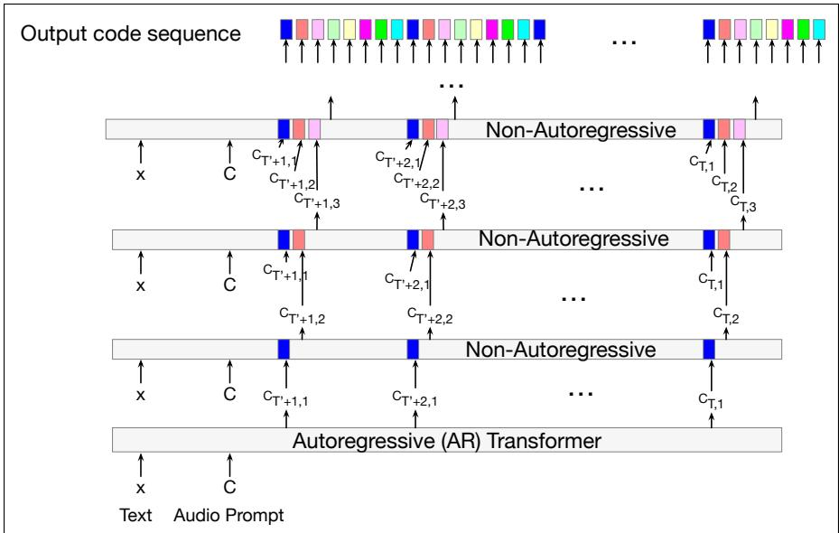
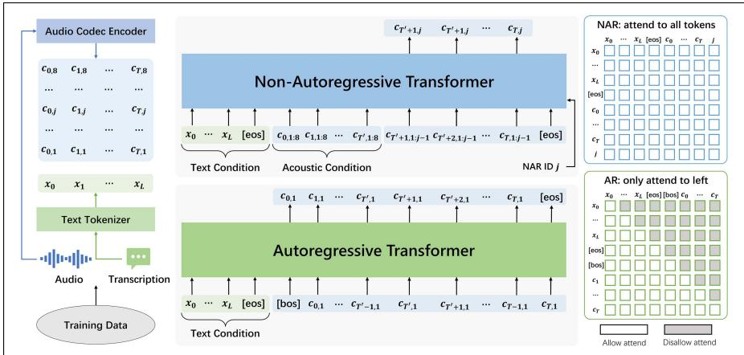
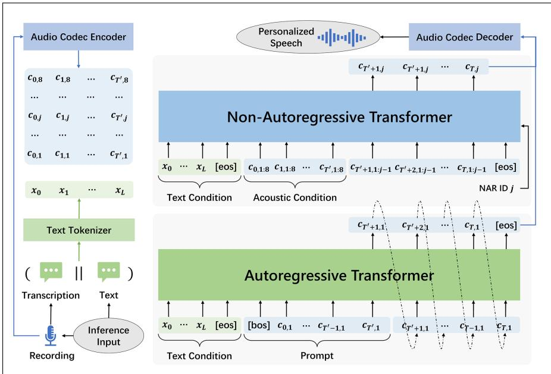

## 17.3 VALL-E: Generating audio with 2-stage LM

As we summarized in the introduction, the structure of TTS systems like VALL-E is to take as input a text to be synthesized and a sample of the voice to be used, and tokenize both, using BPE for the text and an audio codec for the speech. We then use a language model to conditionally generate discrete audio tokens corresponding to the text prompt, in the voice of the speech sample.

  
Figure 17.7 The 2-stage language modelling approach for VALL-E, showing the inference stage for the autoregressive transformer and the first 3 of the 7 non-autoregressive transformers. The output sequence of discrete audio codes is generated in two stages. First the autoregressive LM generates all the codes for the first quantizer from left to right. Then the non-autoregressive model is called 7 times to generate the remaining codes conditioned on all the codes from the preceding quantizer, including conditioning on the codes to the right.

Instead of doing this conditional generation with a single autoregressive language model, VALL-E does the conditional generation in a 2-stage process, using two distinct language models. This architectural choice is influenced by the hierarchical nature of the RVQ quantizer that generates the audio tokens. The output of the first RVQ quantizer is the most important token to the final speech, while the subsequent quantizers contribute less and less residual information to the final signal. So the language model generates the acoustic codes in two stages. First, an autoregressive LM generates the first-quantizer codes for the entire output sequence, given the input text and enrolled audio. Then given those codes, a non-autoregressive LM is run 7 times, each time taking as input the output of the initial autoregressive codes and the prior non-autoregressive quantizer and thus generating the codes from the remaining quantizers one by one. Fig. 17.7 shows the intuition for the inference step.

Now let’s see the architecture in a bit more detail. For training, we are given an audio sample y and its tokenized text transcription $\mathbf { x } = [ x _ { 0 } , x _ { 1 } , \ldots , x _ { L } ]$ . We use a pretrained ENCODEC to convert y into a code matrix C. Let T be the number of downsampled vectors output by ENCODEC, with 8 codes per vector. Then we can represent the encoder output as

$$
\mathbf {C} ^ {T \times 8} = \operatorname{ENCODEC} (\mathbf {y})\tag{17.5}
$$

Here C is a two-dimensional acoustic code matrix that has $T \times 8$ entries, where the columns represent time and the rows represent different quantizers. That is, the row vector $\mathbf { c } _ { t , : }$ of the matrix contains the 8 codes for the t-th frame, and the column vector $\mathbf { c } _ { : , j }$ contains the code sequence from the j-th vector quantizer where $j \in [ 1 , . . . , 8 ]$

Given the text x and audio C, we train the TTS as a conditional code language model to maximize the likelihood of C conditioned on x:

$$
\begin{array}{l} L = - \log p (\mathbf {C} | \mathbf {x}) \\ = - \log \prod_ {t = 0} ^ {T} p (\mathbf {c} _ {<   t, \cdot}, \mathbf {x}) \end{array}\tag{17.6}
$$

  
iew of VALL-E. We regard TTS as a conditional codec language modeling task. We structure VALL-E as two coFigure 17.8 Training procedure for VALL-E. Given the text prompt, the autoregressive structure. The AR model is used to generate each code of the first code sequence in an autoregressive manner,transformer is first trained to generate each code of the first-quantizer code sequence, autore-maining code sequence based on the previous code sequences in a non-autoregressive manner.gressively The the non-autoregressive transformer generates the rest of the codes. Figure from Chen et al. (2025).

ure: AR and NAR Model simultaneously, thus reducing the time comFig. 17.8 shows the intuition. On the left, we have an audio sample and its to (1).transcription, and both are tokenized. Then we append an [EOS] and [BOS] token to x and an [EOS] token to the end of C and train the autoregressive transformer h sample is encoded into multiple code se- C.to predict the acoustic tokens, starting with $\mathbf { c } _ { 0 , 1 }$ ining: Conditional Codec Language, until [EOS], and then the nonple quantizers in the audio codec model. (2) As depiautoregressive transformers to fill in the other tokens.

is present where the code sequence from tional codec language modelingDuring inference, we are given a text sequence to be spoken as well as $\mathbf { y } ^ { \prime } .$ thod. I, an enovers most of the acoustic information, while the training of VALL-E requires only simrolled speech sample from some unseen speaker, for which we have the transcription transcript $( \mathbf { y } ^ { \prime } )$ . We first run the codec to get an acoustic code matrix for ${ \bf { y } } ^ { \prime } ,$ which will be $\mathbf { C } ^ { P } = \mathsf { \pmb { C } } _ { : T ^ { \prime } , : } = [ \mathbf { c } _ { 0 , : } , \mathbf { c } _ { 1 , : } , \dots \mathbf { c } _ { T ^ { \prime } , : } . ]$ . Next we concatenate the transcription of $\mathbf { y } ^ { \prime }$ to the text sequence to be spoken to create the total input text x, which we pass through a text tokenizer. At this stage we thus have a tokenized text x and a tokenized audio prompt ${ \pmb { C } } ^ { P }$

Then we generate $\mathbf { C } ^ { T } = \mathbf { C } _ { > T ^ { \prime } , : } = [ \mathbf { c } _ { T ^ { \prime } + 1 , : } , \mathbf { \dots } \mathbf { c } _ { T , : } ]$ conditioned on the text sequence x and the prompt ${ \mathsf { C } } ^ { P }$ :

$$
\begin{array}{l} \mathbf {C} ^ {T} = \underset {\mathbf {C} ^ {T}} {\operatorname{argmax}} p (\mathbf {C} ^ {T} | \mathbf {C} ^ {P}, \mathbf {x}) \\ = \underset {\mathbf {C} ^ {T}} {\operatorname{argmax}} \prod_ {t = T ^ {\prime} + 1} ^ {T} p (\mathbf {c} _ {t,:} | \mathbf {c} _ {<   t,:}, \mathbf {x}) \end{array}\tag{17.7}
$$

Then the generated tokens ACTIONS ON AUDIO, SPE ${ \mathsf { C } } ^ { T }$ can be converted by the ENCODEC decoder into AND LANGUAGE PROCESSING, VOL. 33, 2025 a waveform. Fig. 17.9 shows the intuition.

  
Figure 17.9 Inference procedure for VALL-E. Figure from Chen et al. (2025). The transcript for the 3 seconds of enrolled speech is first prepended to the text to be generated, and both the speech and text are tokenized. Next the autoregressive transformer starts generating the first codes $\pmb { c } _ { t ^ { \prime } + 1 , 1 }$ conditioned on the transcript and acoustic prompt.

See Chen et al. (2025) for more details on the transformer components and other details of training.
