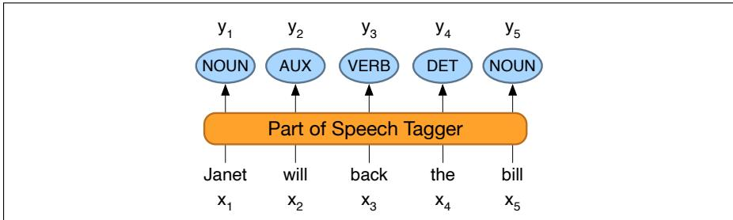

## 18.2 Part-of-Speech Tagging

Part-of-speech tagging is the process of assigning a part-of-speech to each word in a text. The input is a sequence $x _ { 1 } , x _ { 2 } , . . . , x _ { n }$ of (tokenized) words and a tagset, and the output is a sequence $y _ { 1 } , y _ { 2 } , . . . , y _ { n }$ of tags, each output yi corresponding exactly to one input xi, as shown in the intuition in Fig. 18.3.

Tagging is a disambiguation task; words are ambiguous —have more than one possible part-of-speech—and the goal is to find the correct tag for the situation. For example, book can be a verb (book that flight) or a noun (hand me that book).

  
Figure 18.3 The task of part-of-speech tagging: mapping from input words $x _ { 1 } , x _ { 2 } , . . . , x _ { n }$ to output POS tags $y _ { 1 } , y _ { 2 } , . . . , y _ { n }$

That can be a determiner (Does that flight serve dinner) or a complementizer (I thought that your flight was earlier). The goal of POS-tagging is to resolve these ambiguities, choosing the proper tag for the context.

The accuracy of part-of-speech tagging algorithms (the percentage of test set tags that match human gold labels) is extremely high. One study found accuracies over 97% across 15 languages from the Universal Dependency (UD) treebank (Wu and Dredze, 2019). Accuracies on various English treebanks are also 97% (no matter the algorithm; HMMs, CRFs, BERT perform similarly). This 97% number is also about the human performance on this task, at least for English (Manning, 2011).

<table><tr><td colspan="2">Types:</td><td colspan="2">WSJ</td><td colspan="2">Brown</td></tr><tr><td>Unambiguous</td><td>(1 tag)</td><td>44,432</td><td>(86%)</td><td>45,799</td><td>(85%)</td></tr><tr><td>Ambiguous</td><td>(2+ tags)</td><td>7,025</td><td>(14%)</td><td>8,050</td><td>(15%)</td></tr><tr><td colspan="2">Tokens:</td><td></td><td></td><td></td><td></td></tr><tr><td>Unambiguous</td><td>(1 tag)</td><td>577,421</td><td>(45%)</td><td>384,349</td><td>(33%)</td></tr><tr><td>Ambiguous</td><td>(2+ tags)</td><td>711,780</td><td>(55%)</td><td>786,646</td><td>(67%)</td></tr></table>

Figure 18.4 Tag ambiguity in the Brown and WSJ corpora (Treebank-3 45-tag tagset).

We’ll introduce algorithms for the task in the next few sections, but first let’s explore the task. Exactly how hard is it? Fig. 18.4 shows that most word types (85-86%) are unambiguous (Janet is always NNP, hesitantly is always RB). But the ambiguous words, though accounting for only 14-15% of the vocabulary, are very common, and 55-67% of word tokens in running text are ambiguous. Particularly ambiguous common words include that, back, down, put and set; here are some examples of the 6 different parts of speech for the word back:

earnings growth took a back/JJ seat

a small building in the back/NN

a clear majority of senators back/VBP the bill

Dave began to back/VB toward the door

enable the country to buy back/RP debt

I was twenty-one back/RB then

Nonetheless, many words are easy to disambiguate, because their different tags aren’t equally likely. For example, a can be a determiner or the letter a, but the determiner sense is much more likely.

This idea suggests a useful baseline: given an ambiguous word, choose the tag which is most frequent in the training corpus. This is a key concept:

Most Frequent Class Baseline: Always compare a classifier against a baseline at least as good as the most frequent class baseline (assigning each token to the class it occurred in most often in the training set).

The most-frequent-tag baseline has an accuracy of about $9 2 \% ^ { 1 }$ . The baseline thus differs from the state-of-the-art and human ceiling (97%) by only 5%.
