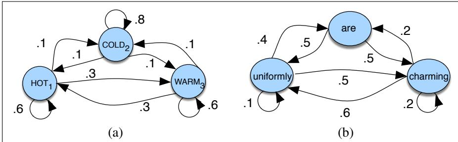
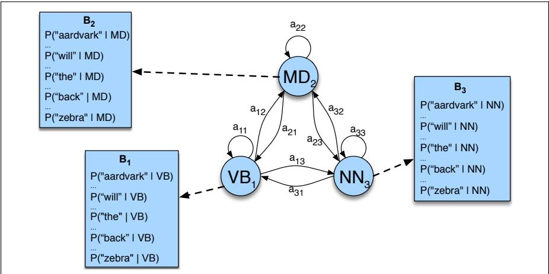
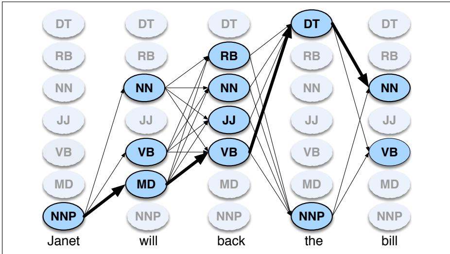
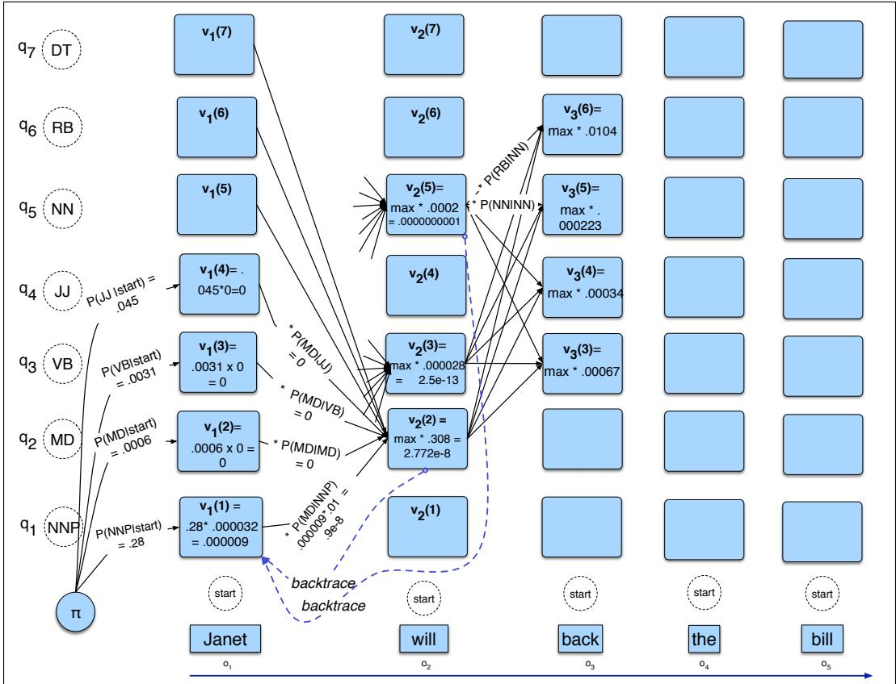

## 18.4 HMM Part-of-Speech Tagging

In this section we introduce our first sequence labeling algorithm, the Hidden Markov Model, and show how to apply it to part-of-speech tagging. Recall that a sequence labeler is a model whose job is to assign a label to each unit in a sequence, thus mapping a sequence of observations to a sequence of labels of the same length. The HMM is a classic model that introduces many of the key concepts of sequence modeling that we will see again in more modern models.

An HMM is a probabilistic sequence model: given a sequence of units (words, letters, morphemes, sentences, whatever), it computes a probability distribution over possible sequences of labels and chooses the best label sequence.

## 18.4.1 Markov Chains

The HMM is based on augmenting the Markov chain. A Markov chain is a model that tells us something about the probabilities of sequences of random variables, states, each of which can take on values from some set. These sets can be words, or tags, or symbols representing anything, for example the weather. A Markov chain makes a very strong assumption that if we want to predict the future in the sequence, all that matters is the current state. All the states before the current state have no impact on the future except via the current state. It’s as if to predict tomorrow’s weather you could examine today’s weather but you weren’t allowed to look at yesterday’s weather.

  
Figure 18.8 A Markov chain for weather (a) and one for words (b), showing states and transitions. A start distribution <sub>π</sub> is required; setting $\pi = [ 0 . 1 , 0 . 7 , 0 . 2 ]$ for (a) would mean a probability 0.7 of starting in state 2 (cold), probability 0.1 of starting in state 1 (hot), etc.

More formally, consider a sequence of state variables $q _ { 1 } , q _ { 2 } , . . . , q _ { i }$ . A Markov model embodies the Markov assumption on the probabilities of this sequence: that when predicting the future, the past doesn’t matter, only the present.

Markov Assumption:

$$
P (q _ {i} = a | q _ {1}... q _ {i - 1}) = P (q _ {i} = a | q _ {i - 1})\tag{18.3}
$$

Figure 18.8a shows a Markov chain for assigning a probability to a sequence of weather events, for which the vocabulary consists of HOT, COLD, and WARM. The states are represented as nodes in the graph, and the transitions, with their probabilities, as edges. The transitions are probabilities: the values of arcs leaving a given state must sum to 1. Figure 18.8b shows a Markov chain for assigning a probability to a sequence of words $w _ { 1 } . . . w _ { t }$ . This Markov chain should be familiar; in fact, it represents a bigram language model, with each edge expressing the probability $p ( w _ { i } | w _ { j } ) !$ Given the two models in Fig. 18.8, we can assign a probability to any sequence from our vocabulary.

Formally, a Markov chain is specified by the following components:

<table><tr><td> $Q = q_{1}q_{2}\ldots q_{N}$ </td><td>a set of  $N$  states</td></tr><tr><td> $A = a_{11}a_{12}\ldots a_{N1}\ldots a_{NN}$ </td><td>a transition probability matrix  $A$ , each  $a_{ij}$  representing the probability of moving from state  $i$  to state  $j$ , s.t.  $\sum_{j=1}^{n} a_{ij} = 1 \forall i$ </td></tr><tr><td> $\pi = \pi_{1}, \pi_{2}, ..., \pi_{N}$ </td><td>an initial probability distribution over states.  $\pi_{i}$  is the probability that the Markov chain will start in state  $i$ . Some states  $j$  may have  $\pi_{j} = 0$ , meaning that they cannot be initial states. Also,  $\sum_{i=1}^{n} \pi_{i} = 1$ </td></tr></table>

Before you go on, use the sample probabilities in Fig. 18.8a (with $\pmb { \pi } = [ 0 . 1 , 0 . 7 , 0 . 2 ] )$ to compute the probability of each of the following sequences:

(18.4) hot hot hot hot

(18.5) cold hot cold hot

What does the difference in these probabilities tell you about a real-world weather fact encoded in Fig. 18.8a?

## 18.4.2 The Hidden Markov Model

A Markov chain is useful when we need to compute a probability for a sequence of observable events. In many cases, however, the events we are interested in are hidden: we don’t observe them directly. For example we don’t normally observe part-of-speech tags in a text. Rather, we see words, and must infer the tags from the word sequence. We call the tags hidden because they are not observed.

A hidden Markov model (HMM) allows us to talk about both observed events (like words that we see in the input) and hidden events (like part-of-speech tags) that we think of as causal factors in our probabilistic model. An HMM is specified by the following components:

<table><tr><td> $Q = q_{1}q_{2}\ldots q_{N}$ </td><td>a set of  $N$  states</td></tr><tr><td> $A = a_{11}\ldots a_{ij}\ldots a_{NN}$ </td><td>a transition probability matrix  $A$ , each  $a_{ij}$  representing the probability of moving from state  $i$  to state  $j$ , s.t.  $\sum_{j=1}^{N} a_{ij} = 1 \quad \forall i$ </td></tr><tr><td> $B = b_{i}(o_{t})$ </td><td>a sequence of observation likelihoods, also called emission probabilities, each expressing the probability of an observation  $o_{t}$  (drawn from a vocabulary  $V = v_{1}, v_{2}, ..., v_{V}$ ) being generated from a state  $q_{i}$ </td></tr><tr><td> $\pi = \pi_{1}, \pi_{2}, ..., \pi_{N}$ </td><td>an initial probability distribution over states.  $\pi_{i}$  is the probability that the Markov chain will start in state  $i$ . Some states  $j$  may have  $\pi_{j} = 0$ , meaning that they cannot be initial states. Also,  $\sum_{i=1}^{n} \pi_{i} = 1$ </td></tr></table>

The HMM is given as input ${ \cal O } = o _ { 1 } o _ { 2 } \dots o _ { T } ;$ a sequence of T observations, each one drawn from the vocabulary V.

A first-order hidden Markov model instantiates two simplifying assumptions. First, as with a first-order Markov chain, the probability of a particular state depends only on the previous state:

Markov Assumption:

$$
P (q _ {i} | q _ {1}, \dots , q _ {i - 1}) = P (q _ {i} | q _ {i - 1})\tag{18.6}
$$

Second, the probability of an output observation $o _ { i }$ depends only on the state that produced the observation $q _ { i }$ and not on any other states or any other observations:

Output Independence: $P ( o _ { i } | q 1 , \dots q _ { i } , \dots , q _ { T } , o _ { 1 } , \dots , o _ { i } , \dots , o _ { T } ) = P ( o _ { i } | q _ { i } )$

(18.7)

## 18.4.3 The components of an HMM tagger

An HMM has two components, the A and B probabilities, both estimated by counting on a tagged training corpus. (For this example we’ll use the tagged WSJ corpus.)

The A matrix contains the tag transition probabilities $P ( t _ { i } | t _ { i - 1 } )$ which represent the probability of a tag occurring given the previous tag. For example, modal verbs like will are very likely to be followed by a verb in the base form, a VB, like race, so we expect this probability to be high. We compute the maximum likelihood estimate of this transition probability by counting, out of the times we see the first tag in a labeled corpus, how often the first tag is followed by the second:

$$
P (t _ {i} | t _ {i - 1}) = \frac {C (t _ {i - 1} , t _ {i})}{C (t _ {i - 1})}\tag{18.8}
$$

In the WSJ corpus, for example, MD occurs 13124 times of which it is followed by VB 10471, for an MLE estimate of

$$
P (\mathrm{VB} | \mathrm{MD}) = \frac {C (\mathrm{MD} , \mathrm{VB})}{C (\mathrm{MD})} = \frac {1 0 4 7 1}{1 3 1 2 4} = . 8 0\tag{18.9}
$$

The B emission probabilities, $P ( w _ { i } | t _ { i } )$ , represent the probability, given a tag (say MD), that it will be associated with a given word (say will). The MLE of the emission probability is

$$
P (w _ {i} | t _ {i}) = \frac {C (t _ {i} , w _ {i})}{C (t _ {i})}\tag{18.10}
$$

Of the 13124 occurrences of MD in the WSJ corpus, it is associated with will 4046 times:

$$
P (w i l l \mid M D) = \frac {C (M D , w i l l)}{C (M D)} = \frac {4 0 4 6}{1 3 1 2 4} = . 3 1\tag{18.11}
$$

We saw this kind of Bayesian modeling in Appendix B; recall that this likelihood term is not asking “which is the most likely tag for the word will?” That would be <sup>the</sup> <sup>posterior</sup> <sup>P(MD</sup>|<sup>will).</sup> <sup>Instead,</sup> <sup>P(will</sup>|<sup>MD)</sup> <sup>answers</sup> <sup>the</sup> <sup>slightly</sup> <sup>counterintuitive</sup> question “If we were going to generate a MD, how likely is it that this modal would be will?”

  
Figure 18.9 An illustration of the two parts of an HMM representation: the A transition probabilities used to compute the prior probability, and the B observation likelihoods that are associated with each state, one likelihood for each possible observation word.

The A transition probabilities, and B observation likelihoods of the HMM are illustrated in Fig. 18.9 for three states in an HMM part-of-speech tagger; the full tagger would have one state for each tag.

## 18.4.4 HMM tagging as decoding

For any model, such as an HMM, that contains hidden variables, the task of determining the hidden variables sequence corresponding to the sequence of observations is called decoding. More formally,

Decoding: Given as input an HMM $\lambda = ( A , B )$ and a sequence of observations $O = o _ { 1 } , o _ { 2 } , . . . , o _ { T }$ , find the most probable sequence of states $Q = q _ { 1 } q _ { 2 } q _ { 3 } \ldots q _ { T } .$

For part-of-speech tagging, the goal of HMM decoding is to choose the tag sequence $t _ { 1 } \ldots t _ { n }$ that is most probable given the observation sequence of n words $w _ { 1 } \ldots w _ { n }          \colon$

$$
\hat {t} _ {1: n} = \underset {t _ {1} \dots t _ {n}} {\operatorname{argmax}} P (t _ {1} \dots t _ {n} | w _ {1} \dots w _ {n})\tag{18.12}
$$

The way we’ll do this in the HMM is to use Bayes’ rule to instead compute:

$$
\hat {t} _ {1: n} = \underset {t _ {1} \dots t _ {n}} {\operatorname{argmax}} \frac {P (w _ {1} \dots w _ {n} | t _ {1} \dots t _ {n}) P (t _ {1} \dots t _ {n})}{P (w _ {1} \dots w _ {n})}\tag{18.13}
$$

Furthermore, we simplify Eq. 18.13 by dropping the denominator $P ( w _ { 1 } ^ { n } )$

$$
\hat {t} _ {1: n} = \underset {t _ {1} \dots t _ {n}} {\operatorname{argmax}} P (w _ {1} \dots w _ {n} | t _ {1} \dots t _ {n}) P (t _ {1} \dots t _ {n})\tag{18.14}
$$

HMM taggers make two further simplifying assumptions. The first (output independence, from Eq. 18.7) is that the probability of a word appearing depends only on its own tag and is independent of neighboring words and tags:

$$
P (w _ {1} \dots w _ {n} | t _ {1} \dots t _ {n}) \approx \prod_ {i = 1} ^ {n} P (w _ {i} | t _ {i})\tag{18.15}
$$

The second assumption (the Markov assumption, Eq. 18.6) is that the probability of a tag is dependent only on the previous tag, rather than the entire tag sequence;

$$
P (t _ {1} \dots t _ {n}) \approx \prod_ {i = 1} ^ {n} P (t _ {i} | t _ {i - 1})\tag{18.16}
$$

Plugging the simplifying assumptions from $\operatorname { E q } .$ 18.15 and Eq. 18.16 into Eq. 18.14 results in the following equation for the most probable tag sequence from a bigram tagger:

$$
\hat {t} _ {1: n} = \underset {t _ {1} \dots t _ {n}} {\operatorname{argmax}} P (t _ {1} \dots t _ {n} | w _ {1} \dots w _ {n}) \approx \underset {t _ {1} \dots t _ {n}} {\operatorname{argmax}} \prod_ {i = 1} ^ {n} \overbrace {P (w _ {i} | t _ {i})} ^ {\text { emission   transition }} \overbrace {P (t _ {i} | t _ {i - 1})}\tag{18.17}
$$

The two parts of Eq. 18.17 correspond neatly to the B emission probability and A transition probability that we just defined above!

```csv
function VITERBI(observations of len T,state-graph of len N) returns best-path, path-prob
create a path probability matrix viterbi[N,T]
create a backpointer matrix backpointer[N,T]
for each state s from 1 to N do ; initialization step
viterbi[s,1]← πs * bs(o1)
backpointer[s,1]← 0
for each time step t from 2 to T do ; recursion step
for each state s from 1 to N do
viterbi[s,t]← max N s'=1 viterbi[s',t-1] * as',s * bs(o_t)
backpointer[s,t]← argmax N s'=1 viterbi[s',t-1] * as',s * bs(o_t)
bestpathprob← max N s=1 viterbi[s,T] ; termination step
bestpathpointer← argmax N s=1 viterbi[s,T] ; termination step
bestpath← the path starting at state bestpathpointer, that follows backpointer[] to states back in time
return bestpath, bestpathprob
```

Figure 18.10 Viterbi algorithm for finding the optimal sequence of tags. Given an observation sequence and an HMM $\lambda = ( A , B )$ , the algorithm returns the state path through the HMM that assigns maximum likelihood to the observation sequence.

## 18.4.5 The Viterbi Algorithm

The decoding algorithm for HMMs is the Viterbi algorithm shown in Fig. 18.10. As an instance of dynamic programming, Viterbi resembles the dynamic programming minimum edit distance algorithm of Chapter 2.

The Viterbi algorithm first sets up a probability matrix or lattice, with one column for each observation $o _ { t }$ and one row for each state in the state graph. Each column thus has a cell for each state $q _ { i }$ in the single combined automaton. Figure 18.11 shows an intuition of this lattice for the sentence Janet will back the bill.

Each cell of the lattice, $\nu _ { t } ( j )$ , represents the probability that the HMM is in state $j$ after seeing the first t observations and passing through the most probable state sequence $q _ { 1 } , . . . , q _ { t - 1 }$ , given the HMM λ. The value of each cell $\nu _ { t } ( j )$ is computed by recursively taking the most probable path that could lead us to this cell. Formally, each cell expresses the probability

$$
v _ {t} (j) = \max _ {q _ {1}, \dots , q _ {t - 1}} P \left(q _ {1} \dots q _ {t - 1}, o _ {1}, o _ {2} \dots o _ {t}, q _ {t} = j \mid \lambda\right)\tag{18.18}
$$

We represent the most probable path by taking the maximum over all possible previous state sequences max . Like other dynamic programming algorithms, $q _ { 1 } , . . . , q _ { t - }$ 1 Viterbi fills each cell recursively. Given that we had already computed the probability of being in every state at time $t - 1$ , we compute the Viterbi probability by taking the most probable of the extensions of the paths that lead to the current cell. For a given state $q _ { j }$ at time t, the value $\nu _ { t } ( j )$ is computed as

$$
v _ {t} (j) = \max _ {i = 1} ^ {N} v _ {t - 1} (i) a _ {i j} b _ {j} (o _ {t})\tag{18.19}
$$

The three factors that are multiplied in Eq. 18.19 for extending the previous paths to compute the Viterbi probability at time t are

  
Figure 18.11 A sketch of the lattice for Janet will back the bill, showing the possible tags (q<sub>i</sub>) for each word and highlighting the path corresponding to the correct tag sequence through the hidden states. States (parts of speech) which have a zero probability of generating a particular word according to the B matrix (such as the probability that a determiner DT will be realized as Janet) are greyed out.

$\nu _ { t - 1 } ( i )$ the previous Viterbi path probability from the previous time step $a _ { i j }$ the transition probability from previous state $q _ { i }$ to current state $q _ { j }$ $b _ { j } ( o _ { t } )$ the state observation likelihood of the observation symbol $o _ { t }$ given the current state j

## 18.4.6 Working through an example

Let’s tag the sentence Janet will back the bill; the goal is the correct series of tags (see also Fig. 18.11):

(18.20) Janet/NNP will/MD back/VB the/DT bill/NN

<table><tr><td></td><td>NNP</td><td>MD</td><td>VB</td><td>JJ</td><td>NN</td><td>RB</td><td>DT</td></tr><tr><td></td><td>0.2767</td><td>0.0006</td><td>0.0031</td><td>0.0453</td><td>0.0449</td><td>0.0510</td><td>0.2026</td></tr><tr><td>NNP</td><td>0.3777</td><td>0.0110</td><td>0.0009</td><td>0.0084</td><td>0.0584</td><td>0.0090</td><td>0.0025</td></tr><tr><td>MD</td><td>0.0008</td><td>0.0002</td><td>0.7968</td><td>0.0005</td><td>0.0008</td><td>0.1698</td><td>0.0041</td></tr><tr><td>VB</td><td>0.0322</td><td>0.0005</td><td>0.0050</td><td>0.0837</td><td>0.0615</td><td>0.0514</td><td>0.2231</td></tr><tr><td>JJ</td><td>0.0366</td><td>0.0004</td><td>0.0001</td><td>0.0733</td><td>0.4509</td><td>0.0036</td><td>0.0036</td></tr><tr><td>NN</td><td>0.0096</td><td>0.0176</td><td>0.0014</td><td>0.0086</td><td>0.1216</td><td>0.0177</td><td>0.0068</td></tr><tr><td>RB</td><td>0.0068</td><td>0.0102</td><td>0.1011</td><td>0.1012</td><td>0.0120</td><td>0.0728</td><td>0.0479</td></tr><tr><td>DT</td><td>0.1147</td><td>0.0021</td><td>0.0002</td><td>0.2157</td><td>0.4744</td><td>0.0102</td><td>0.0017</td></tr></table>

Figure 18.12 The A transition probabilities $P ( t _ { i } | t _ { i - 1 } )$ computed from the WSJ corpus without smoothing. Rows are labeled with the conditioning event; thus $P \mathrm { ( V B | M D ) }$ is 0.7968. <s > is the start token.

Let the HMM be defined by the two tables in Fig. 18.12 and Fig. 18.13. Figure 18.12 lists the $a _ { i j }$ probabilities for transitioning between the hidden states (partof-speech tags). Figure 18.13 expresses the $b _ { i } ( o _ { t } )$ probabilities, the observation likelihoods of words given tags. This table is (slightly simplified) from counts in the WSJ corpus. So the word Janet only appears as an NNP, back has 4 possible parts of speech, and the word the can appear as a determiner or as an NNP (in titles like “Somewhere Over the Rainbow” all words are tagged as NNP).

<table><tr><td></td><td>Janet</td><td>will</td><td>back</td><td>the</td><td>bill</td></tr><tr><td>NNP</td><td>0.000032</td><td>0</td><td>0</td><td>0.000048</td><td>0</td></tr><tr><td>MD</td><td>0</td><td>0.308431</td><td>0</td><td>0</td><td>0</td></tr><tr><td>VB</td><td>0</td><td>0.000028</td><td>0.000672</td><td>0</td><td>0.000028</td></tr><tr><td>JJ</td><td>0</td><td>0</td><td>0.000340</td><td>0</td><td>0</td></tr><tr><td>NN</td><td>0</td><td>0.000200</td><td>0.000223</td><td>0</td><td>0.002337</td></tr><tr><td>RB</td><td>0</td><td>0</td><td>0.010446</td><td>0</td><td>0</td></tr><tr><td>DT</td><td>0</td><td>0</td><td>0</td><td>0.506099</td><td>0</td></tr></table>

Figure 18.13 Observation likelihoods B computed from the WSJ corpus without smoothing, simplified slightly.

  
Figure 18.14 The first few entries in the individual state columns for the Viterbi algorithm. Each cell keeps the probability of the best path so far and a pointer to the previous cell along that path. We have only filled out columns 1 and 2; to avoid clutter most cells with value 0 are left empty. The rest is left as an exercise for the reader. After the cells are filled in, backtracing from the end state, we should be able to reconstruct the correct state sequence NNP MD VB DT NN.

Figure 18.14 shows a fleshed-out version of the sketch we saw in Fig. 18.11, the Viterbi lattice for computing the best hidden state sequence for the observation sequence Janet will back the bill.

There are N = 5 state columns. We begin in column 1 (for the word Janet) by setting the Viterbi value in each cell to the product of the <sub>π</sub> transition probability (the start probability for that state i, which we get from the <s> entry of Fig. 18.12), and the observation likelihood of the word Janet given the tag for that cell. Most of the cells in the column are zero since the word Janet cannot be any of those tags. The reader should find this in Fig. 18.14.

Next, each cell in the will column gets updated. For each state, we compute the value viterbi[s,t] by taking the maximum over the extensions of all the paths from the previous column that lead to the current cell according to Eq. 18.19. We have shown the values for the MD, VB, and NN cells. Each cell gets the max of the 7 values from the previous column, multiplied by the appropriate transition probability; as it happens in this case, most of them are zero from the previous column. The remaining value is multiplied by the relevant observation probability, and the (trivial) max is taken. In this case the final value, 2.772e-8, comes from the NNP state at the previous column. The reader should fill in the rest of the lattice in Fig. 18.14 and backtrace to see whether or not the Viterbi algorithm returns the gold state sequence NNP MD VB DT NN.
