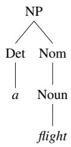
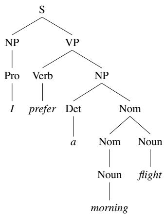

## 19.2 Context-Free Grammars

A widely used formal system for modeling constituent structure in natural language is the context-free grammar, or CFG. Context-free grammars are also called phrase-structure grammars, and the formalism is equivalent to Backus-Naur form, or BNF. The idea of basing a grammar on constituent structure dates back to the psychologist Wilhelm Wundt (1900) but was not formalized until Chomsky (1956) and, independently, Backus (1959).

A context-free grammar consists of a set of rules or productions, each of which expresses the ways that symbols of the language can be grouped and ordered together, and a lexicon of words and symbols. For example, the following productions express that an NP (or noun phrase) can be composed of either a ProperNoun or a determiner (Det) followed by a Nominal; a Nominal in turn can consist of one or

more Nouns.1

$$
\begin{array}{r c l} N P & \to & D e t   N o m i n a l \\ N P & \to & P r o p e r N o u n \\ N o m i n a l & \to & N o u n \mid N o m i n a l   N o u n \end{array}
$$

Context-free rules can be hierarchically embedded, so we can combine the previous rules with others, like the following, that express facts about the lexicon:

$$
\begin{array}{c} D e t \to a \\ D e t \to t h e \\ N o u n \to f l i g h t \end{array}
$$

The symbols that are used in a CFG are divided into two classes. The symbols that correspond to words in the language (“the”, “nightclub”) are called terminal symbols; the lexicon is the set of rules that introduce these terminal symbols. The symbols that express abstractions over these terminals are called non-terminals. In each context-free rule, the item to the right of the arrow ( ) is an ordered list of one or more terminals and non-terminals; to the left of the arrow is a single non-terminal symbol expressing some cluster or generalization. The non-terminal associated with each word in the lexicon is its lexical category, or part of speech.

A CFG can be thought of in two ways: as a device for generating sentences and as a device for assigning a structure to a given sentence. Viewing a CFG as a generator, we can read the  arrow as “rewrite the symbol on the left with the string of symbols on the right”.

$$
\begin{array}{l l} \text {So starting from the symbol:} & N P \\ \text {we can use our first rule to rewrite NP as:} & \text {Det Nominal} \\ \text {and then rewrite Nominal as:} & \text {Noun} \\ \text {and finally rewrite these parts-of-speech as:} & \text {a flight} \end{array}
$$

We say the string aflight can be derived from the non-terminal NP. Thus, a CFG can be used to generate a set of strings. This sequence of rule expansions is called a derivation of the string of words. It is common to represent a derivation by a parse tree (commonly shown inverted with the root at the top). Figure 19.1 shows the tree representation of this derivation.

  
Figure 19.1 A parse tree for “a flight”.

In the parse tree shown in Fig. 19.1, we can say that the node NP dominates all the nodes in the tree (Det, Nom, Noun, a, flight). We can say further that it immediately dominates the nodes Det and Nom.

The formal language defined by a CFG is the set of strings that are derivable from the designated start symbol. Each grammar must have one designated start symbol, which is often called S. Since context-free grammars are often used to define sentences, S is usually interpreted as the “sentence” node, and the set of strings that are derivable from S is the set of sentences in some simplified version of English.

Let’s add a few additional rules to our inventory. The following rule expresses the fact that a sentence can consist of a noun phrase followed by a verb phrase:

## S  NP VP I prefer a morning flight

A verb phrase in English consists of a verb followed by assorted other things; for example, one kind of verb phrase consists of a verb followed by a noun phrase:

$$
V P \rightarrow \text { Verb } N P \quad \text { prefer   a   morning   flight }
$$

Or the verb may be followed by a noun phrase and a prepositional phrase:

$$
V P \rightarrow \text { Verb   NP   PP } \quad \text { leave   Boston   in   the   morning }
$$

Or the verb phrase may have a verb followed by a prepositional phrase alone:

$$
V P \rightarrow \text { Verb } P P \quad \text { leaving   on   Thursday }
$$

A prepositional phrase generally has a preposition followed by a noun phrase. For example, a common type of prepositional phrase in the ATIS corpus is used to indicate location or direction:

## PP Preposition NP from Los Angeles

The NP inside a PP need not be a location; PPs are often used with times and dates, and with other nouns as well; they can be arbitrarily complex. Here are ten examples from the ATIS corpus:

<table><tr><td>to Seattle</td><td>on these flights</td></tr><tr><td>in Minneapolis</td><td>about the ground transportation in Chicago</td></tr><tr><td>on Wednesday</td><td>of the round trip flight on United Airlines</td></tr><tr><td>in the evening</td><td>of the AP fifty seven flight</td></tr><tr><td>on the ninth of July</td><td>with a stopover in Nashville</td></tr></table>

Figure 19.2 gives a sample lexicon, and Fig. 19.3 summarizes the grammar rules we’ve seen so far, which we’ll call $\mathcal { L } _ { 0 }$ . Note that we can use the or-symbol to indicate that a non-terminal has alternate possible expansions.

Noun  flights  flight  breeze  trip  morning

Verb  is  prefer  like  need  want  fly  do

Adjective  cheapest  non-stop  first  latest

Pronoun me I you it

Proper-Noun  Alaska  Baltimore  Los Angeles

Chicago  United  American

Determiner  the  a  an  this  these  that

Preposition  from  to  on  near  in

Conjunction and or but

Figure 19.2 The lexicon for L0.

We can use this grammar to generate sentences of this “ATIS-language”. We start with S, expand it to NP VP, then choose a random expansion of NP (let’s say, to

<table><tr><td colspan="2">Grammar Rules</td><td>Examples</td></tr><tr><td colspan="2">S → NP VP</td><td>I + want a morning flight</td></tr><tr><td colspan="2">NP → Pronoun</td><td>I</td></tr><tr><td></td><td>Proper-Noun</td><td>Los Angeles</td></tr><tr><td></td><td>Det Nominal</td><td>a + flight</td></tr><tr><td colspan="2">Nominal → Nominal Noun</td><td>morning + flight</td></tr><tr><td></td><td>Noun</td><td>flights</td></tr><tr><td colspan="2">VP → Verb</td><td>do</td></tr><tr><td></td><td>Verb NP</td><td>want + a flight</td></tr><tr><td></td><td>Verb NP PP</td><td>leave + Boston + in the morning</td></tr><tr><td></td><td>Verb PP</td><td>leaving + on Thursday</td></tr><tr><td colspan="2">PP → Preposition NP</td><td>from + Los Angeles</td></tr></table>

Figure 19.3 The grammar for L0, with example phrases for each rule.

  
Figure 19.4 The parse tree for “I prefer a morning flight” according to grammar $\mathcal { L } _ { 0 }$

I), and a random expansion of VP (let’s say, to Verb NP), and so on until we generate the string I prefer a morning flight. Figure 19.4 shows a parse tree that represents a complete derivation of I prefer a morningflight.

We can also represent a parse tree in a more compact format called bracketed notation; here is the bracketed representation of the parse tree of Fig. 19.4:

(19.1) [S [NP $[ { \boldsymbol { P r o } }$ I]] [VP [V prefer] [NP [Det a] [Nom [Nom [N morning]] [N flight]]]]]]

A CFG like that of $\mathcal { L } _ { 0 }$ defines a formal language. Sentences (strings of words) that can be derived by a grammar are in the formal language defined by that grammar, and are called grammatical sentences. Sentences that cannot be derived by a given formal grammar are not in the language defined by that grammar and are referred to as ungrammatical. This hard line between “in” and “out” characterizes all formal languages but is only a very simplified model of how natural languages really work. This is because determining whether a given sentence is part of a given natural language (say, English) often depends on the context. In linguistics, the use of formal languages to model natural languages is called generative grammar since the language is defined by the set of possible sentences “generated” by the grammar. (Note that this is a different sense of the word ‘generate’ than when we talk about

language models generating text.)

## 19.2.1 Formal Definition of Context-Free Grammar

We conclude this section with a quick, formal description of a context-free grammar and the language it generates. A context-free grammar G is defined by four parameters: N, Σ, R, S (technically it is a “4-tuple”).

N a set of non-terminal symbols (or variables)

Σ a set of terminal symbols (disjoint from N)

R a set of rules or productions, each of the form $A  \beta$ ,

where A is a non-terminal,

β is a string of symbols from the infinite set of strings (Σ ∪ N)∗

S a designated start symbol and a member of N

For the remainder of the book we adhere to the following conventions when discussing the formal properties of context-free grammars (as opposed to explaining particular facts about English or other languages).

<table><tr><td>Capital letters like A, B, and S</td><td>Non-terminals</td></tr><tr><td>S</td><td>The start symbol</td></tr><tr><td>Lower-case Greek letters like α, β, and γ</td><td>Strings drawn from (Σ∪N)*</td></tr><tr><td>Lower-case Roman letters like u, v, and w</td><td>Strings of terminals</td></tr></table>

A language is defined through the concept of derivation. One string derives another one if it can be rewritten as the second one by some series of rule applications. More formally, following Hopcroft and Ullman (1979),

if $A  \beta$ is a production of R and α and γ are any strings in the set

(Σ N)∗ , then we say that αAγ directly derives $\alpha \beta \gamma ,$ or $\alpha A \gamma \Rightarrow \alpha \beta \gamma .$

Derivation is then a generalization of direct derivation:

Let $\alpha _ { 1 } , \alpha _ { 2 } , \ldots , \alpha _ { m }$ be strings in $( \Sigma \cup N ) ^ { * } , m \geq 1$ , such that

$$
\alpha_ {1} \Rightarrow \alpha_ {2}, \alpha_ {2} \Rightarrow \alpha_ {3}, \dots , \alpha_ {m - 1} \Rightarrow \alpha_ {m}
$$

We say that $\alpha _ { 1 }$ derives $\alpha _ { m } , \mathrm { o r } \ : \alpha _ { 1 } \stackrel { * } { \Rightarrow } \alpha _ { m } .$

We can then formally define the language $\mathcal { L } _ { G }$ generated by a grammar G as the set of strings composed of terminal symbols that can be derived from the designated start symbol S.

$$
\mathcal {L} _ {G} = \{w | w \text {   is   in   } \Sigma^ {*} \text {   and   } S \stackrel {*} {\Rightarrow} w \}
$$

The problem of mapping from a string of words to its parse tree is called syntactic parsing, as we’ll see in Section 19.6.
