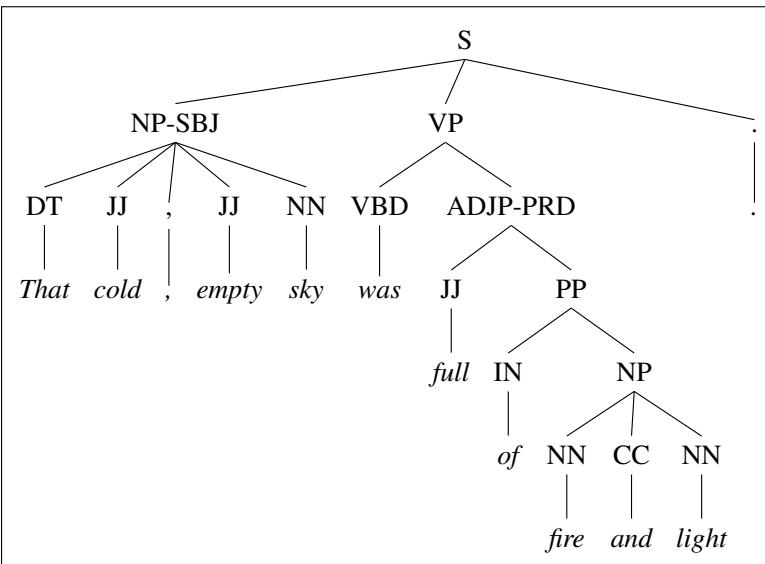

## 19.3 Treebanks

treebank A corpus in which every sentence is annotated with a parse tree is called a treebank.

Treebanks play an important role in parsing as well as in linguistic investigations of syntactic phenomena.

Treebanks are generally made by running a parser over each sentence and then having the resulting parse hand-corrected by human linguists. Figure 19.5 shows sentences from the Penn Treebank project, which includes various treebanks in English, Arabic, and Chinese. The Penn Treebank part-of-speech tagset was defined in Chapter 18, but we’ll see minor formatting differences across treebanks. The use of LISP-style parenthesized notation for trees is extremely common and resembles the bracketed notation we saw earlier in (19.1). For those who are not familiar with it we show a standard node-and-line tree representation in Fig. 19.6.

<table><tr><td rowspan="2">((S(NP-SBJ (DT That)(JJ cold) (, ,)(JJ empty) (NN sky))(VP (VBD was)(ADJP-PRD (JJ full)(PP (IN of)(NP (NN fire)(CC and)(NN light))))(. . )))(a)</td><td>((S(NP-SBJ The/DT flight/NN )(VP should/MD(VP arrive/VB(PP-TMP at/IN(NP eleven/CD a.m/RB))(NP-TMP tomorrow/NN ))))</td></tr><tr><td>(b)</td></tr></table>

Figure 19.5 Parses from the LDC Treebank3 for (a) Brown and (b) ATIS sentences.

  
Figure 19.6 The tree corresponding to the Brown corpus sentence in the previous figure.

The sentences in a treebank implicitly constitute a grammar of the language. For example, from the parsed sentences in Fig. 19.5 we can extract the CFG rules shown in Fig. 19.7 (with rule suffixes (-SBJ) stripped for simplicity). The grammar used to parse the Penn Treebank is very flat, resulting in very many rules. For example, among the approximately 4,500 different rules for expanding VPs are separate rules for PP sequences of any length and every possible arrangement of verb arguments:

```txt
Grammar Lexicon
S → NP VP. DT → the | that
S → NP VP JJ → cold | empty | full
NP → CD RB NN → sky | fire | light | flight | tomorrow
NP → DT NN CC → and
NP → NN CC NN IN → of | at
NP → DT JJ, JJ NN CD → eleven
NP → NN RB → a.m.
VP → MD VP VB → arrive
VP → VBD ADJP VBD → was | said
VP → MD VP MD → should | would
VP → VB PP NP
ADJP → JJ PP
PP → IN NP
```  
Figure 19.7 CFG grammar rules and lexicon from the treebank sentences in Fig. 19.5.

```txt
VP → VBD PP
VP → VBD PP PP
VP → VBD PP PP PP
VP → VBD PP PP PP PP
VP → VB ADVP PP
VP → VB PP ADVP
VP → ADVP VB PP
```
