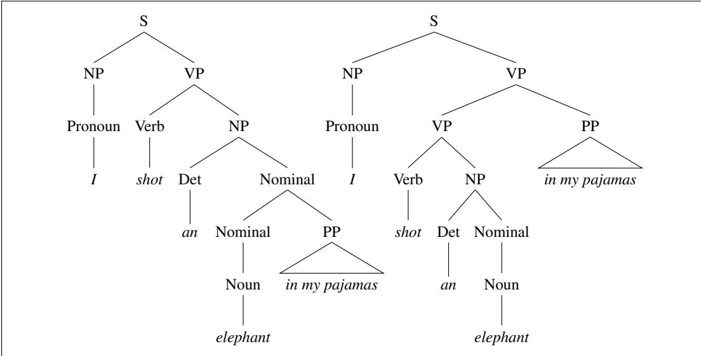

## 19.5 Ambiguity

Ambiguity is the most serious problem faced by syntactic parsers. Chapter 18 introduced the notions of part-of-speech ambiguity and part-of-speech disambiguation. Here, we introduce a new kind of ambiguity, called structural ambiguity, illustrated with a new toy grammar $\mathcal { L } _ { 1 }$ , shown in Figure 19.8, which adds a few rules to the $\mathcal { L } _ { 0 }$ grammar.

Structural ambiguity occurs when the grammar can assign more than one parse to a sentence. Groucho Marx’s well-known line as Captain Spaulding in Animal

  
Figure 19.9 Two parse trees for an ambiguous sentence. The parse on the left corresponds to the humorous reading in which the elephant is in the pajamas, the parse on the right corresponds to the reading in which Captain Spaulding did the shooting in his pajamas.

Crackers is ambiguous because the phrase in my pajamas can be part of the NP headed by elephant or a part of the verb phrase headed by shot. Figure 19.9 illustrates these two analyses of Marx’s line using rules from $\mathcal { L } _ { 1 }$

Structural ambiguity, appropriately enough, comes in many forms. Two common kinds of ambiguity are attachment ambiguity and coordination ambiguity. A sentence has an attachment ambiguity if a particular constituent can be attached to the parse tree at more than one place. The Groucho Marx sentence is an example of PP-attachment ambiguity: the preposition phrase can be attached either as part of the NP or as part of the VP. Various kinds of adverbial phrases are also subject to this kind of ambiguity. For instance, in the following example the gerundive-VP flying to Paris can be part of a gerundive sentence whose subject is the Eiffel Tower or it can be an adjunct modifying the VP headed by saw:

(19.2) We saw the Eiffel Tower flying to Paris.

In coordination ambiguity phrases can be conjoined by a conjunction like and. For example, the phrase old men and women can be bracketed as [old [men and women]], referring to old men and old women, or as [old men] and [women], in which case it is only the men who are old. These ambiguities combine in complex ways in real sentences, like the following news sentence from the Brown corpus:

(19.3) President Kennedy today pushed aside other White House business to devote all his time and attention to working on the Berlin crisis address he will deliver tomorrow night to the American people over nationwide television and radio.

This sentence has a number of ambiguities, although since they are semantically unreasonable, it requires a careful reading to see them. The last noun phrase could be parsed [nationwide [television and radio]] or [[nationwide television] and radio]. The direct object of pushed aside should be other White House business but could also be the bizarre phrase [other White House business to devote all his time and attention to working] (i.e., a structure like Kennedy affirmed [his intention to propose a new budget to address the deficit]). Then the phrase on the Berlin crisis address he will deliver tomorrow night to the American people could be an adjunct modifying the verb pushed. A PP like over nationwide television and radio could be attached to any of the higher VPs or $N P s \left( \mathrm { e . g . } \right.$ , it could modify people or night).

The fact that there are many grammatically correct but semantically unreasonable parses for naturally occurring sentences is an irksome problem that affects all parsers. Fortunately, the CKY algorithm below is designed to efficiently handle structural ambiguities. And as we’ll see in the following section, we can augment CKY with neural methods to choose a single correct parse by syntactic disambiguation.
