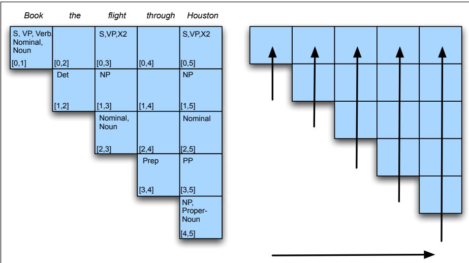
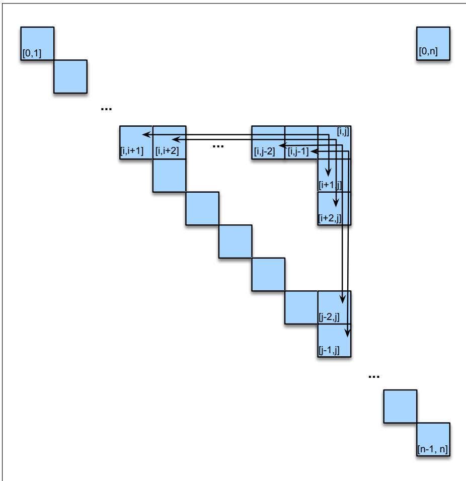
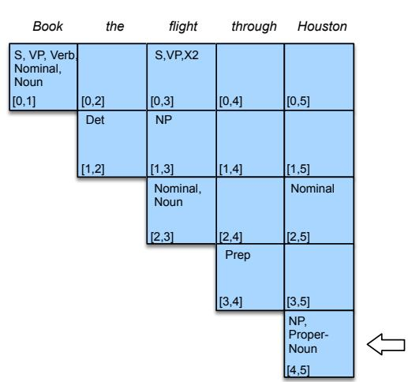
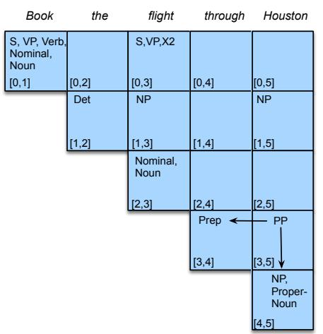
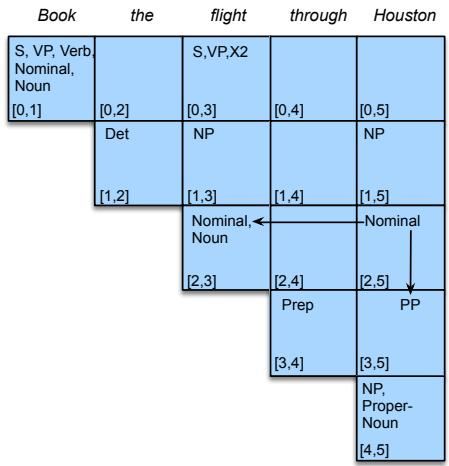
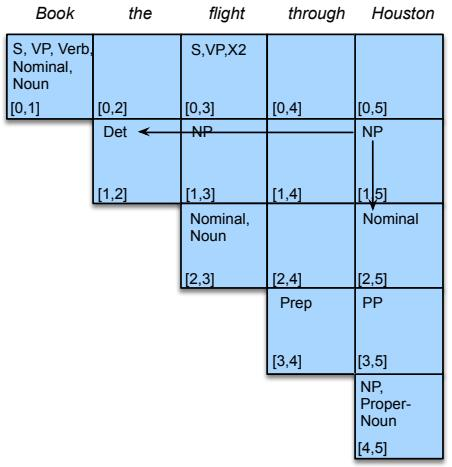
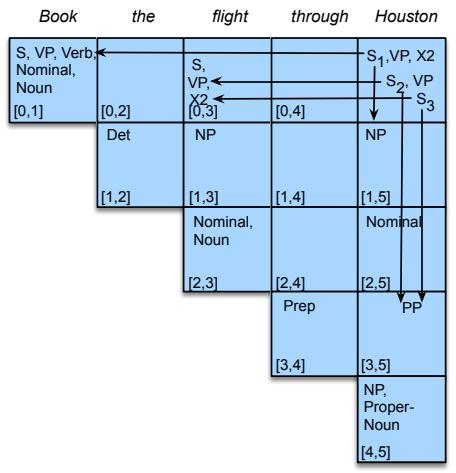

## 19.6 CKY Parsing: A Dynamic Programming Approach

Dynamic programming provides a powerful framework for addressing the problems caused by ambiguity in grammars. Recall that a dynamic programming approach systematically fills in a table of solutions to subproblems. The complete table has the solution to all the subproblems needed to solve the problem as a whole. In the case of syntactic parsing, these subproblems represent parse trees for all the constituents detected in the input.

The dynamic programming advantage arises from the context-free nature of our grammar rules—once a constituent has been discovered in a segment of the input we can record its presence and make it available for use in any subsequent derivation that might require it. This provides both time and storage efficiencies since subtrees can be looked up in a table, not reanalyzed. This section presents the Cocke-Kasami-Younger (CKY) algorithm, the most widely used dynamic-programming based approach to parsing. Chart parsing (Kaplan 1973, Kay 1982) is a related approach, and dynamic programming methods are often referred to as chart parsing methods.

## 19.6.1 Conversion to Chomsky Normal Form

The CKY algorithm requires grammars to first be in Chomsky Normal Form (CNF). Recall from Section 19.4 that grammars in CNF are restricted to rules of the form $A \to B C \operatorname { o r } A \to w .$ . That is, the right-hand side of each rule must expand either to two non-terminals or to a single terminal. Restricting a grammar to CNF does not lead to any loss in expressiveness, since any context-free grammar can be converted into a corresponding CNF grammar that accepts exactly the same set of strings as the original grammar.

Let’s start with the process of converting a generic CFG into one represented in CNF. Assuming we’re dealing with an ϵ-free grammar, there are three situations we need to address in any generic grammar: rules that mix terminals with non-terminals on the right-hand side, rules that have a single non-terminal on the right-hand side, and rules in which the length of the right-hand side is greater than 2.

The remedy for rules that mix terminals and non-terminals is to simply introduce a new dummy non-terminal that covers only the original terminal. For example, a rule for an infinitive verb phrase such as $I N F { \cdot } V P $ to VP would be replaced by the two rules $I N F { \cdot } V P  T O V P$ and $T O \  \ t o .$

Rules with a single non-terminal on the right are called unit productions. We can eliminate unit productions by rewriting the right-hand side of the original rules with the right-hand side of all the non-unit production rules that they ultimately lead to. More formally, if $A \stackrel { * } { \Rightarrow } B$ by a chain of one or more unit productions and $B \to \gamma$ is a non-unit production in our grammar, then we add $A  \gamma$ for each such rule in the grammar and discard all the intervening unit productions. As we demonstrate with our toy grammar, this can lead to a substantial flattening of the grammar and a consequent promotion of terminals to fairly high levels in the resulting trees.

Rules with right-hand sides longer than 2 are normalized through the introduction of new non-terminals that spread the longer sequences over several new rules. Formally, if we have a rule like

$$
A \to B C \gamma
$$

we replace the leftmost pair of non-terminals with a new non-terminal and introduce a new production, resulting in the following new rules:

$$
\begin{array}{c} A \to X 1 \gamma \\ X 1 \to B C \end{array}
$$

In the case of longer right-hand sides, we simply iterate this process until the offending rule has been replaced by rules of length 2. The choice of replacing the leftmost pair of non-terminals is purely arbitrary; any systematic scheme that results in binary rules would suffice.

In our current grammar, the rule S  Aux NP VP would be replaced by the two rules S X1 VP and $X l $ Aux NP.

The entire conversion process can be summarized as follows:

1. Copy all conforming rules to the new grammar unchanged.

2. Convert terminals within rules to dummy non-terminals.

3. Convert unit productions.

4. Make all rules binary and add them to new grammar.

Figure 19.10 shows the results of applying this entire conversion procedure to the $\mathcal { L } _ { 1 }$ grammar introduced earlier on page 433. Note that this figure doesn’t show the original lexical rules; since these original lexical rules are already in CNF, they all carry over unchanged to the new grammar. Figure 19.10 does, however, show the various places where the process of eliminating unit productions has, in effect, created new lexical rules. For example, all the original verbs have been promoted to both VPs and to Ss in the converted grammar.

## 19.6.2 CKY Recognition

With our grammar now in CNF, each non-terminal node above the part-of-speech level in a parse tree will have exactly two daughters. A two-dimensional matrix can be used to encode the structure of an entire tree. For a sentence of length n, we will work with the upper-triangular portion of an $( n + 1 ) \times ( n + 1 )$ matrix. Each cell $[ i , j ]$ in this matrix contains the set of non-terminals that represent all the constituents that span positions i through j of the input. Since our indexing scheme begins with 0, it’s natural to think of the indexes as pointing at the gaps between the input words (as in $\phantom { } _ { 0 } B o o k \phantom { } _ { 1 }$ that $_ { 2 } \hbar i g h t _ { 3 } )$ . These gaps are often called fenceposts, on the metaphor of the posts between segments of fencing. It follows then that the cell that represents the entire input resides in position $[ 0 , n ]$ in the matrix.

Since each non-terminal entry in our table has two daughters in the parse, it follows that for each constituent represented by an entry $[ i , j ]$ , there must be a position in the input, k, where it can be split into two parts such that $i < k < j .$ . Given such a position k, the first constituent [i, k] must lie to the left of entry [i, j] somewhere along row i, and the second entry [k, j] must lie beneath it, along column j.

19.6 • CKY PARSING: A DYNAMIC PROGRAMMING APPROACH

<div class="mineru-algorithm" style="white-space: pre-wrap; font-family:monospace;">
$\mathcal{L}_{1}$ Grammar $\mathcal{L}_{1}$ in CNF
$S \rightarrow NP VP$ $S \rightarrow NP VP$ $S \rightarrow Aux NP VP$ $S \rightarrow X1 VP$ $X1 \rightarrow Aux NP$ $S \rightarrow VP$ $S \rightarrow book | include | prefer$ $S \rightarrow Verb NP$ $S \rightarrow X2 PP$ $S \rightarrow Verb PP$ $S \rightarrow VP PP$ $NP \rightarrow Pronoun$ $NP \rightarrow I | she | me$ $NP \rightarrow Proper-Noun$ $NP \rightarrow United | Houston$ $NP \rightarrow Det Nominal$ $NP \rightarrow Det Nominal$ $Nominal \rightarrow Noun$ $Nominal \rightarrow book | flight | meal | money$ $Nominal \rightarrow Nominal Noun$ $Nominal \rightarrow Nominal Noun$ $Nominal \rightarrow Nominal PP$ $Nominal \rightarrow Nominal PP$ $VP \rightarrow Verb$ $VP \rightarrow book | include | prefer$ $VP \rightarrow Verb NP$ $VP \rightarrow Verb NP$ $VP \rightarrow Verb NP PP$ $VP \rightarrow X2 PP$ $X2 \rightarrow Verb NP$ $VP \rightarrow Verb PP$ $VP \rightarrow Verb PP$ $VP \rightarrow VP PP$ $VP \rightarrow VP PP$ $PP \rightarrow Preposition NP$ $PP \rightarrow Preposition NP$

Figure 19.10 $\mathcal{L}_{1}$ Grammar and its conversion to CNF. Note that although they aren’t shown here, all the original lexical entries from $\mathcal{L}_{1}$ carry over unchanged as well.
</div>

To make this more concrete, consider the following example with its completed parse matrix, shown in Fig. 19.11.

## (19.4) Book the flight through Houston.

The superdiagonal row in the matrix contains the parts of speech for each word in the input. The subsequent diagonals above that superdiagonal contain constituents that cover all the spans of increasing length in the input.

Given this setup, CKY recognition consists of filling the parse table in the right way. To do this, we’ll proceed in a bottom-up fashion so that at the point where we are filling any cell [i, j], the cells containing the parts that could contribute to this entry (i.e., the cells to the left and the cells below) have already been filled. The algorithm given in Fig. 19.12 fills the upper-triangular matrix a column at a time working from left to right, with each column filled from bottom to top, as the right side of Fig. 19.11 illustrates. This scheme guarantees that at each point in time we have all the information we need (to the left, since all the columns to the left have already been filled, and below since we’re filling bottom to top). It also mirrors online processing, since filling the columns from left to right corresponds to processing each word one at a time.

The outermost loop of the algorithm given in Fig. 19.12 iterates over the columns, and the second loop iterates over the rows, from the bottom up. The purpose of the innermost loop is to range over all the places where a substring spanning i to j in the input might be split in two. As k ranges over the places where the string can be split, the pairs of cells we consider move, in lockstep, to the right along row i and down along column j. Figure 19.13 illustrates the general case of filling cell [i, j].

  
Figure 19.11 Completed parse table for Book the flight through Houston.

```txt
function CKY-PARSE(words, grammar) returns table
for j← from 1 to LENGTH(words) do
for all {A|A → words[j] ∈ grammar}
table[j-1,j] ← table[j-1,j] ∪ A
for i← from j-2 down to 0 do
for k← i+1 to j-1 do
for all {A|A → BC ∈ grammar and B ∈ table[i,k] and C ∈ table[k,j]}
table[i,j] ← table[i,j] ∪ A

Figure 19.12 The CKY algorithm.
```

At each such split, the algorithm considers whether the contents of the two cells can be combined in a way that is sanctioned by a rule in the grammar. If such a rule exists, the non-terminal on its left-hand side is entered into the table.

Figure 19.14 shows how the five cells of column 5 of the table are filled after the word Houston is read. The arrows point out the two spans that are being used to add an entry to the table. Note that the action in cell [0,5] indicates the presence of three alternative parses for this input, one where the PP modifies the flight, one where it modifies the booking, and one that captures the second argument in the original VP Verb NP PP rule, now captured indirectly with the $V P  X 2 \ : P P$ rule.

## 19.6.3 CKY Parsing

The algorithm given in Fig. 19.12 is a recognizer, not a parser. That is, it can tell us whether a valid parse exists for a given sentence based on whether or not if finds an S in cell [0,n], but it can’t provide the derivation, which is the actual job for a parser. To turn it into a parser capable of returning all possible parses for a given input, we can make two simple changes to the algorithm: the first change is to augment the entries in the table so that each non-terminal is paired with pointers to the table entries from which it was derived (more or less as shown in Fig. 19.14), the second change is to permit multiple versions of the same non-terminal to be entered into the table (again as shown in Fig. 19.14). With these changes, the completed table contains all the possible parses for a given input. Returning an arbitrary single parse consists of choosing an S from cell [0, n] and then recursively retrieving its component constituents from the table. Of course, instead of returning every parse for a sentence, we usually want just the best parse; we’ll see how to do that in the next section.

  
Figure 19.13 All the ways to fill the [i, j]th cell in the CKY table.

## 19.6.4 CKY in Practice

Finally, we should note that while the restriction to CNF does not pose a problem theoretically, it does pose some non-trivial problems in practice. The returned CNF trees may not be consistent with the original grammar built by the grammar developers, and will complicate any syntax-driven approach to semantic analysis.

One approach to getting around these problems is to keep enough information around to transform our trees back to the original grammar as a post-processing step of the parse. This is trivial in the case of the transformation used for rules with length greater than 2. Simply deleting the new dummy non-terminals and promoting their daughters restores the original tree.

In the case of unit productions, it turns out to be more convenient to alter the basic CKY algorithm to handle them directly than it is to store the information needed to recover the correct trees. Exercise 19.3 asks you to make this change. Many of the probabilistic parsers presented in Appendix E use the CKY algorithm altered in

<table><tr><td></td><td></td></tr><tr><td></td><td></td></tr><tr><td colspan="2"></td></tr></table>

Figure 19.14 Filling the cells of column 5 after reading the word Houston.

just this manner.
