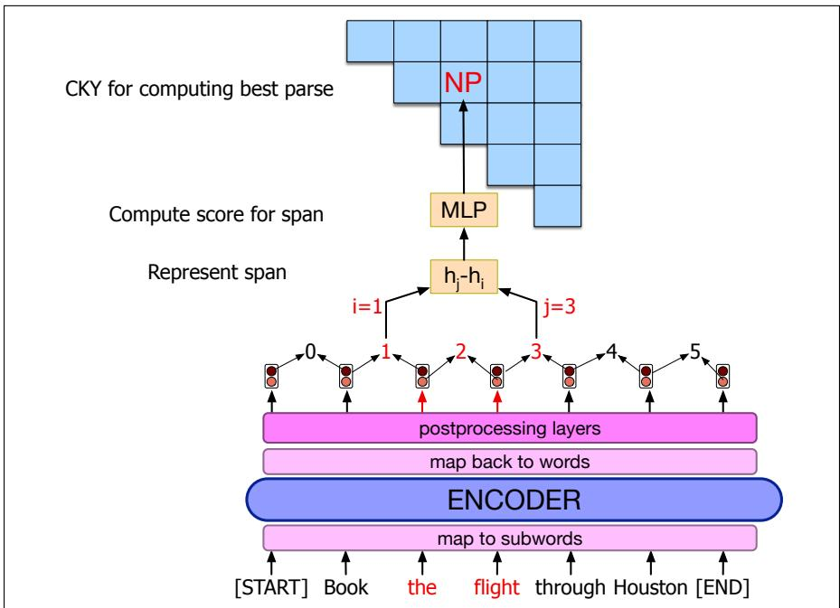
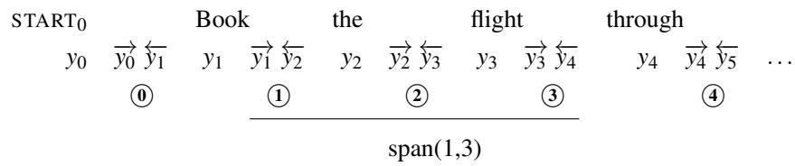

## 19.7 Span-Based Neural Constituency Parsing

While the CKY parsing algorithm we’ve seen so far does great at enumerating all the possible parse trees for a sentence, it has a large problem: it doesn’t tell us which parse is the correct one! That is, it doesn’t disambiguate among the possible parses. To solve the disambiguation problem we’ll use a simple neural extension of the CKY algorithm. The intuition of such parsing algorithms (often called span-based constituency parsing, or neural CKY), is to train a neural classifier to assign a score to each constituent, and then use a modified version of CKY to combine these constituent scores to find the best-scoring parse tree.

Here we’ll describe a version of the algorithm from Kitaev et al. (2019). This parser learns to map a span of words to a constituent, and, like CKY, hierarchically combines larger and larger spans to build the parse-tree bottom-up. But unlike classic CKY, this parser doesn’t use the hand-written grammar to constrain what constituents can be combined, instead just relying on the learned neural representations of spans to encode likely combinations.

## 19.7.1 Computing Scores for a Span

Let’s begin by considering just the constituent (we’ll call it a span) that lies between fencepost positions i and j with non-terminal symbol label l. We’ll build a system to assign a score $s ( i , j , l )$ to this constituent span.

  
Figure 19.15 A simplified outline of computing the span score for the span the flight with the label NP.  
Fig. 19.15 sketches the architecture. The input word tokens are embedded by

passing them through a pretrained language model like BERT. Because BERT operates on the level of subword (wordpiece) tokens rather than words, we’ll first need to convert the BERT outputs to word representations. One standard way of doing this is to simply use the first subword unit as the representation for the entire word; using the last subword unit, or the sum of all the subword units are also common. The embeddings can then be passed through some postprocessing layers; Kitaev et al. (2019), for example, use 8 Transformer layers.

The resulting word encoder outputs yt are then used to compute a span score. First, we must map the word encodings (indexed by word positions) to span encodings (indexed by fenceposts). We do this by representing each fencepost with two separate values; the intuition is that a span endpoint to the right of a word represents different information than a span endpoint to the left of a word. We convert each word output $y _ { t }$ into a (leftward-pointing) value for spans ending at this fencepost, $\left. \right.$ , and a (rightward-pointing) value $\smash { \vec { y } } _ { t }$ for spans beginning at this fencepost, by splitting yt into two halves. Each span then stretches from one double-vector fencepost to another, as in the following representation of theflight, which is span(1,3):

A traditional way to represent a span, developed originally for RNN-based models (Wang and Chang, 2016), but extended also to Transformers, is to take the difference between the embeddings of its start and end, i.e., representing span $( i , j )$ by subtracting the embedding of i from the embedding of $j .$ Here we represent a span by concatenating the difference of each of its fencepost components:

$$
v (i, j) = [ \overrightarrow {y _ {j}} - \overrightarrow {y _ {i}}; \overleftarrow {y _ {j + 1}} - \overleftarrow {y _ {i + 1}} ]\tag{19.5}
$$

The span vector v is then passed through an MLP span classifier, with two fullyconnected layers and one ReLU activation function, whose output dimensionality is the number of possible non-terminal labels:

$$
s (i, j, \cdot) = \mathbf {W} _ {2} \operatorname{ReLU} (\text { LayerNorm } (\mathbf {W} _ {1} \mathbf {v} (i, j)))\tag{19.6}
$$

The MLP then outputs a score for each possible non-terminal.

## 19.7.2 Integrating Span Scores into a Parse

Now we have a score for each labeled constituent span $s ( i , j , l )$ . But we need a score for an entire parse tree. Formally a tree $T$ is represented as a set of T such labeled spans, with the $t ^ { \mathrm { { t h } } }$ span starting at position $i _ { t }$ and ending at position $j _ { t }$ , with label lt :

$$
T = \{(i _ {t}, j _ {t}, l _ {t}): t = 1, \dots , | T | \}\tag{19.7}
$$

Thus once we have a score for each span, the parser can compute a score for the whole tree $s ( T )$ simply by summing over the scores of its constituent spans:

$$
s (T) = \sum_ {(i, j, l) \in T} s (i, j, l)\tag{19.8}
$$

And we can choose the final parse tree as the tree with the maximum score:

$$
\hat {T} = \underset {T} {\operatorname{argmax}} s (T)\tag{19.9}
$$

The simplest method to produce the most likely parse is to greedily choose the highest scoring label for each span. This greedy method is not guaranteed to produce a tree, since the best label for a span might not fit into a complete tree. In practice, however, the greedy method tends to find trees; in their experiments Gaddy et al. (2018) finds that 95% of predicted bracketings form valid trees.

Nonetheless it is more common to use a variant of the CKY algorithm to find the full parse. The variant defined in Gaddy et al. (2018) works as follows. Let’s define $s _ { \mathrm { b e s t } } ( i , j )$ as the score of the best subtree spanning $( i , j )$ ). For spans of length one, we choose the best label:

$$
s _ {\text { best }} (i, i + 1) = \max _ {l} s (i, i + 1, l)\tag{19.10}
$$

For other spans $( i , j )$ , the recursion is:

$$
\begin{array}{l} s _ {\text { best }} (i, j) = \max _ {l} s (i, j, l) \\ + \max _ {k} [ s _ {\text { best }} (i, k) + s _ {\text { best }} (k, j) ] \end{array}\tag{19.11}
$$

Note that the parser is using the max label for span $( i , j ) +$ the max labels for spans (i, k) and $( k , j )$ without worrying about whether those decisions make sense given a grammar. The role of the grammar in classical parsing is to help constrain possible combinations of constituents (NPs like to be followed by VPs). By contrast, the neural model seems to learn these kinds of contextual constraints during its mapping from spans to non-terminals.

For more details on span-based parsing, including the margin-based training algorithm, see Stern et al. (2017), Gaddy et al. (2018), Kitaev and Klein (2018), and Kitaev et al. (2019).
