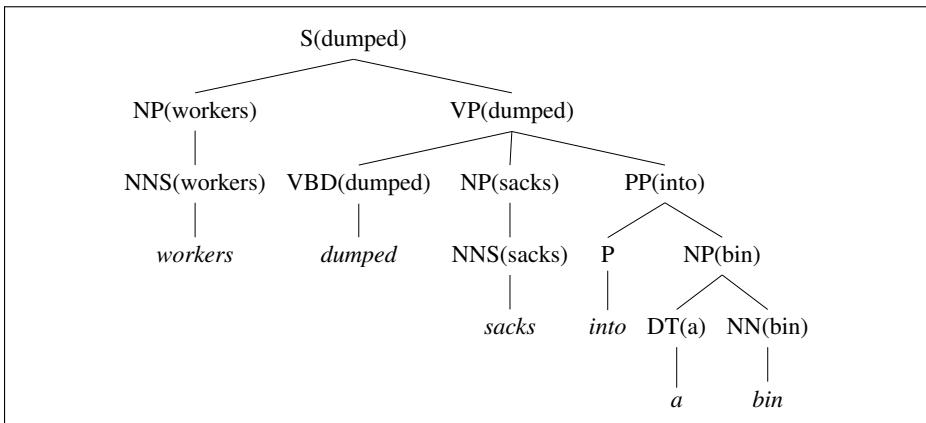

## 19.8 Evaluating Parsers

The standard tool for evaluating parsers that assign a single parse tree to a sentence is the PARSEVAL metrics (Black et al., 1991). The PARSEVAL metric measures how much the constituents in the hypothesis parse tree look like the constituents in a hand-labeled, reference parse. PARSEVAL thus requires a human-labeled reference (or “gold standard”) parse tree for each sentence in the test set; we generally draw these reference parses from a treebank like the Penn Treebank.

A constituent in a hypothesis parse $C _ { h }$ of a sentence s is labeled correct if there is a constituent in the reference parse $C _ { r }$ with the same starting point, ending point, and non-terminal symbol. We can then measure the precision and recall just as for tasks we’ve seen already like named entity tagging:

$$
\text { labeled   recall: } = \frac {\# \text { of   correct   constituents   in   hypothesis   parse   of } s}{\# \text { of   total   constituents   in   reference   parse   of } s}
$$

$$
\text { labeled   precision: } = \frac {\# \text { of   correct   constituents   in   hypothesis   parse   of } s}{\# \text { of   total   constituents   in   hypothesis   parse   of } s}
$$

  
Figure 19.16 A lexicalized tree from Collins (1999).

As usual, we often report a combination of the two, F1:

$$
\mathrm{F} _ {1} = \frac {2 P R}{P + R}\tag{19.12}
$$

We additionally use a new metric, crossing brackets, for each sentence s:

cross-brackets: the number of constituents for which the reference parse has a bracketing such as ((A B) C) but the hypothesis parse has a bracketing such as (A (B C)).

For comparing parsers that use different grammars, the PARSEVAL metric includes a canonicalization algorithm for removing information likely to be grammarspecific (auxiliaries, pre-infinitival “to”, etc.) and for computing a simplified score (Black et al., 1991). The canonical implementation of the PARSEVAL metrics is called evalb (Sekine and Collins, 1997).
