# Dependency Parsing

Tout mot qui fait partie d’une phrase... Entre lui et ses voisins, l’esprit aperc¸oit des connexions, dont l’ensemble forme la charpente de la phrase.

[Between each word in a sentence and its neighbors, the mind perceives connections. These connections together form the scaffolding of the sentence.] Lucien Tesniere. 1959.\` El<sup>´</sup> ements de syntaxe structurale, A.1.§3´

The focus of the last chapter was on context-free grammars and constituentbased representations. Here we present another important family of grammar formalisms called dependency grammars. In dependency formalisms, phrasal constituents and phrase-structure rules do not play a direct role. Instead, the syntactic structure of a sentence is described solely in terms of directed binary grammatical relations between the words, as in the following dependency parse:


(20.1)

Relations among the words are illustrated above the sentence with directed, labeled arcs from heads to dependents. We call this a typed dependency structure because the labels are drawn from a fixed inventory of grammatical relations. A root node explicitly marks the root of the tree, the head of the entire structure.

Figure 20.1 on the next page shows the dependency analysis from Eq. 20.1 but visualized as a tree, alongside its corresponding phrase-structure analysis of the kind given in the prior chapter. Note the absence of nodes corresponding to phrasal constituents or lexical categories in the dependency parse; the internal structure of the dependency parse consists solely of directed relations between words. These headdependent relationships directly encode important information that is often buried in the more complex phrase-structure parses. For example, the arguments to the verb prefer are directly linked to it in the dependency structure, while their connection to the main verb is more distant in the phrase-structure tree. Similarly, morning and Denver, modifiers of flight, are linked to it directly in the dependency structure. This fact that the head-dependent relations are a good proxy for the semantic relationship between predicates and their arguments is an important reason why dependency grammars are currently more common than constituency grammars in natural language processing.

Another major advantage of dependency grammars is their ability to deal with languages that have a relatively free word order. For example, word order in Czech can be much more flexible than in English; a grammatical object might occur before or after a location adverbial. A phrase-structure grammar would need a separate rule for each possible place in the parse tree where such an adverbial phrase could occur. A dependency-based approach can have just one link type representing this particular adverbial relation; dependency grammar approaches can thus abstract away a bit more from word order information.

  
Figure 20.1 Dependency and constituent analyses for I prefer the morningflight through Denver.

In the following sections, we’ll give an inventory of relations used in dependency parsing, discuss two families of parsing algorithms (transition-based, and graphbased), and discuss evaluation.

## 20.1 Dependency Relations

The traditional linguistic notion of grammatical relation provides the basis for the binary relations that comprise these dependency structures. The arguments to these relations consist of a head and a dependent. The head plays the role of the central organizing word, and the dependent as a kind of modifier. The head-dependent relationship is made explicit by directly linking heads to the words that are immediately dependent on them.

In addition to specifying the head-dependent pairs, dependency grammars allow us to classify the kinds of grammatical relations, or grammatical function that the dependent plays with respect to its head. These include familiar notions such as subject, direct object and indirect object. In English these notions strongly correlate with, but by no means determine, both position in a sentence and constituent type and are therefore somewhat redundant with the kind of information found in phrase-structure trees. However, in languages with more flexible word order, the information encoded directly in these grammatical relations is critical since phrasebased constituent syntax provides little help.

Linguists have developed taxonomies of relations that go well beyond the familiar notions of subject and object. While there is considerable variation from theory to theory, there is enough commonality that cross-linguistic standards have been developed. The Universal Dependencies (UD) project (de Marneffe et al., 2021), an open community effort to annotate dependencies and other aspects of grammar across more than 100 languages, provides an inventory of 37 dependency relations. Fig. 20.2 shows a subset of the UD relations and Fig. 20.3 provides some examples.

<table><tr><td>Clausal Argument Relations</td><td>Description</td></tr><tr><td>NSUBJ</td><td>Nominal subject</td></tr><tr><td>OBJ</td><td>Direct object</td></tr><tr><td>IOBJ</td><td>Indirect object</td></tr><tr><td>CCOMP</td><td>Clausal complement</td></tr><tr><td>Nominal Modifier Relations</td><td>Description</td></tr><tr><td>NMOD</td><td>Nominal modifier</td></tr><tr><td>AMOD</td><td>Adjectival modifier</td></tr><tr><td>APPOS</td><td>Appositional modifier</td></tr><tr><td>DET</td><td>Determiner</td></tr><tr><td>CASE</td><td>Prepositions, postpositions and other case markers</td></tr><tr><td>Other Notable Relations</td><td>Description</td></tr><tr><td>CONJ</td><td>Conjunct</td></tr><tr><td>CC</td><td>Coordinating conjunction</td></tr></table>

Figure 20.2 Some of the Universal Dependency relations (de Marneffe et al., 2021).

The motivation for all of the relations in the Universal Dependency scheme is beyond the scope of this chapter, but the core set of frequently used relations can be broken into two sets: clausal relations that describe syntactic roles with respect to a predicate (often a verb), and modifier relations that categorize the ways that words can modify their heads.

Consider, for example, the following sentence:

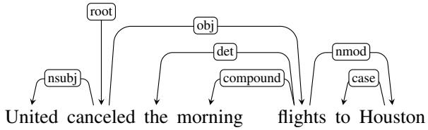

(20.2)

Here the clausal relations NSUBJ and OBJ identify the subject and direct object of the predicate cancel, while the NMOD, DET, and CASE relations denote modifiers of the nounsflights and Houston.

## 20.1.1 Dependency Formalisms

A dependency structure can be represented as a directed graph $G = \left( V , A \right)$ , consisting of a set of vertices V, and a set of ordered pairs of vertices A, which we’ll call arcs.

For the most part we will assume that the set of vertices, V, corresponds exactly to the set of words in a given sentence. However, they might also correspond to punctuation, or when dealing with morphologically complex languages the set of vertices might consist of stems and affixes. The set of arcs, A, captures the headdependent and grammatical function relationships between the elements in V.

Different grammatical theories or formalisms may place further constraints on these dependency structures. Among the more frequent restrictions are that the structures must be connected, have a designated root node, and be acyclic or planar. Of most relevance to the parsing approaches discussed in this chapter is the common, computationally-motivated, restriction to rooted trees. That is, a dependency tree is a directed graph that satisfies the following constraints:

<table><tr><td>Relation</td><td>Examples with head and dependent</td></tr><tr><td>NSUBJ</td><td>United canceled the flight.</td></tr><tr><td>OBJ</td><td>United diverted the flight to Reno.We booked her the first flight to Miami.</td></tr><tr><td>IOBJ</td><td>We booked her the flight to Miami.</td></tr><tr><td>COMPOUND</td><td>We took the morning flight.</td></tr><tr><td>NMOD</td><td>flight to Houston.</td></tr><tr><td>AMOD</td><td>Book the cheapest flight.</td></tr><tr><td>APPOS</td><td>United, a unit of UAL, matched the fares.</td></tr><tr><td>DET</td><td>The flight was canceled.Which flight was delayed?</td></tr><tr><td>CONJ</td><td>We flew to Denver and drove to Steamboat.</td></tr><tr><td>CC</td><td>We flew to Denver and drove to Steamboat.</td></tr><tr><td>CASE</td><td>Book the flight through Houston.</td></tr></table>

Figure 20.3 Examples of some Universal Dependency relations.

1. There is a single designated root node that has no incoming arcs.

2. With the exception of the root node, each vertex has exactly one incoming arc.

3. There is a unique path from the root node to each vertex in V.

Taken together, these constraints ensure that each word has a single head, that the dependency structure is connected, and that there is a single root node from which one can follow a unique directed path to each of the words in the sentence.

## 20.1.2 Projectivity

The notion of projectivity imposes an additional constraint that is derived from the order of the words in the input. An arc from a head to a dependent is said to be projective if there is a path from the head to every word that lies between the head and the dependent in the sentence. A dependency tree is then said to be projective if all the arcs that make it up are projective. All the dependency trees we’ve seen thus far have been projective. There are, however, many valid constructions which lead to non-projective trees, particularly in languages with relatively flexible word order.

Consider the following example.

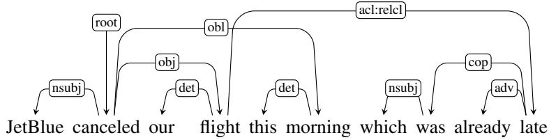

(20.3)

In this example, the arc from flight to its modifier late is non-projective since there is no path fromflight to the intervening words this and morning. As we can see from this diagram, projectivity (and non-projectivity) can be detected in the way we’ve been drawing our trees. A dependency tree is projective if it can be drawn with no crossing edges. Here there is no way to link flight to its dependent late without crossing the arc that links morning to its head.

Our concern with projectivity arises from two related issues. First, the most widely used English dependency treebanks were automatically derived from phrasestructure treebanks through the use of head-finding rules. The trees generated in such a fashion will always be projective, and hence will be incorrect when non-projective examples like this one are encountered.

Second, there are computational limitations to the most widely used families of parsing algorithms. The transition-based approaches discussed in Section 20.2 can only produce projective trees, hence any sentences with non-projective structures will necessarily contain some errors. This limitation is one of the motivations for the more flexible graph-based parsing approach described in Section 20.3.

## 20.1.3 Dependency Treebanks

Treebanks play a critical role in the development and evaluation of dependency parsers. They are used for training parsers, they act as the gold labels for evaluating parsers, and they also provide useful information for corpus linguistics studies.

Dependency treebanks are created by having human annotators directly generate dependency structures for a given corpus, or by hand-correcting the output of an automatic parser. A few early treebanks were also based on using a deterministic process to translate existing constituent-based treebanks into dependency trees.

The largest open community project for building dependency trees is the Universal Dependencies project at https://universaldependencies.org/ introduced above, which currently has almost 200 dependency treebanks in more than 100 languages (de Marneffe et al., 2021). Here are a few UD examples showing dependency trees for sentences in Spanish, Basque, and Mandarin Chinese:

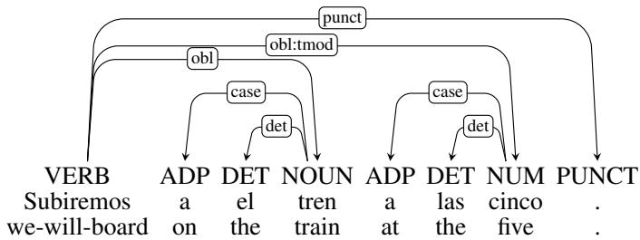  
[Spanish] Subiremos al tren a las cinco. “We will be boarding the train at five.”(20.4)

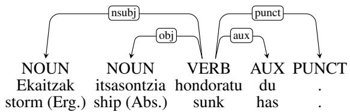  
[Basque] Ekaitzak itsasontzia hondoratu du. “The storm has sunk the ship.”(20.5)

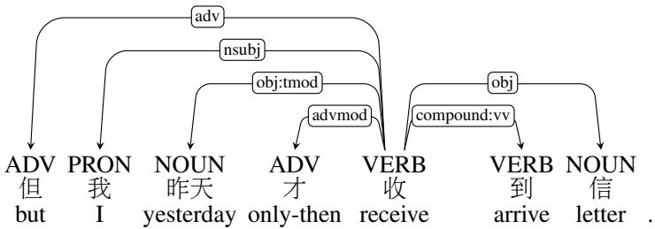  
[Chinese] 但我昨天才收到信 “But I didn’t receive the letter until yesterday”(20.6)

## 20.2 Transition-Based Dependency Parsing

Our first approach to dependency parsing is called transition-based parsing. This architecture draws on shift-reduce parsing, a paradigm originally developed for analyzing programming languages (Aho and Ullman, 1972). In transition-based parsing we’ll have a stack on which we build the parse, a buffer of tokens to be parsed, and a parser which takes actions on the parse via a predictor called an oracle, as illustrated in Fig. 20.4.

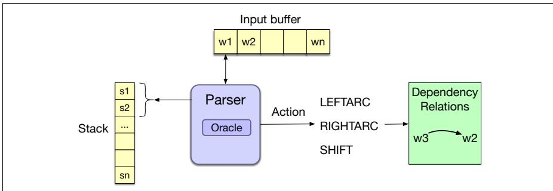  
Figure 20.4 Basic transition-based parser. The parser examines the top two elements of the stack and selects an action by consulting an oracle that examines the current configuration.

The parser walks through the sentence left-to-right, successively shifting items from the buffer onto the stack. At each time point we examine the top two elements on the stack, and the oracle makes a decision about what transition to apply to build the parse. The possible transitions correspond to the intuitive actions one might take in creating a dependency tree by examining the words in a single pass over the input from left to right (Covington, 2001):

• Assign the current word as the head of some previously seen word,

• Assign some previously seen word as the head of the current word,

• Postpone dealing with the current word, storing it for later processing.

We’ll formalize this intuition with the following three transition operators that will operate on the top two elements of the stack:

• LEFTARC: Assert a head-dependent relation between the word at the top of the stack and the second word; remove the second word from the stack.

• RIGHTARC: Assert a head-dependent relation between the second word on the stack and the word at the top; remove the top word from the stack;

• SHIFT: Remove the word from the front of the input buffer and push it onto the stack.

We’ll sometimes call operations like LEFTARC and RIGHTARC reduce operations, based on a metaphor from shift-reduce parsing, in which reducing means combining elements on the stack. There are some preconditions for using operators. The LEFTARC operator cannot be applied when ROOT is the second element of the stack (since by definition the ROOT node cannot have any incoming arcs). And both the LEFTARC and RIGHTARC operators require two elements to be on the stack to be applied.

This particular set of operators implements what is known as the arc standard approach to transition-based parsing (Covington 2001, Nivre 2003, Yamada and Matsumoto 2003). In arc standard parsing the transition operators only assert relations between elements at the top of the stack, and once an element has been assigned its head it is removed from the stack and is not available for further processing. As we’ll see, there are alternative transition systems which demonstrate different parsing behaviors, but the arc standard approach is quite effective and is simple to implement.

The specification of a transition-based parser is quite simple, based on representing the current state of the parse as a configuration: the stack, an input buffer of words or tokens, and a set of relations representing a dependency tree. Parsing means making a sequence of transitions through the space of possible configurations. We start with an initial configuration in which the stack contains the ROOT node, the buffer has the tokens in the sentence, and an empty set of relations represents the parse. In the final goal state, the stack and the word list should be empty, and the set of relations will represent the final parse. Fig. 20.5 gives the algorithm.

```txt
function DEPENDENCYPARSE(words) returns dependency tree
state ← { [root], [words], [] } ; initial configuration
while state not final
t ← ORACLE(state) ; choose a transition operator to apply
state ← APPLY(t, state) ; apply it, creating a new state
return state
```

Figure 20.5 A generic transition-based dependency parser

At each step, the parser consults an oracle (we’ll come back to this shortly) that provides the correct transition operator to use given the current configuration. It then applies that operator to the current configuration, producing a new configuration. The process ends when all the words in the sentence have been consumed and the ROOT node is the only element remaining on the stack.

The efficiency of transition-based parsers should be apparent from the algorithm. The complexity is linear in the length of the sentence since it is based on a single left to right pass through the words in the sentence. (Each word must first be shifted onto the stack and then later reduced.)

Note that unlike the dynamic programming and search-based approaches discussed in Chapter 19, this approach is a straightforward greedy algorithm—the oracle provides a single choice at each step and the parser proceeds with that choice, no other options are explored, no backtracking is employed, and a single parse is returned in the end.

Figure 20.6 illustrates the operation of the parser with the sequence of transitions leading to a parse for the following example.

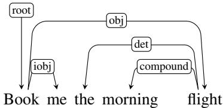

(20.7)

Let’s consider the state of the configuration at Step 2, after the word me has been pushed onto the stack.

<table><tr><td>Stack</td><td>Word List</td><td>Relations</td></tr><tr><td>[root, book, me]</td><td>[the, morning, flight]</td><td></td></tr></table>

The correct operator to apply here is RIGHTARC which assigns book as the head of me and pops me from the stack resulting in the following configuration.

<table><tr><td>Stack</td><td>Word List</td><td>Relations</td></tr><tr><td>[root, book]</td><td>[the, morning, flight]</td><td>(book → me)</td></tr></table>

After several subsequent applications of the SHIFT operator, the configuration in Step 6 looks like the following:

<table><tr><td>Stack</td><td>Word List</td><td>Relations</td></tr><tr><td>[root, book, the, morning, flight]</td><td>[]</td><td>(book → me)</td></tr></table>

Here, all the remaining words have been passed onto the stack and all that is left to do is to apply the appropriate reduce operators. In the current configuration, we employ the LEFTARC operator resulting in the following state.

<table><tr><td>Stack</td><td>Word List</td><td>Relations</td></tr><tr><td>[root, book, the, flight]</td><td>[]</td><td>(book → me)(morning ← flight)</td></tr></table>

At this point, the parse for this sentence consists of the following structure.

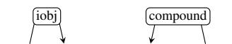

(20.8)

Book me the morning flight

There are several important things to note when examining sequences such as the one in Figure 20.6. First, the sequence given is not the only one that might lead to a reasonable parse. In general, there may be more than one path that leads to the same result, and due to ambiguity, there may be other transition sequences that lead to different equally valid parses.

Second, we are assuming that the oracle always provides the correct operator at each point in the parse—an assumption that is unlikely to be true in practice. As a result, given the greedy nature of this algorithm, incorrect choices will lead to incorrect parses since the parser has no opportunity to go back and pursue alternative choices. Section 20.2.4 will introduce several techniques that allow transition-based approaches to explore the search space more fully.

<table><tr><td>Step</td><td>Stack</td><td>Word List</td><td>Action</td><td>Relation Added</td></tr><tr><td>0</td><td>[root]</td><td>[book, me, the, morning, flight]</td><td>SHIFT</td><td></td></tr><tr><td>1</td><td>[root, book]</td><td>[me, the, morning, flight]</td><td>SHIFT</td><td></td></tr><tr><td>2</td><td>[root, book, me]</td><td>[the, morning, flight]</td><td>RIGHTARC</td><td>(book → me)</td></tr><tr><td>3</td><td>[root, book]</td><td>[the, morning, flight]</td><td>SHIFT</td><td></td></tr><tr><td>4</td><td>[root, book, the]</td><td>[morning, flight]</td><td>SHIFT</td><td></td></tr><tr><td>5</td><td>[root, book, the, morning]</td><td>[flight]</td><td>SHIFT</td><td></td></tr><tr><td>6</td><td>[root, book, the, morning, flight]</td><td>[]</td><td>LEFTARC</td><td>(morning ← flight)</td></tr><tr><td>7</td><td>[root, book, the, flight]</td><td>[]</td><td>LEFTARC</td><td>(the ← flight)</td></tr><tr><td>8</td><td>[root, book, flight]</td><td>[]</td><td>RIGHTARC</td><td>(book → flight)</td></tr><tr><td>9</td><td>[root, book]</td><td>[]</td><td>RIGHTARC</td><td>(root → book)</td></tr><tr><td>10</td><td>[root]</td><td>[]</td><td>Done</td><td></td></tr></table>

Figure 20.6 Trace of a transition-based parse.

Finally, for simplicity, we have illustrated this example without the labels on the dependency relations. To produce labeled trees, we can parameterize the LEFT-ARC and RIGHTARC operators with dependency labels, as in LEFTARC(NSUBJ) or RIGHTARC(OBJ). This is equivalent to expanding the set of transition operators from our original set of three to a set that includes LEFTARC and RIGHTARC operators for each relation in the set of dependency relations being used, plus an additional one for the SHIFT operator. This, of course, makes the job of the oracle more difficult since it now has a much larger set of operators from which to choose.

## 20.2.1 Creating an Oracle

The oracle for greedily selecting the appropriate transition is trained by supervised machine learning. As with all supervised machine learning methods, we will need training data: configurations annotated with the correct transition to take. We can draw these from dependency trees. And we need to extract features of the configuration. We’ll introduce neural classifiers that represent the configuration via embeddings, as well as classic systems that use hand-designed features.

## Generating Training Data

The oracle from the algorithm in Fig. 20.5 takes as input a configuration and returns a transition operator. Therefore, to train a classifier, we will need configurations paired with transition operators (i.e., LEFTARC, RIGHTARC, or SHIFT). Unfortunately, treebanks pair entire sentences with their corresponding trees, not configurations with transitions.

To generate the required training data, we employ the oracle-based parsing algorithm in a clever way. We supply our oracle with the training sentences to be parsed along with their corresponding reference parses from the treebank. To produce training instances, we then simulate the operation of the parser by running the algorithm and relying on a new training oracle to give us correct transition operators for each successive configuration.

To see how this works, let’s first review the operation of our parser. It begins with a default initial configuration where the stack contains the ROOT, the input list is just the list of words, and the set of relations is empty. The LEFTARC and RIGHTARC operators each add relations between the words at the top of the stack to the set of relations being accumulated for a given sentence. Since we have a gold-standard reference parse for each training sentence, we know which dependency relations are valid for a given sentence. Therefore, we can use the reference parse to guide the selection of operators as the parser steps through a sequence of configurations.

<table><tr><td>Step</td><td>Stack</td><td>Word List</td><td>Predicted Action</td></tr><tr><td>0</td><td>[root]</td><td>[book, the, flight, through, houston]</td><td>SHIFT</td></tr><tr><td>1</td><td>[root, book]</td><td>[the, flight, through, houston]</td><td>SHIFT</td></tr><tr><td>2</td><td>[root, book, the]</td><td>[flight, through, houston]</td><td>SHIFT</td></tr><tr><td>3</td><td>[root, book, the, flight]</td><td>[through, houston]</td><td>LEFTARC</td></tr><tr><td>4</td><td>[root, book, flight]</td><td>[through, houston]</td><td>SHIFT</td></tr><tr><td>5</td><td>[root, book, flight, through]</td><td>[houston]</td><td>SHIFT</td></tr><tr><td>6</td><td>[root, book, flight, through, houston]</td><td>[]</td><td>LEFTARC</td></tr><tr><td>7</td><td>[root, book, flight, houston]</td><td>[]</td><td>RIGHTARC</td></tr><tr><td>8</td><td>[root, book, flight]</td><td>[]</td><td>RIGHTARC</td></tr><tr><td>9</td><td>[root, book]</td><td>[]</td><td>RIGHTARC</td></tr><tr><td>10</td><td>[root]</td><td>[]</td><td>Done</td></tr></table>

Figure 20.7 Generating training items consisting of configuration/predicted action pairs by simulating a parse with a given reference parse.

To be more precise, given a reference parse and a configuration, the training oracle proceeds as follows:

• Choose LEFTARC if it produces a correct head-dependent relation given the reference parse and the current configuration,

• Otherwise, choose RIGHTARC if (1) it produces a correct head-dependent relation given the reference parse and (2) all of the dependents of the word at the top of the stack have already been assigned,

• Otherwise, choose SHIFT.

The restriction on selecting the RIGHTARC operator is needed to ensure that a word is not popped from the stack, and thus lost to further processing, before all its dependents have been assigned to it.

More formally, during training the oracle has access to the following:

• A current configuration with a stack S and a set of dependency relations $R _ { c }$

• A reference parse consisting of a set of vertices V and a set of dependency relations $R _ { p }$

Given this information, the oracle chooses transitions as follows:

LEFTARC(r): if $( S _ { 1 } r S _ { 2 } ) \in R _ { p }$

RIGHTARC(r): if $( S _ { 2 } r S _ { 1 } ) \in R _ { p }$ and $\forall { r } ^ { \prime }$ , w s.t. $( S _ { 1 } r ^ { \prime } w ) \in R _ { p }$ then $( S _ { 1 } r ^ { \prime } w ) \in R _ { c }$ SHIFT: otherwise

Let’s walk through the processing of the following example as shown in Fig. 20.7.

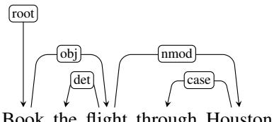

(20.9)

Book the flight through Houston

At Step 1, LEFTARC is not applicable in the initial configuration since it asserts a relation, (root book), not in the reference answer; RIGHTARC does assert a relation contained in the final answer (root book), however book has not been attached to any of its dependents yet, so we have to defer, leaving SHIFT as the only possible action. The same conditions hold in the next two steps. In step 3, LEFTARC is selected to link the to its head.

Now consider the situation in Step 4.

<table><tr><td>Stack</td><td>Word buffer</td><td>Relations</td></tr><tr><td>[root, book, flight]</td><td>[through, Houston]</td><td>(the ← flight)</td></tr></table>

Here, we might be tempted to add a dependency relation between book and flight, which is present in the reference parse. But doing so now would prevent the later attachment of Houston since flight would have been removed from the stack. Fortunately, the precondition on choosing RIGHTARC prevents this choice and we’re again left with SHIFT as the only viable option. The remaining choices complete the set of operators needed for this example.

To recap, we derive appropriate training instances consisting of configurationtransition pairs from a treebank by simulating the operation of a parser in the context of a reference dependency tree. We can deterministically record correct parser actions at each step as we progress through each training example, thereby creating the training set we require.

## 20.2.2 A feature-based classifier

We’ll now introduce two classifiers for choosing transitions, here a classic featurebased algorithm and in the next section a neural classifier using embedding features.

Featured-based classifiers generally use the same features we’ve seen with partof-speech tagging and partial parsing: Word forms, lemmas, parts of speech, the head, and the dependency relation to the head. Other features may be relevant for some languages, for example morphosyntactic features like case marking on subjects or objects. The features are extracted from the training configurations, which consist of the stack, the buffer and the current set of relations. Most useful are features referencing the top levels of the stack, the words near the front of the buffer, and the dependency relations already associated with any of those elements.

We’ll use a feature template as we did for sentiment analysis and part-of-speech tagging. Feature templates allow us to automatically generate large numbers of specific features from a training set. For example, consider the following feature templates that are based on single positions in a configuration.

$$
\begin{array}{c} \langle s _ {1}. w, o p \rangle , \langle s _ {2}. w, o p \rangle \langle s _ {1}. t, o p \rangle , \langle s _ {2}. t, o p \rangle \\ \langle b _ {1}. w, o p \rangle , \langle b _ {1}. t, o p \rangle \langle s _ {1}. w t, o p \rangle \end{array}\tag{20.10}
$$

Here features are denoted as location.property, where s = stack, b = the word buffer, w = word forms, t = part-of-speech, and op = operator. Thus the feature for the word form at the top of the stack would be $s _ { 1 } . w _ { : }$ , the part of speech tag at the front of the buffer $b _ { 1 } . t ,$ and the concatenated feature s<sub>1</sub>.wt represents the word form concatenated with the part of speech of the word at the top of the stack. Consider applying these templates to the following intermediate configuration derived from a training oracle for (20.2).

<table><tr><td>Stack</td><td>Word buffer</td><td>Relations</td></tr><tr><td>[root, canceled, flights]</td><td>[to Houston]</td><td>(canceled → United)(flights → morning)(flights → the)</td></tr></table>

The correct transition here is SHIFT (you should convince yourself of this before proceeding). The application of our set of feature templates to this configuration would result in the following set of instantiated features.

$$
\begin{array}{c} \langle s _ {1}. w = f l i g h t s, o p = s h i f t \rangle \\ \langle s _ {2}. w = c a n c e l e d, o p = s h i f t \rangle \\ \langle s _ {1}. t = N N S, o p = s h i f t \rangle \\ \langle s _ {2}. t = V B D, o p = s h i f t \rangle \\ \langle b _ {1}. w = t o, o p = s h i f t \rangle \\ \langle b _ {1}. t = T O, o p = s h i f t \rangle \\ \langle s _ {1}. w t = f l i g h t s N N S, o p = s h i f t \rangle \end{array}\tag{20.11}
$$

Given that the left and right arc transitions operate on the top two elements of the stack, features that combine properties from these positions are even more useful. For example, a feature like s<sub>1</sub>.t s<sub>2</sub>.t concatenates the part of speech tag of the word at the top of the stack with the tag of the word beneath it.

$$
\left\langle s _ {1}. t \circ s _ {2}. t = N N S V B D, o p = s h i f t \right\rangle\tag{20.12}
$$

Given the training data and features, any classifier, like multinomial logistic regression or support vector machines, can be used.

## 20.2.3 A neural classifier

The oracle can also be implemented by a neural classifier. A standard architecture is simply to pass the sentence through an encoder, then take the presentation of the top 2 words on the stack and the first word of the buffer, concatenate them, and present to a feedforward network that predicts the transition to take (Kiperwasser and Goldberg, 2016; Kulmizev et al., 2019). Fig. 20.8 sketches this model. Learning can be done with cross-entropy loss.

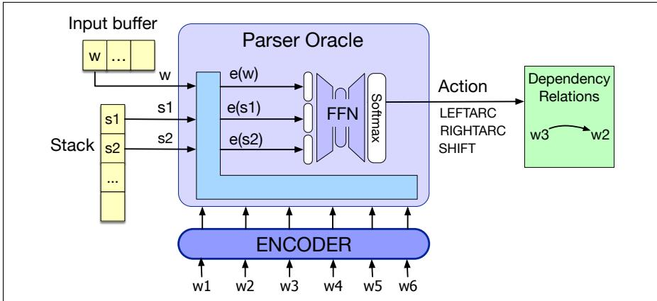  
Figure 20.8 Neural classifier for the oracle for the transition-based parser. The parser takes the top 2 words on the stack and the first word of the buffer, represents them by their encodings (from running the whole sentence through the encoder), concatenates the embeddings and passes through a softmax to choose a parser action (transition).

## 20.2.4 Advanced Methods in Transition-Based Parsing

The basic transition-based approach can be elaborated in a number of ways to improve performance by addressing some of the most obvious flaws in the approach.

## Alternative Transition Systems

The arc-standard transition system described above is only one of many possible systems. A frequently used alternative is the arc eager transition system. The arc eager approach gets its name from its ability to assert rightward relations much sooner than in the arc standard approach. To see this, let’s revisit the arc standard trace of Example 20.9, repeated here.

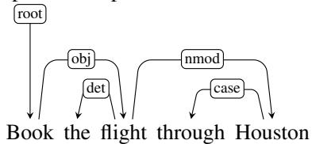

Consider the dependency relation between book and flight in this analysis. As is shown in Fig. 20.7, an arc-standard approach would assert this relation at Step 8, despite the fact that book and flight first come together on the stack much earlier at Step 4. The reason this relation can’t be captured at this point is due to the presence of the postnominal modifier through Houston. In an arc-standard approach, dependents are removed from the stack as soon as they are assigned their heads. If flight had been assigned book as its head in Step 4, it would no longer be available to serve as the head of Houston.

While this delay doesn’t cause any issues in this example, in general the longer a word has to wait to get assigned its head the more opportunities there are for something to go awry. The arc-eager system addresses this issue by allowing words to be attached to their heads as early as possible, before all the subsequent words dependent on them have been seen. This is accomplished through minor changes to the LEFTARC and RIGHTARC operators and the addition of a new REDUCE operator.

• LEFTARC: Assert a head-dependent relation between the word at the front of the input buffer and the word at the top of the stack; pop the stack.

• RIGHTARC: Assert a head-dependent relation between the word on the top of the stack and the word at the front of the input buffer; shift the word at the front of the input buffer to the stack.

• SHIFT: Remove the word from the front of the input buffer and push it onto the stack.

• REDUCE: Pop the stack.

The LEFTARC and RIGHTARC operators are applied to the top of the stack and the front of the input buffer, instead of the top two elements of the stack as in the arc-standard approach. The RIGHTARC operator now moves the dependent to the stack from the buffer rather than removing it, thus making it available to serve as the head of following words. The new REDUCE operator removes the top element from the stack. Together these changes permit a word to be eagerly assigned its head and still allow it to serve as the head for later dependents. The trace shown in Fig. 20.9 illustrates the new decision sequence for this example.

In addition to demonstrating the arc-eager transition system, this example demonstrates the power and flexibility of the overall transition-based approach. We were able to swap in a new transition system without having to make any changes to the underlying parsing algorithm. This flexibility has led to the development of a diverse set of transition systems that address different aspects of syntax and semantics including: assigning part of speech tags (Choi and Palmer, 2011a), allowing the generation of non-projective dependency structures (Nivre, 2009), assigning semantic roles (Choi and Palmer, 2011b), and parsing texts containing multiple languages (Bhat et al., 2017).

<table><tr><td>Step</td><td>Stack</td><td>Word List</td><td>Action</td><td>Relation Added</td></tr><tr><td>0</td><td>[root]</td><td>[book, the, flight, through, houston]</td><td>RIGHTARC</td><td>(root → book)</td></tr><tr><td>1</td><td>[root, book]</td><td>[the, flight, through, houston]</td><td>SHIFT</td><td></td></tr><tr><td>2</td><td>[root, book, the]</td><td>[flight, through, houston]</td><td>LEFTARC</td><td>(the ← flight)</td></tr><tr><td>3</td><td>[root, book]</td><td>[flight, through, houston]</td><td>RIGHTARC</td><td>(book → flight)</td></tr><tr><td>4</td><td>[root, book, flight]</td><td>[through, houston]</td><td>SHIFT</td><td></td></tr><tr><td>5</td><td>[root, book, flight, through]</td><td>[houston]</td><td>LEFTARC</td><td>(through ← houston)</td></tr><tr><td>6</td><td>[root, book, flight]</td><td>[houston]</td><td>RIGHTARC</td><td>(flight → houston)</td></tr><tr><td>7</td><td>[root, book, flight, houston]</td><td>[]</td><td>REDUCE</td><td></td></tr><tr><td>8</td><td>[root, book, flight]</td><td>[]</td><td>REDUCE</td><td></td></tr><tr><td>9</td><td>[root, book]</td><td>[]</td><td>REDUCE</td><td></td></tr><tr><td>10</td><td>[root]</td><td>[]</td><td>Done</td><td></td></tr></table>

Figure 20.9 A processing trace of Book the flight through Houston using the arc-eager transition operators.

## Beam Search

The computational efficiency of the transition-based approach discussed earlier derives from the fact that it makes a single pass through the sentence, greedily making decisions without considering alternatives. Of course, this is also a weakness – once a decision has been made it can not be undone, even in the face of overwhelming evidence arriving later in a sentence. We can use beam search to explore alternative decision sequences. Recall from Chapter 13 that beam search uses a breadth-first search strategy with a heuristic filter that prunes the search frontier to stay within a fixed-size beam width.

In applying beam search to transition-based parsing, we’ll elaborate on the algorithm given in Fig. 20.5. Instead of choosing the single best transition operator at each iteration, we’ll apply all applicable operators to each state on an agenda and then score the resulting configurations. We then add each of these new configurations to the frontier, subject to the constraint that there has to be room within the beam. As long as the size of the agenda is within the specified beam width, we can add new configurations to the agenda. Once the agenda reaches the limit, we only add new configurations that are better than the worst configuration on the agenda (removing the worst element so that we stay within the limit). Finally, to insure that we retrieve the best possible state on the agenda, the while loop continues as long as there are non-final states on the agenda.

The beam search approach requires a more elaborate notion of scoring than we used with the greedy algorithm. There, we assumed that the oracle would be a supervised classifier that chose the best transition operator based on features of the current configuration. This choice can be viewed as assigning a score to all the possible transitions and picking the best one.

$$
\hat {T} (c) = \operatorname{argmaxScore} (t, c)
$$

With beam search we are now searching through the space of decision sequences, so it makes sense to base the score for a configuration on its entire history. So we can define the score for a new configuration as the score of its predecessor plus the

score of the operator used to produce it.

$$
\begin{array}{l} \text { ConfigScore } (c _ {0}) = 0. 0 \\ \text { ConfigScore } (c _ {i}) = \text { ConfigScore } (c _ {i - 1}) + \text { Score } (t _ {i}, c _ {i - 1}) \end{array}
$$

This score is used both in filtering the agenda and in selecting the final answer. The new beam search version of transition-based parsing is given in Fig. 20.10.

```txt
function DEPENDENCYBEAMPARSE(words, width) returns dependency tree
state ← { [root], [words], [], 0.0} ; initial configuration
agenda ← <state> ; initial agenda

while agenda contains non-final states
newagenda ← ⟨⟩
for each state ∈ agenda do
for all { t | t ∈ VALIDOPERATORS(state)} do
child ← APPLY(t, state)
newagenda ← ADDTOBEAM(child, newagenda, width)
agenda ← newagenda
return BESTOF(agenda)

function ADDTOBEAM(state, agenda, width) returns updated agenda

if LENGTH(agenda) < width then
agenda ← INSERT(state, agenda)
else if SCORE(state) > SCORE(WORSTOF(agenda))
agenda ← REMOVE(WORSTOF(agenda))
agenda ← INSERT(state, agenda)
return agenda
```  
Figure 20.10 Beam search applied to transition-based dependency parsing.

## 20.3 Graph-Based Dependency Parsing

Graph-based methods are the second important family of dependency parsing algorithms. Graph-based parsers are more accurate than transition-based parsers, especially on long sentences; transition-based methods have trouble when the heads are very far from the dependents (McDonald and Nivre, 2011). Graph-based methods avoid this difficulty by scoring entire trees, rather than relying on greedy local decisions. Furthermore, unlike transition-based approaches, graph-based parsers can produce non-projective trees. Although projectivity is not a significant issue for English, it is definitely a problem for many of the world’s languages.

Graph-based dependency parsers search through the space of possible trees for a given sentence for a tree (or trees) that maximize some score. These methods encode the search space as directed graphs and employ methods drawn from graph theory to search the space for optimal solutions. More formally, given a sentence S we’re looking for the best dependency tree in ${ \mathcal G } _ { s } .$ , the space of all possible trees for that sentence, that maximizes some score.

$$
\hat {T} (S) = \underset {t \in \mathcal {G} _ {S}} {\operatorname{argmax}} \operatorname{Score} (t, S)
$$

We’ll make the simplifying assumption that this score can be edge-factored, meaning that the overall score for a tree is the sum of the scores of each of the scores of the edges that comprise the tree.

$$
\operatorname{Score} (t, S) = \sum_ {e \in t} \operatorname{Score} (e)
$$

Graph-based algorithms have to solve two problems: (1) assigning a score to each edge, and (2) finding the best parse tree given the scores of all potential edges. In the next few sections we’ll introduce solutions to these two problems, beginning with the second problem of finding trees, and then giving a feature-based and a neural algorithm for solving the first problem of assigning scores.

## 20.3.1 Parsing via finding the maximum spanning tree

In graph-based parsing, given a sentence S we start by creating a graph G which is a fully-connected, weighted, directed graph where the vertices are the input words and the directed edges represent all possible head-dependent assignments. We’ll include an additional ROOT node with outgoing edges directed at all of the other vertices. The weights of each edge in G reflect the score for each possible head-dependent relation assigned by some scoring algorithm.

It turns out that finding the best dependency parse for S is equivalent to finding the maximum spanning tree over G. A spanning tree over a graph G is a subset of G that is a tree and covers all the vertices in G; a spanning tree over G that starts from the ROOT is a valid parse of S. A maximum spanning tree is the spanning tree with the highest score. Thus a maximum spanning tree of G emanating from the ROOT is the optimal dependency parse for the sentence.

A directed graph for the example Book thatflight is shown in Fig. 20.11, with the maximum spanning tree corresponding to the desired parse shown in blue. For ease of exposition, we’ll describe here the algorithm for unlabeled dependency parsing.

  
Figure 20.11 Initial rooted, directed graph for Book thatflight.

Before describing the algorithm it’s useful to consider two intuitions about directed graphs and their spanning trees. The first intuition begins with the fact that every vertex in a spanning tree has exactly one incoming edge. It follows from this that every connected component of a spanning tree (i.e., every set of vertices that are linked to each other by paths over edges) will also have one incoming edge. The second intuition is that the absolute values of the edge scores are not critical to determining its maximum spanning tree. Instead, it is the relative weights of the edges entering each vertex that matters. If we were to subtract a constant amount from each edge entering a given vertex it would have no impact on the choice of the maximum spanning tree since every possible spanning tree would decrease by exactly the same amount.

The first step of the algorithm itself is quite straightforward. For each vertex in the graph, an incoming edge (representing a possible head assignment) with the highest score is chosen. If the resulting set of edges produces a spanning tree then we’re done. More formally, given the original fully-connected graph $G = \left( V , E \right)$ , a subgraph $T = \left( V , F \right)$ is a spanning tree if it has no cycles and each vertex (other than the root) has exactly one edge entering it. If the greedy selection process produces such a tree then it is the best possible one.

Unfortunately, this approach doesn’t always lead to a tree since the set of edges selected may contain cycles. Fortunately, in yet another case of multiple discovery, there is a straightforward way to eliminate cycles generated during the greedy selection phase. Chu and Liu (1965) and Edmonds (1967) independently developed an approach that begins with greedy selection and follows with an elegant recursive cleanup phase that eliminates cycles.

The cleanup phase begins by adjusting all the weights in the graph by subtracting the score of the maximum edge entering each vertex from the score of all the edges entering that vertex. This is where the intuitions mentioned earlier come into play. We have scaled the values of the edges so that the weights of the edges in the cycle have no bearing on the weight of any of the possible spanning trees. Subtracting the value of the edge with maximum weight from each edge entering a vertex results in a weight of zero for all of the edges selected during the greedy selection phase, including all of the edges involved in the cycle.

Having adjusted the weights, the algorithm creates a new graph by selecting a cycle and collapsing it into a single new node. Edges that enter or leave the cycle are altered so that they now enter or leave the newly collapsed node. Edges that do not touch the cycle are included and edges within the cycle are dropped.

Now, if we knew the maximum spanning tree of this new graph, we would have what we need to eliminate the cycle. The edge of the maximum spanning tree directed towards the vertex representing the collapsed cycle tells us which edge to delete in order to eliminate the cycle. How do we find the maximum spanning tree of this new graph? We recursively apply the algorithm to the new graph. This will either result in a spanning tree or a graph with a cycle. The recursions can continue as long as cycles are encountered. When each recursion completes we expand the collapsed vertex, restoring all the vertices and edges from the cycle with the exception ofthe single edge to be deleted.

Putting all this together, the maximum spanning tree algorithm consists of greedy edge selection, re-scoring of edge costs and a recursive cleanup phase when needed. The full algorithm is shown in Fig. 20.12.

Fig. 20.13 steps through the algorithm with our Book that flight example. The first row of the figure illustrates greedy edge selection with the edges chosen shown in blue (corresponding to the set F in the algorithm). This results in a cycle between that and flight. The scaled weights using the maximum value entering each node are shown in the graph to the right.

Collapsing the cycle between that and flight to a single node (labeled tf) and recursing with the newly scaled costs is shown in the second row. The greedy selection step in this recursion yields a spanning tree that links root to book, as well as an edge that links book to the contracted node. Expanding the contracted node, we can see that this edge corresponds to the edge from book toflight in the original graph. This in turn tells us which edge to drop to eliminate the cycle.

<div class="mineru-algorithm" style="white-space: pre-wrap; font-family:monospace;">
function MAXSPANNINGTREE(G=(V,E), root, score) returns spanning tree
F ← []
T' ← []
score' ← []
for each v ∈ V do
bestInEdge ← argmax$_{e=(u,v)\in E}$ score[e]
F ← F ∪ bestInEdge
for each e=(u,v) ∈ E do
score'[e] ← score[e] - score[bestInEdge]

if T=(V,F) is a spanning tree then return it
else
C ← a cycle in F
G' ← CONTRACT(G, C)
T' ← MAXSPANNINGTREE(G', root, score')
T ← EXPAND(T', C)
return T

function CONTRACT(G, C) returns contracted graph
function EXPAND(T, C) returns expanded graph
</div>

Figure 20.12 The Chu-Liu Edmonds algorithm for finding a maximum spanning tree in a weighted directed graph.

On arbitrary directed graphs, this version of the CLE algorithm runs in $O ( m n )$ time, where m is the number of edges and n is the number of nodes. Since this particular application of the algorithm begins by constructing a fully connected graph $m = n ^ { 2 }$ yielding a running time of $O ( n ^ { 3 } )$ . Gabow et al. (1986) present a more efficient implementation with a running time of $O ( m + n l o g n )$

## 20.3.2 A feature-based algorithm for assigning scores

Recall that given a sentence, S, and a candidate tree, T, edge-factored parsing models make the simplification that the score for the tree is the sum of the scores of the edges that comprise the tree:

$$
\operatorname{score} (S, T) = \sum_ {e \in T} \operatorname{score} (S, e)
$$

In a feature-based algorithm we compute the edge score as a weighted sum of features extracted from it:

$$
\operatorname{score} (S, e) = \sum_ {i = 1} ^ {N} w _ {i} f _ {i} (S, e)
$$

Or more succinctly.

$$
\operatorname{score} (S, e) = w \cdot f
$$

Given this formulation, we need to identify relevant features and train the weights.

The features (and feature combinations) used to train edge-factored models mirror those used in training transition-based parsers, such as

  
Figure 20.13 Chu-Liu-Edmonds graph-based example for Book thatflight

• Wordforms, lemmas, and parts of speech of the headword and its dependent.

• Corresponding features from the contexts before, after and between the words.

• Word embeddings.

• The dependency relation itself.

• The direction of the relation (to the right or left).

• The distance from the head to the dependent.

Given a set of features, our next problem is to learn a set of weights corresponding to each. Unlike many of the learning problems discussed in earlier chapters, here we are not training a model to associate training items with class labels, or parser actions. Instead, we seek to train a model that assigns higher scores to correct trees than to incorrect ones. An effective framework for problems like this is to use inference-based learning combined with the perceptron learning rule. In this framework, we parse a sentence (i.e, perform inference) from the training set using some initially random set of initial weights. If the resulting parse matches the corresponding tree in the training data, we do nothing to the weights. Otherwise, we find those features in the incorrect parse that are not present in the reference parse and we lower their weights by a small amount based on the learning rate. We do this incrementally for each sentence in our training data until the weights converge.

## 20.3.3 A neural algorithm for assigning scores

State-of-the-art graph-based multilingual parsers are based on neural networks. Instead of extracting hand-designed features to represent each edge between words w<sub>i</sub> and w<sub>j</sub>, these parsers run the sentence through an encoder, and then pass the encoded representation of the two words $w _ { i }$ and $w _ { j }$ through a network that estimates a score for the edge $i  j$

  
Figure 20.14 Computing scores for a single edge (book flight) in the biaffine parser of Dozat and Manning (2017); Dozat et al. (2017). The parser uses distinct feedforward networks to turn the encoder output for each word into a head and dependent representation for the word. The biaffine function turns the head embedding of the head and the dependent embedding of the dependent into a score for the dependency edge.

Here we’ll sketch the biaffine algorithm of Dozat and Manning (2017) and Dozat et al. (2017) shown in Fig. 20.14, drawing on the work of Grunewald et al.¨ (2021) who tested many versions of the algorithm via their STEPS system. The algorithm first runs the sentence $X = x _ { 1 } , . . . , x _ { n }$ through an encoder to produce a contextual embedding representation for each token $R = r _ { 1 } , . . . , r _ { n }$ The embedding for each token is now passed through two separate feedforward networks, one to produce a representation of this token as a head, and one to produce a representation of this token as a dependent:

$$
\mathbf {h} _ {i} ^ {\text {head}} = \operatorname{FFN} ^ {\text {head}} (\mathbf {r} _ {i})\tag{20.13}
$$

$$
\mathbf {h} _ {i} ^ {d e p} = \mathrm{FFN} ^ {d e p} (\mathbf {r} _ {i})\tag{20.14}
$$

Now to assign a score to the directed edge $i  j , ( w _ { i }$ is the head and $w _ { j }$ is the dependent), we feed the head representation of $i , \hbar _ { i } ^ { h e a d }$ , and the dependent representation of $j , \boldsymbol { \mathsf { h } } _ { j } ^ { d e p }$ , into a biaffine scoring function:

$$
\operatorname{Score} (i \rightarrow j) = \operatorname{Biaff} (\mathbf {h} _ {i} ^ {\text { head }}, \mathbf {h} _ {j} ^ {\text { dep }})\tag{20.15}
$$

$$
\operatorname{Biaff} (\mathbf {x}, \mathbf {y}) = \mathbf {x} ^ {\top} \mathbf {U y} + \mathbf {W} (\mathbf {x} \oplus \mathbf {y}) + b\tag{20.16}
$$

where U, W, and b are weights learned by the model. The idea of using a biaffine function is to allow the system to learn multiplicative interactions between the vectors x and y.

If we pass Score $( i  j )$ through a softmax, we end up with a probability distribution, for each token j, over potential heads i (all other tokens in the sentence):

$$
p (i \rightarrow j) = \operatorname{softmax} ([ \operatorname{Score} (k \rightarrow j); \forall k \neq j, 1 \leq k \leq n ])\tag{20.17}
$$

This probability can then be passed to the maximum spanning tree algorithm of Section 20.3.1 to find the best tree.

This $p ( i  j )$ classifier is trained by optimizing the cross-entropy loss.

Note that the algorithm as we’ve described it is unlabeled. To make this into a labeled algorithm, the Dozat and Manning (2017) algorithm actually trains two classifiers. The first classifier, the edge-scorer, the one we described above, assigns a probability $p ( i  j )$ to each word $w _ { i }$ and $w _ { j }$ . Then the Maximum Spanning Tree algorithm is run to get a single best dependency parse tree for the second. We then apply a second classifier, the label-scorer, whose job is to find the maximum probability label for each edge in this parse. This second classifier has the same form as (20.15-20.17), but instead of being trained to predict with binary softmax the probability of an edge existing between two words, it is trained with a softmax over dependency labels to predict the dependency label between the words.

## 20.4 Evaluation

As with phrase structure-based parsing, the evaluation of dependency parsers proceeds by measuring how well they work on a test set. An obvious metric would be exact match (EM)—how many sentences are parsed correctly. This metric is quite pessimistic, with most sentences being marked wrong. Such measures are not finegrained enough to guide the development process. Our metrics need to be sensitive enough to tell if actual improvements are being made.

For these reasons, the most common method for evaluating dependency parsers are labeled and unlabeled attachment accuracy. Labeled attachment refers to the proper assignment of a word to its head along with the correct dependency relation. Unlabeled attachment simply looks at the correctness of the assigned head, ignoring the dependency relation. Given a system output and a corresponding reference parse, accuracy is simply the percentage of words in an input that are assigned the correct head with the correct relation. These metrics are usually referred to as the labeled attachment score (LAS) and unlabeled attachment score (UAS). Finally, we can make use of a label accuracy score (LS), the percentage of tokens with correct labels, ignoring where the relations are coming from.

As an example, consider the reference parse and system parse for the following example shown in Fig. 20.15.

## (20.18) Book me the flight through Houston.

The system correctly finds 4 of the 6 dependency relations present in the reference parse and receives an LAS of 2/3. However, one of the 2 incorrect relations found by the system holds between book andflight, which are in a head-dependent relation in the reference parse; the system therefore achieves a UAS of 5/6.

Beyond attachment scores, we may also be interested in how well a system is performing on a particular kind of dependency relation, for example NSUBJ, across a development corpus. Here we can make use of the notions of precision and recall introduced in Chapter 18, measuring the percentage of relations labeled NSUBJ by the system that were correct (precision), and the percentage of the NSUBJ relations present in the development set that were in fact discovered by the system (recall). We can employ a confusion matrix to keep track of how often each dependency type was confused for another.

  
Figure 20.15 Reference and system parses for Book me the flight through Houston, resulting in an LAS of 2/3 and an UAS of 5/6.

## 20.5 Summary

This chapter has introduced the concept of dependency grammars and dependency parsing. Here’s a summary of the main points that we covered:

• In dependency-based approaches to syntax, the structure of a sentence is described in terms of a set of binary relations that hold between the words in a sentence. Larger notions of constituency are not directly encoded in dependency analyses.

• The relations in a dependency structure capture the head-dependent relationship among the words in a sentence.

• Dependency-based analysis provides information directly useful in further language processing tasks including information extraction, semantic parsing and question answering.

• Transition-based parsing systems employ a greedy stack-based algorithm to create dependency structures.

• Graph-based methods for creating dependency structures are based on the use of maximum spanning tree methods from graph theory.

• Both transition-based and graph-based approaches are developed using supervised machine learning techniques.

• Treebanks provide the data needed to train these systems. Dependency treebanks can be created directly by human annotators or via automatic transformation from phrase-structure treebanks.

• Evaluation of dependency parsers is based on labeled and unlabeled accuracy scores as measured against withheld development and test corpora.

## Historical Notes

The dependency-based approach to grammar is much older than the relatively recent phrase-structure or constituency grammars, which date only to the 20th century. Dependency grammar dates back to the Indian grammarian Pan¯ <sub>.</sub> ini sometime between the 7th and 4th centuries BCE, as well as the ancient Greek linguistic traditions. Contemporary theories of dependency grammar all draw heavily on the 20th century work of Tesniere\` (1959).

Automatic parsing using dependency grammars was first introduced into computational linguistics by early work on machine translation at the RAND Corporation led by David Hays. This work on dependency parsing closely paralleled work on constituent parsing and made explicit use of grammars to guide the parsing process. After this early period, computational work on dependency parsing remained intermittent over the following decades. Notable implementations of dependency parsers for English during this period include Link Grammar (Sleator and Temperley, 1993), Constraint Grammar (Karlsson et al., 1995), and MINIPAR (Lin, 2003).

Dependency parsing saw a major resurgence in the late 1990’s with the appearance of large dependency-based treebanks and the associated advent of data driven approaches described in this chapter. Eisner (1996) developed an efficient dynamic programming approach to dependency parsing based on bilexical grammars derived from the Penn Treebank. Covington (2001) introduced the deterministic word by word approach underlying current transition-based approaches. Yamada and Matsumoto (2003) and Kudo and Matsumoto (2002) introduced both the shift-reduce paradigm and the use of supervised machine learning in the form of support vector machines to dependency parsing.

Transition-based parsing is based on the shift-reduce parsing algorithm originally developed for analyzing programming languages (Aho and Ullman, 1972). Shift-reduce parsing also makes use of a context-free grammar. Input tokens are successively shifted onto the stack and the top two elements of the stack are matched against the right-hand side of the rules in the grammar; when a match is found the matched elements are replaced on the stack (reduced) by the non-terminal from the left-hand side of the rule being matched. In transition-based dependency parsing we skip the grammar, and alter the reduce operation to add a dependency relation between a word and its head.

Nivre (2003) defined the modern, deterministic, transition-based approach to dependency parsing. Subsequent work by Nivre and his colleagues formalized and analyzed the performance of numerous transition systems, training methods, and methods for dealing with non-projective language (Nivre and Scholz 2004, Nivre 2006, Nivre and Nilsson 2005, Nivre et al. 2007b, Nivre 2007). The neural approach was pioneered by Chen and Manning (2014) and extended by Kiperwasser and Goldberg (2016); Kulmizev et al. (2019).

The graph-based maximum spanning tree approach to dependency parsing was introduced by McDonald et al. 2005a, McDonald et al. 2005b. The neural classifier was introduced by (Kiperwasser and Goldberg, 2016).

The long-running Prague Dependency Treebank project (Hajicˇ, 1998) is the most significant effort to directly annotate a corpus with multiple layers of morphological, syntactic and semantic information. PDT 3.0 contains over 1.5 M tokens (Bejcekˇ et al., 2013).

Universal Dependencies (UD) (de Marneffe et al., 2021) is an open community project to create a framework for dependency treebank annotation, with nearly 200 treebanks in over 100 languages. The UD annotation scheme evolved out of several distinct efforts including Stanford dependencies (de Marneffe et al. 2006, de Marneffe and Manning 2008, de Marneffe et al. 2014), Google’s universal part-of-speech tags (Petrov et al., 2012), and the Interset interlingua for morphosyntactic tagsets (Zeman, 2008).

The Conference on Natural Language Learning (CoNLL) has conducted an influential series of shared tasks related to dependency parsing over the years (Buchholz and Marsi 2006, Nivre et al. 2007a, Surdeanu et al. 2008, Hajic et al.ˇ 2009). More recent evaluations have focused on parser robustness with respect to morphologically rich languages (Seddah et al., 2013), and non-canonical language forms such as social media, texts, and spoken language (Petrov and McDonald, 2012). Choi et al. (2015) presents a performance analysis of 10 dependency parsers across a range of metrics, as well as DEPENDABLE, a robust parser evaluation tool.

## Exercises