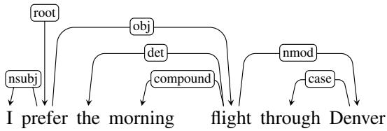
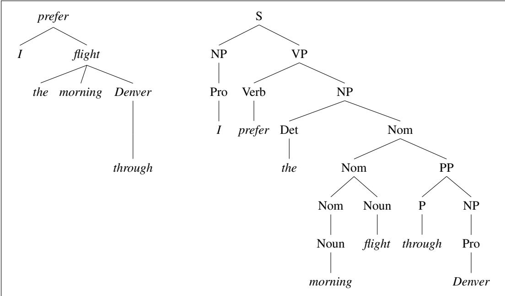

# Dependency Parsing

Tout mot qui fait partie d’une phrase... Entre lui et ses voisins, l’esprit aperc¸oit des connexions, dont l’ensemble forme la charpente de la phrase.

[Between each word in a sentence and its neighbors, the mind perceives connections. These connections together form the scaffolding of the sentence.] Lucien Tesniere. 1959.\` El´ ements de syntaxe structurale, A.1.§3´

The focus of the last chapter was on context-free grammars and constituentbased representations. Here we present another important family of grammar formalisms called dependency grammars. In dependency formalisms, phrasal constituents and phrase-structure rules do not play a direct role. Instead, the syntactic structure of a sentence is described solely in terms of directed binary grammatical relations between the words, as in the following dependency parse:

(20.1)

Relations among the words are illustrated above the sentence with directed, labeled arcs from heads to dependents. We call this a typed dependency structure because the labels are drawn from a fixed inventory of grammatical relations. A root node explicitly marks the root of the tree, the head of the entire structure.

Figure 20.1 on the next page shows the dependency analysis from Eq. 20.1 but visualized as a tree, alongside its corresponding phrase-structure analysis of the kind given in the prior chapter. Note the absence of nodes corresponding to phrasal constituents or lexical categories in the dependency parse; the internal structure of the dependency parse consists solely of directed relations between words. These headdependent relationships directly encode important information that is often buried in the more complex phrase-structure parses. For example, the arguments to the verb prefer are directly linked to it in the dependency structure, while their connection to the main verb is more distant in the phrase-structure tree. Similarly, morning and Denver, modifiers of flight, are linked to it directly in the dependency structure. This fact that the head-dependent relations are a good proxy for the semantic relationship between predicates and their arguments is an important reason why dependency grammars are currently more common than constituency grammars in natural language processing.

Another major advantage of dependency grammars is their ability to deal with languages that have a relatively free word order. For example, word order in Czech can be much more flexible than in English; a grammatical object might occur before or after a location adverbial. A phrase-structure grammar would need a separate rule for each possible place in the parse tree where such an adverbial phrase could occur. A dependency-based approach can have just one link type representing this particular adverbial relation; dependency grammar approaches can thus abstract away a bit more from word order information.

  
Figure 20.1 Dependency and constituent analyses for I prefer the morningflight through Denver.

In the following sections, we’ll give an inventory of relations used in dependency parsing, discuss two families of parsing algorithms (transition-based, and graphbased), and discuss evaluation.
