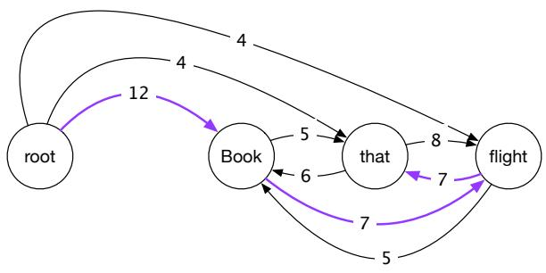
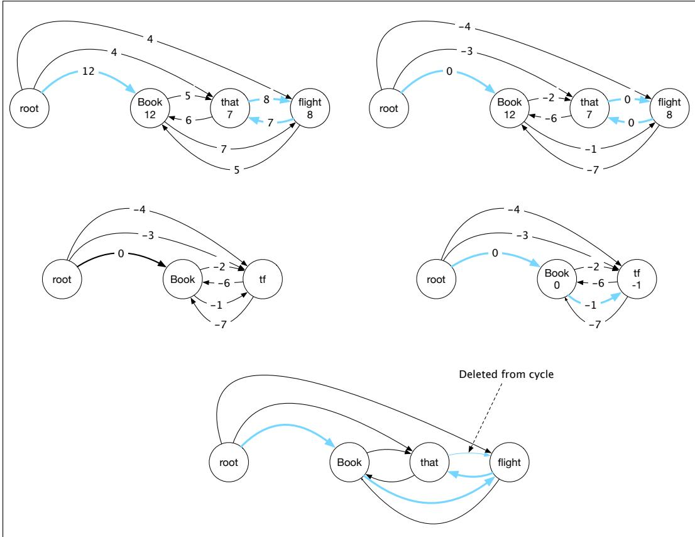
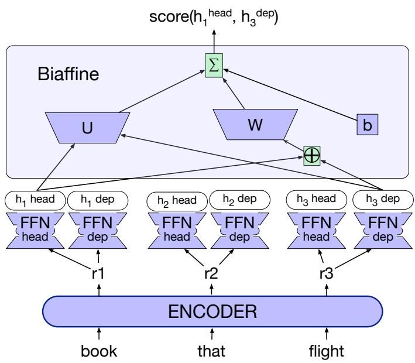

## 20.3 Graph-Based Dependency Parsing

Graph-based methods are the second important family of dependency parsing algorithms. Graph-based parsers are more accurate than transition-based parsers, especially on long sentences; transition-based methods have trouble when the heads are very far from the dependents (McDonald and Nivre, 2011). Graph-based methods avoid this difficulty by scoring entire trees, rather than relying on greedy local decisions. Furthermore, unlike transition-based approaches, graph-based parsers can produce non-projective trees. Although projectivity is not a significant issue for English, it is definitely a problem for many of the world’s languages.

Graph-based dependency parsers search through the space of possible trees for a given sentence for a tree (or trees) that maximize some score. These methods encode the search space as directed graphs and employ methods drawn from graph theory to search the space for optimal solutions. More formally, given a sentence S we’re looking for the best dependency tree in ${ \mathcal G } _ { s } .$ , the space of all possible trees for that sentence, that maximizes some score.

$$
\hat {T} (S) = \underset {t \in \mathcal {G} _ {S}} {\operatorname{argmax}} \operatorname{Score} (t, S)
$$

We’ll make the simplifying assumption that this score can be edge-factored, meaning that the overall score for a tree is the sum of the scores of each of the scores of the edges that comprise the tree.

$$
\operatorname{Score} (t, S) = \sum_ {e \in t} \operatorname{Score} (e)
$$

Graph-based algorithms have to solve two problems: (1) assigning a score to each edge, and (2) finding the best parse tree given the scores of all potential edges. In the next few sections we’ll introduce solutions to these two problems, beginning with the second problem of finding trees, and then giving a feature-based and a neural algorithm for solving the first problem of assigning scores.

## 20.3.1 Parsing via finding the maximum spanning tree

In graph-based parsing, given a sentence S we start by creating a graph G which is a fully-connected, weighted, directed graph where the vertices are the input words and the directed edges represent all possible head-dependent assignments. We’ll include an additional ROOT node with outgoing edges directed at all of the other vertices. The weights of each edge in G reflect the score for each possible head-dependent relation assigned by some scoring algorithm.

It turns out that finding the best dependency parse for S is equivalent to finding the maximum spanning tree over G. A spanning tree over a graph G is a subset of G that is a tree and covers all the vertices in G; a spanning tree over G that starts from the ROOT is a valid parse of S. A maximum spanning tree is the spanning tree with the highest score. Thus a maximum spanning tree of G emanating from the ROOT is the optimal dependency parse for the sentence.

A directed graph for the example Book thatflight is shown in Fig. 20.11, with the maximum spanning tree corresponding to the desired parse shown in blue. For ease of exposition, we’ll describe here the algorithm for unlabeled dependency parsing.

  
Figure 20.11 Initial rooted, directed graph for Book thatflight.

Before describing the algorithm it’s useful to consider two intuitions about directed graphs and their spanning trees. The first intuition begins with the fact that every vertex in a spanning tree has exactly one incoming edge. It follows from this that every connected component of a spanning tree (i.e., every set of vertices that are linked to each other by paths over edges) will also have one incoming edge. The second intuition is that the absolute values of the edge scores are not critical to determining its maximum spanning tree. Instead, it is the relative weights of the edges entering each vertex that matters. If we were to subtract a constant amount from each edge entering a given vertex it would have no impact on the choice of the maximum spanning tree since every possible spanning tree would decrease by exactly the same amount.

The first step of the algorithm itself is quite straightforward. For each vertex in the graph, an incoming edge (representing a possible head assignment) with the highest score is chosen. If the resulting set of edges produces a spanning tree then we’re done. More formally, given the original fully-connected graph $G = \left( V , E \right)$ , a subgraph $T = \left( V , F \right)$ is a spanning tree if it has no cycles and each vertex (other than the root) has exactly one edge entering it. If the greedy selection process produces such a tree then it is the best possible one.

Unfortunately, this approach doesn’t always lead to a tree since the set of edges selected may contain cycles. Fortunately, in yet another case of multiple discovery, there is a straightforward way to eliminate cycles generated during the greedy selection phase. Chu and Liu (1965) and Edmonds (1967) independently developed an approach that begins with greedy selection and follows with an elegant recursive cleanup phase that eliminates cycles.

The cleanup phase begins by adjusting all the weights in the graph by subtracting the score of the maximum edge entering each vertex from the score of all the edges entering that vertex. This is where the intuitions mentioned earlier come into play. We have scaled the values of the edges so that the weights of the edges in the cycle have no bearing on the weight of any of the possible spanning trees. Subtracting the value of the edge with maximum weight from each edge entering a vertex results in a weight of zero for all of the edges selected during the greedy selection phase, including all of the edges involved in the cycle.

Having adjusted the weights, the algorithm creates a new graph by selecting a cycle and collapsing it into a single new node. Edges that enter or leave the cycle are altered so that they now enter or leave the newly collapsed node. Edges that do not touch the cycle are included and edges within the cycle are dropped.

Now, if we knew the maximum spanning tree of this new graph, we would have what we need to eliminate the cycle. The edge of the maximum spanning tree directed towards the vertex representing the collapsed cycle tells us which edge to delete in order to eliminate the cycle. How do we find the maximum spanning tree of this new graph? We recursively apply the algorithm to the new graph. This will either result in a spanning tree or a graph with a cycle. The recursions can continue as long as cycles are encountered. When each recursion completes we expand the collapsed vertex, restoring all the vertices and edges from the cycle with the exception ofthe single edge to be deleted.

Putting all this together, the maximum spanning tree algorithm consists of greedy edge selection, re-scoring of edge costs and a recursive cleanup phase when needed. The full algorithm is shown in Fig. 20.12.

Fig. 20.13 steps through the algorithm with our Book that flight example. The first row of the figure illustrates greedy edge selection with the edges chosen shown in blue (corresponding to the set F in the algorithm). This results in a cycle between that and flight. The scaled weights using the maximum value entering each node are shown in the graph to the right.

Collapsing the cycle between that and flight to a single node (labeled tf) and recursing with the newly scaled costs is shown in the second row. The greedy selection step in this recursion yields a spanning tree that links root to book, as well as an edge that links book to the contracted node. Expanding the contracted node, we can see that this edge corresponds to the edge from book toflight in the original graph. This in turn tells us which edge to drop to eliminate the cycle.

function MAXSPANNINGTREE(G=(V,E), root, score) returns spanning tree
F ← []
T' ← []
score' ← []
for each v ∈ V do
bestInEdge ← argmax$_{e=(u,v)\in E}$ score[e]
F ← F ∪ bestInEdge
for each e=(u,v) ∈ E do
score'[e] ← score[e] - score[bestInEdge]

if T=(V,F) is a spanning tree then return it
else
C ← a cycle in F
G' ← CONTRACT(G, C)
T' ← MAXSPANNINGTREE(G', root, score')
T ← EXPAND(T', C)
return T

function CONTRACT(G, C) returns contracted graph
function EXPAND(T, C) returns expanded graph

Figure 20.12 The Chu-Liu Edmonds algorithm for finding a maximum spanning tree in a weighted directed graph.

On arbitrary directed graphs, this version of the CLE algorithm runs in $O ( m n )$ time, where m is the number of edges and n is the number of nodes. Since this particular application of the algorithm begins by constructing a fully connected graph $m = n ^ { 2 }$ yielding a running time of $O ( n ^ { 3 } )$ . Gabow et al. (1986) present a more efficient implementation with a running time of $O ( m + n l o g n )$

## 20.3.2 A feature-based algorithm for assigning scores

Recall that given a sentence, S, and a candidate tree, T, edge-factored parsing models make the simplification that the score for the tree is the sum of the scores of the edges that comprise the tree:

$$
\operatorname{score} (S, T) = \sum_ {e \in T} \operatorname{score} (S, e)
$$

In a feature-based algorithm we compute the edge score as a weighted sum of features extracted from it:

$$
\operatorname{score} (S, e) = \sum_ {i = 1} ^ {N} w _ {i} f _ {i} (S, e)
$$

Or more succinctly.

$$
\operatorname{score} (S, e) = w \cdot f
$$

Given this formulation, we need to identify relevant features and train the weights.

The features (and feature combinations) used to train edge-factored models mirror those used in training transition-based parsers, such as

  
Figure 20.13 Chu-Liu-Edmonds graph-based example for Book thatflight

• Wordforms, lemmas, and parts of speech of the headword and its dependent.

• Corresponding features from the contexts before, after and between the words.

• Word embeddings.

• The dependency relation itself.

• The direction of the relation (to the right or left).

• The distance from the head to the dependent.

Given a set of features, our next problem is to learn a set of weights corresponding to each. Unlike many of the learning problems discussed in earlier chapters, here we are not training a model to associate training items with class labels, or parser actions. Instead, we seek to train a model that assigns higher scores to correct trees than to incorrect ones. An effective framework for problems like this is to use inference-based learning combined with the perceptron learning rule. In this framework, we parse a sentence (i.e, perform inference) from the training set using some initially random set of initial weights. If the resulting parse matches the corresponding tree in the training data, we do nothing to the weights. Otherwise, we find those features in the incorrect parse that are not present in the reference parse and we lower their weights by a small amount based on the learning rate. We do this incrementally for each sentence in our training data until the weights converge.

## 20.3.3 A neural algorithm for assigning scores

State-of-the-art graph-based multilingual parsers are based on neural networks. Instead of extracting hand-designed features to represent each edge between words wi and wj, these parsers run the sentence through an encoder, and then pass the encoded representation of the two words $w _ { i }$ and $w _ { j }$ through a network that estimates a score for the edge $i  j$

  
Figure 20.14 Computing scores for a single edge (book flight) in the biaffine parser of Dozat and Manning (2017); Dozat et al. (2017). The parser uses distinct feedforward networks to turn the encoder output for each word into a head and dependent representation for the word. The biaffine function turns the head embedding of the head and the dependent embedding of the dependent into a score for the dependency edge.

Here we’ll sketch the biaffine algorithm of Dozat and Manning (2017) and Dozat et al. (2017) shown in Fig. 20.14, drawing on the work of Grunewald et al.¨ (2021) who tested many versions of the algorithm via their STEPS system. The algorithm first runs the sentence $X = x _ { 1 } , . . . , x _ { n }$ through an encoder to produce a contextual embedding representation for each token $R = r _ { 1 } , . . . , r _ { n }$ The embedding for each token is now passed through two separate feedforward networks, one to produce a representation of this token as a head, and one to produce a representation of this token as a dependent:

$$
\mathbf {h} _ {i} ^ {\text {head}} = \operatorname{FFN} ^ {\text {head}} (\mathbf {r} _ {i})\tag{20.13}
$$

$$
\mathbf {h} _ {i} ^ {d e p} = \mathrm{FFN} ^ {d e p} (\mathbf {r} _ {i})\tag{20.14}
$$

Now to assign a score to the directed edge $i  j , ( w _ { i }$ is the head and $w _ { j }$ is the dependent), we feed the head representation of $i , \hbar _ { i } ^ { h e a d }$ , and the dependent representation of $j , \boldsymbol { \mathsf { h } } _ { j } ^ { d e p }$ , into a biaffine scoring function:

$$
\operatorname{Score} (i \rightarrow j) = \operatorname{Biaff} (\mathbf {h} _ {i} ^ {\text { head }}, \mathbf {h} _ {j} ^ {\text { dep }})\tag{20.15}
$$

$$
\operatorname{Biaff} (\mathbf {x}, \mathbf {y}) = \mathbf {x} ^ {\top} \mathbf {U y} + \mathbf {W} (\mathbf {x} \oplus \mathbf {y}) + b\tag{20.16}
$$

where U, W, and b are weights learned by the model. The idea of using a biaffine function is to allow the system to learn multiplicative interactions between the vectors x and y.

If we pass Score $( i  j )$ through a softmax, we end up with a probability distribution, for each token j, over potential heads i (all other tokens in the sentence):

$$
p (i \rightarrow j) = \operatorname{softmax} ([ \operatorname{Score} (k \rightarrow j); \forall k \neq j, 1 \leq k \leq n ])\tag{20.17}
$$

This probability can then be passed to the maximum spanning tree algorithm of Section 20.3.1 to find the best tree.

This $p ( i  j )$ classifier is trained by optimizing the cross-entropy loss.

Note that the algorithm as we’ve described it is unlabeled. To make this into a labeled algorithm, the Dozat and Manning (2017) algorithm actually trains two classifiers. The first classifier, the edge-scorer, the one we described above, assigns a probability $p ( i  j )$ to each word $w _ { i }$ and $w _ { j }$ . Then the Maximum Spanning Tree algorithm is run to get a single best dependency parse tree for the second. We then apply a second classifier, the label-scorer, whose job is to find the maximum probability label for each edge in this parse. This second classifier has the same form as (20.15-20.17), but instead of being trained to predict with binary softmax the probability of an edge existing between two words, it is trained with a softmax over dependency labels to predict the dependency label between the words.
