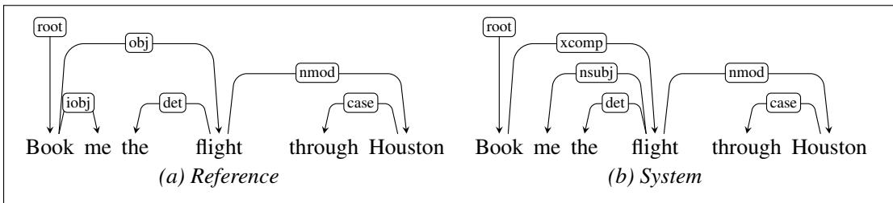

## 20.4 Evaluation

As with phrase structure-based parsing, the evaluation of dependency parsers proceeds by measuring how well they work on a test set. An obvious metric would be exact match (EM)—how many sentences are parsed correctly. This metric is quite pessimistic, with most sentences being marked wrong. Such measures are not finegrained enough to guide the development process. Our metrics need to be sensitive enough to tell if actual improvements are being made.

For these reasons, the most common method for evaluating dependency parsers are labeled and unlabeled attachment accuracy. Labeled attachment refers to the proper assignment of a word to its head along with the correct dependency relation. Unlabeled attachment simply looks at the correctness of the assigned head, ignoring the dependency relation. Given a system output and a corresponding reference parse, accuracy is simply the percentage of words in an input that are assigned the correct head with the correct relation. These metrics are usually referred to as the labeled attachment score (LAS) and unlabeled attachment score (UAS). Finally, we can make use of a label accuracy score (LS), the percentage of tokens with correct labels, ignoring where the relations are coming from.

As an example, consider the reference parse and system parse for the following example shown in Fig. 20.15.

## (20.18) Book me the flight through Houston.

The system correctly finds 4 of the 6 dependency relations present in the reference parse and receives an LAS of 2/3. However, one of the 2 incorrect relations found by the system holds between book andflight, which are in a head-dependent relation in the reference parse; the system therefore achieves a UAS of 5/6.

Beyond attachment scores, we may also be interested in how well a system is performing on a particular kind of dependency relation, for example NSUBJ, across a development corpus. Here we can make use of the notions of precision and recall introduced in Chapter 18, measuring the percentage of relations labeled NSUBJ by the system that were correct (precision), and the percentage of the NSUBJ relations present in the development set that were in fact discovered by the system (recall). We can employ a confusion matrix to keep track of how often each dependency type was confused for another.

  
Figure 20.15 Reference and system parses for Book me the flight through Houston, resulting in an LAS of 2/3 and an UAS of 5/6.
