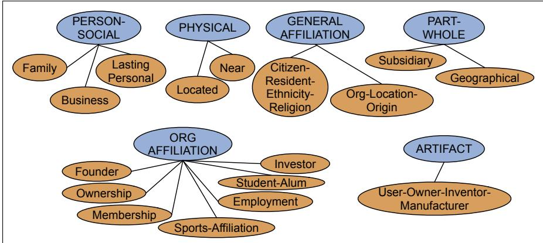

# Information Extraction: Relations, Events, and Time

Time will explain.

Jane Austen, Persuasion

Imagine that you are an analyst with an investment firm that tracks airline stocks. You’re given the task of determining the relationship (if any) between airline announcements of fare increases and the behavior of their stocks the next day. Historical data about stock prices is easy to come by, but what about the airline announcements? You will need to know at least the name of the airline, the nature of the proposed fare hike, the dates of the announcement, and possibly the response of other airlines. Fortunately, these can be all found in news articles like this one:

Citing high fuel prices, United Airlines said Friday it has increased fares by \$6 per round trip on flights to some cities also served by lowercost carriers. American Airlines, a unit of AMR Corp., immediately matched the move, spokesman Tim Wagner said. United, a unit of UAL Corp., said the increase took effect Thursday and applies to most routes where it competes against discount carriers, such as Chicago to Dallas and Denver to San Francisco.

This chapter presents techniques for extracting limited kinds of semantic content from text. This process of information extraction (IE) turns the unstructured information embedded in texts into structured data, for example for populating a relational database to enable further processing.

We begin with the task of relation extraction: finding and classifying semantic relations among entities mentioned in a text, like child-of (X is the child-of Y), or part-whole or geospatial relations. Relation extraction has close links to populating a relational database, and knowledge graphs, datasets of structured relational knowledge, are a useful way for search engines to present information to users.

Next, we discuss event extraction, the task of finding events in which these entities participate, like, in our sample text, the fare increases by United and American and the reporting events said and cite. Events are also situated in time, occurring at a particular date or time, and events can be related temporally, happening before or after or simultaneously with each other. We’ll need to recognize temporal expressions like Friday, Thursday or two days from now and times such as 3:30 P.M., and normalize them onto specific calendar dates or times. We’ll need to link Friday to the time of United’s announcement, Thursday to the previous day’s fare increase, and we’ll need to produce a timeline in which United’s announcement follows the fare increase and American’s announcement follows both of those events.

The related task of template filling is to find recurring stereotypical events or situations in documents and fill in the template slots. These slot-fillers may consist of text segments extracted directly from the text, or concepts like times, amounts, or ontology entities that have been inferred through additional processing. Our airline text presents such a stereotypical situation since airlines often raise fares and then wait to see if competitors follow along. Here we can identify United as a lead airline that initially raised its fares, \$6 as the amount, Thursday as the increase date, and American as an airline that followed along, leading to a filled template like the following:

  
Figure 21.1 The 17 relations used in the ACE relation extraction task.

<table><tr><td rowspan="4">FARE-RAISE ATTEMPT:</td><td>LEAD AIRLINE:</td><td>UNITED AIRLINES</td></tr><tr><td>AMOUNT:</td><td>$6</td></tr><tr><td>EFFECTIVE DATE:</td><td>2006-10-26</td></tr><tr><td>FOLLOWER:</td><td>AMERICAN AIRLINES</td></tr></table>
