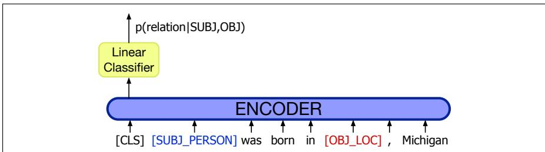
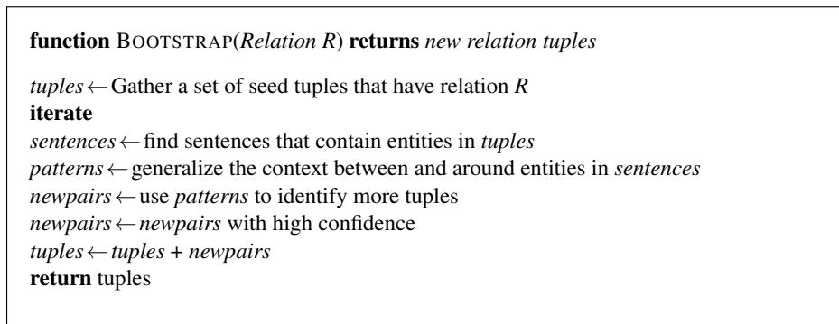

## 21.2 Relation Extraction Algorithms

There are five main classes of algorithms for relation extraction: handwritten patterns, supervised machine learning, semi-supervised (via bootstrapping or distant supervision), and unsupervised. We’ll introduce each of these in the next sections.

## 21.2.1 Using Patterns to Extract Relations

The earliest and still common algorithm for relation extraction is lexico-syntactic patterns, first developed by Hearst (1992a), and therefore often called Hearst patterns. Consider the following sentence:

Agar is a substance prepared from a mixture of red algae, such as Gelidium, for laboratory or industrial use.

Hearst points out that most human readers will not know what Gelidium is, but that they can readily infer that it is a kind of (a hyponym of) red algae, whatever that is. She suggests that the following lexico-syntactic pattern

$$
N P _ {0} \text {   such   as   } N P _ {1} \{, N P _ {2} \dots , (a n d | o r) N P _ {i} \}, i \geq 1\tag{21.2}
$$

implies the following semantics

$$
\forall N P _ {i}, i \geq 1, \text { hyponym } (N P _ {i}, N P _ {0})\tag{21.3}
$$

allowing us to infer

$$
\text { hyponym(Gelidium,red   algae) }\tag{21.4}
$$

<table><tr><td>NP {, NP}* {,} (and|or) other NP $_H$ </td><td>temples, treasuries, and other important civic buildings</td></tr><tr><td>NP $_H$  such as {NP,}* {(or|and)} NP</td><td>red algae such as Gelidium</td></tr><tr><td>such NP $_H$  as {NP,}* {(or|and)} NP</td><td>such authors as Herrick, Goldsmith, and Shakespeare</td></tr><tr><td>NP $_H$  {,} including {NP,}* {(or|and)} NP</td><td>common-law countries, including Canada and England</td></tr><tr><td>NP $_H$  {,} especially {NP}* {(or|and)} NP</td><td>European countries, especially France, England, and Spain</td></tr><tr><td colspan="2">Figure 21.4 Hand-built lexico-syntactic patterns for finding hypernyms, using {} to mark optionality (Hearst 1992a, Hearst 1998).</td></tr></table>

Figure 21.4 shows five patterns Hearst (1992a, 1998) suggested for inferring the hyponym relation; we’ve shown $\mathrm { N P _ { H } }$ as the parent/hyponym. Modern versions of the pattern-based approach extend it by adding named entity constraints. For example if our goal is to answer questions about “Who holds what office in which organization?”, we can use patterns like the following:

PER, POSITION of ORG:

George Marshall, Secretary of State of the United States

PER (named appointed chose etc.) PER Prep? POSITION

Truman appointed Marshall Secretary of State

PER [be]? (named appointed etc.) Prep? ORG POSITION

George Marshall was named US Secretary of State

Hand-built patterns have the advantage of high-precision and they can be tailored to specific domains. On the other hand, they are often low-recall, and it’s a lot of work to create them for all possible patterns.

## 21.2.2 Relation Extraction via Supervised Learning

Supervised machine learning approaches to relation extraction follow a scheme that should be familiar by now. A fixed set of relations and entities is chosen, a training corpus is hand-annotated with the relations and entities, and the annotated texts are then used to train classifiers to annotate an unseen test set.

The most straightforward approach, illustrated in Fig. 21.5 is: (1) Find pairs of named entities (usually in the same sentence). (2): Apply a relation-classification on each pair. The classifier can use any supervised technique (logistic regression, RNN, Transformer, random forest, etc.).

An optional intermediate filtering classifier can be used to speed up the processing by making a binary decision on whether a given pair of named entities are related (by any relation). It’s trained on positive examples extracted directly from all relations in the annotated corpus, and negative examples generated from within-sentence entity pairs that are not annotated with a relation.

Feature-based supervised relation classifiers. Let’s consider sample features for a feature-based classifier (like logistic regression or random forests), classifying the relationship between American Airlines (Mention 1, or M1) and Tim Wagner (Mention 2, M2) from this sentence:

(21.5) American Airlines, a unit of AMR, immediately matched the move, spokesman Tim Wagner said

These include word features (as embeddings, or 1-hot, stemmed or not):

• The headwords of M1 and M2 and their concatenation Airlines Wagner Airlines-Wagner

<div class="mineru-algorithm" style="white-space: pre-wrap; font-family:monospace;">
function FINDRELATIONS(words) returns relations
relations ← nil
entities ← FINDENTITIES(words)
forall entity pairs  $\langle e1, e2 \rangle$  in entities do
if RELATED?(e1, e2)
relations ← relations + CLASSIFYRELATION(e1, e2)
</div>

Figure 21.5 Finding and classifying the relations among entities in a text.

• Bag-of-words and bigrams in M1 and M2

American, Airlines, Tim, Wagner, American Airlines, Tim Wagner

• Words or bigrams in particular positions

M2: -1 spokesman

M2: +1 said

• Bag of words or bigrams between M1 and M2:

a, AMR, of, immediately, matched, move, spokesman, the, unit

## Named entity features:

• Named-entity types and their concatenation (M1: ORG, M2: PER, M1M2: ORG-PER)

• Entity Level of M1 and M2 (from the set NAME, NOMINAL, PRONOUN)

M1: NAME [it or he would be PRONOUN]

M2: NAME [the company would be NOMINAL]

• Number of entities between the arguments (in this case 1, for AMR)

Syntactic structure is a useful signal, often represented as the dependency or constituency syntactic path traversed through the tree between the entities.

• Constituent paths between M1 and M2

$$
N P \uparrow N P \uparrow S \uparrow S \downarrow N P
$$

• Dependency-tree paths

$$
\text { Airlines } \leftarrow_ {\text { subj }} \text { matched } \leftarrow_ {\text { comp }} \text { said } \rightarrow_ {\text { subj }} \text { Wagner }
$$

Neural supervised relation classifiers Neural models for relation extraction similarly treat the task as supervised classification. Let’s consider a typical system applied to the TACRED relation extraction dataset and task (Zhang et al., 2017). In TACRED we are given a sentence and two spans within it: a subject, which is a person or organization, and an object, which is any other entity. The task is to assign a relation from the 42 TAC relations, including no relation.

A typical Transformer-encoder algorithm, shown in Fig. 21.6, simply takes a pretrained encoder like BERT and adds a linear layer on top of the sentence representation (for example the BERT [CLS] token), a linear layer that is finetuned as a 1-of-N classifier to assign one of the 43 labels. The input to the BERT encoder is partially de-lexified; the subject and object entities are replaced in the input by their NER tags. This helps keep the system from overfitting to the individual lexical items (Zhang et al., 2017). When using BERT-type Transformers for relation extraction, it helps to use versions of BERT like RoBERTa (Liu et al., 2019) or spanBERT (Joshi et al., 2020) that don’t have two sequences separated by a [SEP] token, but instead form the input from a single long sequence of sentences.

In general, if the test set is similar enough to the training set, and if there is enough hand-labeled data, supervised relation extraction systems can get high accuracies. But labeling a large training set is extremely expensive and supervised models are brittle: they don’t generalize well to different text genres. For this reason, much research in relation extraction has focused on the semi-supervised and unsupervised approaches we turn to next.

  
Figure 21.6 Relation extraction as a linear layer on top of an encoder (in this case BERT), with the subject and object entities replaced in the input by their NER tags (Zhang et al. 2017, Joshi et al. 2020).

## 21.2.3 Semisupervised Relation Extraction via Bootstrapping

Supervised machine learning assumes that we have lots of labeled data. Unfortunately, this is expensive. But suppose we just have a few high-precision seed patterns, like those in Section 21.2.1, or perhaps a few seed tuples. That’s enough to bootstrap a classifier! Bootstrapping proceeds by taking the entities in the seed pair, and then finding sentences (on the web, or whatever dataset we are using) that contain both entities. From all such sentences, we extract and generalize the context around the entities to learn new patterns. Fig. 21.7 sketches a basic algorithm.

  
Figure 21.7 Bootstrapping from seed entity pairs to learn relations.

Suppose, for example, that we need to create a list of airline/hub pairs, and we know only that Ryanair has a hub at Charleroi. We can use this seed fact to discover new patterns by finding other mentions of this relation in our corpus. We search for the terms Ryanair, Charleroi and hub in some proximity. Perhaps we find the following set of sentences:

(21.6) Budget airline Ryanair, which uses Charleroi as a hub, scrapped all weekend flights out of the airport.

(21.7) All flights in and out of Ryanair’s hub at Charleroi airport were grounded on Friday...

(21.8) A spokesman at Charleroi, a main hub for Ryanair, estimated that 8000 passengers had already been affected.

From these results, we can use the context of words between the entity mentions, the words before mention one, the word after mention two, and the named entity types of the two mentions, and perhaps other features, to extract general patterns such as the following:

/ [ORG], which uses [LOC] as a hub /

/ [ORG]’s hub at [LOC] /

/ [LOC], a main hub for [ORG] /

These new patterns can then be used to search for additional tuples.

Bootstrapping systems also assign confidence values to new tuples to avoid semantic drift. In semantic drift, an erroneous pattern leads to the introduction of erroneous tuples, which, in turn, lead to the creation of problematic patterns and the meaning of the extracted relations ‘drifts’. Consider the following example:

## (21.9) Sydney has a ferry hub at Circular Quay.

If accepted as a positive example, this expression could lead to the incorrect introduction of the tuple Sydney,CircularQuay . Patterns based on this tuple could propagate further errors into the database.

Confidence values for patterns are based on balancing two factors: the pattern’s performance with respect to the current set of tuples and the pattern’s productivity in terms of the number of matches it produces in the document collection. More formally, given a document collection D, a current set of tuples T, and a proposed pattern $p ,$ we need to track two factors:

$h i t s ( p ) \colon$ : the set of tuples in T that p matches while looking in D

$\hbar n d s ( p )$ : The total set of tuples that $p$ finds in D

The following equation balances these considerations (Riloff and Jones, 1999).

$$
\operatorname{Conf} _ {R \log F} (p) = \frac {| h i t s (p) |}{| f i n d s (p) |} \log (| f i n d s (p) |)\tag{21.10}
$$

This metric is generally normalized to produce a probability.

We can assess the confidence in a proposed new tuple by combining the evidence supporting it from all the patterns $P ^ { \prime }$ that match that tuple in D (Agichtein and Gravano, 2000). One way to combine such evidence is the noisy-or technique. Assume that a given tuple is supported by a subset of the patterns in $P ,$ each with its own confidence assessed as above. In the noisy-or model, we make two basic assumptions. First, that for a proposed tuple to be false, all of its supporting patterns must have been in error, and second, that the sources of their individual failures are all independent. If we loosely treat our confidence measures as probabilities, then the probability of any individual pattern $p$ failing is $1 - C o n f ( p )$ ; the probability of all of the supporting patterns for a tuple being wrong is the product of their individual failure probabilities, leaving us with the following equation for our confidence in a new tuple.

$$
\operatorname{Conf} (t) = 1 - \prod_ {p \in P ^ {\prime}} (1 - \operatorname{Conf} (p))\tag{21.11}
$$

Setting conservative confidence thresholds for the acceptance of new patterns and tuples during the bootstrapping process helps prevent the system from drifting away from the targeted relation.

## 21.2.4 Distant Supervision for Relation Extraction

Although hand-labeling text with relation labels is expensive to produce, there are ways to find indirect sources of training data. The distant supervision method (Mintz et al., 2009) combines the advantages of bootstrapping with supervised learning. Instead of just a handful of seeds, distant supervision uses a large database to acquire a huge number of seed examples, creates lots of noisy pattern features from all these examples and then combines them in a supervised classifier.

For example suppose we are trying to learn the place-of-birth relationship between people and their birth cities. In the seed-based approach, we might have only 5 examples to start with. But Wikipedia-based databases like DBPedia or Freebase have tens of thousands of examples of many relations; including over 100,000 examples ofplace-of-birth, (<Edwin Hubble, Marshfield>, <Albert Einstein, Ulm>, etc.,). The next step is to run named entity taggers on large amounts of text— Mintz et al. (2009) used 800,000 articles from Wikipedia—and extract all sentences that have two named entities that match the tuple, like the following:

...Hubble was born in Marshfield...

...Einstein, born (1879), Ulm...

...Hubble’s birthplace in Marshfield...

Training instances can now be extracted from this data, one training instance for each identical tuple <relation, entity1, entity2>. Thus there will be one training instance for each of:

<born-in, Edwin Hubble, Marshfield>

<born-in, Albert Einstein, Ulm>

<born-year, Albert Einstein, 1879>

and so on.

We can then apply feature-based or neural classification. For feature-based classification, we can use standard supervised relation extraction features like the named entity labels of the two mentions, the words and dependency paths in between the mentions, and neighboring words. Each tuple will have features collected from many training instances; the feature vector for a single training instance like (<born-in,Albert Einstein, Ulm> will have lexical and syntactic features from many different sentences that mention Einstein and Ulm.

Because distant supervision has very large training sets, it is also able to use very rich features that are conjunctions of these individual features. So we will extract thousands of patterns that conjoin the entity types with the intervening words or dependency paths like these:

PER was born in LOC

PER, born (XXXX), LOC

PER’s birthplace in LOC

To return to our running example, for this sentence:

(21.12) American Airlines, a unit of AMR, immediately matched the move, spokesman Tim Wagner said

we would learn rich conjunction features like this one:

$$
\mathrm{M} 1 = \text { ORG } \& \mathrm{M} 2 = \text { PER } \& \text { nextword } = \text {"said"} \& \text { path } = N P \uparrow N P \uparrow S \uparrow S \downarrow N P
$$

The result is a supervised classifier that has a huge rich set of features to use in detecting relations. Since not every test sentence will have one of the training relations, the classifier will also need to be able to label an example as no-relation. This label is trained by randomly selecting entity pairs that do not appear in any Freebase relation, extracting features for them, and building a feature vector for each such tuple. The final algorithm is sketched in Fig. 21.8.

```txt
function DISTANT SUPERVISION(Database D, Text T) returns relation classifier C
foreach relation R
foreach tuple (e1,e2) of entities with relation R in D
sentences ← Sentences in T that contain e1 and e2
f ← Frequent features in sentences
observations ← observations + new training tuple (e1, e2, f, R)
C ← Train supervised classifier on observations
return C
```

Figure 21.8 The distant supervision algorithm for relation extraction. A neural classifier would skip the feature set $f .$

Distant supervision shares advantages with each of the methods we’ve examined. Like supervised classification, distant supervision uses a classifier with lots of features, and supervised by detailed hand-created knowledge. Like pattern-based classifiers, it can make use of high-precision evidence for the relation between entities. Indeed, distance supervision systems learn patterns just like the hand-built patterns of early relation extractors. For example the is-a or hypernym extraction system of Snow et al. (2005) used hypernym/hyponym NP pairs from WordNet as distant supervision, and then learned new patterns from large amounts of text. Their system induced exactly the original 5 template patterns of Hearst (1992a), but also 70,000 additional patterns including these four:

<div class="mineru-algorithm" style="white-space: pre-wrap; font-family:monospace;">
$\mathrm{NP}_H$ like NP Many hormones like leptin...  
$\mathrm{NP}_H$ called NP ...using a markup language called XHTML  
NP is a $\mathrm{NP}_H$ Ruby is a programming language...  
NP, a $\mathrm{NP}_H$ IBM, a company with a long...
</div>

This ability to use a large number of features simultaneously means that, unlike the iterative expansion of patterns in seed-based systems, there’s no semantic drift. Like unsupervised classification, it doesn’t use a labeled training corpus of texts, so it isn’t sensitive to genre issues in the training corpus, and relies on very large amounts of unlabeled data. Distant supervision also has the advantage that it can create training tuples to be used with neural classifiers, where features are not required.

The main problem with distant supervision is that it tends to produce low-precision results, and so current research focuses on ways to improve precision. Furthermore, distant supervision can only help in extracting relations for which a large enough database already exists. To extract new relations without datasets, or relations for new domains, purely unsupervised methods must be used.

## 21.2.5 Unsupervised Relation Extraction

The goal of unsupervised relation extraction is to extract relations from the web when we have no labeled training data, and not even any list of relations. This task is often called open information extraction or Open IE. In Open IE, the relations are simply strings of words (usually beginning with a verb).

For example, the ReVerb system (Fader et al., 2011) extracts a relation from a sentence s in 4 steps:

1. Run a part-of-speech tagger and entity chunker over s

2. For each verb in s, find the longest sequence of words w that start with a verb and satisfy syntactic and lexical constraints, merging adjacent matches.

3. For each phrase w, find the nearest noun phrase x to the left which is not a relative pronoun, wh-word or existential “there”. Find the nearest noun phrase y to the right.

4. Assign confidence c to the relation ${ r } = ( x , w , y )$ using a confidence classifier and return it.

A relation is only accepted if it meets syntactic and lexical constraints. The syntactic constraints ensure that it is a verb-initial sequence that might also include nouns (relations that begin with light verbs like make, have, or do often express the core of the relation with a noun, like have a hub in):

<sup>V</sup> | <sup>VP</sup> | <sup>VW\*P</sup>

V = verb particle? adv?

<sup>W</sup> <sup>=</sup> <sup>(noun</sup> | <sup>adj</sup> | <sup>adv</sup> | <sup>pron</sup> | <sup>det</sup> <sup>)</sup>

P = (prep  particle  infinitive “to”)

The lexical constraints are based on a dictionary D that is used to prune very rare, long relation strings. The intuition is to eliminate candidate relations that don’t occur with sufficient number of distinct argument types and so are likely to be bad examples. The system first runs the above relation extraction algorithm offline on 500 million web sentences and extracts a list of all the relations that occur after normalizing them (removing inflection, auxiliary verbs, adjectives, and adverbs). Each relation r is added to the dictionary if it occurs with at least 20 different arguments. Fader et al. (2011) used a dictionary of 1.7 million normalized relations.

Finally, a confidence value is computed for each relation using a logistic regression classifier. The classifier is trained by taking 1000 random web sentences, running the extractor, and hand labeling each extracted relation as correct or incorrect. A confidence classifier is then trained on this hand-labeled data, using features of the relation and the surrounding words. Fig. 21.9 shows some sample features used in the classification.

```txt
(x,r,y) covers all words in s
the last preposition in r is for
the last preposition in r is on
len(s) ≤ 10
there is a coordinating conjunction to the left of r in s
r matches a lone V in the syntactic constraints
there is preposition to the left of x in s
there is an NP to the right of y in s
```

Figure 21.9 Features for the classifier that assigns confidence to relations extracted by the Open Information Extraction system REVERB (Fader et al., 2011).

For example the following sentence:

(21.13) United has a hub in Chicago, which is the headquarters of United Continental Holdings.

has the relation phrases has a hub in and is the headquarters of (it also has has and $i s ,$ but longer phrases are preferred). Step 3 finds United to the left and Chicago to the right of has a hub $i n ,$ and skips over which to find Chicago to the left of is the headquarters of. The final output is:

r1: <United, has a hub in, Chicago>

r2: <Chicago, is the headquarters of, United Continental Holdings>

The great advantage of unsupervised relation extraction is its ability to handle a huge number of relations without having to specify them in advance. The disadvantage is the need to map all the strings into some canonical form for adding to databases or knowledge graphs. Current methods focus heavily on relations expressed with verbs, and so will miss many relations that are expressed nominally.

## 21.2.6 Evaluation of Relation Extraction

Supervised relation extraction systems are evaluated by using test sets with humanannotated, gold-standard relations and computing precision, recall, and F-measure. Labeled precision and recall require the system to classify the relation correctly, whereas unlabeled methods simply measure a system’s ability to detect entities that are related.

Semi-supervised and unsupervised methods are much more difficult to evaluate, since they extract totally new relations from the web or a large text. Because these methods use very large amounts of text, it is generally not possible to run them solely on a small labeled test set, and as a result it’s not possible to pre-annotate a gold set of correct instances of relations.

For these methods it’s possible to approximate (only) precision by drawing a random sample of relations from the output, and having a human check the accuracy of each of these relations. Usually this approach focuses on the tuples to be extracted from a body of text rather than on the relation mentions; systems need not detect every mention of a relation to be scored correctly. Instead, the evaluation is based on the set of tuples occupying the database when the system is finished. That is, we want to know if the system can discover that Ryanair has a hub at Charleroi; we don’t really care how many times it discovers it. The estimated precision $\hat { P }$ is then

$$
\hat {P} = \frac {\# \text {   of   correctly   extracted   relation   tuples   in   the   sample   }}{\text { total   } \# \text {   of   extracted   relation   tuples   in   the   sample. }}\tag{21.14}
$$

Another approach that gives us a little bit of information about recall is to compute precision at different levels of recall. Assuming that our system is able to rank the relations it produces (by probability, or confidence) we can separately compute precision for the top 1000 new relations, the top 10,000 new relations, the top 100,000, and so on. In each case we take a random sample of that set. This will show us how the precision curve behaves as we extract more and more tuples. But there is no way to directly evaluate recall.
