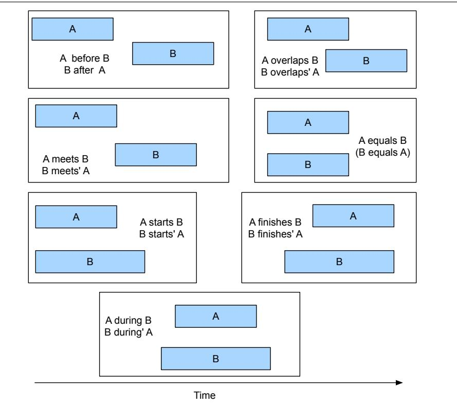
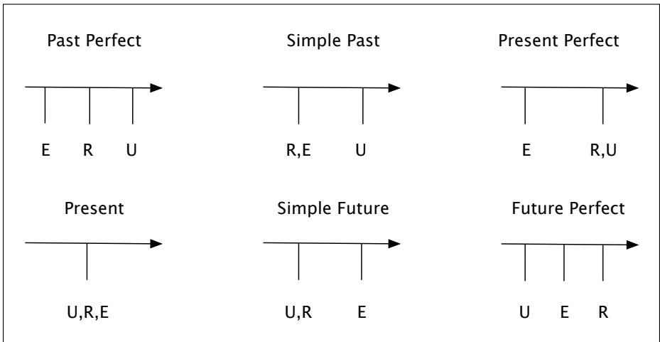

## 21.4 Representing Time

Let’s begin by introducing the basics of temporal logic and how human languages convey temporal information. The most straightforward theory of time holds that it flows inexorably forward and that events are associated with either points or intervals in time, as on a timeline. We can order distinct events by situating them on the timeline; one event precedes another if the flow of time leads from the first event to the second. Accompanying these notions in most theories is the idea of the current moment in time. Combining this notion with the idea of a temporal ordering relationship yields the familiar notions of past, present, and future.

Various kinds of temporal representation systems can be used to talk about temporal ordering relationship. One of the most commonly used in computational modeling is the interval algebra of Allen (1984). Allen models all events and time expressions as intervals there is no representation for points (although intervals can be very short). In order to deal with intervals without points, he identifies 13 primitive relations that can hold between these temporal intervals. Fig. 21.11 shows these 13 Allen relations.

  
Figure 21.11 The 13 temporal relations from Allen (1984).

## 21.4.1 Reichenbach’s reference point

The relation between simple verb tenses and points in time is by no means straightforward. The present tense can be used to refer to a future event, as in this example: (21.15) Ok, we fly from San Francisco to Boston at 10.

Or consider the following examples:

(21.16) Flight 1902 arrived late.

(21.17) Flight 1902 had arrived late.

Although both refer to events in the past, representing them in the same way seems wrong. The second example seems to have another unnamed event lurking in the background (e.g., Flight 1902 had already arrived late when something else happened).

To account for this phenomena, Reichenbach (1947) introduced the notion of a reference point. In our simple temporal scheme, the current moment in time is equated with the time of the utterance and is used as a reference point for when the event occurred (before, at, or after). In Reichenbach’s approach, the notion of the reference point is separated from the utterance time and the event time. The following examples illustrate the basics of this approach:

(21.18) When Mary’s flight departed, I ate lunch.

(21.19) When Mary’s flight departed, I had eaten lunch.

In both of these examples, the eating event has happened in the past, that is, prior to the utterance. However, the verb tense in the first example indicates that the eating event began when the flight departed, while the second example indicates that the eating was accomplished prior to the flight’s departure. Therefore, in Reichenbach’s terms the departure event specifies the reference point. These facts can be accommodated by additional constraints relating the eating and departure events. In the first example, the reference point precedes the eating event, and in the second example, the eating precedes the reference point. Figure 21.12 illustrates Reichenbach’s approach with the primary English tenses. Exercise 21.4 asks you to represent these examples in FOL.

  
Figure 21.12 Reichenbach’s approach applied to various English tenses. In these diagrams, time flows from left to right, E denotes the time of the event, R denotes the reference time, and U denotes the time of the utterance.

Languages have many other ways to convey temporal information besides tense. Most useful for our purposes will be temporal expressions like in the morning or 6:45 or afterwards.

(21.20) I’d like to go at 6:45 in the morning.

(21.21) Somewhere around noon, please.

(21.22) I want to take the train back afterwards.

Incidentally, temporal expressions display a fascinating metaphorical conceptual organization. Temporal expressions in English are frequently expressed in spatial terms, as is illustrated by the various uses of at, in, somewhere, and near in these examples (Lakoff and Johnson 1980, Jackendoff 1983). Metaphorical organizations such as these, in which one domain is systematically expressed in terms of another, are very common in languages of the world.
